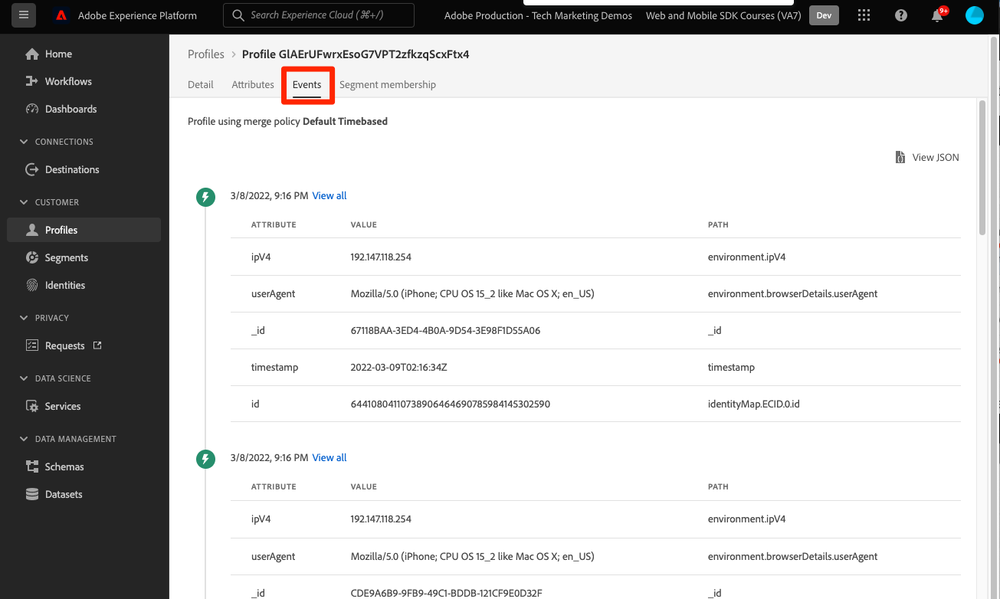

# Inviare dati a Adobe Experience Platform

Scopri come inviare dati a Adobe Experience Platform.

Questa lezione facoltativa è valida per tutti i clienti di Real-time Customer Data Platform (Real-Time CDP), Journey Optimizer e Customer Journey Analytics. Ad Experience Platform, la base dei prodotti Experience Cloud, è un sistema aperto che trasforma tutti i tuoi dati, Adobe Adobi e non, in solidi profili cliente da aggiornare in tempo reale e utilizza informazioni basate sull’intelligenza artificiale per aiutarti a fornire le esperienze giuste su ogni canale.

Il [evento](events.md), [ciclo di vita](lifecycle-data.md), e [identità](identity.md) I dati raccolti e inviati a Platform Edge Network nelle lezioni precedenti vengono inoltrati ai servizi configurati nel flusso di dati, incluso Adobe Experience Platform.

## Prerequisiti

È necessario eseguire il provisioning della tua organizzazione e concedere le autorizzazioni per Adobe Experience Platform.

Se non hai accesso, puoi [salta questa lezione](install-sdks.md).

## Finalità di apprendimento

In questa lezione verranno fornite le seguenti informazioni:

* Crea un set di dati di Experience Platform.
* Convalida i dati nel set di dati.
* Abilita lo schema e il set di dati per Real-Time Customer Profile.
* Convalidare i dati in Real-Time Customer Profile.
* Convalida i dati nel grafico delle identità.

## Creare un set di dati

Tutti i dati acquisiti correttamente in Adobe Experience Platform vengono memorizzati nel data lake come set di dati. Un set di dati è un costrutto di archiviazione e gestione per una raccolta di dati, in genere una tabella, che contiene uno schema (colonne) e dei campi (righe). I set di dati contengono anche metadati che descrivono vari aspetti dei dati memorizzati. Consulta la [documentazione](https://experienceleague.adobe.com/docs/experience-platform/catalog/datasets/overview.html?lang=it) per informazione.

1. Passa all’interfaccia di Experience Platform selezionandola dal menu 3x3 in alto a destra.
   

1. Seleziona **[!UICONTROL Set di dati]** dal menu di navigazione sinistro.

1. **[!UICONTROL Creare un set di dati]**.
   

1. Seleziona **[!UICONTROL Crea set di dati dallo schema]**.
   

1. Cerca lo schema e seleziona.

1. Seleziona **[!UICONTROL Avanti]**.
   

1. Fornisci un **[!UICONTROL Nome]**, **[!UICONTROL Descrizione]**, e seleziona **[!UICONTROL Fine]**.
   

## Aggiornare lo stream di dati

Dopo aver creato il set di dati, assicurati di [aggiornare lo stream di dati](create-datastream.md) per aggiungere Adobe Experience Platform. Questo aggiornamento garantisce il flusso dei dati in Platform.

## Convalidare i dati nel set di dati

Dopo aver creato un set di dati e aggiornato lo stream di dati per inviare i dati ad Experience Platform, tutti i dati XDM inviati a Platform Edge Network vengono inoltrati a Platform e inseriti nel set di dati.

Apri l’app e passa alle schermate in cui tieni traccia degli eventi. Puoi anche attivare le metriche del ciclo di vita.

Apri il set di dati nell’interfaccia di Platform. Dovresti visualizzare i dati in arrivo in batch nel set di dati

Dovresti anche poter visualizzare record e campi di esempio utilizzando **[!UICONTROL Anteprima set di dati]** funzionalità:

Uno strumento più affidabile per la convalida dei dati è [servizio query](https://experienceleague.adobe.com/docs/platform-learn/tutorials/queries/explore-data.html?lang=it).

## Abilita Real-Time Customer Profile

Il profilo cliente in tempo reale di Experience Platform ti consente di creare una visualizzazione olistica di ogni singolo cliente che combina dati provenienti da più canali, inclusi dati online, offline, del sistema CRM e di terze parti. Il profilo ti consente di consolidare i diversi dati dei clienti in una visualizzazione unificata che offre un account utilizzabile e con marca temporale per ogni interazione con il cliente.

### Abilita lo schema

1. Apri lo schema
1. Abilita **[!UICONTROL Profilo]**
1. Seleziona **[!UICONTROL I dati per questo schema conterranno un’identità primaria nel campo identityMap.]** nel modale
1. **[!UICONTROL Salva]** lo schema

   

### Abilitare il set di dati

1. Apri il set di dati
1. Abilita **[!UICONTROL Profilo]**

   

### Convalidare i dati nel profilo

Apri l’app e passa alle schermate in cui tieni traccia degli eventi. Accedi all’app Luma e fai un acquisto.

Utilizza Assurance per trovare una delle identità passate in identityMap (E-mail, lumaCrmId o ECID):

>[!TIP]
>
>   Il valore della proprietà `lumaCrmId` è `112ca06ed53d3db37e4cea49cc45b71e`

Nell’interfaccia di Platform, passa a **[!UICONTROL Profili]** > **[!UICONTROL Sfoglia]**, cerca il valore di identità appena ottenuto e apri il profilo:

Il giorno **[!UICONTROL Dettaglio]** schermo puoi visualizzare le informazioni di base sull’utente, tra cui **[!UICONTROL ** identità collegate **]**:

Il giorno **[!UICONTROL Eventi]**, puoi visualizzare gli eventi raccolti dall’implementazione dell’app mobile per questo utente:

Dalla schermata dei dettagli del profilo, fai clic sul collegamento per visualizzare il grafico delle identità o accedi a **[!UICONTROL Identità]** > **[!UICONTROL Grafico delle identità]** e cerca il valore di identità. Questa visualizzazione mostra tutte le identità collegate tra loro in un profilo e la loro origine. Di seguito è riportato un esempio di grafico delle identità costituito dai dati raccolti dal completamento di questa esercitazione dell’SDK per dispositivi mobili (Origine dati 2) e della [Tutorial su Web SDK](https://experienceleague.adobe.com/docs/platform-learn/implement-web-sdk/overview.html?lang=it) (Origine dati 1):

Gli esperti di marketing e analisi possono fare molto di più con i dati acquisiti in Experience Platform, compresa l’analisi di Customer Journey Analytics e la creazione di segmenti in Real-time Customer Data Platform. Stai partendo bene!

Successivo: **[Messaggistica push con Journey Optimizer](journey-optimizer-push.md)**

>[!NOTE]
>
>Grazie per aver dedicato il tuo tempo all’apprendimento dell’SDK di Adobe Experience Platform Mobile. Se hai domande, vuoi condividere commenti generali o suggerimenti su contenuti futuri, condividili su questo [Experience League post di discussione community](https://experienceleaguecommunities.adobe.com/t5/adobe-experience-platform-launch/tutorial-discussion-implement-adobe-experience-cloud-in-mobile/td-p/443796)
