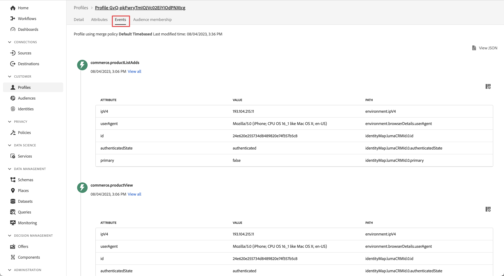

# Invia dati all’Experience Platform

Scopri come inviare dati da app mobili a Adobe Experience Platform.

Questa lezione facoltativa è valida per tutti i clienti di Real-time Customer Data Platform (Real-Time CDP), Journey Optimizer e Customer Journey Analytics. Ad Experience Platform, la base dei prodotti Experience Cloud, è un sistema aperto che trasforma tutti i tuoi dati (Adobi e non Adobi) in solidi profili cliente. Questi profili cliente vengono aggiornati in tempo reale e utilizzano informazioni basate sull’intelligenza artificiale per aiutarti a fornire le esperienze giuste su ogni canale.

Il [evento](events.md), [ciclo di vita](lifecycle-data.md), e [identità](identity.md) I dati raccolti e inviati a Platform Edge Network nelle lezioni precedenti vengono inoltrati ai servizi configurati nel flusso di dati, incluso Adobe Experience Platform.

## Prerequisiti

È necessario eseguire il provisioning della tua organizzazione e concedere le autorizzazioni per Adobe Experience Platform.

Se non hai accesso, puoi [salta questa lezione](install-sdks.md).

## Obiettivi di apprendimento

In questa lezione verranno fornite le seguenti informazioni:

* Crea un set di dati di Experience Platform.
* Configura lo stream di dati per inoltrare i dati ad Experienci Platform.
* Convalida i dati nel set di dati.
* Abilita lo schema e il set di dati per Real-Time Customer Profile.
* Convalidare i dati in Real-Time Customer Profile.
* Convalida i dati nel grafico delle identità.

## Creare un set di dati

Tutti i dati acquisiti correttamente in Adobe Experience Platform vengono memorizzati nel data lake come set di dati. Un set di dati è un costrutto di archiviazione e gestione per una raccolta di dati (in genere una tabella) che contiene uno schema (colonne) e dei campi (righe). I set di dati contengono anche metadati che descrivono vari aspetti dei dati memorizzati. Consulta la [documentazione](https://experienceleague.adobe.com/docs/experience-platform/catalog/datasets/overview.html?lang=it) per informazione.

1. Passa all’interfaccia di Experience Platform selezionandola dall’elenco App  in alto a destra.

1. Seleziona **[!UICONTROL Set di dati]** dal menu di navigazione sinistro.

1. Seleziona  **[!UICONTROL Crea set di dati]**.

1. Seleziona **[!UICONTROL Crea set di dati dallo schema]**.
   

1. Cerca lo schema. ad esempio utilizzando `Luma Mobile` nel campo di ricerca.
1. Seleziona lo schema, ad esempio **[!DNL Luma Mobile App Event Schema]**.

1. Seleziona **[!UICONTROL Avanti]**.
   

1. Fornisci un **[!UICONTROL Nome]**, ad esempio `Luma Mobile App Events Dataset` e un **[!UICONTROL Descrizione]**.

1. Seleziona **[!UICONTROL Fine]**.
   

## Aggiungi servizio flusso di dati Adobe Experience Platform

Per inviare i dati XDM da Edge Network a Adobe Experience Platform, aggiungi il servizio Adobe Experience Platform allo stream di dati configurato come parte di [Creare un flusso di dati](create-datastream.md).

>[!IMPORTANT]
>
>Puoi abilitare il servizio Adobe Experience Platform solo dopo aver creato un set di dati evento.

1. Nell’interfaccia utente di Data Collection, seleziona **[!UICONTROL Flussi di dati]** e lo stream di dati.

1. Quindi seleziona  **[!UICONTROL Aggiungi servizio]**.

1. Seleziona **[!UICONTROL Adobe Experience Platform]** dal [!UICONTROL Servizio] elenco.

1. Attiva il servizio cambiando **[!UICONTROL Abilitato]** su.

1. Seleziona la **[!UICONTROL Set di dati evento]** create in precedenza, ad esempio **[!DNL Luma Mobile App Event Dataset]**.

1. Seleziona **[!UICONTROL Salva]**.

   
1. La configurazione finale sarà simile alla seguente.

   

## Convalidare i dati nel set di dati

Dopo aver creato un set di dati e aggiornato lo stream di dati per inviare i dati ad Experienci Platform, tutti i dati XDM inviati a Platform Edge Network vengono inoltrati a Platform e vengono inseriti nel set di dati.

Apri l’app e passa alle schermate in cui tieni traccia degli eventi. Puoi anche attivare le metriche del ciclo di vita.

Apri il set di dati nell’interfaccia di Platform. Dovresti visualizzare i dati in arrivo in batch nel set di dati. I dati in genere arrivano in microbatch ogni 15 minuti, pertanto potresti non visualizzare immediatamente i dati.

Dovresti anche poter visualizzare record e campi di esempio utilizzando **[!UICONTROL Anteprima set di dati]** funzionalità:

Uno strumento più affidabile per la convalida dei dati è [servizio query](https://experienceleague.adobe.com/docs/platform-learn/tutorials/queries/explore-data.html?lang=it).

## Abilita Real-Time Customer Profile

Il profilo cliente in tempo reale di Experienci Platform consente di creare una visualizzazione olistica di ogni singolo cliente che combina dati provenienti da più canali, inclusi dati online, offline, del sistema CRM e di terze parti. Il profilo ti consente di consolidare i diversi dati dei clienti in una visualizzazione unificata che offre un account utilizzabile e con marca temporale per ogni interazione con il cliente.

### Abilita lo schema

1. Apri lo schema, ad esempio **[!DNL Luma Mobile App Event Schema]**.
1. Abilita **[!UICONTROL Profilo]**.
1. Seleziona **[!UICONTROL I dati per questo schema conterranno un’identità primaria nel campo identityMap.]** nella finestra di dialogo.
1. **[!UICONTROL Salva]** lo schema.

   

### Abilitare il set di dati

1. Apri il set di dati, ad esempio **[!DNL Luma Mobile App Event Dataset]**.
1. Abilita **[!UICONTROL Profilo]**.

   

### Convalidare i dati nel profilo

Apri l’app e passa alle schermate in cui stai tracciando gli eventi, ad esempio: accedi all’app Luma e fai un acquisto.

Utilizza Assurance per trovare una delle identità passate in identityMap (E-mail, lumaCrmId o ECID), ad esempio l’ID del sistema di gestione delle relazioni con i clienti.

Nell’interfaccia di Platform,

1. Accedi a **[!UICONTROL Profili]**, e seleziona **[!UICONTROL Sfoglia]** dalla barra superiore.
1. Specifica i dettagli di identità appena acquisiti, ad esempio `Luma CRM ID` per **[!UICONTROL Spazio dei nomi dell’identità]** e il valore per cui hai copiato **[!UICONTROL Valore identità]**. Quindi seleziona **[!UICONTROL Visualizza]**.
1. Per visualizzare i dettagli, seleziona il profilo.

Il giorno **[!UICONTROL Dettaglio]** , è possibile visualizzare le informazioni di base sull&#39;utente, tra cui **[!UICONTROL ** identità collegate **]**:

Il giorno **[!UICONTROL Eventi]**, puoi visualizzare gli eventi raccolti dall’implementazione dell’app mobile per questo utente:

Dalla schermata dei dettagli del profilo:

1. Per visualizzare il grafo delle identità, fai clic sul collegamento o passa a **[!UICONTROL Identità]**, quindi seleziona **[!UICONTROL Grafico delle identità]** dalla barra superiore.
1. Per cercare il valore di identità, specifica `Luma CRM ID` come **[!UICONTROL Spazio dei nomi dell’identità]** e il valore copiato come **[!UICONTROL Valore identità]**. Quindi seleziona **[!UICONTROL Visualizza]**.

   Questa visualizzazione mostra tutte le identità collegate tra loro in un profilo e la loro origine. Di seguito è riportato un esempio di grafico delle identità costituito dai dati raccolti dal completamento di questa esercitazione dell’SDK per dispositivi mobili (Origine dati 2) e della [Tutorial su Web SDK](https://experienceleague.adobe.com/docs/platform-learn/implement-web-sdk/overview.html?lang=it) (Origine dati 1):

   

## Passaggi successivi

Gli esperti di marketing e analisi possono fare molto di più con i dati acquisiti in Experienci Platform, compresa l’analisi di Customer Journey Analytics e la creazione di segmenti in Real-time Customer Data Platform. Stai partendo bene!

>[!SUCCESS]
>
>Ora hai configurato l’app per inviare dati non solo a Edge Network, ma anche a Adobe Experience Platform. Grazie per aver dedicato il tuo tempo all’apprendimento dell’SDK di Adobe Experience Platform Mobile. Se hai domande, vuoi condividere feedback generali o suggerimenti su contenuti futuri, condividili su questo [Experience League post di discussione community](https://experienceleaguecommunities.adobe.com/t5/adobe-experience-platform-data/tutorial-discussion-implement-adobe-experience-cloud-in-mobile/td-p/443796).

Successivo: **[Creare e inviare notifiche push](journey-optimizer-push.md)**
