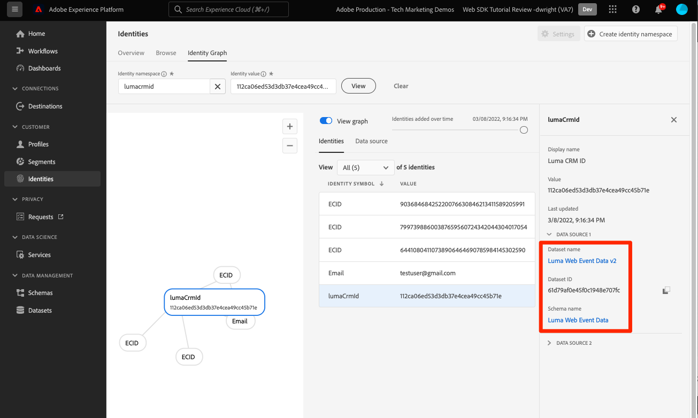

# Inviare dati a Adobe Experience Platform

Scopri come inviare dati a Adobe Experience Platform.

Questa lezione opzionale è pertinente per tutti i clienti di Real-time Customer Data Platform (Real-time CDP), Journey Optimizer e Customer Journey Analytics. Ad Experience Platform, la base dei prodotti Experience Cloud, è un sistema aperto che trasforma tutti i tuoi dati, Adobe e non, in solidi profili cliente che si aggiornano in tempo reale e utilizzano informazioni basate sull’intelligenza artificiale per aiutarti a fornire le esperienze giuste in ogni canale.

La [event](events.md), [ciclo](lifecycle-data.md)e [identità](identity.md) i dati raccolti e inviati a Platform Edge Network nelle lezioni precedenti vengono inoltrati ai servizi configurati nel datastream, incluso Adobe Experience Platform.

## Prerequisiti

È necessario eseguire il provisioning della tua organizzazione e concedere le autorizzazioni per Adobe Experience Platform.

Se non hai accesso, puoi [saltare questa lezione](install-sdks.md).

## Finalità di apprendimento

In questa lezione:

* Crea un set di dati di Experience Platform.
* Convalida i dati nel set di dati.
* Abilita lo schema e il set di dati per Profilo cliente in tempo reale.
* Convalida i dati in Profilo cliente in tempo reale.
* Convalida i dati nel grafico dell&#39;identità.

## Creare un set di dati

Tutti i dati correttamente acquisiti in Adobe Experience Platform vengono memorizzati all’interno del data lake come set di dati. Un set di dati è un costrutto di archiviazione e gestione per una raccolta di dati, in genere una tabella, che contiene uno schema (colonne) e dei campi (righe). I set di dati contengono anche metadati che descrivono vari aspetti dei dati memorizzati. Consulta la sezione [documentazione](https://experienceleague.adobe.com/docs/experience-platform/catalog/datasets/overview.html?lang=it) per informazioni.

1. Passa all’interfaccia di Experience Platform selezionandola dal menu 3x3 in alto a destra.
   

1. Seleziona **[!UICONTROL Set di dati]** dal menu di navigazione a sinistra.

1. **[!UICONTROL Creare un set di dati]**.
   

1. Seleziona **[!UICONTROL Creare un set di dati dallo schema]**.
   

1. Cerca lo schema e seleziona.

1. Seleziona **[!UICONTROL Avanti]**.
   

1. Fornisci un **[!UICONTROL Nome]**, **[!UICONTROL Descrizione]**, quindi seleziona **[!UICONTROL Fine]**.
   

## Aggiornare il datastream

Una volta creato il set di dati, assicurati di [aggiorna il datastream](create-datastream.md) per aggiungere Adobe Experience Platform. Questo aggiornamento assicura il flusso di dati in Platform.

## Convalidare i dati nel set di dati

Dopo aver creato un set di dati e aver aggiornato il datastream per inviare dati ad Experience Platform, tutti i dati XDM inviati a Platform Edge Network vengono inoltrati a Platform e inseriti nel set di dati.

Apri l’app e passa alle schermate in cui stai tracciando gli eventi. Puoi anche attivare le metriche del ciclo di vita.

Apri il set di dati nell’interfaccia di Platform. Dovresti visualizzare i dati in arrivo in batch al set di dati

È inoltre necessario essere in grado di visualizzare record e campi di esempio utilizzando **[!UICONTROL Anteprima set di dati]** caratteristica:

Uno strumento più affidabile per convalidare i dati è quello di Platform [servizio query](https://experienceleague.adobe.com/docs/platform-learn/tutorials/queries/explore-data.html?lang=it).

## Abilita profilo cliente in tempo reale

Il Profilo del cliente in tempo reale di Experience Platform ti consente di creare una visualizzazione olistica di ogni singolo cliente che combina dati provenienti da più canali, inclusi dati online, offline, CRM e di terze parti. Il profilo ti consente di consolidare i dati dei tuoi clienti diversi in una visualizzazione unificata che offre un account utilizzabile e con marca temporale per ogni interazione con il cliente.

### Abilitare lo schema

1. Apri lo schema
1. Abilita **[!UICONTROL Profilo]**
1. Seleziona **[!UICONTROL I dati per questo schema conterranno un&#39;identità primaria nel campo identityMap .]** nel modale
1. **[!UICONTROL Salva]** schema

   

### Abilitare il set di dati

1. Apri il set di dati
1. Abilita **[!UICONTROL Profilo]**

   

### Convalidare i dati in Profilo

Apri l’app e passa alle schermate in cui stai tracciando gli eventi. Accedi all’app Luma e acquista.

Utilizza Assurance per trovare una delle identità passate in identityMap (Email, lumaCrmId o ECID):

>[!TIP]
>
>   Il valore del `lumaCrmId` è `112ca06ed53d3db37e4cea49cc45b71e`

Nell’interfaccia di Platform , passa a **[!UICONTROL Profili]** > **[!UICONTROL Sfoglia]**, cerca il valore di identità appena acquisito e apri il profilo:

Sulla **[!UICONTROL Dettaglio]** è possibile visualizzare informazioni di base sull’utente, tra cui **[!UICONTROL ** identità collegate **]**:

Sulla **[!UICONTROL Eventi]**, puoi visualizzare gli eventi raccolti dall’implementazione della tua app mobile per questo utente:

Dalla schermata di dettaglio del profilo, fai clic sul collegamento per visualizzare il grafico delle identità o naviga fino a **[!UICONTROL Identità]** > **[!UICONTROL Grafico di identità]** e cerca il valore identity. Questa visualizzazione mostra tutte le identità collegate tra loro in un profilo e la loro origine. Ecco un esempio di grafico dell&#39;identità composto dai dati raccolti per completare sia questa esercitazione Mobile SDK (Origine dati 2) che la [Esercitazione SDK per web](https://experienceleague.adobe.com/docs/platform-learn/implement-web-sdk/overview.html?lang=it) (Origine dati 1):

Gli addetti al marketing e all’analisi possono fare molto di più con i dati acquisiti in Experience Platform, tra cui analizzarli nel Customer Journey Analytics e creare segmenti in Real-time Customer Data Platform. Siete pronti a un buon inizio!

Avanti: **[Messaggi push con Journey Optimizer](journey-optimizer-push.md)**

>[!NOTE]
>
>Grazie per aver investito il tuo tempo nell&#39;apprendimento dell&#39;SDK di Adobe Experience Platform Mobile. In caso di domande, se desideri condividere feedback generali o se hai suggerimenti su contenuti futuri, condividi questi su questo [Experience League Articolo di discussione della Comunità](https://experienceleaguecommunities.adobe.com/t5/adobe-experience-platform-launch/tutorial-discussion-implement-adobe-experience-cloud-in-mobile/td-p/443796)
