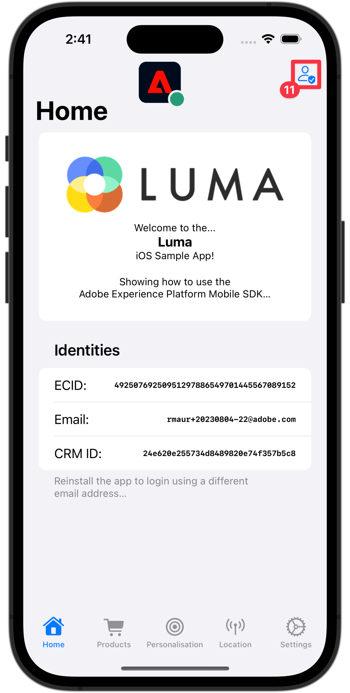

# Raccogliere dati profilo

Scopri come raccogliere i dati del profilo in un’app mobile.

Puoi utilizzare l’estensione Profilo per memorizzare gli attributi dell’utente sul client. Queste informazioni possono essere utilizzate in un secondo momento per eseguire il targeting e personalizzare i messaggi durante scenari online o offline, senza dover connettersi a un server per ottenere prestazioni ottimali. L’estensione Profile gestisce il profilo operativo lato client (CSOP, Client-Side Operation Profile), fornisce un modo per reagire alle API, aggiorna gli attributi del profilo utente e condivide gli attributi del profilo utente con il resto del sistema come evento generato.

I dati di profilo vengono utilizzati da altre estensioni per eseguire azioni relative al profilo. Un esempio è l’estensione Rules Engine che utilizza i dati del profilo ed esegue le regole in base ai dati del profilo. Ulteriori informazioni sull&#39;[estensione profilo](https://developer.adobe.com/client-sdks/documentation/profile/) nella documentazione

>[!IMPORTANT]
>
>La funzionalità di profilo descritta in questa lezione è distinta dalla funzionalità Profilo cliente in tempo reale nelle applicazioni basate su Adobe Experience Platform e Platform.


## Prerequisiti

* L&#39;app con gli SDK installati e configurati è stata creata ed eseguita correttamente.

## Obiettivi di apprendimento

In questa lezione verranno fornite le seguenti informazioni:

* Imposta o aggiorna gli attributi utente.
* Recuperare gli attributi utente.


## Impostare e aggiornare gli attributi utente

Sarebbe utile per il targeting e/o la personalizzazione nell’app sapere rapidamente se un utente ha effettuato un acquisto in passato o di recente. Impostiamolo nell’app Luma.

1. Passa a **[!DNL Luma]** > **[!DNL Luma]** > **[!DNL Utils]** > **[!DNL MobileSDK]** nel navigatore progetti Xcode e trova la funzione `func updateUserAttribute(attributeName: String, attributeValue: String)`. Aggiungi il seguente codice:

   ```swift
   // Create a profile map, add attributes to the map and update profile using the map
   var profileMap = [String: Any]()
   profileMap[attributeName] = attributeValue
   UserProfile.updateUserAttributes(attributeDict: profileMap)
   ```

   Questo codice:

   1. Imposta un dizionario vuoto denominato `profileMap`.

   1. Aggiunge un elemento al dizionario utilizzando `attributeName` (ad esempio `isPaidUser`) e `attributeValue` (ad esempio `yes`).

   1. Utilizza il dizionario `profileMap` come valore per il parametro `attributeDict` della chiamata API [`UserProfile.updateUserAttributes`](https://developer.adobe.com/client-sdks/documentation/profile/api-reference/#updateuserattributes).

1. Passa a **[!DNL Luma]** > **[!DNL Luma]** > **[!DNL Views]** > **[!DNL Products]** > **[!DNL ProductView]** nel navigatore progetti Xcode e trova la chiamata a `updateUserAttributes` (nel codice per gli acquisti ). Aggiungi il seguente codice:

   ```swift
   // Update attributes
   MobileSDK.shared.updateUserAttribute(attributeName: "isPaidUser", attributeValue: "yes")
   ```


## Ottieni attributi utente

Dopo aver aggiornato l’attributo di un utente, questo è disponibile per altri SDK di Adobe, ma puoi anche recuperare gli attributi in modo esplicito, per consentire all’app di comportarsi come desideri.

1. Passa a **[!DNL Luma]** > **[!DNL Luma]** > **[!DNL Views]** > **[!DNL General]** > **[!DNL HomeView]** nel navigatore progetti Xcode e trova il modificatore `.onAppear`. Aggiungi il seguente codice:

   ```swift
   // Get attributes
   UserProfile.getUserAttributes(attributeNames: ["isPaidUser"]) { attributes, error in
       if attributes?.count ?? 0 > 0 {
           if attributes?["isPaidUser"] as? String == "yes" {
               showBadgeForUser = true
           }
           else {
               showBadgeForUser = false
           }
       }
   }
   ```

   Questo codice:

   1. Chiama l&#39;API [`UserProfile.getUserAttributes`](https://developer.adobe.com/client-sdks/documentation/profile/api-reference/#getuserattributes) con il nome attributo `isPaidUser` come singolo elemento nell&#39;array `attributeNames`.
   1. Poi controlla il valore dell&#39;attributo `isPaidUser` e quando `yes`, inserisce un badge sul Icona  nella barra degli strumenti in alto a destra.

Ulteriori informazioni sono disponibili [qui](https://developer.adobe.com/client-sdks/documentation/profile/api-reference/#getuserattributes).

## Convalidare con Assurance

1. Consulta la sezione [istruzioni di installazione](assurance.md#connecting-to-a-session) per collegare il simulatore o il dispositivo ad Assurance.
1. Esegui l’app per accedere e interagire con un prodotto.

   1. Sposta l’icona Assurance a sinistra.
   1. Seleziona **[!UICONTROL Home]** nella barra delle schede.
   1. Per aprire il foglio di accesso, selezionare Pulsante 

      

   1. Per inserire un’e-mail casuale e un ID cliente, seleziona la Pulsante  .
   1. Seleziona **[!UICONTROL Accesso]**.

      

   1. Selezionare **[!DNL Products]** nella barra delle schede.
   1. Seleziona un prodotto.
   1. Seleziona .
   1. Seleziona .
   1. Seleziona .

      

   1. Torna alla schermata **[!UICONTROL Home]**. Dovresti notare che è stato aggiunto un badge .

      


1. Nell&#39;interfaccia utente di Assurance, dovresti visualizzare un **[!UICONTROL UserProfileUpdate]** e **[!UICONTROL getUserAttributes]** eventi con il valore `profileMap` aggiornato.
   

>[!SUCCESS]
>
>Ora hai impostato la tua app per aggiornare gli attributi dei profili nell’Edge Network e (se configurato) con Adobe Experience Platform.
>
>Grazie per aver dedicato il tuo tempo all’apprendimento dell’SDK di Adobe Experience Platform Mobile. Se hai domande, vuoi condividere commenti generali o suggerimenti su contenuti futuri, condividili in questo [Experience League post di discussione della community](https://experienceleaguecommunities.adobe.com/t5/adobe-experience-platform-data/tutorial-discussion-implement-adobe-experience-cloud-in-mobile/td-p/443796).

Successivo: **[Usa luoghi](places.md)**
