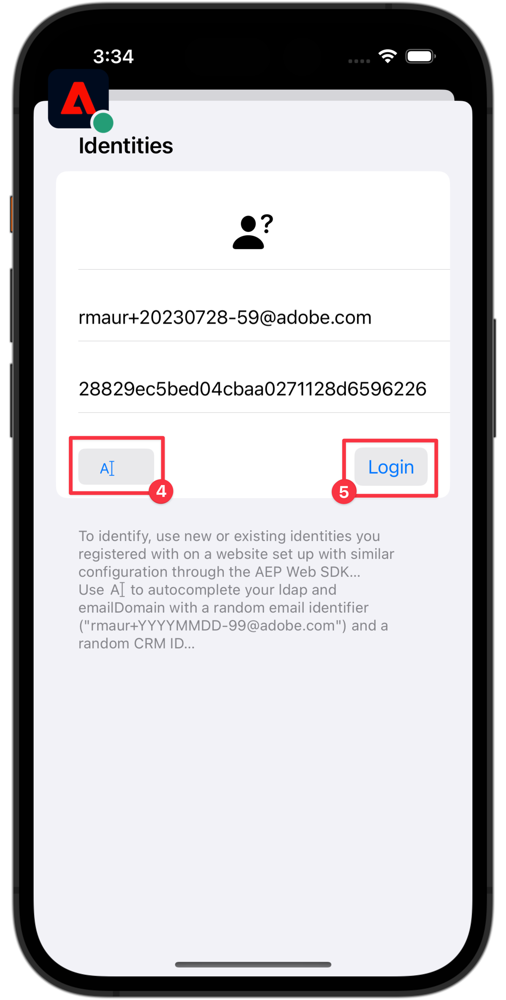

# Raccogliere dati profilo

Scopri come raccogliere i dati del profilo in un’app mobile.

Puoi utilizzare l’estensione Profilo per memorizzare gli attributi dell’utente sul client. Queste informazioni possono essere utilizzate in un secondo momento per eseguire il targeting e personalizzare i messaggi durante scenari online o offline, senza dover connettersi a un server per ottenere prestazioni ottimali.

L’estensione Profile gestisce il profilo operativo lato client (CSOP, Client-Side Operation Profile), fornisce un modo per reagire alle API, aggiorna gli attributi del profilo utente e condivide gli attributi del profilo utente con il resto del sistema come evento generato.

I dati di profilo vengono utilizzati da altre estensioni per eseguire azioni relative al profilo. Un esempio è l’estensione Rules Engine che utilizza i dati del profilo ed esegue le regole in base ai dati del profilo. Ulteriori informazioni sull&#39;[estensione profilo](https://developer.adobe.com/client-sdks/documentation/profile/) nella documentazione

>[!IMPORTANT]
>
>La funzionalità di profilo descritta in questa lezione è distinta dalla funzionalità Profilo cliente in tempo reale nelle applicazioni basate su Adobe Experience Platform e Platform.


## Prerequisiti

* L&#39;app con gli SDK installati e configurati è stata creata ed eseguita correttamente.

## Obiettivi di apprendimento

In questa lezione verranno fornite le seguenti informazioni:

* Imposta o aggiorna gli attributi utente.
* Recuperare gli attributi utente.


## Impostare e aggiornare gli attributi utente

Sarebbe utile che il targeting e la personalizzazione dell’app sapessero rapidamente se un utente ha effettuato un acquisto in passato o di recente. Impostiamolo nell’app Luma.

>[!BEGINTABS]

>[!TAB iOS]

1. Passa a **[!DNL Luma]** > **[!DNL Luma]** > **[!DNL Utils]** > **[!DNL MobileSDK]** nel navigatore progetti Xcode e trova la funzione `func updateUserAttribute(attributeName: String, attributeValue: String)`. Aggiungi il seguente codice:

   ```swift
   // Create a profile map, add attributes to the map and update profile using the map
   var profileMap = [String: Any]()
   profileMap[attributeName] = attributeValue
   UserProfile.updateUserAttributes(attributeDict: profileMap)
   ```

   Questo codice:

   1. Imposta un dizionario vuoto denominato `profileMap`.

   1. Aggiunge un elemento al dizionario utilizzando `attributeName` (ad esempio `isPaidUser`) e `attributeValue` (ad esempio `yes`).

   1. Utilizza il dizionario `profileMap` come valore per il parametro `attributeDict` della chiamata API [`UserProfile.updateUserAttributes`](https://developer.adobe.com/client-sdks/documentation/profile/api-reference/#updateuserattributes).

1. Passa a **[!DNL Luma]** > **[!DNL Luma]** > **[!DNL Views]** > **[!DNL Products]** > **[!DNL ProductView]** nel navigatore progetti Xcode e trova la chiamata a `updateUserAttributes` (all&#39;interno del codice per il pulsante Acquisti ). Aggiungi il seguente codice:

   ```swift
   // Update attributes
   MobileSDK.shared.updateUserAttribute(attributeName: "isPaidUser", attributeValue: "yes")
   ```

>[!TAB Android]

1. Passa a **[!UICONTROL Android]**  > **[!DNL app]** > **[!DNL kotlin+java]** > **[!DNL com.adobe.luma.tutorial.android]** > **[!UICONTROL models]** > **[!UICONTROL MobileSDK]** nel navigatore di Android Studio e trova la funzione `func updateUserAttribute(attributeName: String, attributeValue: String)`. Aggiungi il seguente codice:

   ```kotlin
   // Create a profile map, add attributes to the map and update profile using the map
   val profileMap = mapOf(attributeName to attributeValue)
   UserProfile.updateUserAttributes(profileMap)
   ```

   Questo codice:

   1. Imposta una mappa vuota denominata `profileMap`.

   1. Aggiunge un elemento alla mappa utilizzando `attributeName` (ad esempio `isPaidUser`) e `attributeValue` (ad esempio `yes`).

   1. Utilizza la mappa `profileMap` come valore per il parametro `attributeDict` della chiamata API [`UserProfile.updateUserAttributes`](https://developer.adobe.com/client-sdks/documentation/profile/api-reference/#updateuserattributes).

1. Passa a **[!UICONTROL Android]**  > **[!DNL app]** > **[!DNL kotlin+java]** > **[!DNL com.adobe.luma.tutorial.android]** > **[!UICONTROL visualizzazioni]** > **[!UICONTROL ProductView.kt]** e trova la chiamata a `updateUserAttributes` (all&#39;interno del codice per il pulsante Acquisti ). Aggiungi il seguente codice:

   ```kotlin
   // Update attributes
   MobileSDK.shared.updateUserAttribute("isPaidUser", "yes")
   ```

>[!ENDTABS]

## Ottieni attributi utente

Dopo aver aggiornato l’attributo di un utente, questo è disponibile per altri SDK di Adobe, ma puoi anche recuperare gli attributi in modo esplicito, per consentire all’app di comportarsi come desideri.

>[!BEGINTABS]

>[!TAB iOS]

1. Passa a **[!DNL Luma]** > **[!DNL Luma]** > **[!DNL Views]** > **[!DNL General]** > **[!DNL HomeView]** nel navigatore progetti Xcode e trova il modificatore `.onAppear`. Aggiungi il seguente codice:

   ```swift
   // Get attributes
   UserProfile.getUserAttributes(attributeNames: ["isPaidUser"]) { attributes, error in
       if attributes?.count ?? 0 > 0 {
           if attributes?["isPaidUser"] as? String == "yes" {
               showBadgeForUser = true
           }
           else {
               showBadgeForUser = false
           }
       }
   }
   ```

   Questo codice:

   1. Chiama l&#39;API [`UserProfile.getUserAttributes`](https://developer.adobe.com/client-sdks/documentation/profile/api-reference/#getuserattributes) con il nome attributo `isPaidUser` come singolo elemento nell&#39;array `attributeNames`.
   1. Verifica quindi il valore dell&#39;attributo `isPaidUser` e, quando `yes`, inserisce un badge nell&#39;icona  nella barra degli strumenti in alto a destra.

>[!TAB Android]

1. Passa a **[!UICONTROL Android]**  > **[!DNL app]** > **[!DNL kotlin+java]** > **[!DNL com.adobe.luma.tutorial.androi]** > **[!DNL views]** > **[!DNL HomeView.kt]** nel Navigatore progetti di Android Studio e trova il modificatore `.onAppear`. Aggiungi il seguente codice:

   ```kotlin
   // Get attributes
   UserProfile.getUserAttributes(listOf("isPaidUser")) { attributes ->
       showBadgeForUser = attributes?.get("isPaidUser") == "yes"
   }
   ```

   Questo codice:

   1. Chiama l&#39;API [`UserProfile.getUserAttributes`](https://developer.adobe.com/client-sdks/documentation/profile/api-reference/#getuserattributes) con il nome attributo `isPaidUser` come singolo elemento nell&#39;array `attributeNames`.
   1. Verifica quindi il valore dell&#39;attributo `isPaidUser`. Quando `yes`, il codice sostituisce l&#39;icona della persona con un&#39;icona del badge nella barra degli strumenti in alto a destra.

>[!ENDTABS]

Per ulteriori informazioni, consulta il [riferimento API](https://developer.adobe.com/client-sdks/documentation/profile/api-reference/#getuserattributes).

## Convalidare con Assurance

1. Consulta la sezione [istruzioni di installazione](assurance.md#connecting-to-a-session) per collegare il simulatore o il dispositivo ad Assurance.
1. Esegui l’app per accedere e interagire con un prodotto.

>[!BEGINTABS]

>[!TAB iOS]

1. Seleziona **[!UICONTROL Home]** nella barra delle schede.
1. Sposta l’icona Assurance a sinistra.
1. Per aprire il foglio di accesso, selezionare il pulsante .

   

1. Per inserire un’e-mail casuale e un ID cliente, seleziona il pulsante > .
1. Seleziona **[!UICONTROL Accesso]**.

   

1. Selezionare **[!DNL Products]** nella barra delle schede.
1. Seleziona un prodotto.
1. Seleziona .
1. Seleziona .
1. Seleziona .

   

1. Torna alla schermata **[!UICONTROL Home]**. Dovresti notare che è stato aggiunto un distintivo .

   


>[!TAB Android]

1. Seleziona **[!UICONTROL Home]** nella barra delle schede.
1. Sposta l’icona Assurance a sinistra.
1. Per aprire il foglio di accesso, selezionare il pulsante .

   

1. Per inserire un&#39;e-mail casuale e un ID cliente, seleziona **[!UICONTROL Genera e-mail casuale]**.
1. Seleziona **[!UICONTROL Accesso]**.

   

1. Selezionare **[!DNL Products]** nella barra delle schede.
1. Seleziona un prodotto.
1. Seleziona 
1. Seleziona .
1. Seleziona .

   

1. Torna alla schermata **[!UICONTROL Home]**. Dovresti vedere che l’icona della persona è stata aggiornata.

   

>[!ENDTABS]


Nell&#39;interfaccia utente di Assurance, dovresti visualizzare **[!UICONTROL UserProfileUpdate]** e **[!UICONTROL getUserAttributes]** eventi con il valore `profileMap` aggiornato.

{zoomable="yes"}

>[!SUCCESS]
>
>Ora hai impostato la tua app per aggiornare gli attributi dei profili in Edge Network e (se configurato) in Adobe Experience Platform.
>
>Grazie per aver dedicato tempo all&#39;apprendimento di Adobe Experience Platform Mobile SDK. Se hai domande, vuoi condividere commenti generali o suggerimenti su contenuti futuri, condividili in questo [post di discussione della community Experience League](https://experienceleaguecommunities.adobe.com/t5/adobe-experience-platform-data/tutorial-discussion-implement-adobe-experience-cloud-in-mobile/td-p/443796).

Successivo: **[Usa luoghi](places.md)**
