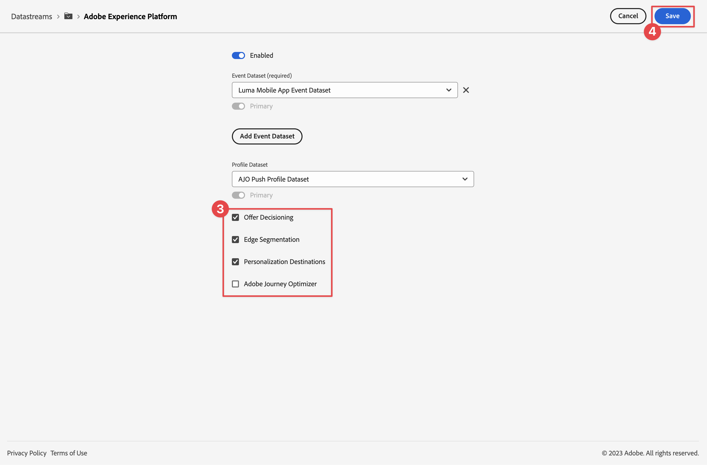

# Ottimizzare e personalizzare con Adobe Target

Scopri come ottimizzare e personalizzare le esperienze nelle app mobili con Platform Mobile SDK e Adobe Target.

Target offre tutto ciò che è necessario adattare e personalizzare le esperienze dei clienti. Target consente di massimizzare i ricavi sui siti web e mobili, applicazioni, social media e altri canali digitali. Target può eseguire test A/B, test multivariati, consigliare prodotti e contenuti, eseguire il targeting del contenuto, personalizzare automaticamente i contenuti con AI e molto altro. Questa lezione si concentra sulla funzionalità di test A/B di Target. Per ulteriori informazioni, vedere [Panoramica test A/B](https://experienceleague.adobe.com/it/docs/target/using/activities/abtest/test-ab).

{zoomable="yes"}

Prima di poter eseguire test A/B con Target, è necessario assicurarsi che siano presenti le configurazioni e le integrazioni corrette.

>[!NOTE]
>
>Questa lezione è facoltativa e si applica solo agli utenti di Adobe Target che desiderano eseguire test A/B.


## Prerequisiti

* L&#39;app con gli SDK installati e configurati è stata creata ed eseguita correttamente.
* Accedi ad Adobe Target con [autorizzazioni, ruoli, aree di lavoro e proprietà configurati correttamente](https://experienceleague.adobe.com/it/docs/target/using/administer/manage-users/enterprise/property-channel).


## Obiettivi di apprendimento

In questa lezione verranno fornite le seguenti informazioni:

* Aggiorna lo stream di dati per l’integrazione di Target.
* Aggiorna la proprietà tag con l’estensione Offer Decisioning e Target.
* Aggiorna lo schema per acquisire gli eventi della proposta.
* Convalida la configurazione in Assurance.
* Crea un semplice test A/B in Target.
* Aggiorna l&#39;app per registrare l&#39;estensione Optimizer.
* Implementa il test A/B nell’app.
* Convalidare l’implementazione in Assurance.


## Configurazione

>[!TIP]
>
>Se hai già configurato l&#39;app come parte della lezione [Offerte Journey Optimizer](journey-optimizer-offers.md), potresti aver già eseguito alcuni dei passaggi descritti in questa sezione di configurazione.

### Aggiorna configurazione dello stream di dati

#### Adobe Target

Per fare in modo che i dati inviati dalla tua app mobile ad Experience Platform Edge Network vengano inoltrati ad Adobe Target, devi aggiornare la configurazione dello stream di dati.

1. Nell&#39;interfaccia utente di Data Collection, seleziona **[!UICONTROL Datastreams]** e quindi il tuo datastream, ad esempio **[!DNL Luma Mobile App]**.
1. Seleziona **[!UICONTROL Aggiungi servizio]** e seleziona **[!UICONTROL Adobe Target]** dall&#39;elenco **[!UICONTROL Servizio]**.
1. Se sei un cliente di Target Premium e desideri utilizzare i token di proprietà, immetti il valore **[!UICONTROL Token proprietà]** di Target che desideri utilizzare per questa integrazione. Gli utenti di Target Standard possono saltare questo passaggio.

   Puoi trovare le tue proprietà nell&#39;interfaccia utente di Target, in **[!UICONTROL Amministrazione]** > **[!UICONTROL Proprietà]**. Selezionare  per visualizzare il token di proprietà per la proprietà che si desidera utilizzare. Il token di proprietà ha un formato come `"at_property": "xxxxxxxx-xxxx-xxxxx-xxxx-xxxxxxxxxxxx"`. Immettere solo il valore `xxxxxxxx-xxxx-xxxxx-xxxx-xxxxxxxxxxxx`.

   Facoltativamente, puoi specificare un ID ambiente di destinazione. Target utilizza gli ambienti per organizzare i siti e gli ambienti di pre-produzione per semplificare la gestione e creare rapporti separati. Gli ambienti predefiniti includono Produzione, Staging e Sviluppo. Per ulteriori informazioni, vedere [Ambienti](https://experienceleague.adobe.com/it/docs/target/using/administer/environments) e [ID ambiente di destinazione](https://experienceleague.adobe.com/it/docs/platform-learn/implement-web-sdk/applications-setup/setup-target).

   Facoltativamente, puoi specificare uno spazio dei nomi di terze parti per l’ID di Target per supportare la sincronizzazione dei profili su uno spazio dei nomi di identità (ad esempio, ID CRM). Per ulteriori informazioni, consulta [Spazio dei nomi ID terze parti di Target](https://experienceleague.adobe.com/it/docs/platform-learn/implement-web-sdk/applications-setup/setup-target).

1. Seleziona **[!UICONTROL Salva]**.

   {zoomable="yes"}


#### Adobe Journey Optimizer

Per fare in modo che i dati inviati dalla tua app mobile ad Edge Network vengano inoltrati a Journey Optimizer - Gestione delle decisioni, aggiorna la configurazione dello stream di dati.

1. Nell&#39;interfaccia utente di Data Collection, seleziona **[!UICONTROL Datastreams]** e quindi il tuo datastream, ad esempio **[!DNL Luma Mobile App]**.
1. Seleziona  per **[!UICONTROL Experience Platform]** e seleziona  **[!UICONTROL Modifica]** dal menu di scelta rapida.
1. Nella schermata **[!UICONTROL Flussi di dati]** >  > **[!UICONTROL Adobe Experience Platform]**, assicurati che siano selezionate **[!UICONTROL Destinazioni Offer Decisioning]**, **[!UICONTROL Segmentazione Edge]** e **[!UICONTROL Destinazioni Personalization]**. Se segui anche le lezioni di Journey Optimizer, seleziona **[!UICONTROL Adobe Journey Optimizer]**. Per ulteriori informazioni, vedere [Impostazioni di Adobe Experience Platform](https://experienceleague.adobe.com/it/docs/experience-platform/datastreams/configure).
1. Per salvare la configurazione dello stream di dati, seleziona **[!UICONTROL Salva]**.

   {zoomable="yes"}


### Installare l’estensione tag di Offer Decisioning e Target

Anche se questa lezione riguarda i test A/B in Target, il risultato di un test viene visto come un’offerta e implementato nell’infrastruttura Adobe utilizzando l’estensione tag Adobe Offer Decisioning e Target. Tale estensione gestisce entrambe le offerte gestite da Journey Optimizer e Target.

1. Passa a **[!UICONTROL Tag]**, individua la proprietà del tag mobile e apri la proprietà.
1. Seleziona **[!UICONTROL Estensioni]**.
1. Seleziona **[!UICONTROL Catalogo]**.
1. Cerca l&#39;estensione **[!UICONTROL Offer Decisioning e Target]**.
1. Installa l’estensione. L&#39;estensione non richiede una configurazione aggiuntiva.

   {zoomable="yes"}


### Aggiornare lo schema

1. Passa all&#39;interfaccia di Data Collection e seleziona **[!UICONTROL Schemi]** dalla barra a sinistra.
1. Seleziona **[!UICONTROL Sfoglia]** dalla barra superiore.
1. Seleziona lo schema per aprirlo.
1. Nell&#39;editor schema, selezionare  **[!UICONTROL Aggiungi]** accanto a **[!UICONTROL Gruppi di campi]**.
1. Nella finestra di dialogo **[!UICONTROL Aggiungi gruppi di campi]**, cerca `proposition`, seleziona **[!UICONTROL Evento esperienza - Interazioni proposte]** e seleziona **[!UICONTROL Aggiungi gruppi di campi]**.
   {zoomable="yes"}
1. Per salvare le modifiche apportate allo schema, selezionare **[!UICONTROL Salva]**.


### Convalidare la configurazione in Assurance

Per convalidare la configurazione in Assurance:

1. Passa all’interfaccia utente di Assurance.
1. Seleziona **[!UICONTROL Configura]** nella barra a sinistra e seleziona  accanto a **[!UICONTROL Convalida installazione]** sotto **[!UICONTROL OFFER DECISIONING AND TARGET]**.
1. Seleziona **[!UICONTROL Salva]**.
1. Seleziona **[!UICONTROL Convalida installazione]** nella barra a sinistra. La configurazione dello stream di dati viene convalidata e la configurazione di SDK nell’applicazione.
   {zoomable="yes"}

## Creare un test A/B

Esistono molti tipi di attività che è possibile creare in Adobe Target e implementare in un’app mobile, come indicato nell’introduzione. Per questa lezione, implementerai un test A/B.

1. Nell&#39;interfaccia utente di Target, seleziona **[!UICONTROL Attività]** dalla barra superiore.
1. Selezionare **[!UICONTROL Crea attività]** e **[!UICONTROL Test A/B]** dal menu di scelta rapida.
1. Nella finestra di dialogo **[!UICONTROL Crea attività test A/B]**, seleziona **[!UICONTROL Mobile]** come **[!UICONTROL Type]**, quindi seleziona un&#39;area di lavoro dall&#39;elenco **[!UICONTROL Scegli Workspace]**. Selezionare la proprietà dall&#39;elenco **[!UICONTROL Scegli la proprietà]** se sei un cliente di Target Premium e hai specificato un token di proprietà nello stream di dati.
1. Seleziona **[!UICONTROL Crea]**.
   {zoomable="yes"}

1. Nella schermata **[!UICONTROL Attività senza titolo]**, al passaggio **[!UICONTROL Esperienze]**:

   1. Immetti `luma-mobileapp-abtest` in **[!UICONTROL Seleziona posizione]** sotto **[!UICONTROL Posizione 1]**. Questo nome di posizione (spesso denominato mbox) viene utilizzato successivamente nell’implementazione dell’app.
   1. Seleziona  accanto a **[!UICONTROL Contenuto]** e seleziona **[!UICONTROL Crea offerta JSON]** dal menu di scelta rapida.
   1. Nella finestra di dialogo **[!UICONTROL Crea offerta JSON]**, incolla il seguente JSON.

      ```json
      { 
          "title": "Luma Anaolog Watch",
          "text": "Designed to stand up to your active lifestyle, this women's Luma Analog Watch features a tasteful brushed chrome finish and a stainless steel, water-resistant construction for lasting durability.", 
          "image": "https://luma.enablementadobe.com/content/dam/luma/en/products/gear/watches/Luma_Analog_Watch.jpg" 
      }
      ```

      {zoomable="yes"}

      Seleziona **[!UICONTROL Crea]**.

   1. Seleziona **[!UICONTROL +]** accanto a **[!UICONTROL Esperienze]** per aggiungere **[!UICONTROL Esperienza B]**.


   1. Ripeti i passaggi b e c per l’esperienza B, ma utilizza `Aim Analog Watch` come titolo e incolla il seguente JSON:

      ```json
      { 
          "title": "Aim Analog Watch",
          "text": "The flexible, rubberized strap is contoured to conform to the shape of your wrist for a comfortable all-day fit. The face features three illuminated hands, a digital read-out of the current time, and stopwatch functions.", 
          "image": "https://luma.enablementadobe.com/content/dam/luma/en/products/gear/watches/Aim_Watch.jpg" 
      }
      ```


1. Nel passaggio **[!DNL Targeting]**, controlla la configurazione del test A/B. Per impostazione predefinita, entrambe le offerte vengono allocate in modo uniforme a tutti i visitatori. Seleziona **[!UICONTROL Avanti]** per continuare.

   {zoomable="yes"}

1. Nel passaggio **[!UICONTROL Obiettivi e impostazioni]**:

   1. Rinomina l&#39;attività senza titolo, ad esempio `Luma Mobile SDK Tutorial - A/B Test Example`.
   1. Immetti un **[!UICONTROL Obiettivo]** per il test A/B, ad esempio `A/B Test for Luma mobile app tutorial`.
   1. Seleziona **[!UICONTROL Conversione]**, **[!UICONTROL ha visualizzato una mbox]** nella sezione **[!UICONTROL Metrica obiettivo]** > **[!UICONTROL OBIETTIVO PRIMARIO]** e immetti il nome della tua posizione (mbox), ad esempio `luma-mobileapp-abtest`.
   1. Seleziona **[!UICONTROL Salva e chiudi]**.

      {zoomable="yes"}

1. Torna alla schermata **[!UICONTROL Tutte le attività]**:

   1. Seleziona  nella tua attività.
   1. Seleziona  **[!UICONTROL Attiva]** per attivare il test A/B.

   {zoomable="yes"}


## Implementare Target nell’app

Come descritto nelle lezioni precedenti, l’installazione di un’estensione tag per dispositivi mobili fornisce solo la configurazione. A questo punto è necessario installare e registrare Optimize SDK. Se questi passaggi non sono chiari, controlla la sezione [Installare gli SDK](install-sdks.md).

>[!NOTE]
>
>Se hai completato la sezione [Installare gli SDK](install-sdks.md), SDK è già installato e puoi saltare questo passaggio.
>

>[!BEGINTABS]

>[!TAB iOS]

1. In Xcode, accertati che [AEP Optimize](https://github.com/adobe/aepsdk-messaging-ios) sia aggiunto all&#39;elenco dei pacchetti nelle dipendenze dei pacchetti. Consulta [Gestione pacchetti Swift](install-sdks.md#swift-package-manager).
1. Passa a **[!DNL Luma]** > **[!DNL Luma]** > **[!DNL AppDelegate]** nel Navigator dei progetti Xcode.
1. Assicurarsi che `AEPOptimize` faccia parte dell&#39;elenco delle importazioni.

   `import AEPOptimize`

1. Assicurarsi che `Optimize.self` faccia parte dell&#39;array di estensioni che si sta registrando.

   ```swift
   let extensions = [
       AEPIdentity.Identity.self,
       Lifecycle.self,
       Signal.self,
       Edge.self,
       AEPEdgeIdentity.Identity.self,
       Consent.self,
       UserProfile.self,
       Places.self,
       Messaging.self,
       Optimize.self,
       Assurance.self
   ]
   ```

1. Passa a **[!DNL Luma]** > **[!DNL Luma]** > **[!DNL Utils]** > **[!DNL MobileSDK]** nel navigatore progetti Xcode. Trovare la funzione ` func updatePropositionAT(ecid: String, location: String) async`. Aggiungi il seguente codice:

   ```swift
   // set up the XDM dictionary, define decision scope and call update proposition API
   Task {
       let ecid = ["ECID" : ["id" : ecid, "primary" : true] as [String : Any]]
       let identityMap = ["identityMap" : ecid]
       let xdmData = ["xdm" : identityMap]
       let decisionScope = DecisionScope(name: location)
       Optimize.clearCachedPropositions()
       Optimize.updatePropositions(for: [decisionScope], withXdm: xdmData) { data, error in
           if let error = error {
               Logger.aepMobileSDK.error("MobileSDK - updatePropositionsAT: Error updating propositions: \(error.localizedDescription)")
           }
       }
   }
   ```

   Questa funzione:

   * configura un dizionario XDM `xdmData` contenente l&#39;ECID per identificare il profilo per il quale si deve presentare il test A/B e
   * definisce un `decisionScope`, un array di posizioni in cui presentare il test A/B.

   Quindi la funzione chiama due API: [`Optimize.clearCachedPropositions`](https://developer.adobe.com/client-sdks/documentation/adobe-journey-optimizer-decisioning/api-reference/#clearpropositions) e [`Optimize.updatePropositions`](https://developer.adobe.com/client-sdks/documentation/adobe-journey-optimizer-decisioning/api-reference/#updatepropositions). Queste funzioni cancellano tutte le proposte memorizzate nella cache e aggiornano le proposte per questo profilo. Una proposta in questo contesto è l&#39;esperienza (offerta) selezionata dall&#39;attività di Target (test A/B) e definita in [Creare un test A/B](#create-an-ab-test).

1. Passa a **[!DNL Luma]** > **[!DNL Luma]** > **[!DNL Views]** > **[!DNL Personalization]** > **[!DNL TargetOffersView]** nel navigatore progetti Xcode. Trovare la funzione `func onPropositionsUpdateAT(location: String) async {` ed esaminare il codice di questa funzione. La parte più importante di questa funzione è la chiamata API [`Optimize.onPropositionsUpdate`](https://developer.adobe.com/client-sdks/documentation/adobe-journey-optimizer-decisioning/api-reference/#onpropositionsupdate), che:
   * recupera le proposte per il profilo corrente in base all’ambito della decisione (che è la posizione definita nel test A/B),
   * recupera l’offerta dalla proposta,
   * decomprime il contenuto dell’offerta in modo che possa essere visualizzato correttamente nell’app; e
   * attiva l&#39;azione `displayed()` nell&#39;offerta che invia nuovamente un evento a Platform Edge Network informando che l&#39;offerta è visualizzata.

1. Sempre in **[!DNL TargetOffersView]**, aggiungi il seguente codice al modificatore `.onFirstAppear`. Questo codice assicura che il callback per l’aggiornamento delle offerte venga registrato una sola volta.

   ```swift
   // Invoke callback for offer updates
   Task {
       await self.onPropositionsUpdateAT(location: location)
   }
   ```

1. Sempre in **[!DNL TargetOffersView]**, aggiungi il seguente codice al modificatore `.task`. Questo codice aggiorna le offerte quando la vista viene aggiornata.

   ```swift
   // Clear and update offers
   await self.updatePropositionsAT(ecid: currentEcid, location: location)
   ```

>[!TAB Android]

1. In Android Studio, assicurati che [aepsdk-optimize-android](https://github.com/adobe/aepsdk-optimize-android) faccia parte delle dipendenze in **[!UICONTROL build.gradle.kts]** in **[!UICONTROL Android]**  > **[!UICONTROL Script Gradle]**. Vedi [Gradle](install-sdks.md#gradle).
1. Passa a **[!DNL app]** > **[!DNL kotlin+java]** > **[!UICONTROL com.adobe.luma.tutorial.android]** > **[!UICONTROL Attività principale]** nel navigatore di Android Studio.
1. Assicurarsi che `Optimize` faccia parte dell&#39;elenco delle importazioni.

   ```kotlin
   import com.adobe.marketing.mobile.optimize.Optimize
   ```

1. Assicurarsi che `Optimize.EXTENSION` faccia parte dell&#39;array di estensioni che si sta registrando.

   ```kotlin
   val extensions = listOf(
      Identity.EXTENSION,
      Lifecycle.EXTENSION,
      Signal.EXTENSION,
      Edge.EXTENSION,
      Consent.EXTENSION,
      UserProfile.EXTENSION,
      Places.EXTENSION,
      Messaging.EXTENSION,
      Optimize.EXTENSION,
      Assurance.EXTENSION
   )
   ```

1. Passa a **[!UICONTROL Android]**  > **[!DNL app]** > **[!DNL kotlin+java]** > **[!DNL com.adobe.luma.tutorial.android]** > **[!DNL models]** > **[!UICONTROL MobileSDK]** nel navigatore di Android Studio. Trovare la funzione ` suspend fun updatePropositionsAT(ecid: String, location: String)`. Aggiungi il seguente codice:

   ```kotlin
   // set up the XDM dictionary, define decision scope and call update proposition API
   withContext(Dispatchers.IO) {
       val ecidMap = mapOf("ECID" to mapOf("id" to ecid, "primary" to true))
       val identityMap = mapOf("identityMap" to ecidMap)
       val xdmData = mapOf("xdm" to identityMap)
       val decisionScope = DecisionScope(location)
       Optimize.clearCachedPropositions()
       Optimize.updatePropositions(listOf(decisionScope), xdmData, null, object :
           AdobeCallbackWithOptimizeError<MutableMap<DecisionScope?, OptimizeProposition?>?> {
           override fun fail(optimizeError: AEPOptimizeError?) {
               val responseError = optimizeError
               Log.i("MobileSDK", "updatePropositionsAT error: ${responseError}")
           }
           override fun call(propositionsMap: MutableMap<DecisionScope?, OptimizeProposition?>?) {
               val responseMap = propositionsMap
               Log.i("MobileSDK", "updatePropositionsOD call: ${responseMap}")
           }
       })
   }
   ```

   Questa funzione:

   * configura un dizionario XDM `xdmData` contenente l&#39;ECID per identificare il profilo per il quale si deve presentare il test A/B e
   * definisce un `decisionScope`, un array di posizioni in cui presentare il test A/B.

   Quindi la funzione chiama due API: [`Optimize.clearCachedPropositions`](https://developer.adobe.com/client-sdks/documentation/adobe-journey-optimizer-decisioning/api-reference/#clearpropositions) e [`Optimize.updatePropositions`](https://developer.adobe.com/client-sdks/documentation/adobe-journey-optimizer-decisioning/api-reference/#updatepropositions). Queste funzioni cancellano tutte le proposte memorizzate nella cache e aggiornano le proposte per questo profilo. Una proposta in questo contesto è l&#39;esperienza (offerta) selezionata dall&#39;attività di Target (test A/B) e definita in [Creare un test A/B](#create-an-ab-test).

1. Passa a **[!DNL app]** > **[!DNL kotlin+java]** > **[!DNL com.adobe.luma.tutorial.android]** > **[!DNL views]** > **[!DNL TargetOffers.kt]** nel navigatore di Android Studio. Trovare la funzione `fun onPropositionsUpdateAT(location: String): List<OfferItem>` ed esaminare il codice di questa funzione. La parte più importante di questa funzione è la chiamata API [`Optimize.onPropositionsUpdate`](https://developer.adobe.com/client-sdks/documentation/adobe-journey-optimizer-decisioning/api-reference/#onpropositionsupdate), che:
   * recupera le proposte per il profilo corrente in base all’ambito della decisione (che è la posizione definita nel test A/B),
   * recupera l’offerta dalla proposta,
   * decomprime il contenuto dell’offerta in modo che possa essere visualizzato correttamente nell’app; e
   * restituisce l’offerta.

1. Sempre in **[!DNL TargetOffers.kt]**, aggiungere la funzione `LaunchedEffect` per garantire l&#39;aggiornamento delle offerte all&#39;avvio della scheda Personalization.

   ```kotlin
   // recompose the view when the number of received offers changes
   LaunchedEffect(offersAT.count()) {
       updatePropositionsAT(currentEcid, MobileSDK.shared.targetLocation.value)
       offersAT = onPropositionsUpdateAT(MobileSDK.shared.targetLocation.value)
   }
   ```

>[!ENDTABS]

Puoi inviare parametri Target aggiuntivi (come mbox, profilo, prodotto o parametri di ordine) in una richiesta di query di personalizzazione alla rete Experience Edge, aggiungendoli in un dizionario dati quando chiami l&#39;API [`Optimize.updatePropositions`](https://developer.adobe.com/client-sdks/documentation/adobe-journey-optimizer-decisioning/api-reference/#updatepropositions). Per ulteriori informazioni, vedere [Parametri di destinazione](https://developer.adobe.com/client-sdks/documentation/adobe-journey-optimizer-decisioning/#target-parameters).


## Convalida tramite l’app

>[!BEGINTABS]

>[!TAB iOS]

1. Rigenera ed esegui l&#39;app nel simulatore o su un dispositivo fisico da Xcode, utilizzando .

1. Passa alla scheda **[!UICONTROL Personalization]**.

1. Scorri verso il basso e visualizzi una delle due offerte definite nel test A/B visualizzato nel riquadro **[!UICONTROL TARGET]**.

   


>[!TAB Android]

1. Rigenera ed esegui l&#39;app nel simulatore o su un dispositivo fisico da Android Studio, utilizzando .

1. Passa alla scheda **[!DNL Personalization]**.

1. Puoi vedere una delle due offerte definite nel test A/B visualizzata nella casella inferiore del riquadro **[!UICONTROL TARGET]**.

   


>[!ENDTABS]

## Convalidare l’implementazione in Assurance

Per convalidare il test A/B in Assurance:

1. Consulta la sezione [istruzioni di installazione](assurance.md#connecting-to-a-session) per collegare il simulatore o il dispositivo ad Assurance.
1. Seleziona **[!UICONTROL Configura]** nella barra a sinistra e seleziona  accanto a **[!UICONTROL Rivedi e simula]** sotto **[!UICONTROL OFFER DECISIONING AND TARGET]**.
1. Seleziona **[!UICONTROL Salva]**.
1. Seleziona **[!UICONTROL Rivedi e simula]** nella barra a sinistra. La configurazione dello stream di dati viene convalidata e la configurazione di SDK nell’applicazione.
1. Seleziona **[!UICONTROL Richieste]** nella barra superiore. Sono visualizzate le tue **[!DNL Target]** richieste.
   {zoomable="yes"}

1. Puoi esplorare le schede **[!UICONTROL Simula]** e **[!UICONTROL Elenco eventi]** per ulteriori funzionalità che ti aiutano a convalidare la configurazione delle offerte Target.

## Passaggi successivi

Ora dovresti disporre di tutti gli strumenti per iniziare ad aggiungere all’app più test A/B o altre attività di Target (come Targeting esperienza, Test multivariato), laddove pertinente e applicabile. Ulteriori informazioni sono disponibili nell&#39;archivio [GitHub per l&#39;estensione Optimize](https://github.com/adobe/aepsdk-optimize-ios), dove è inoltre possibile trovare un collegamento a un [tutorial](https://opensource.adobe.com/aepsdk-optimize-ios/#/tutorials/README) dedicato su come tenere traccia delle offerte Adobe Target.

>[!SUCCESS]
>
>Hai abilitato l’app per test A/B e visualizzato i risultati di un test A/B con l’estensione Offer Decisioning e Target per Adobe Experience Platform Mobile SDK.
>
>Grazie per aver dedicato tempo all&#39;apprendimento di Adobe Experience Platform Mobile SDK. Se hai domande, vuoi condividere commenti generali o suggerimenti su contenuti futuri, condividili in questo [post di discussione della community Experience League](https://experienceleaguecommunities.adobe.com/t5/adobe-experience-platform-data/tutorial-discussion-implement-adobe-experience-cloud-in-mobile/td-p/443796).

Successivo: **[Conclusione e passaggi successivi](conclusion.md)**
