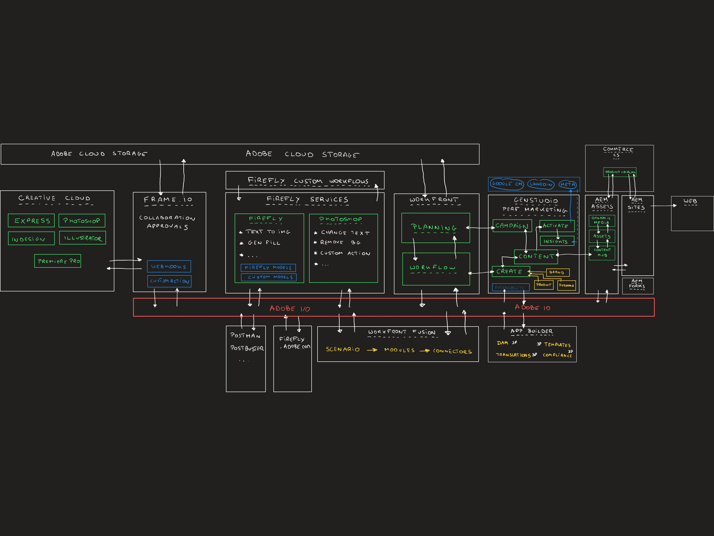
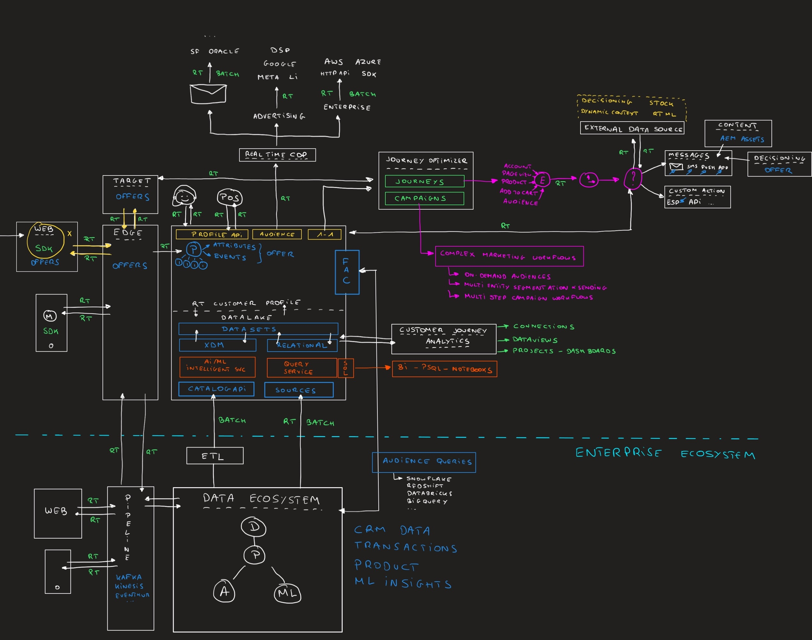

# Tutorial su un Adobe: panoramica dell’architettura

{width="50px" align="left"}

## Panoramica di un’architettura Adobe

Questo video illustra l’architettura dell’esercitazione completa One Adobe.

>[!VIDEO](https://video.tv.adobe.com/v/3481417?quality=12&learn=on)

Scarica l’immagine di panoramica dell’architettura qui sotto:

## Panoramica dell’architettura di IA agente

Questo video illustra l’architettura della parte di IA per l’analisi dinamica dell’esercitazione One Adobe.

>[!VIDEO](https://video.tv.adobe.com/v/3481416?quality=12&learn=on)

Scarica l’immagine di panoramica dell’architettura qui sotto:

## Panoramica dell’architettura dei contenuti

Questo video illustra l’architettura alla base della parte GenStudio di questa esercitazione.

>[!VIDEO](https://video.tv.adobe.com/v/3481414?quality=12&learn=on)

Scarica l’immagine di panoramica dell’architettura qui sotto:

## Panoramica dell’architettura dei dati

Questo video illustra l’architettura alla base della parte relativa a Adobe Experience Platform e applicazioni di questa esercitazione.

>[!VIDEO](https://video.tv.adobe.com/v/3481415?quality=12&learn=on)

Scarica l’immagine di panoramica dell’architettura qui sotto:

>[!NOTE]
>
>Se hai domande, vuoi condividere feedback generali su suggerimenti in merito a contenuti futuri, contatta direttamente Tech Insiders, inviando un&#39;e-mail a **techinsiders@adobe.com**.
