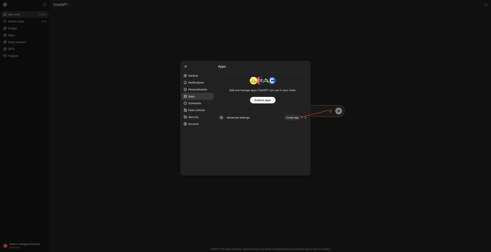
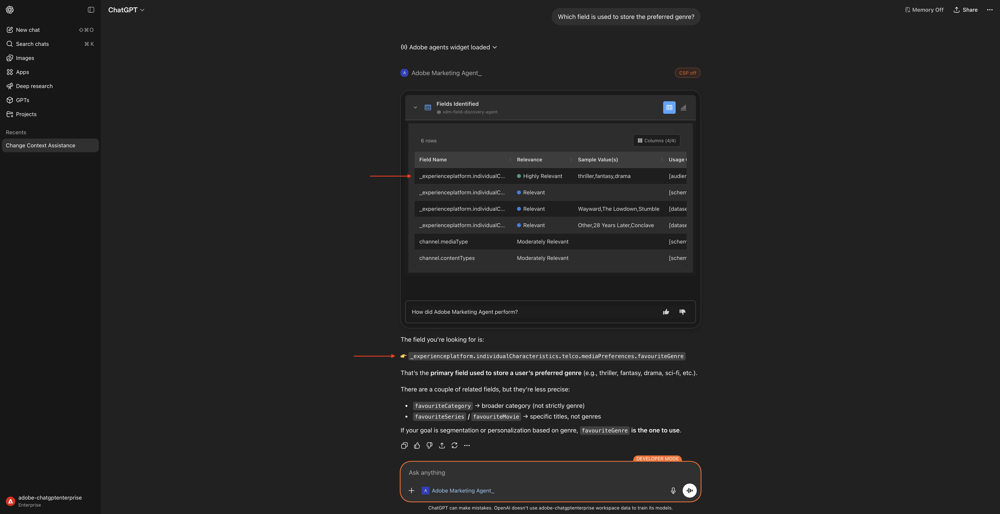
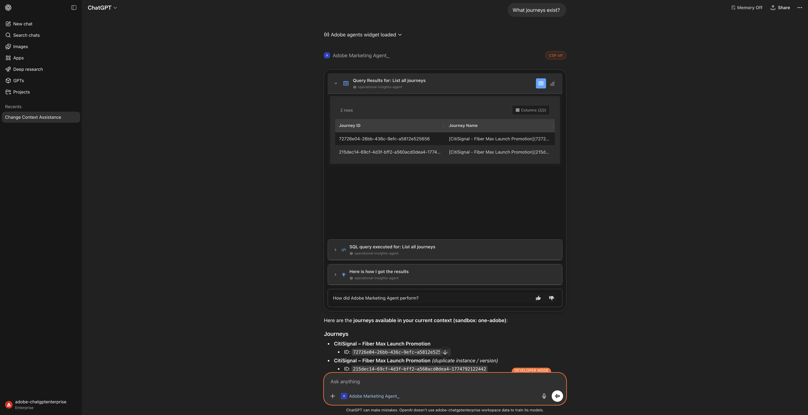
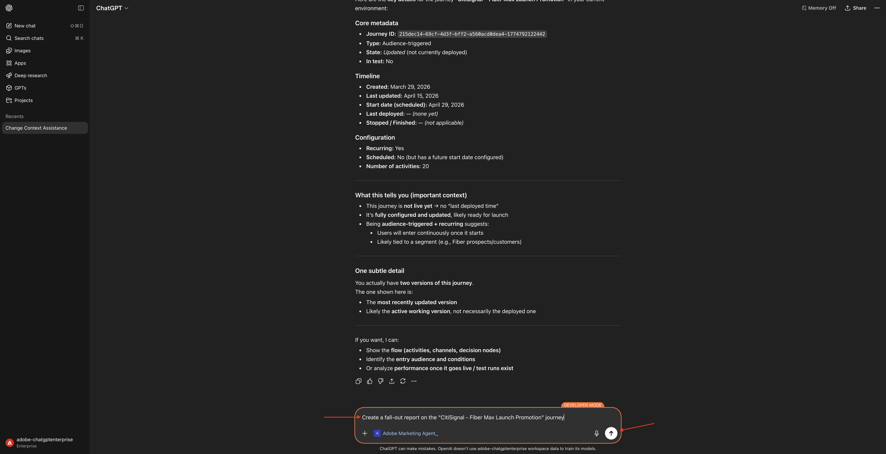
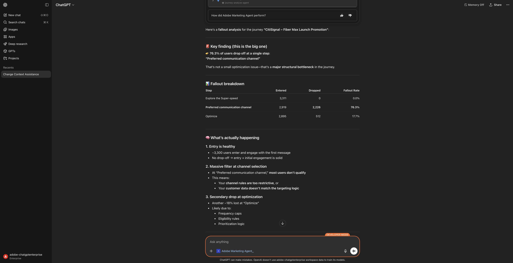

# 1.1.2 Adobe Marketing Agent per ChatGPT Enterprise

## Video

Questo video illustra e illustra tutti i passaggi di questo esercizio.

>[!VIDEO](https://video.tv.adobe.com/v/3478410?quality=12&learn=on)

## 1.1.2.1 Creazione di un&#39;app personalizzata in ChatGPT Enterprise per Adobe Marketing Agent

>[!NOTE]
>
>L’utilizzo di Adobe Marketing Agent in ChatGPT richiede quanto segue:
>- una versione a pagamento di OpenAI ChatGPT Enterprise
>- utilizzo del client Web ChatGPT Enterprise

Vai a [https://chatgpt.com/](https://chatgpt.com/){target="_blank"} e accedi utilizzando i dettagli del tuo account. Una volta effettuato l’accesso, dovresti visualizzarlo. Fai clic sul nome utente.


Seleziona **Impostazioni**.


Vai a **App** e seleziona **Impostazioni avanzate**.


Attiva **Modalità sviluppatore**, quindi fai clic su **Indietro**.


Fai clic su **Crea app**.



Compila i campi in questo modo:

- **Nome**: `Adobe Marketing Agent`
- **URL server MCP**: chiedi al tuo rappresentante Adobe
- **Autenticazione**: `OAuth`

Seleziona la casella di controllo per **Ho capito e voglio continuare**.

Fai clic su **Crea**.


ChatGPT tenterà ora di connettersi al tuo account Adobe. Seleziona **Consenti accesso**, quindi dovrai accedere con il tuo account Adobe.


Dopo aver effettuato l’accesso, dovresti notare che il tuo Adobe Marketing Agent è ora connesso correttamente.


## 1.1.2.2 Imposta contesto in Adobe Marketing Agent

Chiudi questa finestra.


Dovresti vedere questo. Fai clic sull&#39;icona **+**, passa a **Altro** e seleziona **Adobe Marketing Agent**.


Prima di interagire ulteriormente con Adobe Marketing Agent tramite ChatGPT, è necessario impostare il contesto.

Per questo esercizio, il contesto deve essere impostato per utilizzare:

- **Organizzazione IMS**: `--aepImsOrgName--`.

- **Sandbox**: **Prod - Un Adobe**

L’impostazione Sandbox consente di identificare quale sandbox ChatGPT deve esaminare quando si pongono domande.

- **Visualizzazione dati**: **AdobeOne - Visualizzazione dati cliente unificata**

L’impostazione Visualizzazione dati consente di identificare la visualizzazione dati che ChatGPT deve esaminare quando pone domande.

Immetti il seguente **Prompt** e fai clic sul pulsante **invia**.

```
change context
```


Dovresti quindi visualizzare una finestra simile, che mostra l’organizzazione, la sandbox e la visualizzazione dati attualmente selezionate. Modifica questi campi con l’organizzazione, la sandbox e la visualizzazione dati corrette in base alle informazioni di cui sopra.


Il contesto è ora impostato correttamente, quindi puoi iniziare a inviare successivamente richieste specifiche.

## 1.1.2.3 Inizia con le tendenze generali di acquisto per ancorare il contesto e ingrandire la visualizzazione della fibra

**Intento**

Ottieni un impulso a livello di toplevel sulla domanda di categoria: mobile, rete fissa, Internet, TV, fibra ottica, in particolare per gli ultimi 60 giorni. Questo stabilisce le linee di base per la stagionalità, gli effetti promozionali e la varianza regionale dopo il rollout di New York.

Immetti il seguente **Prompt** e fai clic sul pulsante **invia**.

```
Show me purchases by mainCategory over the last 2 months.
```


Dovresti quindi vedere quanto segue:


Immetti il seguente **Prompt** e fai clic sul pulsante **invia**.

```
Show me purchases by mainCategory = Fiber over the last 2 months per week
```


Dovresti vedere questo, che approfondisce le tendenze specifiche della fibra.


## 1.1.2.4 Correlazione degli ordini con le preferenze del contenuto

**Intento**

Testare l&#39;ipotesi che una preferenza per un genere specifico (ad esempio, SciFi, Sport, Drammatico) preveda il comportamento di aggiornamento della banda larga, in particolare per le esigenze di larghezza di banda elevata.

Innanzitutto, devi scoprire quale campo viene utilizzato per memorizzare la preferenza di genere.

Immetti il seguente **Prompt** e fai clic sul pulsante **invia**.

```
Which field is used to store the preferred genre?
```


Dovresti visualizzarlo, il che mostra che il campo utilizzato per il genere è **`--aepTenantId--.individualCharacteristics.telco.mediaPreferences.favouriteGenre`**.



Con tali informazioni, puoi iniziare a espandere i dati di acquisto.

Immetti il seguente **Prompt** e fai clic sul pulsante **invia**.

```
Show me purchases by favouriteGenre for the last 2 months
```


Dovresti vedere questo.


## 1.1.2.5 Identificare Percorsi Fibre Esistenti

**Intento**

Scopri quali percorsi attivi o conclusi di recente includono &quot;Fibre&quot; nel titolo, ad esempio &quot;Fibre Upgrade NYC - Sept&quot;, &quot;Fibre Trial - Streaming Bundle&quot;.

Immetti il seguente **Prompt** e fai clic sul pulsante **invia**.

```
What journeys exist? 
```


Dovresti vedere questo.



Immetti il seguente **Prompt** e fai clic sul pulsante **invia**.

```
Which of these journeys has 'Fiber' in its name?
```


Dovresti vedere questo.


Immetti il seguente **Prompt** e fai clic sul pulsante **invia**.

```
show me the details of the journey 'CitiSignal - Fiber Max Launch Promotion'
```


Dovresti vedere questo.


## 1.1.2.6 Convalidare le prestazioni del percorso tramite analisi dell&#39;abbandono

**Intento**

Desideri comprendere l’abbandono delle prestazioni del percorso per sapere se nel percorso sono presenti nodi o condizioni che riscontrano una grande percentuale di profili eliminati. Questo è utile per capire se sono necessari ulteriori aggiustamenti nel percorso.

Immetti il seguente **Prompt** e fai clic sul pulsante **invia**.

```
Create a fall-out report on the "CitiSignal - Fiber Max Launch Promotion" journey
```



Dovresti vedere questo.


Scorri verso il basso un po&#39;. È ora possibile rivedere la tabella esaminando ogni nodo e i rispettivi numeri di immissione, numeri di abbandono e tasso di abbandono.



Scorri verso il basso ancora un po’ per vedere le osservazioni e i consigli.


Ora hai completato il laboratorio.

## Passaggi successivi

Vai a [Adobe Marketing Agent for Microsoft 365 Copilot](./ex3.md){target="_blank"}

Torna a [Agent Orchestrator](./agentorchestrator.md){target="_blank"}

[Torna a tutti i moduli](./../../../overview.md){target="_blank"}
