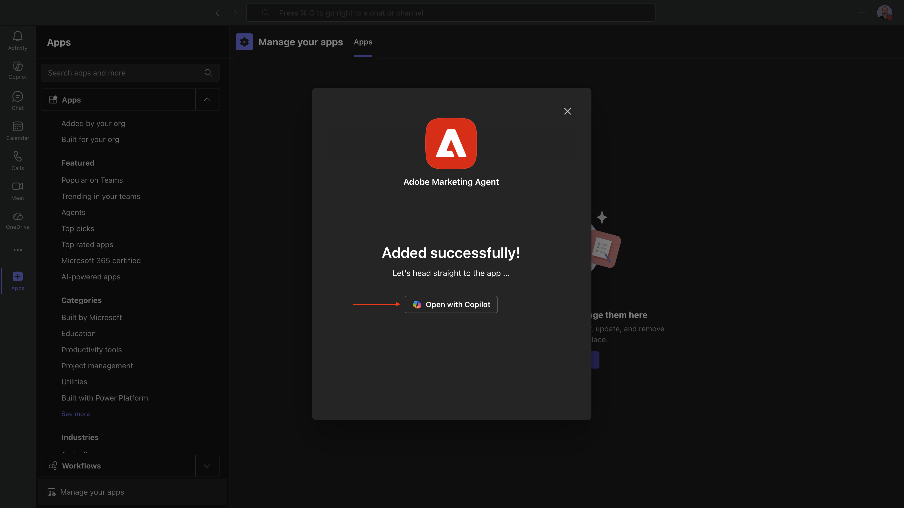
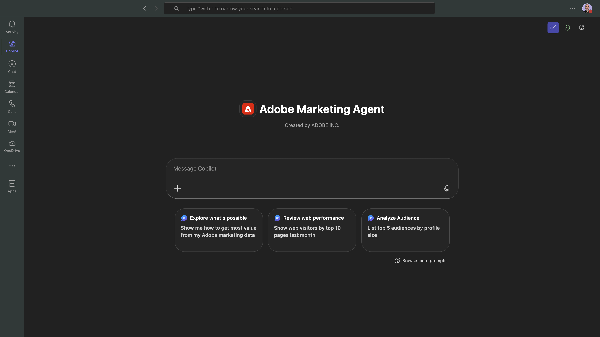
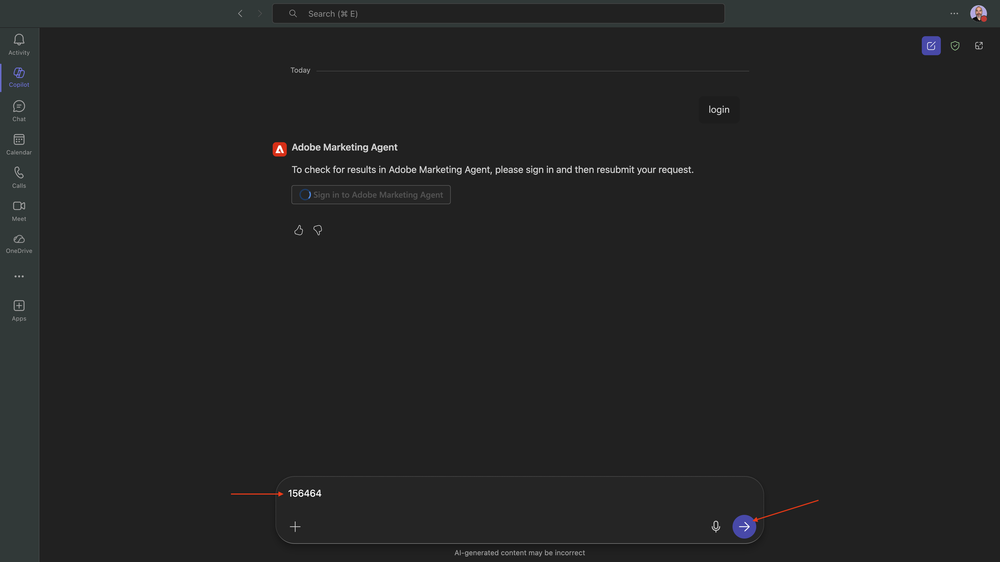
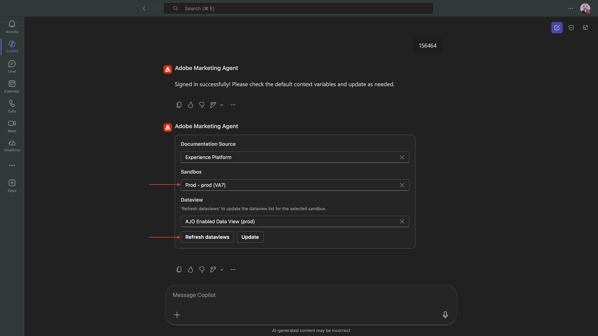
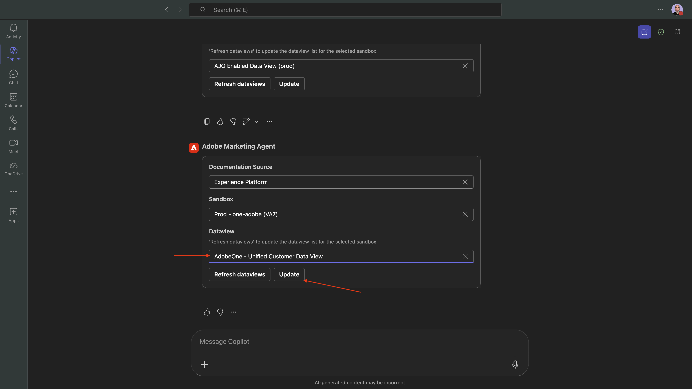
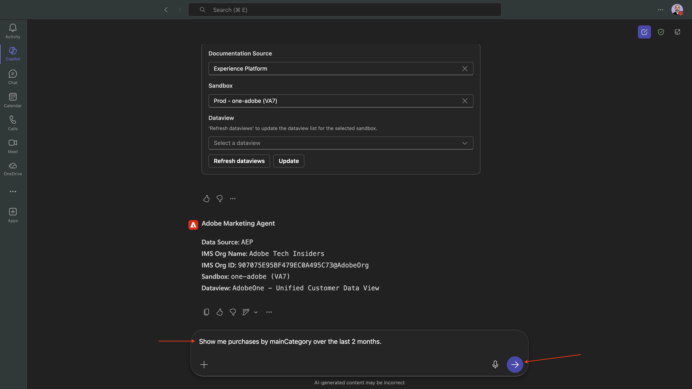
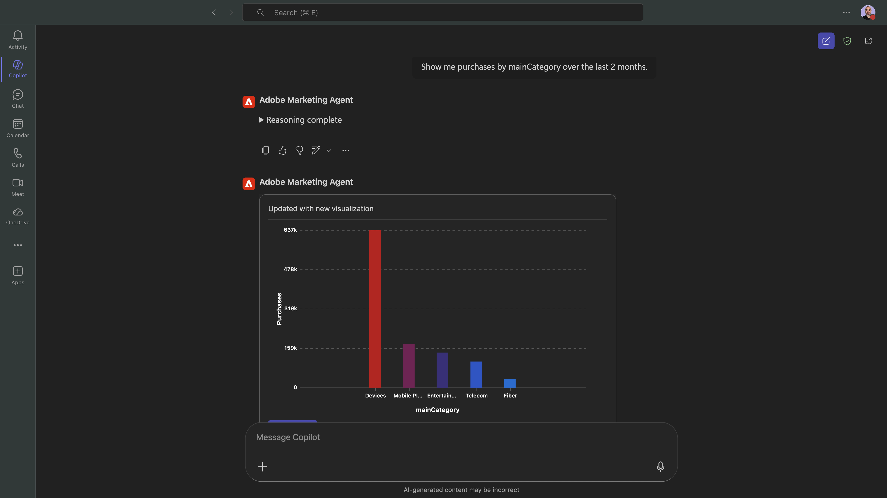
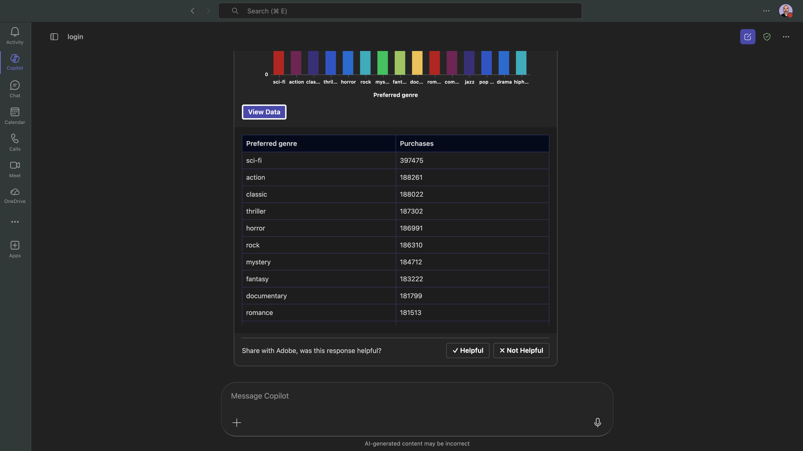
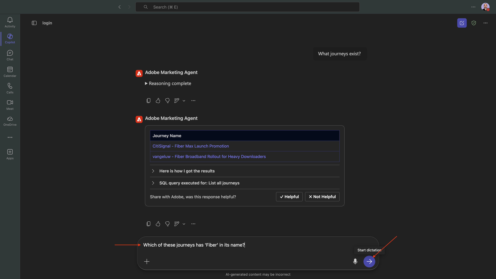
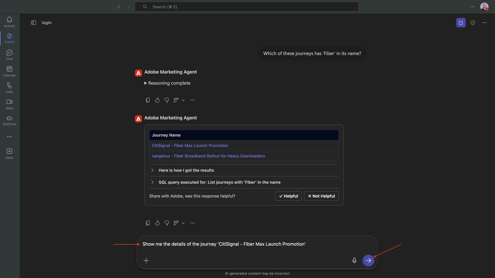

# 1.1.3 Adobe Marketing Agent for Microsoft 365 Copilot

## Prerequisiti

Per seguire i passaggi descritti in questa esercitazione, come documentato di seguito, è necessario disporre dei seguenti diritti di accesso:

- Accesso a Real-Time CDP, Journey Optimizer e Customer Journey Analytics
- Accesso all’Assistente all’intelligenza artificiale in Adobe Experience Cloud
- Accesso ad AEP Agent Orchestrator
- Accesso a Microsoft 365 Copilot

## Video

Questo video illustra e illustra tutti i passaggi di questo esercizio.

>[!VIDEO](https://video.tv.adobe.com/v/3479158?quality=12&learn=on)

## 1.1.3.1 Aggiungi Adobe Marketing Agent a Microsoft 365 Teams e Copilot

Apri Microsoft Teams e accedi utilizzando i dettagli del tuo account. Una volta effettuato l’accesso, dovresti visualizzarlo.

Fare clic su **App**.


Seleziona **Gestione app**.


Seleziona **Carica un&#39;app**.


Seleziona **Carica un&#39;app personalizzata**.


Selezionare il file manifesto fornito dall&#39;istruttore e fare clic su **Apri**.


Fai clic su **Aggiungi**.


Fare clic su **Apri con Copilot**.



Adobe Marketing Agent ora è caricato correttamente.



Immettere il prompt `login` e fare clic sul pulsante **invia**.


Fai clic su **Accedi a Adobe Marketing Agent**.


Viene visualizzata una nuova finestra in cui viene richiesto di accedere con le credenziali dell’account Adobe.


Verrà quindi generato un codice simile. Fai clic su **Copia** per copiare il codice.


Incollare il codice nella finestra di Adobe Marketing Agent in Copilot e fare clic sul pulsante **invia**.



Dovresti vedere qualcosa di simile a questo. Hai effettuato correttamente l’accesso a Adobe Marketing Agent in Microsoft 365 Copilot.


## 1.1.3.2 Imposta contesto in Adobe Marketing Agent

Prima di interagire ulteriormente con Adobe Marketing Agent tramite Copilot, è necessario impostare il contesto.

Per questo esercizio, il contesto deve essere impostato per utilizzare:

- **Sandbox**: **Prod - Un Adobe (VA7)**

  L’impostazione sandbox consente di identificare quale sandbox AI Assistant deve esaminare quando si pongono domande.

- **Visualizzazione dati**: **AdobeOne - Visualizzazione dati cliente unificata**

  L’impostazione della visualizzazione dati consente di identificare quale visualizzazione dati deve essere esaminata dall’Assistente IA per l’analisi dei dati quando si pongono domande.

Innanzitutto, impostare la sandbox sulla sandbox corretta, quindi fare clic su **Aggiorna visualizzazioni dati**.



Quindi, selezionare la visualizzazione dati corretta e fare clic su **Aggiorna**.



Dovresti vedere questo. Il contesto ora è impostato correttamente, quindi puoi iniziare a inviare successivamente richieste specifiche.


## 1.1.3.3 Inizia con le tendenze generali di acquisto per ancorare il contesto e ingrandire la visualizzazione della fibra

**Intento**

Ottieni un impulso a livello di toplevel sulla domanda di categoria: mobile, rete fissa, Internet, TV, fibra ottica, in particolare per gli ultimi 60 giorni. Questo stabilisce le linee di base per la stagionalità, gli effetti promozionali e la varianza regionale dopo il rollout di New York.

Immetti il seguente **Prompt** e fai clic sul pulsante **invia**.

```
Show me purchases by mainCategory over the last 2 months.
```



Dovresti quindi vedere quanto segue:



Immetti il seguente **Prompt** e fai clic sul pulsante **invia**.

```
Show me purchases by mainCategory = Fiber over the last 2 months broken down by week
```


Dovresti vedere questo, che approfondisce le tendenze specifiche della fibra.


## 1.1.3.4 Correlazione degli ordini con le preferenze del contenuto

**Intento**

Testare l&#39;ipotesi che una preferenza per un genere specifico (ad esempio, SciFi, Sport, Drammatico) preveda il comportamento di aggiornamento della banda larga, in particolare per le esigenze di larghezza di banda elevata.

Innanzitutto, devi scoprire quale campo viene utilizzato per memorizzare la preferenza di genere.

Immetti il seguente **Prompt** e fai clic sul pulsante **invia**.

```
Which field is used to store the preferred genre
```


Dovresti visualizzarlo, il che mostra che il campo utilizzato per il genere è **`--aepTenantId--.individualCharacteristics.telco.mediaPreferences.favouriteGenre`**.


Con tali informazioni, puoi iniziare a espandere i dati di acquisto.

Immetti il seguente **Prompt** e fai clic sul pulsante **invia**.

```
Show me purchases by preferred genre for the last 2 months until today
```


Dovresti vedere questo. Fare clic su **Visualizza dati**.


Dovresti vedere questo.



## 1.1.3.5 Identificare Percorsi Fibre Esistenti

**Intento**

Scopri quali percorsi attivi o conclusi di recente includono &quot;Fibre&quot; nel titolo, ad esempio &quot;Fibre Upgrade NYC - Sept&quot;, &quot;Fibre Trial - Streaming Bundle&quot;.

Immetti il seguente **Prompt** e fai clic sul pulsante **invia**.

```
What journeys exist? 
```


Dovresti quindi visualizzare un elenco di percorsi.


Immetti il seguente **Prompt** e fai clic sul pulsante **invia**.

```
Which of these journeys has 'Fiber' in its name?
```



Dovresti vedere questo.


Immetti il seguente **Prompt** e fai clic sul pulsante **invia**.

```
Show me the details of the journey 'CitiSignal - Fiber Max Launch Promotion'
```



Dovresti vedere questo.


## 1.1.3.6 Convalidare le prestazioni del percorso tramite analisi dell&#39;abbandono

**Intento**

Desideri comprendere l’abbandono delle prestazioni del percorso per sapere se nel percorso sono presenti nodi o condizioni che riscontrano una grande percentuale di profili eliminati. Questo è utile per capire se sono necessari ulteriori aggiustamenti nel percorso.

Immetti il seguente **Prompt** e fai clic sul pulsante **invia**.

```
Create a fall-out report on the "CitiSignal - Fiber Max Launch Promotion" journey
```


Dovresti vedere questo.


Scorri verso il basso ancora un po’ per vedere le osservazioni e i consigli.


Ora hai completato il laboratorio.

## Passaggi successivi

Vai a [Adobe Marketing Agent per Google Gemini Enterprise](./ex4.md){target="_blank"}

Torna a [Agent Orchestrator](./agentorchestrator.md){target="_blank"}

[Torna a tutti i moduli](./../../../overview.md){target="_blank"}
