# 1.1.4 Adobe Marketing Agent per Google Gemini Enterprise

[!BADGE Beta]

+++Dettagli Beta
Utilizzando Adobe Marketing Agent con Google Gemini Enterprise Beta, l&#39;Utente riconosce che il Beta viene fornito &quot;così com&#39;è&quot; senza alcuna garanzia. Adobe non ha alcun obbligo di mantenere, correggere, aggiornare, modificare, modificare o supportare in altro modo Beta. Si consiglia di usare cautela e di non fare affidamento in alcun modo sul corretto funzionamento o sulle prestazioni di tale Beta e/o dei materiali di accompagnamento. Beta è considerata un&#39;informazione riservata di Adobe.  Qualsiasi &quot;Feedback&quot; (informazioni relative a Beta, compresi, a titolo esemplificativo e non esaustivo, problemi o difetti riscontrati durante l’utilizzo di Beta, suggerimenti, miglioramenti e raccomandazioni) fornito dall’Utente a Adobe viene assegnato ad Adobe, inclusi tutti i diritti, i titoli e gli interessi relativi a tale Feedback.

+++

## Prerequisiti

Per seguire i passaggi descritti in questa esercitazione, come documentato di seguito, è necessario disporre dei seguenti diritti di accesso:

- Accesso a Real-Time CDP, Journey Optimizer e Customer Journey Analytics
- Accesso all’Assistente all’intelligenza artificiale in Adobe Experience Cloud
- Accesso ad AEP Agent Orchestrator
- Accesso a Google Gemini Enterprise

## Video

Questo video illustra e illustra tutti i passaggi di questo esercizio.

>[!VIDEO](https://video.tv.adobe.com/v/3481322?quality=12&learn=on)

## Accesso 1.1.4.1 a Google Gemini Enterprise

Vai a [https://cloud.google.com/gemini-enterprise](https://cloud.google.com/gemini-enterprise). Fai clic su **Avvia versione di prova gratuita di 30 giorni**.

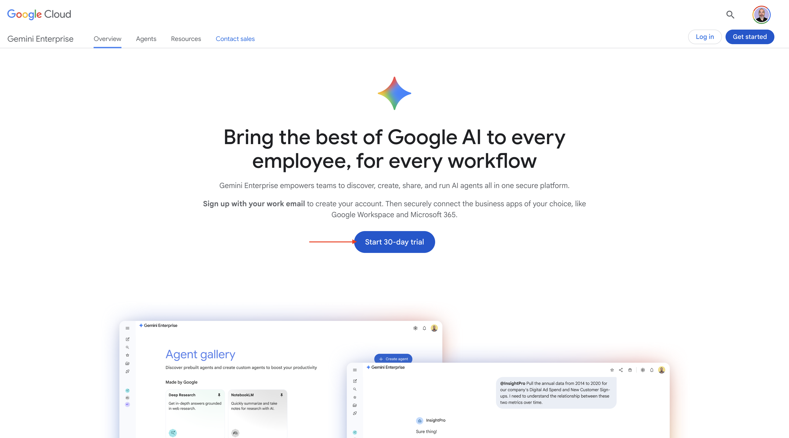

Immetti l&#39;indirizzo e-mail del tuo account Google e fai clic su **Continua con l&#39;e-mail**.


Specifica nome e cognome, quindi fai clic su **Accetto e inizia**.

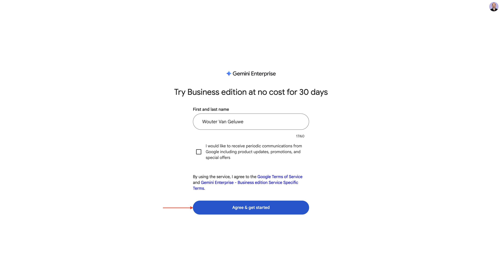

Fai clic su **Lo farò più tardi**.


Dovresti vedere questo.

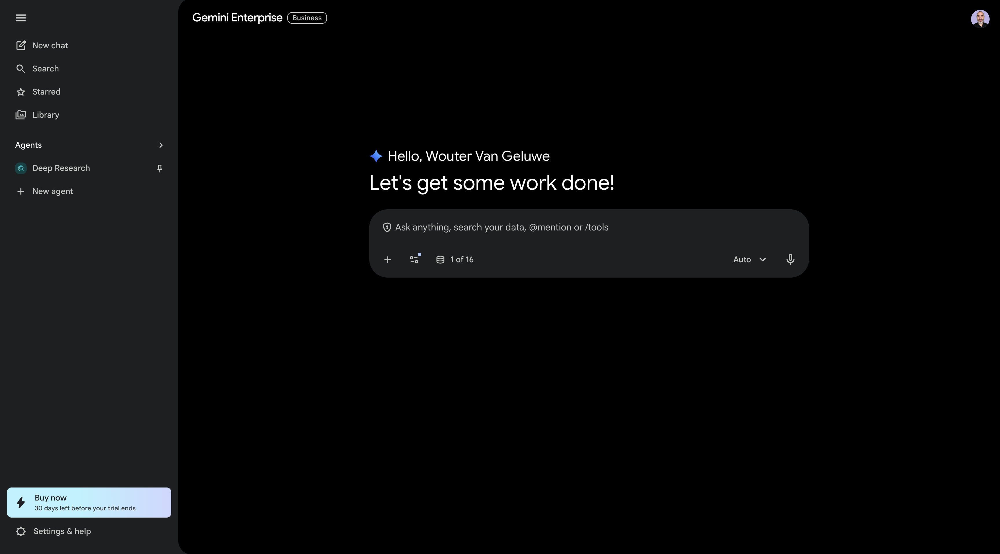

Vai a [https://cloud.google.com/gemini-enterprise](https://cloud.google.com/gemini-enterprise).

Dovresti vedere qualcosa del genere. Potresti anche dover prima creare il tuo account di fatturazione, per poi selezionarlo qui in seguito.


Fai clic su **Avvia prova gratuita di 30 giorni**.


Fai clic su **Continua e attiva l&#39;API**.


Fai clic su **Crea**.

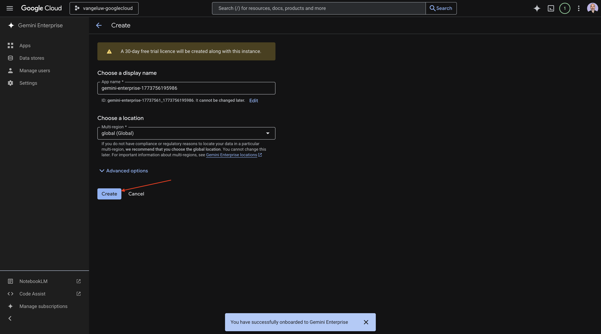

Dovresti vedere questo.

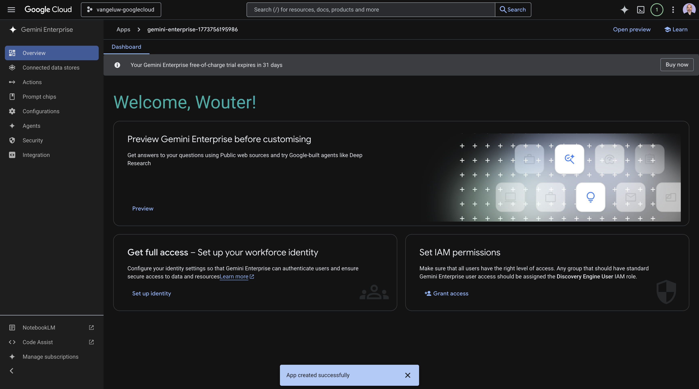

## 1.1.4.2 Crea l&#39;agente personalizzato utilizzando A2A

Vai a [https://console.cloud.google.com/gemini-enterprise](https://console.cloud.google.com/gemini-enterprise). Fare clic su **Agenti**.


Fare clic su **+Aggiungi agente**.


Seleziona **Agente personalizzato tramite A2A**.


Incolla il **JSON** della scheda agente.

>[!NOTE]
>
>Rivolgiti al tuo rappresentante Adobe per ottenere le informazioni **JSON** della carta dell&#39;agente.


Dopo aver incollato il **JSON** della scheda agente, fare clic su **Anteprima dettagli agente**.


Dovresti vedere qualcosa del genere. Scorri verso il basso e fai clic su **Avanti**.


Dovresti vedere qualcosa del genere.


Compila i campi per la tua istanza.

- **ID client**:

```
--aepImsOrgId--
```

- **Segreto client**:

```
AdobeMarketingAgent
```

- **URL autorizzazione**:

```
https://XXX.adobe.io/authorize
```

- **URL token**:

```
https://XXX.adobe.io/token
```

- **Ambiti**:

```
openid email profile
```

Fai clic su **Fine**.


Dovresti vedere questo.


## Accesso a Adobe Marketing Agent di 1.1.4.3

Vai a **Panoramica** e fai clic su **Anteprima**.


Fai clic su **Inizia**


Vai a **Agenti**. Dovresti trovare **Adobe Marketing Agent**.


Fai clic sui tre punti **...**, quindi seleziona **Pin**.

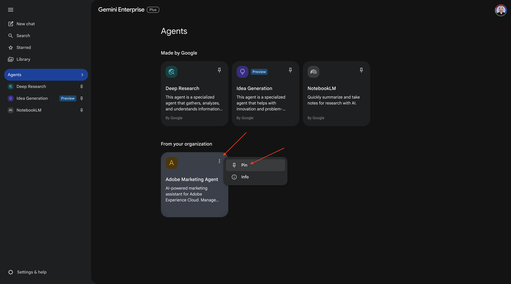

Vai a **Nuova chat** e immetti il simbolo **@** nella chat. Fare clic su **Adobe Marketing Agent**.


Immettere il comando `login` e quindi fare clic su **Invia**.


Dovresti vedere questo. Fare clic su **Autorizza**.

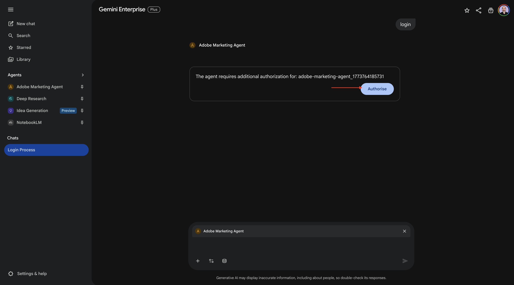

Fai clic su **Consenti accesso**, completa l&#39;accesso con il tuo Adobe ID e, quando richiesto, seleziona l&#39;istanza `--aepImsOrgName--`.


Dovresti vedere questo.


## 1.1.4.4 Imposta contesto in Adobe Marketing Agent

Prima di interagire ulteriormente con Adobe Marketing Agent tramite Copilot, è necessario impostare il contesto.

Per questo esercizio, il contesto deve essere impostato per utilizzare:

- **Sandbox**: **Prod - Un Adobe (VA7)**

  L’impostazione sandbox consente di identificare quale sandbox AI Assistant deve esaminare quando si pongono domande.

- **Visualizzazione dati**: **AdobeOne - Visualizzazione dati cliente unificata**

L’impostazione della visualizzazione dati consente di identificare quale visualizzazione dati deve essere esaminata dall’Assistente IA per l’analisi dei dati quando si pongono domande.

Per modificare la sandbox, immetti il comando seguente e fai clic sul pulsante **invia**.

```javascript
list sandboxes
```


Dovresti vedere qualcosa di simile a questo. Immetti il comando seguente e fai clic sul pulsante **Invia**.

```
switch to sandbox One Adobe
```

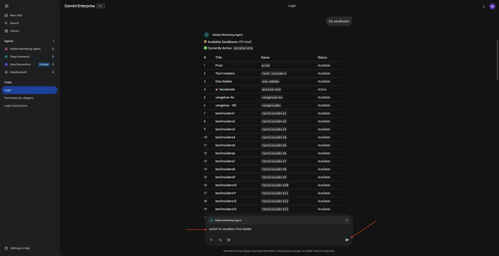

Dovresti vedere questo. Per modificare la visualizzazione dati, immettere il comando seguente e fare clic sul pulsante **invia**.

```
list dataviews
```


Dovresti vedere qualcosa di simile a questo. Immetti il comando seguente e fai clic sul pulsante **Invia**.

```
switch to AdobeOne - Unified Customer Data View
```

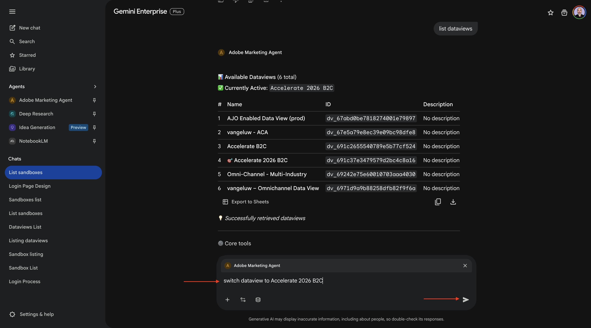

Dovresti vedere questo. Il contesto ora è impostato correttamente, quindi puoi iniziare a inviare successivamente richieste specifiche.

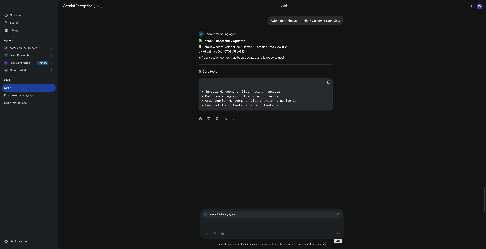

## 1.1.4.5 Inizia con le tendenze generali di acquisto per ancorare il contesto e ingrandire la visualizzazione della fibra

**Intento**

Ottieni un impulso a livello di toplevel sulla domanda di categoria: mobile, rete fissa, Internet, TV, fibra ottica, in particolare per gli ultimi 60 giorni. Questo stabilisce le linee di base per la stagionalità, gli effetti promozionali e la varianza regionale dopo il rollout di New York.

Immetti il seguente **Prompt** e fai clic sul pulsante **invia**.

```javascript
Show me purchases by mainCategory over the last 2 months until today
```


Dovresti quindi vedere quanto segue:


Immetti il seguente **Prompt** e fai clic sul pulsante **invia**.

```javascript
Show me purchases by mainCategory = Fiber over the last 2 months until today, broken down by week
```


Dovresti vedere questo, che approfondisce le tendenze specifiche della fibra.


## 1.1.4.6 Correlazione degli ordini con le preferenze del contenuto

**Intento**

Testare l&#39;ipotesi che una preferenza per un genere specifico (ad esempio, SciFi, Sport, Drammatico) preveda il comportamento di aggiornamento della banda larga, in particolare per le esigenze di larghezza di banda elevata.

Innanzitutto, devi scoprire quale campo viene utilizzato per memorizzare la preferenza di genere.

Immetti il seguente **Prompt** e fai clic sul pulsante **invia**.

```javascript
Which field is used to store the preferred genre
```

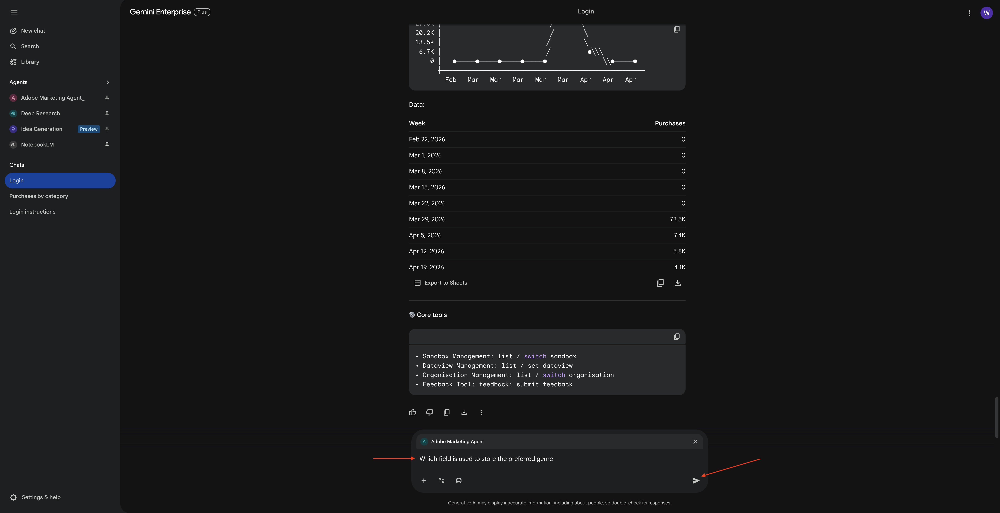

Dovresti visualizzarlo, il che mostra che il campo utilizzato per il genere è **`--aepTenantId--.individualCharacteristics.telco.mediaPreferences.favouriteGenre`**.

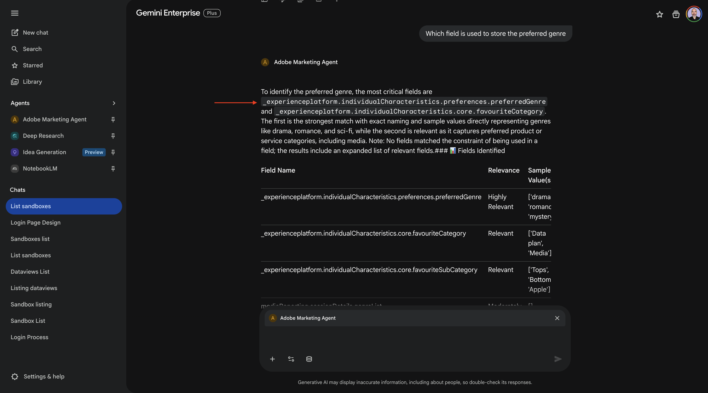

Con tali informazioni, puoi iniziare a espandere i dati di acquisto.

Immetti il seguente **Prompt** e fai clic sul pulsante **invia**.

```javascript
Show me purchases by preferred genre for the last 2 months until today
```

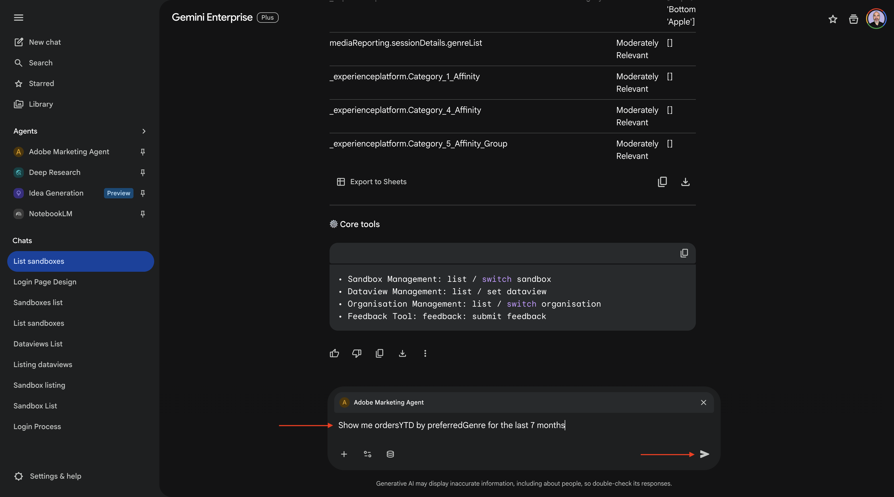

Dovresti vedere questo.


## 1.1.4.7 Identificare Percorsi Fibre Esistenti

**Intento**

Scopri quali percorsi attivi o conclusi di recente includono &quot;Fibre&quot; nel titolo, ad esempio &quot;Fibre Upgrade NYC - Sept&quot;, &quot;Fibre Trial - Streaming Bundle&quot;.

Immetti il seguente **Prompt** e fai clic sul pulsante **invia**.

```javascript
What journeys exist? 
```


Dovresti quindi visualizzare un elenco di percorsi.


Immetti il seguente **Prompt** e fai clic sul pulsante **invia**.

```javascript
Which of these journeys has 'Fiber' in its name?
```


Dovresti vedere questo.

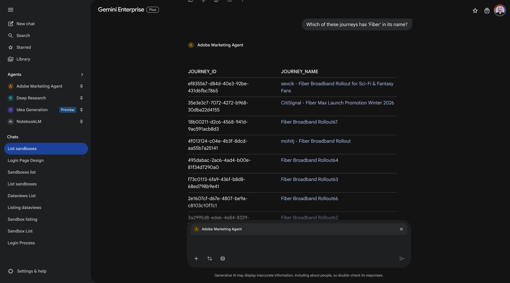

Immetti il seguente **Prompt** e fai clic sul pulsante **invia**.

```javascript
Show me the details of the journey 'CitiSignal - Fiber Max Launch Promotion'
```

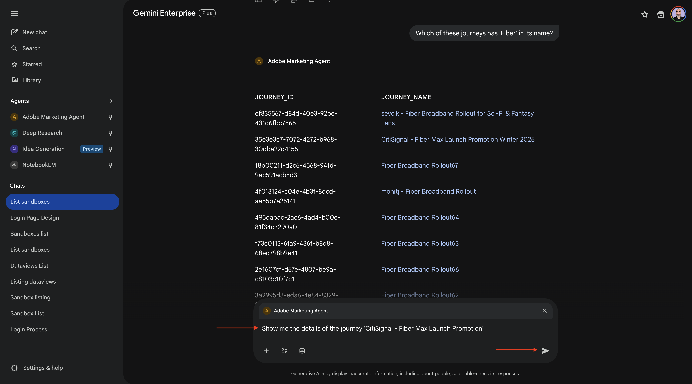

Dovresti vedere questo.

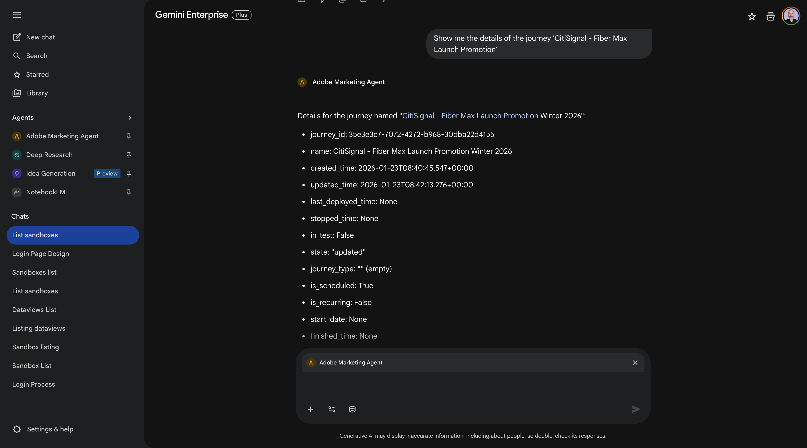

## 1.1.4.8 Convalidare le prestazioni del percorso tramite analisi dell&#39;abbandono

**Intento**

Desideri comprendere l’abbandono delle prestazioni del percorso per sapere se nel percorso sono presenti nodi o condizioni che riscontrano una grande percentuale di profili eliminati. Questo è utile per capire se sono necessari ulteriori aggiustamenti nel percorso.

Immetti il seguente **Prompt** e fai clic sul pulsante **invia**.

```javascript
Create a fall-out report on the "CitiSignal - Fiber Max Launch Promotion" journey
```


Dovresti vedere questo.

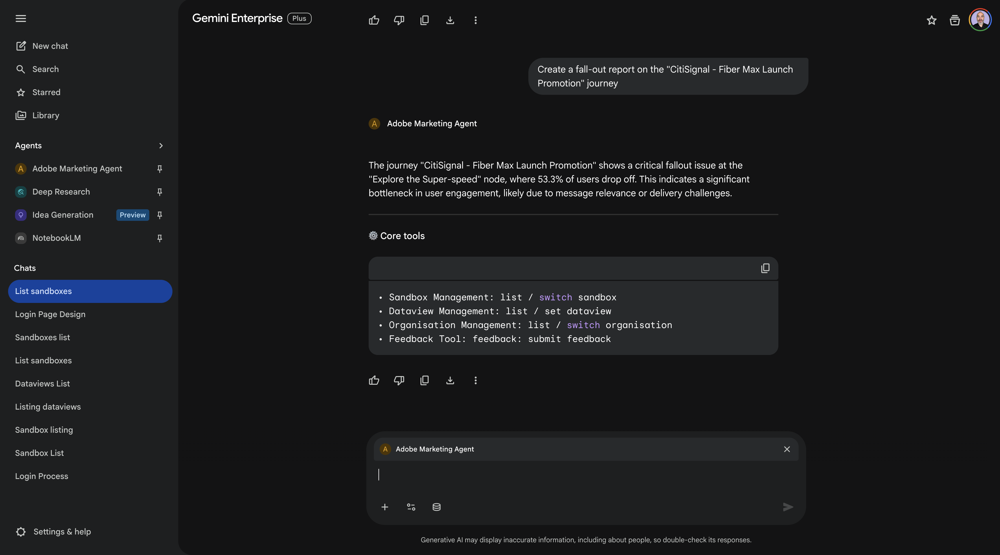

Ora hai completato il laboratorio.

## Passaggi successivi

Vai a [1.1.5 Adobe Marketing Agent per Claude](./ex5.md){target="_blank"}

Torna a [Agent Orchestrator](./agentorchestrator.md){target="_blank"}

[Torna a tutti i moduli](./../../../overview.md){target="_blank"}
