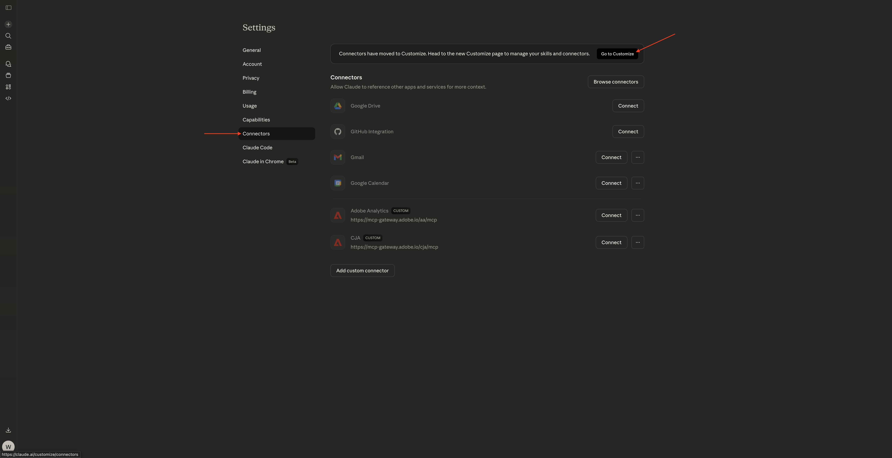
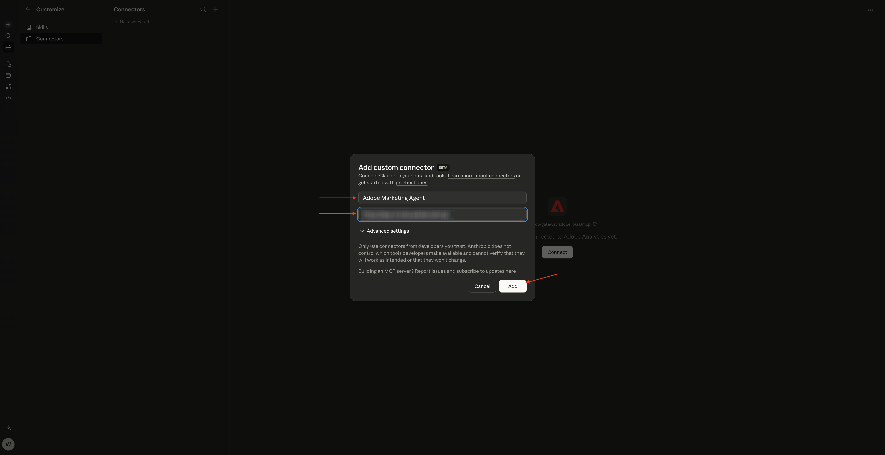
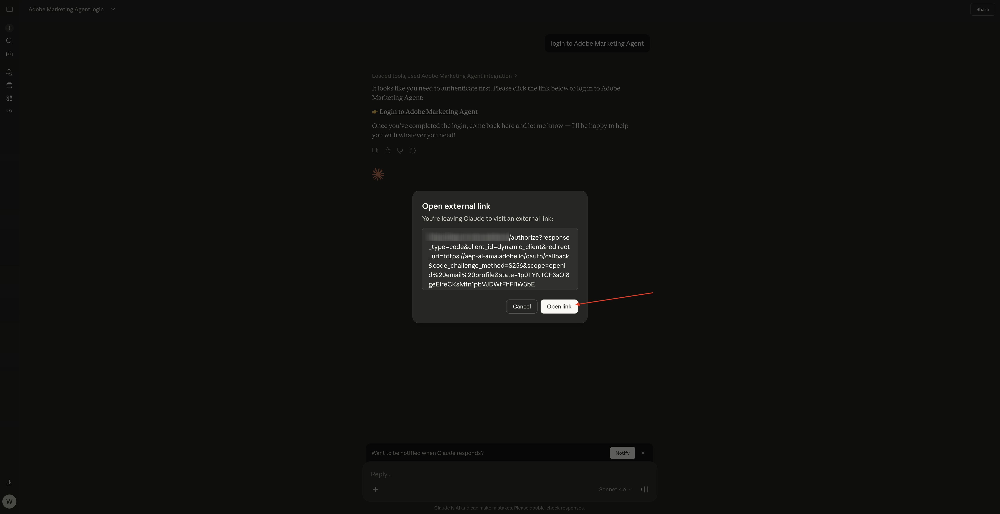
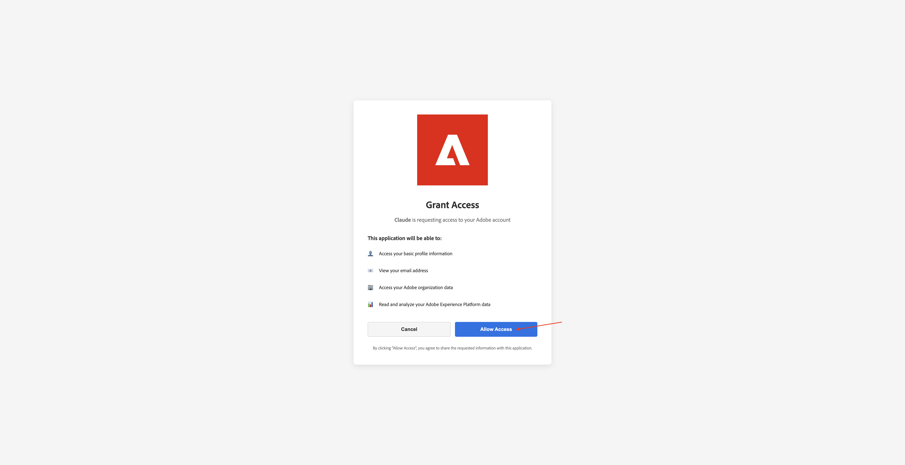
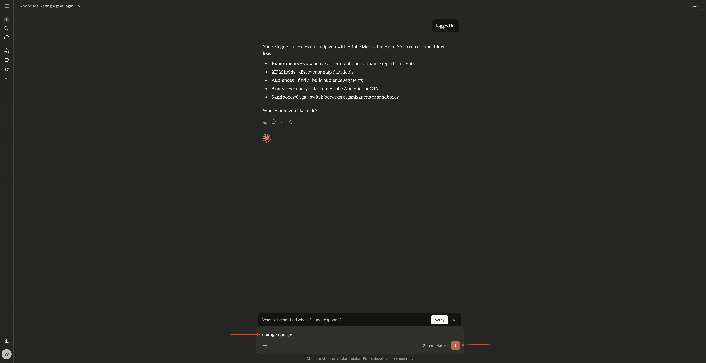
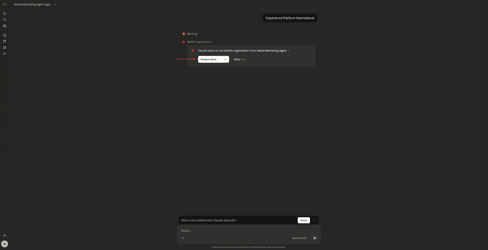

# 1.1.5 Adobe Marketing Agent per Claude

[!BADGE Beta]

+++Dettagli Beta
Utilizzando il Adobe Marketing Agent con Claude Beta, l&#39;Utente riconosce che il Beta viene fornito &quot;così com&#39;è&quot; senza alcuna garanzia. Adobe non ha alcun obbligo di mantenere, correggere, aggiornare, modificare, modificare o supportare in altro modo Beta. Si consiglia di usare cautela e di non fare affidamento in alcun modo sul corretto funzionamento o sulle prestazioni di tale Beta e/o dei materiali di accompagnamento. Beta è considerata un&#39;informazione riservata di Adobe.  Qualsiasi &quot;Feedback&quot; (informazioni relative a Beta, compresi, a titolo esemplificativo e non esaustivo, problemi o difetti riscontrati durante l’utilizzo di Beta, suggerimenti, miglioramenti e raccomandazioni) fornito dall’Utente a Adobe viene assegnato ad Adobe, inclusi tutti i diritti, i titoli e gli interessi relativi a tale Feedback.

+++

## Prerequisiti

Per seguire i passaggi descritti in questa esercitazione, come documentato di seguito, è necessario disporre dei seguenti diritti di accesso:

- Accesso a Real-Time CDP, Journey Optimizer e Customer Journey Analytics
- Accesso all’Assistente all’intelligenza artificiale in Adobe Experience Cloud
- Accesso ad AEP Agent Orchestrator
- Accesso a Claude

## Video

Questo video illustra e illustra tutti i passaggi di questo esercizio.

>[!VIDEO](https://video.tv.adobe.com/v/3482212?quality=12&learn=on)

Questo laboratorio è in fase di sviluppo.

## 1.1.5.1 Creazione di un&#39;app personalizzata in Claude.ai per CJA

>[!NOTE]
>
>L’utilizzo di Adobe Marketing Agent in Claude.ai richiede quanto segue:
>- una versione a pagamento di Claude.ai

Vai a [https://claude.ai/](https://claude.ai/){target="_blank"} e accedi utilizzando i dettagli del tuo account. Una volta effettuato l’accesso, dovresti visualizzarlo.


Fai clic per aprire l&#39;account e quindi seleziona **Impostazioni**.


Vai a **Connettori** e fai clic su **Vai a personalizza**.



Fare clic su **+** e quindi selezionare **Aggiungi connettore personalizzato**.


Compila i campi in questo modo:

- **Nome**: `Adobe Marketing Agent`
- **URL server MCP**: verifica con il tuo rappresentante Adobe

Fai clic su **Aggiungi**.



Dovresti vedere questo. Fai clic su **+** per avviare una nuova chat.


Fai clic sull&#39;icona **+**, vai a **Connettori** e assicurati che **Adobe Marketing Agent** sia abilitato**.


## 1.1.5.2 Autentica e imposta contesto

Prima di interagire ulteriormente con Adobe Marketing Agent tramite Claude.ai, è necessario accedere e impostare il contesto.

Immetti il seguente prompt e fai clic su **invia**.

```
login to Adobe Marketing Agent
```


Seleziona **Consenti sempre**.


Fai clic sul collegamento per accedere ad Adobe Marketing Agent**.


Fai clic su **Apri collegamento**.



Fare clic su **Consenti accesso**.



Dopo aver eseguito correttamente l’autenticazione, dovresti visualizzarlo. Torna da Claude.


Immetti il comando seguente e fai clic su **invia**.

```javascript
logged in
```


Hai effettuato l’accesso con successo. Il passaggio successivo consiste nell&#39;impostare il contesto. Immetti il seguente prompt e fai clic su **invia**.


```javascript
change context
```



Seleziona **Organizzazione**. Puoi anche ripetere questo comando per cambiare la sandbox e la visualizzazione dati in un secondo momento.


Immetti il nome dell&#39;istanza e fai clic su **invia**.


Seleziona **Consenti sempre**.



Dovresti vedere qualcosa del genere.


Se la sandbox non è ancora impostata correttamente, puoi utilizzare il seguente comando per passare alla sandbox da utilizzare. Fai clic su **invia**. In alternativa, è possibile utilizzare il comando precedente `change context` e quindi selezionare **sandbox**

```javascript
change sandbox to --aepSandboxName--
```


Se la visualizzazione dati non è ancora impostata correttamente, puoi utilizzare il seguente comando per passare alla sandbox da utilizzare (sostituisci XXX nel comando seguente con il nome della visualizzazione dati). Fai clic su **invia**. In alternativa, è possibile utilizzare il comando precedente `change context` e quindi selezionare **visualizzazione dati**

```javascript
change dataview to XXX
```


Una volta che l&#39;**organizzazione**, la **sandbox** e la **visualizzazione dati** sono impostate correttamente, puoi iniziare a porre domande a Adobe Marketing Agent.

## Passaggi successivi

Torna a [Agent Orchestrator](./agentorchestrator.md){target="_blank"}

[Torna a tutti i moduli](./../../../overview.md){target="_blank"}
