# 1.1.6 Agent Orchestrator v2

[!BADGE Beta]

+++Dettagli Beta
Con il Beta Agent Orchestrator v2, l&#39;Utente riconosce che il Beta viene fornito &quot;così com&#39;è&quot; senza alcuna garanzia. Adobe non ha alcun obbligo di mantenere, correggere, aggiornare, modificare, modificare o supportare in altro modo Beta. Si consiglia di usare cautela e di non fare affidamento in alcun modo sul corretto funzionamento o sulle prestazioni di tale Beta e/o dei materiali di accompagnamento. Beta è considerata un&#39;informazione riservata di Adobe.  Qualsiasi &quot;Feedback&quot; (informazioni relative a Beta, compresi, a titolo esemplificativo e non esaustivo, problemi o difetti riscontrati durante l’utilizzo di Beta, suggerimenti, miglioramenti e raccomandazioni) fornito dall’Utente a Adobe viene assegnato ad Adobe, inclusi tutti i diritti, i titoli e gli interessi relativi a tale Feedback.

+++

## Prerequisiti

Per seguire i passaggi descritti in questa esercitazione, come documentato di seguito, è necessario disporre dei seguenti diritti di accesso:

- Accesso a Real-Time CDP, Journey Optimizer e Customer Journey Analytics
- Accesso all’Assistente all’intelligenza artificiale in Adobe Experience Cloud
- Accesso ad AEP Agent Orchestrator v2
- È necessario installare Node.js 18+ nel sistema

## Installazione di 1.1.6.1 Agent Orchestrator v2

### IAM

Aggiungi te stesso/a al gruppo seguente utilizzando IAM per accedere alle credenziali LLM.

>[!NOTE]
>
>Alcune delle istruzioni di seguito sono specifiche per Adobe. Chiedi al tuo rappresentante Adobe informazioni sul GRP da utilizzare.

```
GRP-XXX
```

### Installare Agent Orchestrator v2

Aprire una nuova finestra del terminale sul computer.


>[!NOTE]
>
>I comandi seguenti richiedono l’utilizzo di un URL specifico. Chiedi al tuo rappresentante Adobe l’URL da utilizzare.

Esegui il comando seguente.

```
npm login --registry=https://XXX/ --auth-type=web
```


Dovresti vedere questo. Premi **Invio**.


Selezionare **SSO SAML**.


Fare clic su **Sì**.

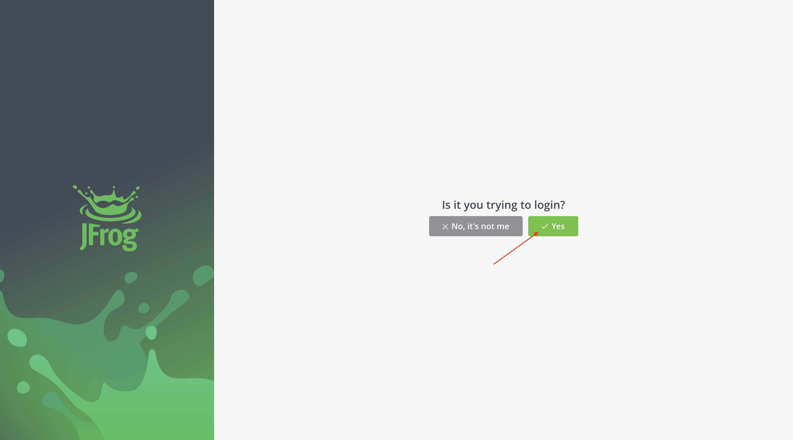

Dovresti vedere questo.

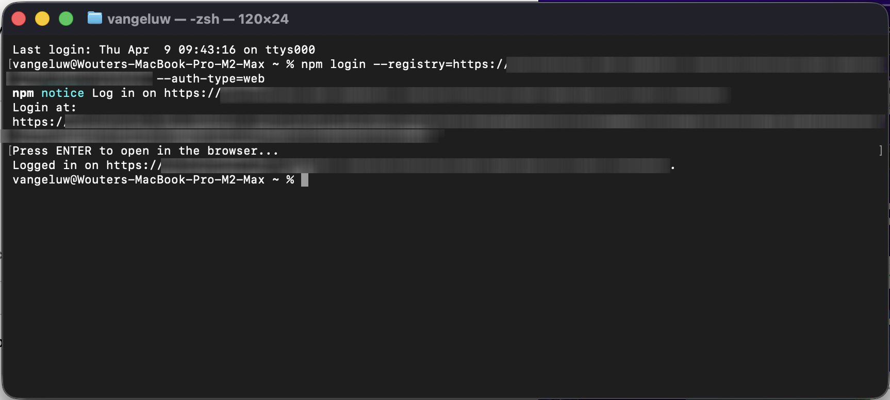

Esegui il comando seguente.

```
npm install -g ao --no-fund --registry=https://XXX/
```


Dovresti vedere questo. Esegui il comando seguente:

```
ao --help
```

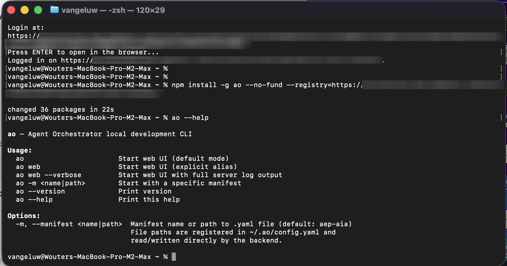

Agent Orchestrator v2 è ora installato. Eseguire il comando seguente per avviare **Agent Orchestrator v2**.

```
ao web
```

Dovresti vedere questo. Premi **Invio** per aprire l&#39;interfaccia utente Web di Agent Orchestrator v2.

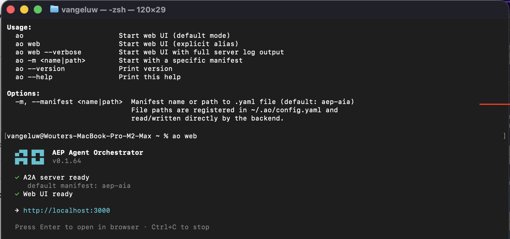

## 1.1.6.2 Configurare Agent Orchestrator v2

Fare clic su **Utilizza AO LLM**.


Fai clic su **Accedi alla produzione**.

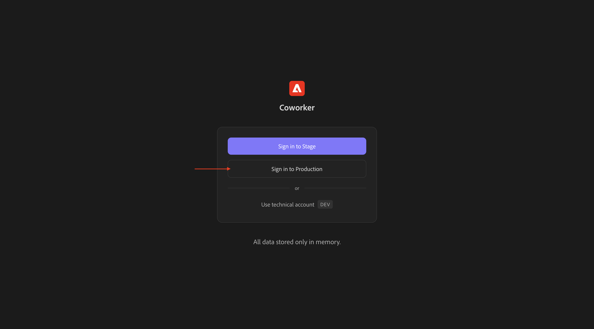

Fai clic sull&#39;icona **livelli**.

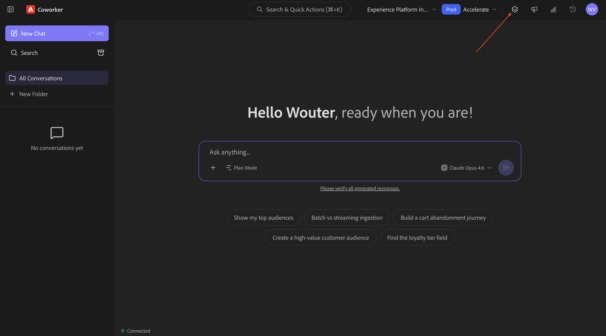

Selezionare **Assistente di AEP AI (esecuzione codice - BashKit)**.


Fai clic sull&#39;icona **profilo** e seleziona **Impostazioni**.


Vai a **Plugin** e fai clic su **cja**.


Fare clic su **Installa**.

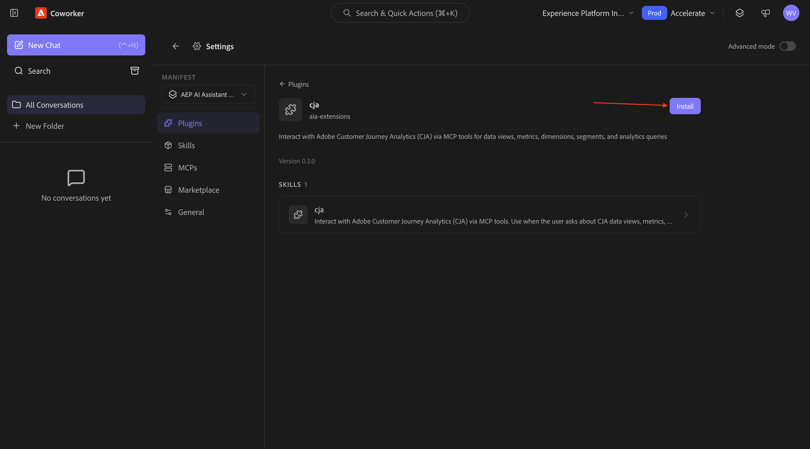

## 1.1.6.3 Imposta il contesto

Fai clic su **Nuova chat**.

Verifica che l&#39;istanza sia impostata per utilizzare l&#39;istanza **Experience Platform International** e la sandbox **Accelerate**.

Immetti il comando seguente e fai clic su **Invia**.

```
list dataviews
```


Immetti il comando seguente e fai clic su **Invia**.

```
switch to dataview Accelerate 2026 B2C
```

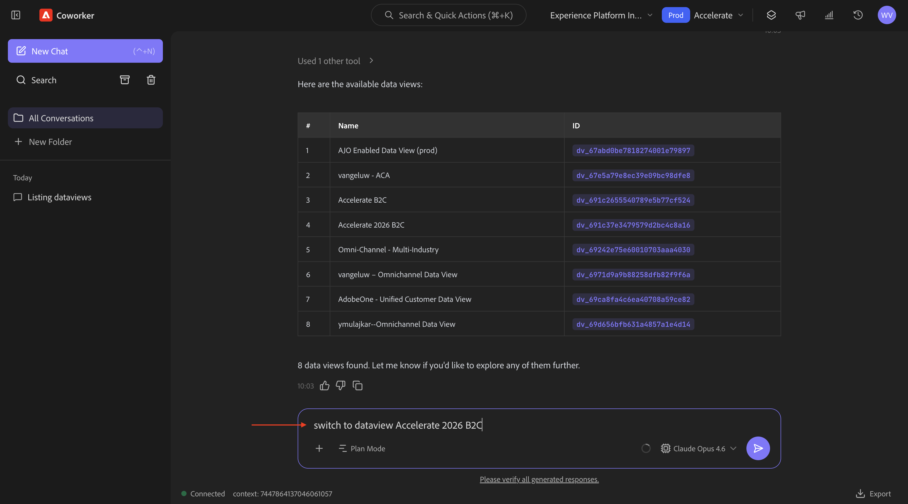

Dovresti vedere questo.


## 1.1.6.4 Inizia con le tendenze generali di acquisto per ancorare il contesto e ingrandire la visualizzazione della fibra

**Intento**

Ottieni un impulso a livello di toplevel sulla domanda di categoria: mobile, rete fissa, Internet, TV, fibra ottica, in particolare per gli ultimi 60 giorni. Questo stabilisce le linee di base per la stagionalità, gli effetti promozionali e la varianza regionale dopo il rollout di New York.

Immetti il seguente **Prompt** e fai clic sul pulsante **invia**.

```javascript
Show me purchases by mainCategory over the last 7 months.
```

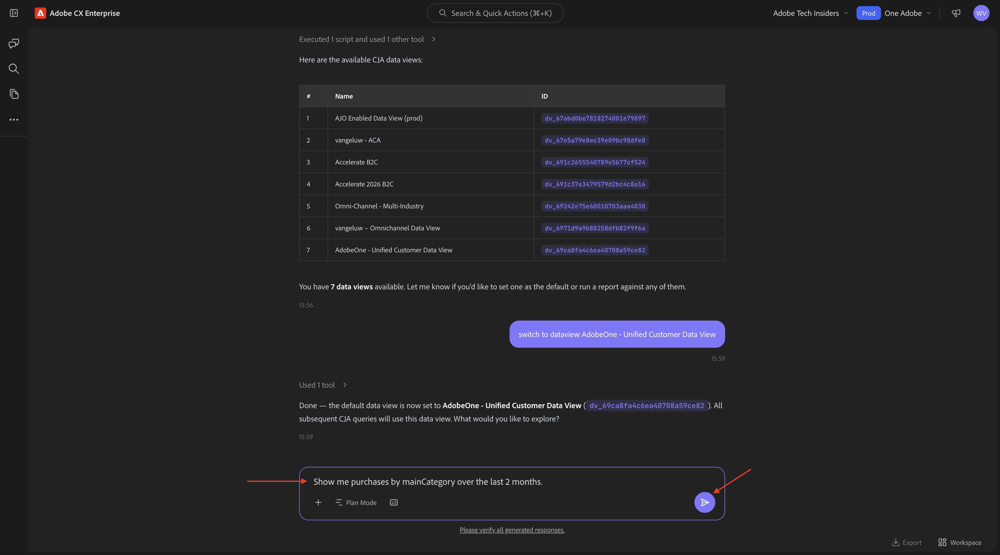

Dovresti quindi vedere quanto segue:


Immetti il seguente **Prompt** e fai clic sul pulsante **invia**.

```javascript
Show me purchases by mainCategory = Fiber over the last 7 months per week
```


Dovresti vedere questo, che approfondisce le tendenze specifiche della fibra.

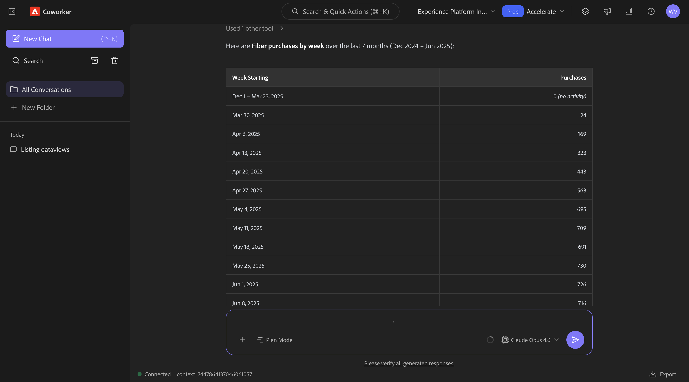

## 1.1.6.5 Correlazione degli ordini con le preferenze del contenuto

**Intento**

Testare l&#39;ipotesi che una preferenza per un genere specifico (ad esempio, SciFi, Sport, Drammatico) preveda il comportamento di aggiornamento della banda larga, in particolare per le esigenze di larghezza di banda elevata.

Innanzitutto, devi scoprire quale campo viene utilizzato per memorizzare la preferenza di genere.

Immetti il seguente **Prompt** e fai clic sul pulsante **invia**.

```javascript
Which field is used to store the preferred genre?
```


Dovresti visualizzarlo, il che mostra che il campo utilizzato per il genere è **_experienceplatform.individualCharacteristics.preferences.preferredGenre**.


Con tali informazioni, puoi iniziare a espandere i dati di acquisto.

Immetti il seguente **Prompt** e fai clic sul pulsante **invia**.

```javascript
Show me ordersYTD by preferredGenre for the last 7 months
```


Dovresti vedere questo.


## 1.1.6.6 Identificare Percorsi Fibre Esistenti

**Intento**

Scopri quali percorsi attivi o conclusi di recente includono &quot;Fibre&quot; nel titolo, ad esempio &quot;Fibre Upgrade NYC - Sept&quot;, &quot;Fibre Trial - Streaming Bundle&quot;.

Immetti il seguente **Prompt** e fai clic sul pulsante **invia**.

```javascript
What journeys exist? 
```


Dovresti vedere questo.


Immetti il seguente **Prompt** e fai clic sul pulsante **invia**.

```javascript
Which of these journeys has 'Fiber' in its name?
```


Dovresti vedere questo. Fai clic sul collegamento a uno dei percorsi.


Verrà aperta una nuova finestra e verrà visualizzata immediatamente la panoramica dei dettagli del Percorso.


## 1.1.6.7 Controllare il pubblico utilizzato

**Intento**:

Comprendi la definizione di seed del percorso &quot;CitiSignal - Fibre Max Launch Promotion&quot;, ossia le caratteristiche che hanno guidato il targeting (ad esempio, &quot;Preferenza di genere SciFi&quot;, &quot;4+ dispositivi&quot;, &quot;streaming ≥ 300 GB/mese&quot;).

Immetti il seguente **Prompt** e fai clic sul pulsante **invia**.

```javascript
What was the initial audience in the journey named CitiSignal - Fiber Max Launch Promotion Winter 2026?
```


Dovresti vedere questo.

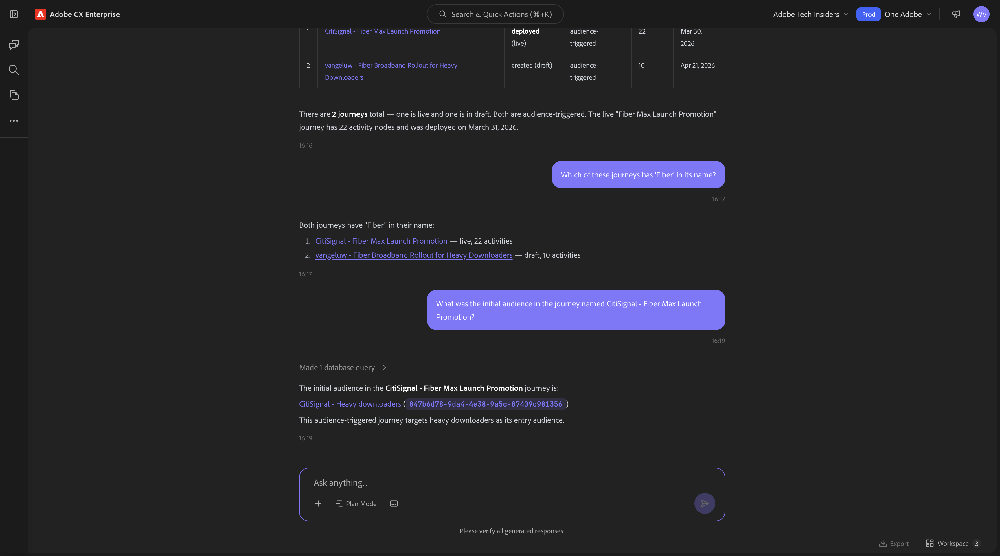

## 1.1.6.8 Convalidare le prestazioni del percorso tramite analisi dell&#39;abbandono

**Intento**

Desideri comprendere l’abbandono delle prestazioni del percorso per sapere se nel percorso sono presenti nodi o condizioni che riscontrano una grande percentuale di profili eliminati. Questo è utile per capire se sono necessari ulteriori aggiustamenti nel percorso.

Immetti il seguente **Prompt** e fai clic sul pulsante **invia**.

```javascript
Create a fall-out report on the "CitiSignal - Fiber Max Launch Promotion" journey
```


Dovresti vedere questo.


## 1.1.6.9 Crea un nuovo pubblico

**Intento**

Sulla base dei risultati e delle ricerche di cui sopra, esiste una correlazione tra i clienti che consumano molti dati e che hanno un genere preferito di fantascienza o fantasy. Ora combinerai questi attributi in un pubblico.

Immetti il seguente **Prompt** e fai clic sul pulsante **invia**.

```javascript
Create an audience that combines people with an average download usage per month of over 2000 GB and a preferred genre of sci-fi or fantasy.
```


Rivedi il piano. Fare clic su **Accetta piano**.


Il pubblico è stato creato.

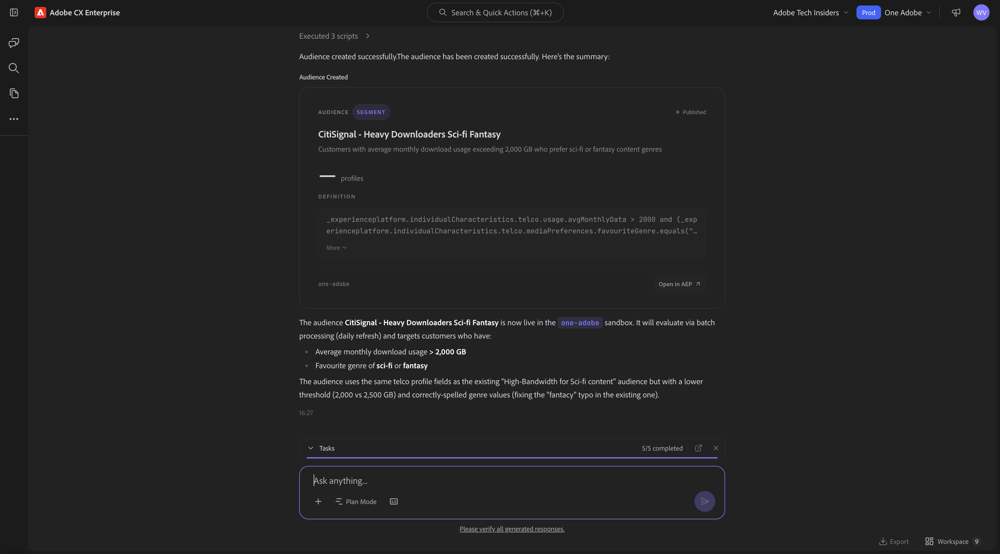

>[!NOTE]
>
>Durante la creazione di un nuovo pubblico, sono necessarie 24 ore prima che il pubblico sia disponibile per l’Assistente AI per un ulteriore utilizzo.

## 1.1.6.10 Trova i tipi di pubblico esistenti allineati all&#39;utilizzo elevato e verifica se sono in uso

**Intento**:

Individua qualsiasi pubblico denominato con &quot;download pesanti&quot;, definito dalle soglie di utilizzo dei dati mensili.

>[!NOTE]
>
>Nel passaggio precedente, hai creato un nuovo pubblico. Tieni presente che saranno necessarie 24 ore prima che il pubblico sia disponibile per un ulteriore utilizzo per l’Assistente AI. Ora dovresti utilizzare invece un altro pubblico già esistente.

Immetti il seguente **Prompt** e fai clic sul pulsante **invia**.

```javascript
Is there an audience that has "heavy downloaders" in the title?
```

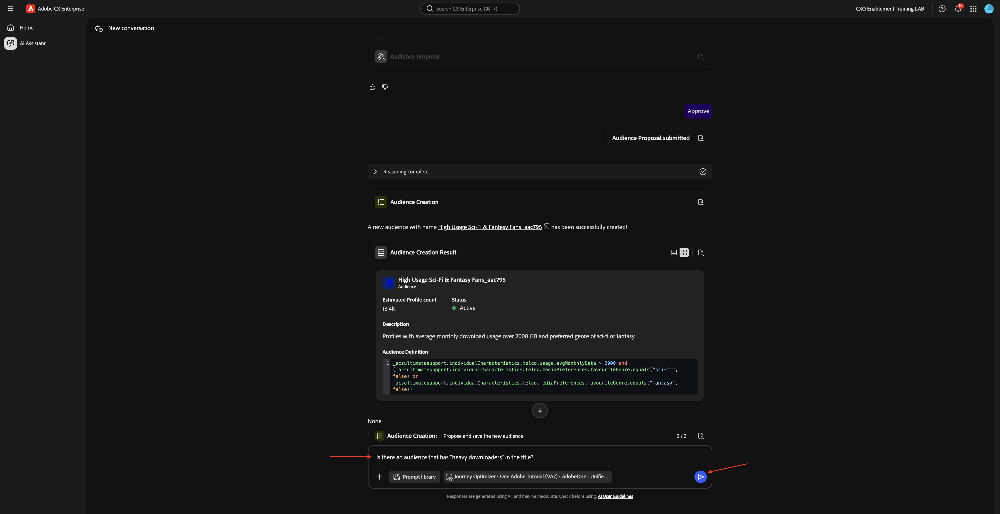

Dovresti vedere questo. Ora vuoi vedere tutti i tuoi tipi di pubblico e quanto sono cambiati negli ultimi giorni.

Immetti il seguente **Prompt** e fai clic sul pulsante **invia**.

```javascript
List how much these audiences changed over the last few days.
```

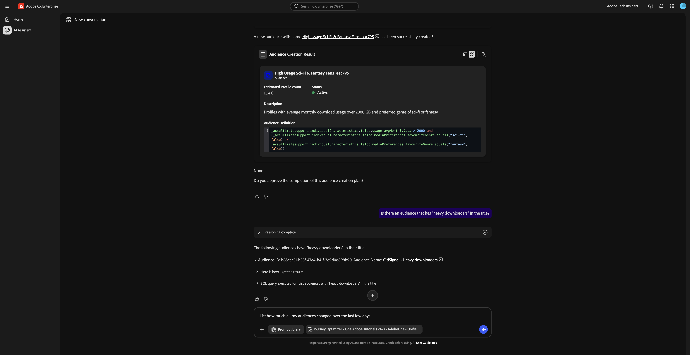

Dovresti vedere questo. Fai clic su **Mostra altro**.

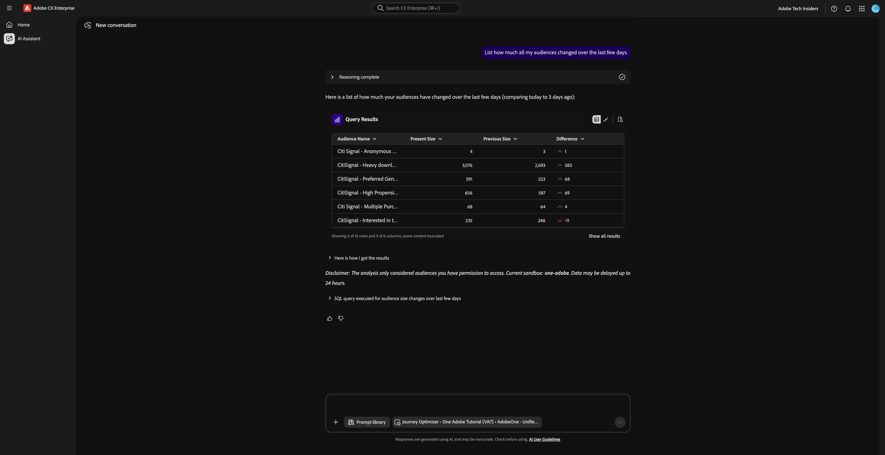

Dovresti vedere questo. Fare clic per chiudere il riquadro destro.


Scorri verso il basso un po&#39; per rivedere i passaggi eseguiti dall&#39;Assistente all&#39;intelligenza artificiale.


Ci sono già alcuni tipi di pubblico per i &quot;downloader pesanti&quot;. Vediamo se sono già in uso.

Immetti il seguente **Prompt** e fai clic sul pulsante **invia**.

```javascript
Which of the above are used in a journey? 
```


Dovresti vedere qualcosa di simile a questo.


È ora necessario verificare se il percorso è attivo. Immetti il seguente **Prompt** e fai clic sul pulsante **invia**.

```javascript
Are these journeys active? 
```


Dovresti vedere qualcosa di simile a questo. Nessuno di questi percorsi è attualmente in esecuzione.

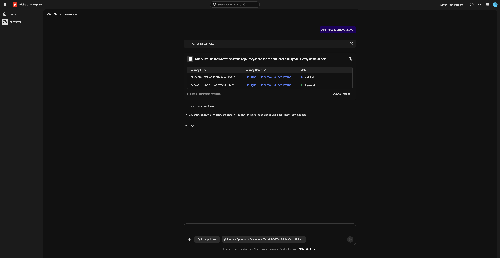

Per il prossimo lancio di Fibre Max, è ora necessario creare un nuovo percorso.

## 1.1.6.11 Crea nuovo Percorso per il lancio Fibre Max

**Intento**:

Crea un nuovo percorso destinato al pubblico composto:

Download pesanti ∩ preferenza SciFi.

Immetti il seguente **Prompt** e fai clic sul pulsante **invia**.

```javascript
Create a  journey towards the audience Heavy Downloaders - Sci-Fi Preference_kbaa_5207bf. The journey is for the rollout of fiber broadband. There will 2 versions of an email  based on  a split of the audience based on who is in the "Eligble for Fiber upgrade" audience.  After 3 days, profiles from both email treatments who have not purchased fibre max will be sent a follow up email. 
```


Dovresti vedere questo. Immettere `yes` e fare clic su genera.

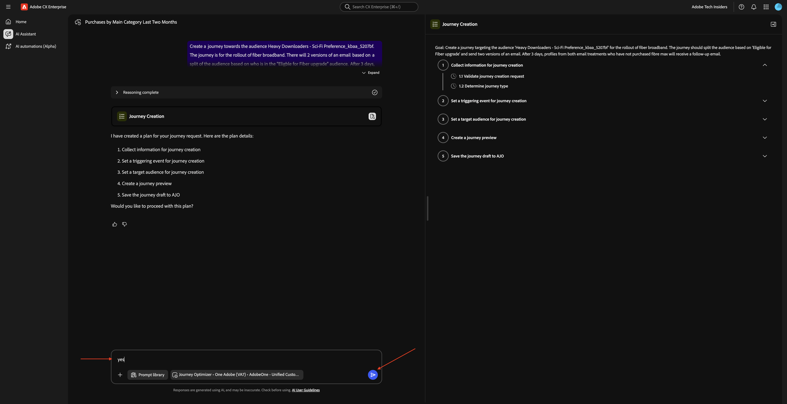

Dovresti vedere questo. Immettere `yes` e fare clic su genera.

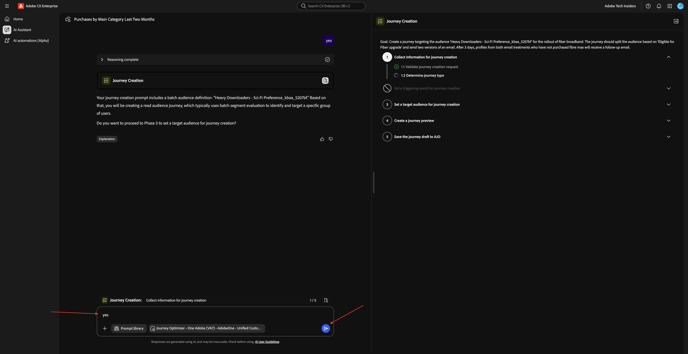

Dovresti vedere questo. Immettere `The first one` e fare clic su Invia.


Dovresti vedere questo. Immettere `yes` e fare clic su Invia.

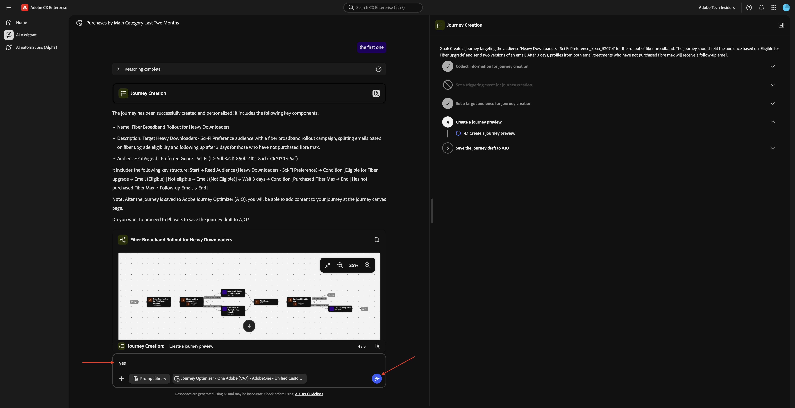

Rivedi la risposta. Immettere `yes` e fare clic su Invia.


Fai clic su **Rivedi**.

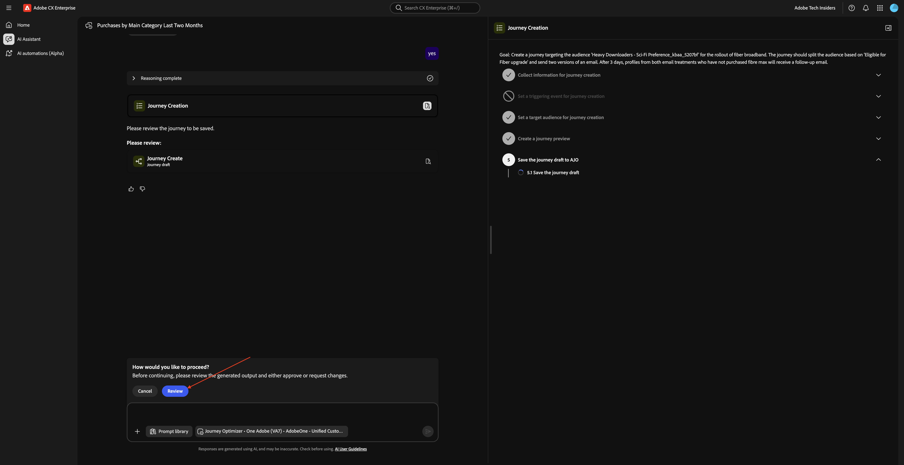

Aggiorna il nome del percorso con il tuo LDAP per renderlo univoco. Fai clic su **Salva**.

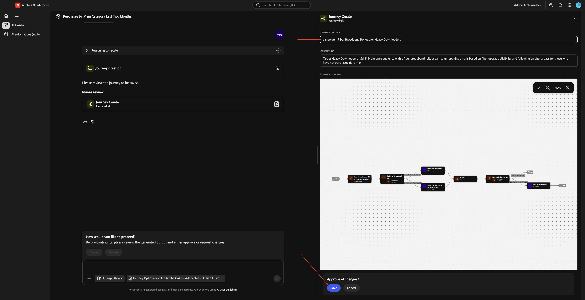

Il percorso è stato creato in modalità bozza.


## Gestione dei conflitti di Percorso di 1.1.6.12

Immetti il seguente **Prompt** e fai clic sul pulsante **invia**.

```javascript
How can I manage journey conflicts?
```


Rivedi le informazioni.

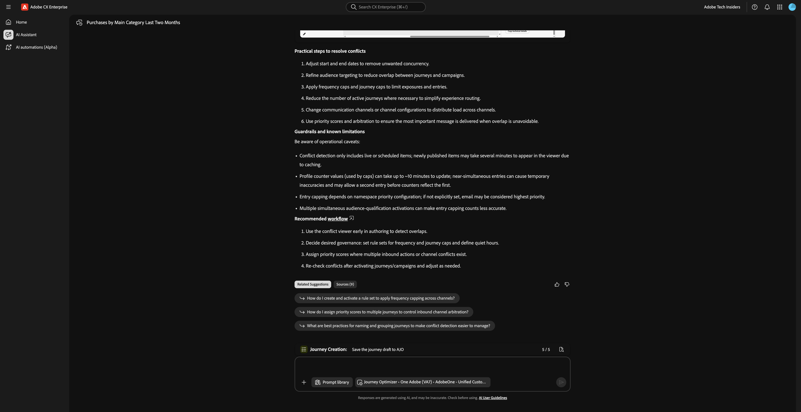

Scorri verso il basso e seleziona **Origini** per verificare che le informazioni provengano da Experience League.


Immetti il seguente **Prompt** e fai clic sul pulsante **invia**.

```javascript
List any conflicts for the journey +CitiSignal Fiber Max
```

Quindi seleziona manualmente il percorso **CitiSignal - Fibre Max Launch Promotion** dall&#39;elenco.

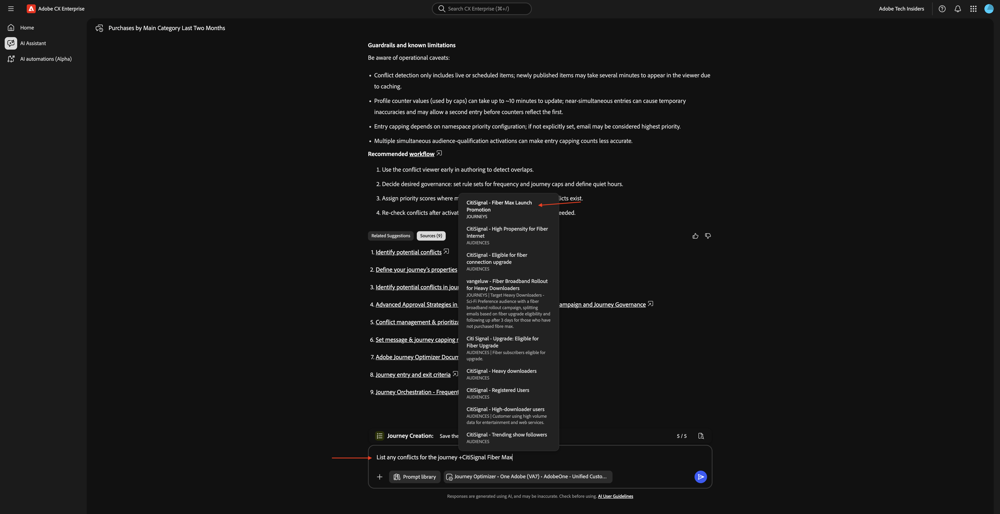

Dovresti vedere questo. Fai clic su **invia**.


Esaminare le informazioni sul conflitto di percorso.

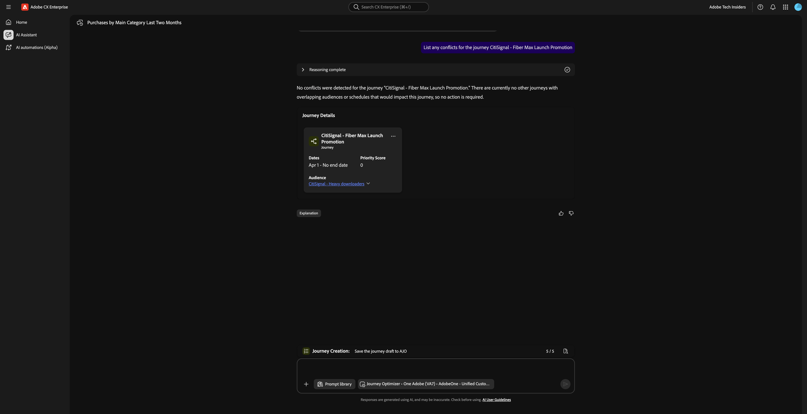

Scorri verso il basso per trovare ulteriori dettagli sui conflitti di percorso.

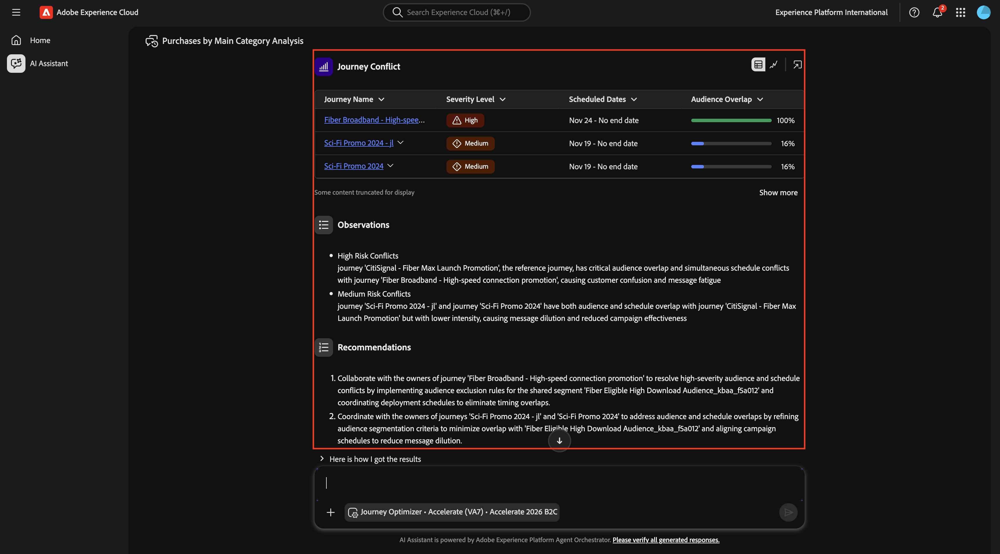

## 1.1.6.13 esperimenti

Immetti il seguente **Prompt** e fai clic sul pulsante **invia**.

```javascript
How are the experiments performing for the journey named 'CitiSignal - Fiber Max Launch Promotion'?
```


Dovresti quindi vedere quanto segue:


Scorri verso il basso e fai clic su uno dei suggerimenti. Fai clic su **invia**.

>[!NOTE]
>
>I suggerimenti sono dinamici, pertanto è necessario aspettarsi di visualizzare suggerimenti diversi ogni volta che viene generata una risposta. I suggerimenti saranno probabilmente diversi da quelli mostrati in questa schermata.


Dovresti quindi vedere una risposta dettagliata relativa al suggerimento scelto.


Ora hai completato il laboratorio.

## Passaggi successivi

Torna a [Agent Orchestrator](./agentorchestrator.md){target="_blank"}

[Torna a tutti i moduli](./../../../overview.md){target="_blank"}
