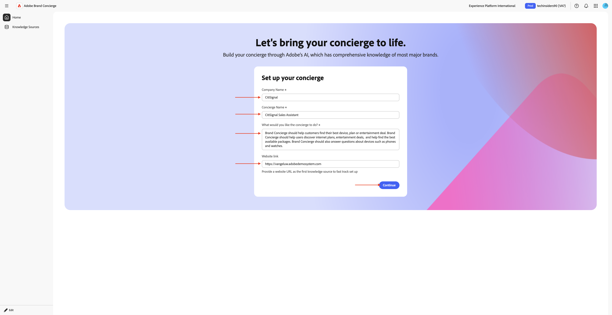
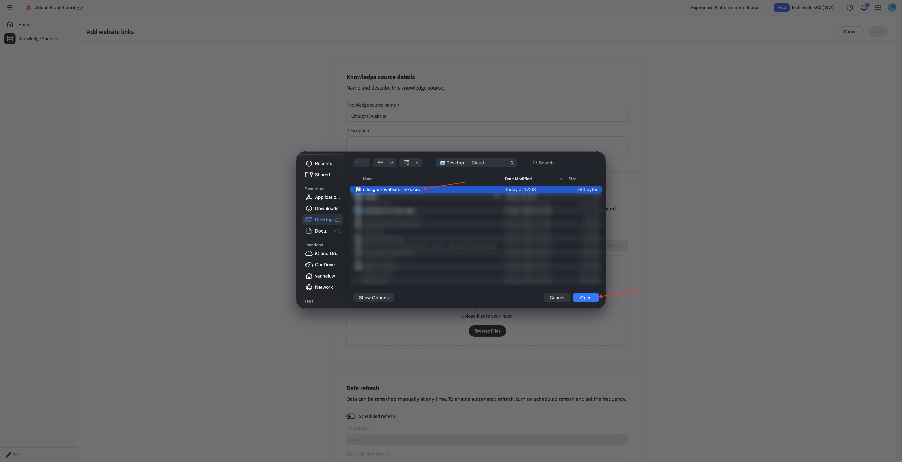
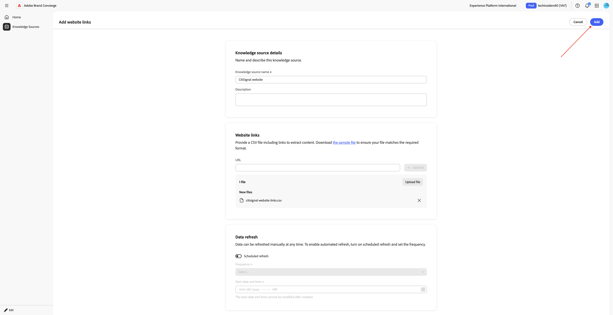
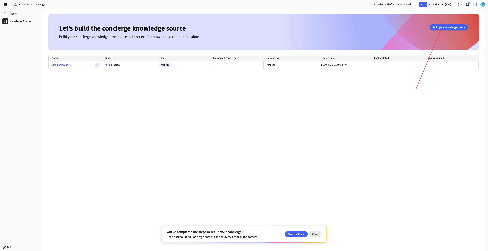
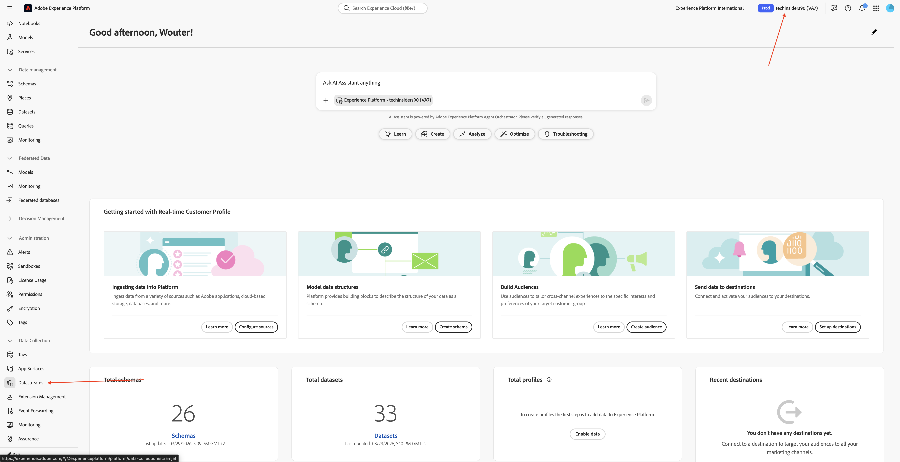
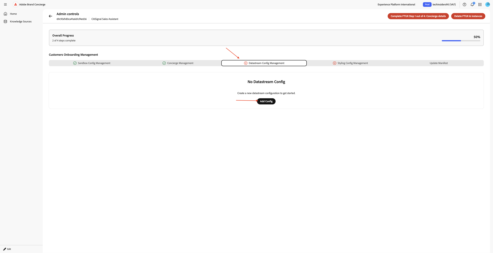
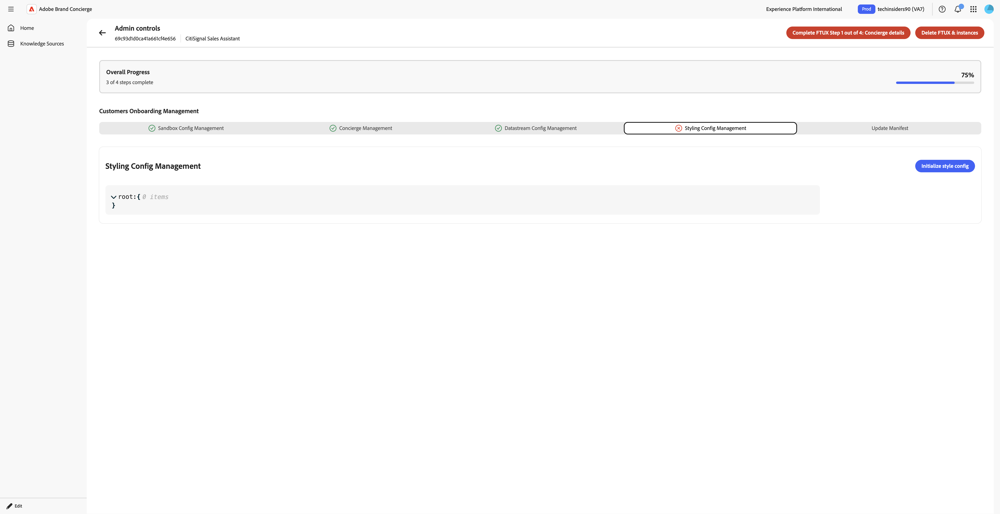
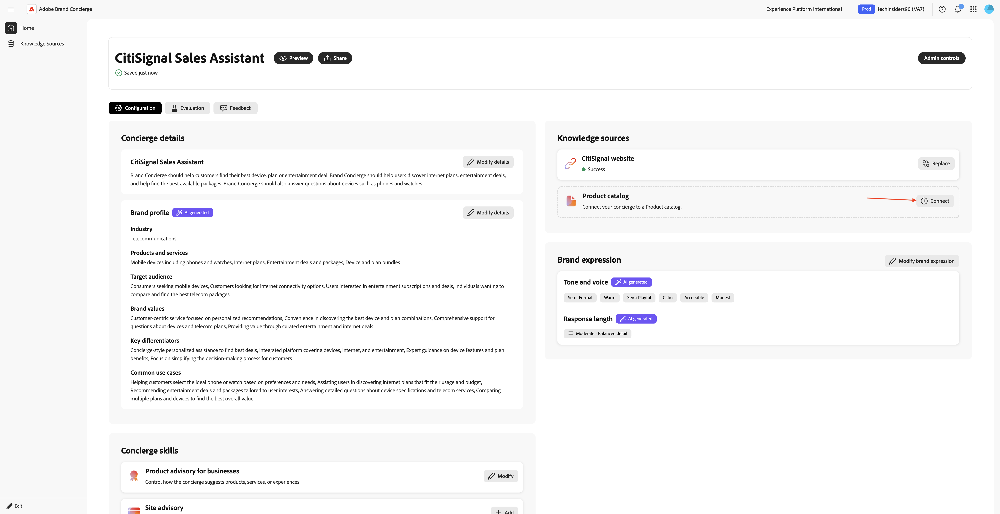

# 1.4.1 Guida introduttiva a Brand Concierge

## Panoramica di 1.4.1.1 Brand Concierge

Durante la configurazione di Brand Concierge, i due elementi principali che utilizzerai sono:

- **Compositore agente (livello di configurazione)**

  Finalità: la piattaforma dell’interfaccia utente principale utilizzata per creare e configurare esperienze di IA per la conversazione.

  Responsabilità principali:

   - Definizione e gestione di origini dati e knowledge base
   - Imposta l’espressione del brand (tono, stile, guardrail)
   - Imposta l&#39;agente di prenotazione riunioni

- **Agent Orchestrator (motore di esecuzione)**

  Finalità: motore di ragionamento e orchestrazione che interpreta le richieste degli utenti ed esegue le azioni agente appropriate.

  Responsabilità principali:

   - Interpretare gli intenti dell&#39;utente in linguaggio naturale
   - Generare ed eseguire piani di ragionamento in più passaggi
   - Seleziona e richiama gli operatori/strumenti appropriati
   - Imporre contesto, conformità e guardrail del marchio
   - Coordinare flussi di lavoro con più agenti
   - Aggregare e comporre risposte da più origini dati

- **Runtime conversazione Brand Concierge (livello servizio)**

  Finalità: il livello di servizio di conversazione rivolto al cliente che gestisce le sessioni di chat, il contesto e le interazioni con i clienti.

  Componenti chiave:

   - Agente web (client): interfaccia utente browser o chat mobile integrata tramite Web SDK
   - Servizio di conversazione (back-end): gestisce lo stato della sessione e funge da gateway di orchestrazione

  Responsabilità principali:

   - Gestire le sessioni utente e le trascrizioni delle conversazioni
   - Gestire l’autenticazione e i profili degli utenti
   - Instradare i messaggi tra il client e Agent Orchestrator
   - Mantenere il contesto della conversazione
   - Registra gli eventi comportamentali e operativi in AEP per Analytics
   - Applicare configurazioni specifiche della superficie

## Configurazione istanza di Brand Concierge 1.4.1.2

Per iniziare a creare una tua istanza di Brand Concierge, segui i passaggi seguenti.

Vai a [https://experience.adobe.com/](https://experience.adobe.com/){target="_blank"}. Apri **Brand Concierge**.


Dovresti vedere questo. Fai clic sul menu **selezione sandbox**. Scegli la sandbox che ti è stata assegnata. La sandbox deve essere denominata `techinsidersX` (sostituisci X con il numero assegnato).


Quindi, compila le seguenti variabili:

- **Nome società**: CitiSignal

- **nome concierge**: `CitiSignal Sales Assistant`.

Immetti il testo seguente in **Come desideri che faccia il portinaio?**.

```javascript
Brand Concierge should help customers find their best device, plan or entertainment deal. Brand Concierge should help users discover internet plans, entertainment deals,  and help find the best available packages. Brand Concierge should also answer questions about devices such as phones and watches.
```

- **Collegamento sito Web**: fornisci il collegamento al sito Web in uso

Fai clic su **Continua**.



Dovresti vedere questo. Queste informazioni sono state generate utilizzando l’intelligenza artificiale in base all’input fornito nella pagina precedente. Rivedi le informazioni e, quando ne sei soddisfatto, fai clic su **Genera concierge**.


Dovresti vedere questo. Fai clic su **+ Add** accanto a **product advisory per gli utenti consumer**.


Dovresti vedere questo. Compila i campi seguenti utilizzando il testo seguente.

**Cosa deve sapere il consulente sul prodotto o sul pubblico prima di formulare consigli?**

```
CitiSignal is a telecommunications company that sells devices such as phones and watches and that sells internet services such as their lead product CitiSignal Fiber Max. On top of that, CitiSignal sells entertainment services that offer premium streaming services at a discounted price. CitiSignal is targeting these 3 personas primarily: Smart Home Families, Online Gamers and Remote Professionals.
```

**Esistono regole o limitazioni aziendali che il portinaio deve seguire quando formula i consigli?**

```
Prioritize positioning the CitiSignal Fiber Max offering.
```

**Esistono parole chiave o frasi specifiche che il portinaio deve seguire o evitare?**

```
Competitor pricing, competitor products
```

Fai clic su **Salva**.


Fai clic sulla **freccia** per tornare alla schermata precedente.


Vai a **Knowledge Source** e fai clic su **Crea la tua origine della conoscenza**.


Seleziona **Collegamenti al sito Web** e fai clic su **Continua**.


Dovresti vedere questo. Immetti `CitiSignal website` come nome per l&#39;origine della conoscenza.

Ora devi caricare un file csv contenente i collegamenti del tuo sito web. Scarica [Il file CSV dei collegamenti del sito Web CitiSignal](./assets/citisignal-website-links.csv) sul desktop.

Fare clic su **Sfoglia file**.


Apri il file **citisignal-website-links.csv** e aggiorna i collegamenti in modo che puntino al tuo sito Web CitiSignal.


Seleziona il file **citisignal-website-links.csv** che hai appena scaricato e modificato. Fai clic su **Apri**.



Il file viene ora aggiunto a questa origine di conoscenza. Fai clic su **Aggiungi**.



Dovresti vedere questo. Fai clic su **Genera l&#39;origine della conoscenza**.



Seleziona **Catalogo prodotti** e fai clic su **Continua**.


Dovresti vedere questo. Immetti `CitiSignal Products` come nome per l&#39;origine della conoscenza. Fare clic su **Sfoglia file** e selezionare **Sfoglia dal dispositivo**.


Ora devi caricare un file csv contenente i collegamenti del tuo sito web. Scarica il catalogo di prodotti [CitiSignal](./assets/CitiSignal-catalog.json.zip) sul desktop e decomprimi.


Seleziona il file **CitiSignal-catalog.json** e fai clic su **Apri**.


Dovresti vedere questo. Fai clic su **Aggiungi**.


Allora tornerai qui. L’elaborazione richiederà 10-20 minuti, quindi dovrai tornare qui in un secondo momento per verificare se l’elaborazione è andata a buon fine.


## 1.4.1.3 passaggi per l&#39;onboarding di AEP

Brand Concierge utilizza Adobe Experience Platform per memorizzare i dati di interazione provenienti dalle conversazioni. La connessione tra Brand Concierge e Experience Platform richiede che Brand Concierge configuri e utilizzi un flusso di dati.

### Stream di dati

Vai a [https://experience.adobe.com/](https://experience.adobe.com/){target="_blank"}. Apri **Experience Platform**.


Verifica di aver selezionato la sandbox corretta, che deve essere denominata `techinsidersX`. Nel menu a sinistra, scorri verso il basso e seleziona **Flussi di dati**.



Fare clic su **Nuovo flusso di dati**.


Immettere il nome **Datastream** `--aepUserLdap-- - Brand Concierge`, quindi selezionare lo **Schema di mappatura** `cja-brand-concierge-sb-XXX`.

Fai clic su **Salva**.


Lo stream di dati è ora configurato. Copia il nome e l’ID dello stream di dati e scrivili in un file di testo sul computer.


### Gestione configurazione stream di dati

Il passaggio successivo consiste nell’abilitare l’API di gestione della configurazione di Brand Concierge per configurare lo stream di dati appena creato. Questa operazione è necessaria per risolvere elementi come l’ID organizzazione IMS e i dettagli della sandbox durante l’elaborazione della richiesta.

Vai alla **Home** e seleziona **Controlli di amministrazione**.


Vai a **Gestione configurazione Datastream**, quindi fai clic su **Aggiungi configurazione**.



Incolla l&#39;**ID dello stream di dati** creato in precedenza. Fai clic su **Salva**.


Dovresti vedere qualcosa del genere.


## Gestione configurazione stili 1.4.1.4

Vai a **Gestione configurazione stili**. Fare clic su **Inizializza configurazione stile**.



Immetti **Brand Name** `CitiSignal` e fai clic su **Initialize style config**.


Dovresti vedere questo.


## Manifesto Agent Orchestrator 1.4.1.5

Vai a **Aggiorna manifesto**. Dovresti vedere questo. Esamina le informazioni in ciascun campo e apporta le modifiche necessarie.

Aggiungi il testo seguente nel campo **Rispondi a una domanda multimodale**, alla fine del testo esistente. Non rimuovere il testo presente, aggiungi il testo seguente sopra quello già presente.

```
# Product Catalog (Fallback Reference)

Use this catalog when <Documents> doesn't return relevant results:

## CONNECTIVITY
**CitiSignal Fiber Max**
- Description: High-speed fiber internet with blazing-fast speeds, seamless streaming, ultra-responsive gaming, crystal-clear video calls. No data caps, no throttling. Future-ready for smart homes.
- Image: https://delivery-p168681-e1803036.adobeaemcloud.com/adobe/assets/urn:aaid:aem:cdb9e163-f9f5-4338-9d62-9807b61c082f/as/CitiSignal-Fiber-Max.webp
- URL: https://main--citisignal-aem-accs--woutervangeluwe.aem.page/products/citisignal-fiber-max/CitiSignal-Fiber-Max

## ENTERTAINMENT
**Disney Plus**
- Description: Streaming home of Disney, Pixar, Marvel, Star Wars, National Geographic. Unlimited entertainment, new releases, original series, classic movies.
- Image: https://delivery-p168681-e1803036.adobeaemcloud.com/adobe/assets/urn:aaid:aem:b3bbe91a-e307-43bd-845f-1c77e7ba28df/as/Disney.webp
- URL: https://main--citisignal-aem-accs--woutervangeluwe.aem.page/products/disney/Disney

**Netflix + HBO Max**
- Description: Unlimited TV shows and movies. Watch as much as you want, whenever you want.
- Image: https://delivery-p168681-e1803036.adobeaemcloud.com/adobe/assets/urn:aaid:aem:883be2a0-6c42-4508-b9ac-1e3a33235081/as/Netflix-HBO-Max.webp
- URL: https://main--citisignal-aem-accs--woutervangeluwe.aem.page/products/netflix-hbo-max/Netflix-HBO-Max

**YouTube Premium**
- Description: Ad-free YouTube, YouTube Music, YouTube Kids. Watch offline, in background, on the go.
- Image: https://delivery-p168681-e1803036.adobeaemcloud.com/adobe/assets/urn:aaid:aem:ac2a8c66-8740-4fce-bd3a-8106db9e556f/as/YouTube-Premium.webp
- URL: https://main--citisignal-aem-accs--woutervangeluwe.aem.page/products/youtube-premium/YouTube-Premium

**Apple One**
- Description: Apple Music (100M+ songs), Apple TV+, Apple Arcade, iCloud+. Complete Apple ecosystem bundle.
- Image: https://delivery-p168681-e1803036.adobeaemcloud.com/adobe/assets/urn:aaid:aem:94126f30-931a-447e-9cef-f58c60dbb17c/as/Apple-One.webp
- URL: https://main--citisignal-aem-accs--woutervangeluwe.aem.page/products/apple-one/Apple-One

## DEVICES
**iPhone Air Sky Blue**
- Description: Slim iPhone with A19 Pro chip, 48MP camera, 6.5\" display, Apple Intelligence, all-day battery. Titanium frame, Ceramic Shield 2.
- Image: https://delivery-p168681-e1803036.adobeaemcloud.com/adobe/assets/urn:aaid:aem:0c4b1537-8268-4507-98e6-bbb03faa3ad1/as/iPhone-Air.webp
- URL: https://main--citisignal-aem-accs--woutervangeluwe.aem.page/products/iphone-air/iPhone-Air?optionsUIDs=Y29uZmlndXJhYmxlLzkzLzIw

**iPhone Air Cloud White**
- Description: Slim iPhone with A19 Pro chip, 48MP camera, 6.5\" display, Apple Intelligence, all-day battery. Titanium frame, Ceramic Shield 2.
- Image: https://delivery-p168681-e1803036.adobeaemcloud.com/adobe/assets/urn:aaid:aem:30447a9c-c037-4df3-ae88-4127b9ec325e/as/iPhone-Air.webp
- URL: https://main--citisignal-aem-accs--woutervangeluwe.aem.page/products/iphone-air/iPhone-Air?optionsUIDs=Y29uZmlndXJhYmxlLzkzLzI

**iPhone Air Space Black**
- Description: Slim iPhone with A19 Pro chip, 48MP camera, 6.5\" display, Apple Intelligence, all-day battery. Titanium frame, Ceramic Shield 2.
- Image: https://main--citisignal-aem-accs--woutervangeluwe.aem.page/products/iphone-air/iPhone-Air?optionsUIDs=Y29uZmlndXJhYmxlLzkzLzIz
- URL: https://main--citisignal-aem-accs--woutervangeluwe.aem.page/products/iphone-air/iPhone-Air?optionsUIDs=Y29uZmlndXJhYmxlLzkzLzIz

**iPhone Air Light Gold**
- Description: Slim iPhone with A19 Pro chip, 48MP camera, 6.5\" display, Apple Intelligence, all-day battery. Titanium frame, Ceramic Shield 2.
- Image: https://delivery-p168681-e1803036.adobeaemcloud.com/adobe/assets/urn:aaid:aem:ffa7b752-87ab-427f-a631-382fc67e7530/as/iPhone-Air.webp
- URL: https://main--citisignal-aem-accs--woutervangeluwe.aem.page/products/iphone-air/iPhone-Air?optionsUIDs=Y29uZmlndXJhYmxlLzkzLzIx

**Apple Watch Ultra 3-Black**
- Description: Rugged smartwatch with 42hr battery, satellite communication, titanium case, dual-frequency GPS, hypertension notifications.
- Image: https://delivery-p168681-e1803036.adobeaemcloud.com/adobe/assets/urn:aaid:aem:d33f4f49-1239-45b8-a6e6-b97f12177e06/as/Apple-Watch-Ultra-3.webp
- URL: https://main--citisignal-aem-accs--woutervangeluwe.aem.page/products/apple-watch-ultra-3/Apple-Watch-Ultra-3?optionsUIDs=Y29uZmlndXJhYmxlLzE4MS8yNA%3D%3D

**Apple Watch Ultra 3-Natural**
- Description: Rugged smartwatch with 42hr battery, satellite communication, titanium case, dual-frequency GPS, hypertension notifications.
- Image: https://delivery-p168681-e1803036.adobeaemcloud.com/adobe/assets/urn:aaid:aem:8f107329-66f1-43fd-b505-b1c16892379f/as/Apple-Watch-Ultra-3.webp
- URL: https://main--citisignal-aem-accs--woutervangeluwe.aem.page/products/apple-watch-ultra-3/Apple-Watch-Ultra-3?optionsUIDs=Y29uZmlndXJhYmxlLzE4MS8yNQ%3D%3D

# Sales Strategy

## Primary Focus: Connectivity Products
- When users ask about internet, connectivity, streaming, or home services, recommend **CitiSignal Fiber Max**.
- Highlight: blazing-fast fiber speeds, seamless streaming, no data caps, no throttling, future-ready.

## Entertainment Upselling Strategy
- After discussing connectivity, PROACTIVELY suggest entertainment products.
- Use natural transitions like:
  - \"With speeds like these, you'll want entertainment that keeps up...\"
  - \"Many of our customers enhance their experience with...\"
  - \"To get the most out of your connection...\"
- Match recommendations to user context:
  - Families with kids → **Disney Plus**
  - Movie/TV enthusiasts → **Netflix + HBO Max**
  - Ad-free YouTube fans → **YouTube Premium**
  - Apple ecosystem users → **Apple One**
```


Dopo aver apportato le modifiche, scorri verso l&#39;alto e fai clic su **Aggiorna manifesto**.


## 1.4.1.6 Completare l&#39;installazione dell&#39;origine delle informazioni

Vai a **Origini informazioni**. Dopo 10-20 minuti, lo **Stato** di entrambe le origini di conoscenza deve essere **Completato**. Quando lo stato è **Operazione completata** per entrambe le origini di conoscenza, fare clic su **Home**.


Dovresti vedere questo. Fai clic su **+ Connect** nella scheda **Collegamenti al sito Web**.


Seleziona l&#39;origine della conoscenza **Sito Web CitiSignal** e fai clic su **Salva**.


Dovresti vedere questo. Fai clic su **+ Connect** nella scheda **Catalogo prodotti**.



Selezionare l&#39;origine della Knowledge Base **Prodotti CitiSignal** e fare clic su **Salva**.


Dovresti vedere questo. Fai clic su **Anteprima** per iniziare a interagire con il tuo Brand Concierge.


Ora puoi iniziare a porre domande relative alle fonti di conoscenza fornite.


Immetti la domanda `what products do you sell?` e fai clic su **invia**.


Dovresti ricevere una risposta simile.


L’istanza di Brand Concierge è ora pronta per essere implementata sul sito web.

## Passaggi successivi

Vai a [Implementa Brand Concierge sul tuo sito Web](./ex2.md){target="_blank"}

Torna a [Brand Concierge](./brandconcierge.md){target="_blank"}

[Torna a tutti i moduli](./../../../overview.md){target="_blank"}
