# 1.6.1 Guida introduttiva agli agenti AEM

>[!IMPORTANT]
>
>Per completare questo esercizio, devi avere accesso a un ambiente AEM Sites e Assets CS funzionante con EDS e i vari agenti AEM devono essere abilitati per l’organizzazione IMS in uso.
>
>Se non si dispone ancora di un ambiente di questo tipo, passare all&#39;esercizio [Adobe Experience Manager Cloud Service &amp; Edge Delivery Services](./../../../modules/asset-mgmt/module2.1/aemcs.md){target="_blank"}. Segui le istruzioni e potrai accedere a tale ambiente.

>[!IMPORTANT]
>
>Se in precedenza hai configurato un programma AEM CS con un ambiente AEM Sites e Assets CS, è possibile che la sandbox AEM CS sia stata sospesa. Dato che la disattivazione di una sandbox di questo tipo richiede 10-15 minuti, sarebbe opportuno avviare subito il processo di disattivazione in modo da non doverlo attendere in un secondo momento.

## 1.6.1.1 agente di individuazione

Adobe Experience Manager (AEM) Discovery Agent è uno strumento basato sull’intelligenza artificiale all’interno di AEM as a Cloud Service che consente agli utenti di trovare, recuperare e utilizzare i contenuti, inclusi Assets, Frammenti di contenuto e Adaptive Forms, utilizzando prompt in linguaggio naturale. Elimina la necessità di filtri manuali, complessi o basati su clic comprendendo le finalità e eseguendo ricerche nell’archivio.

Per utilizzare l&#39;**agente di individuazione**, è necessario creare prima alcuni tag in Adobe Experience Manager e quindi assegnare i tag ad alcune risorse utilizzando tali tag. Al termine, potrai utilizzare l’Assistente AI per individuare le risorse in modo semplice e intuitivo.

Vai a [https://my.cloudmanager.adobe.com](https://my.cloudmanager.adobe.com){target="_blank"}. L&#39;organizzazione da selezionare è `--aepImsOrgName--`.

### Creare e utilizzare i tag con Assets

Fare clic per aprire il programma Cloud Manager, che dovrebbe essere denominato `--aepUserLdap-- - CitiSignal AEM+ACCS`.


Fai clic sull’URL dell’ambiente per aprirlo.

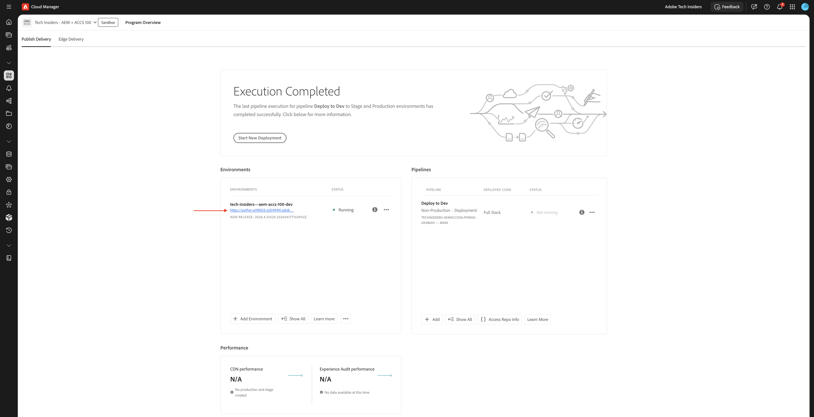

Fai clic sull&#39;icona **martello**.

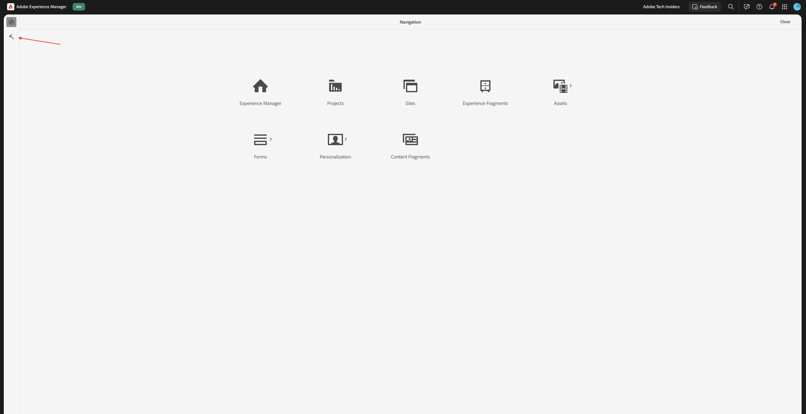

In **Generale**, fare clic su **Assegnazione tag**.


Dovresti vedere questo. Fai clic su **Crea**, quindi seleziona **Crea spazio dei nomi**.


Nel campo **Titolo**, immetti: `CitiSignal`. Fai clic su **Crea**.


Espandere lo spazio dei nomi **CitiSignal** facendo clic su di esso. Fai clic su **Crea**, quindi seleziona **Crea tag**.


Nel campo **Titolo**, immetti: `Campaign`. Fai clic su **Invia**.


Selezionare il tag **Campaign** facendo clic su di esso. Fai clic su **Crea**, quindi seleziona **Crea tag**.


Nel campo **Titolo**, immetti: `Winter 2026`. Fai clic su **Invia**.


Selezionare il tag **Campaign** facendo clic su di esso. Fai clic su **Crea**, quindi seleziona **Crea tag**.

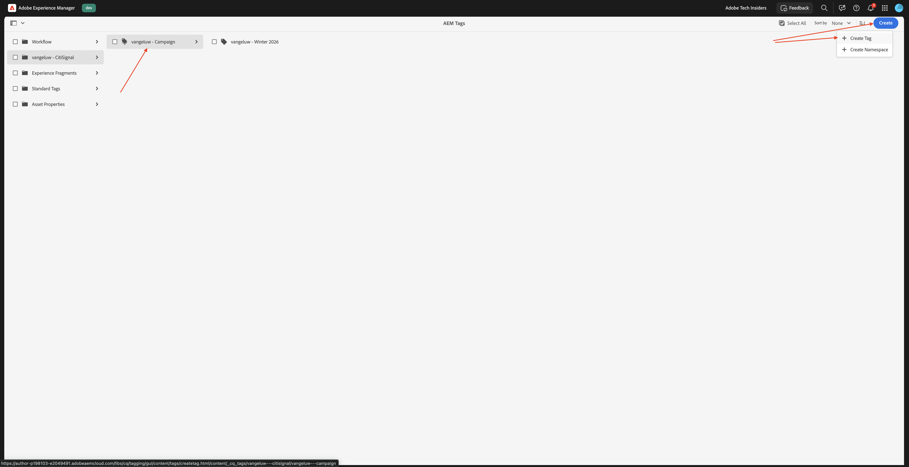

Nel campo **Titolo**, immetti: `Spring 2026`. Fai clic su **Invia**.


Ora dovresti avere questo.


Fare clic su **Adobe Experience Manager** e quindi su **Assets**.


Fare clic su **File**.


Fare doppio clic sulla cartella **CitiSignal** per aprirla.


Fai clic su **Crea**, quindi seleziona **File**.


Scarica il file [citisignal-images-campaign.zip](./assets/citisignal-images-campaign.zip) e decomprimi sul desktop.


Seleziona. i 3 file appena scaricati e fare clic su **apri**.

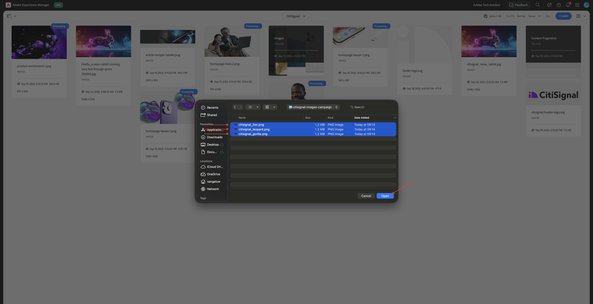

Fai clic su **Carica**.


Dovresti vedere questo.


Selezionare la prima immagine e quindi fare clic su **Proprietà**.


Fai clic sull&#39;icona **cartella** in Tag.

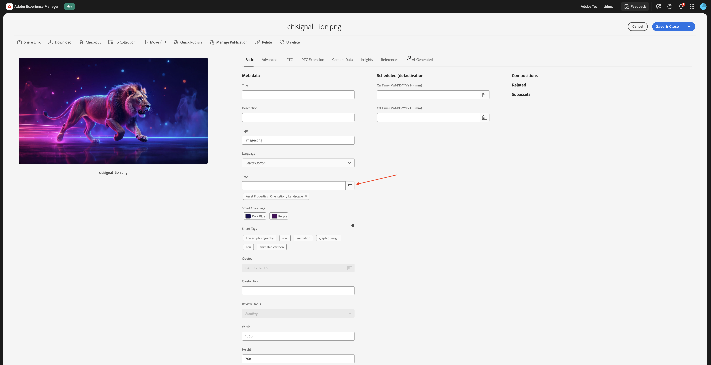

Seleziona il tag **Spring 2026** e fai clic su **Select**. Ripetere il processo per queste immagini:

- citisignal_lion.png
- citisignal_leopard.png
- citisignal_gorilla.png
- citisignal_rabbit.png


Dopo aver selezionato il tag per tutte le immagini, passa a **Experience Manager Assets**.


Seleziona l’archivio in uso.


Vai a **Assets** e apri la cartella **CitiSignal**.


Aprire la prima immagine.


Seleziona **Approvato**, quindi fai clic su **Salva**.

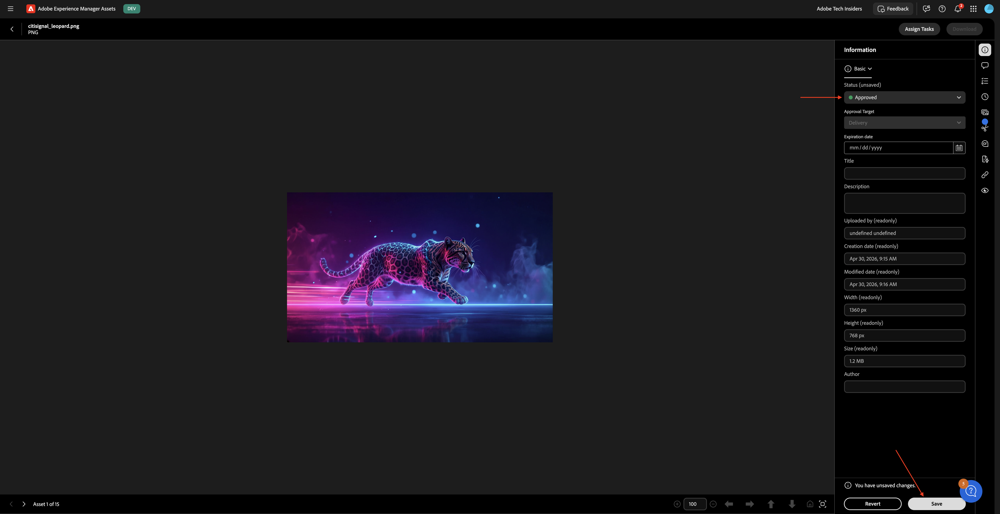

In **Tag** puoi visualizzare il tag selezionato in precedenza.

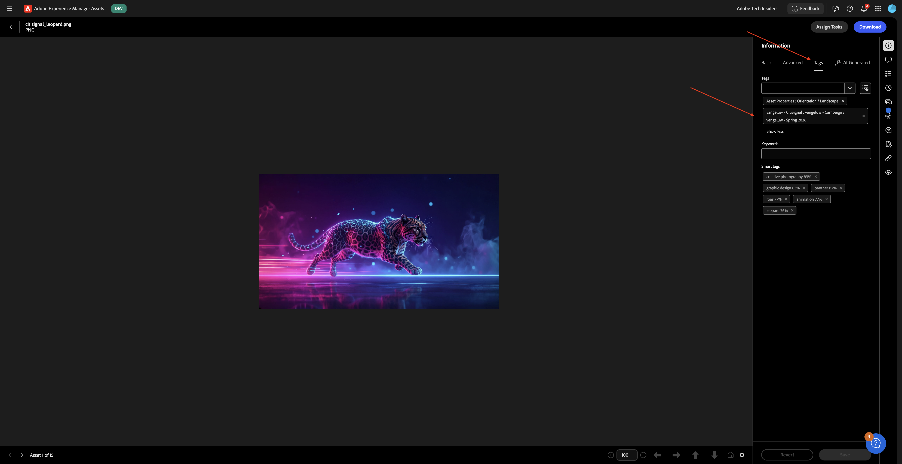

Ripetere il processo in modo che le 4 immagini vengano approvate.


Quindi, vai a **La mia area di lavoro** e fai clic per aprire **Assistente IA**.

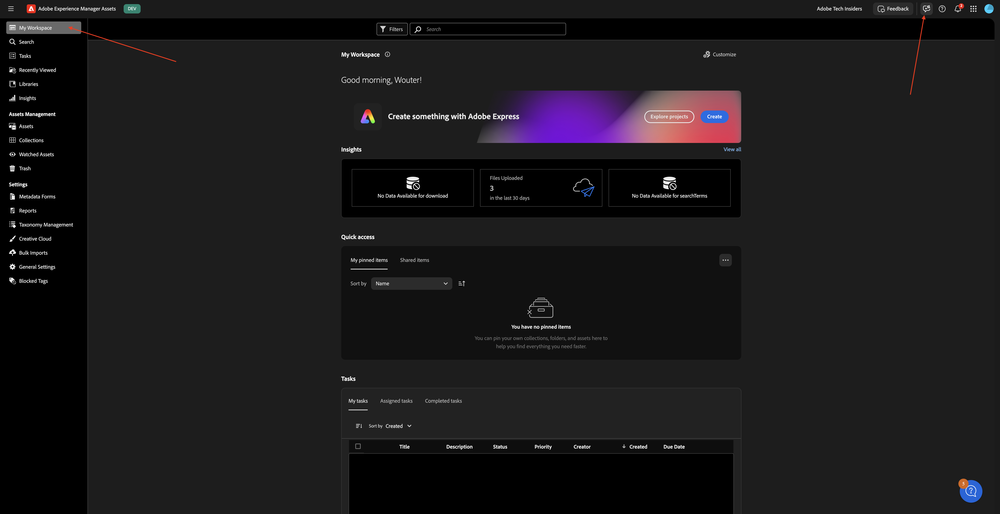

Immetti il seguente prompt e fai clic su **Invia**.

```javascript
find all assets tagged with 'Spring 2026'
```

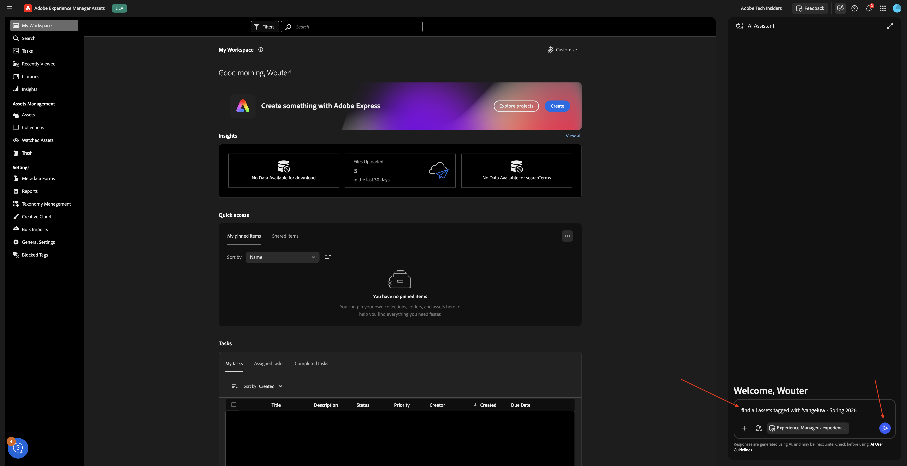

Se hai accesso a più ambienti AEM Assets CS, vedrai qualcosa di simile a questo. Fare clic sulla risposta proposta per l&#39;ambiente che si desidera utilizzare e quindi fare clic su **Invia**.

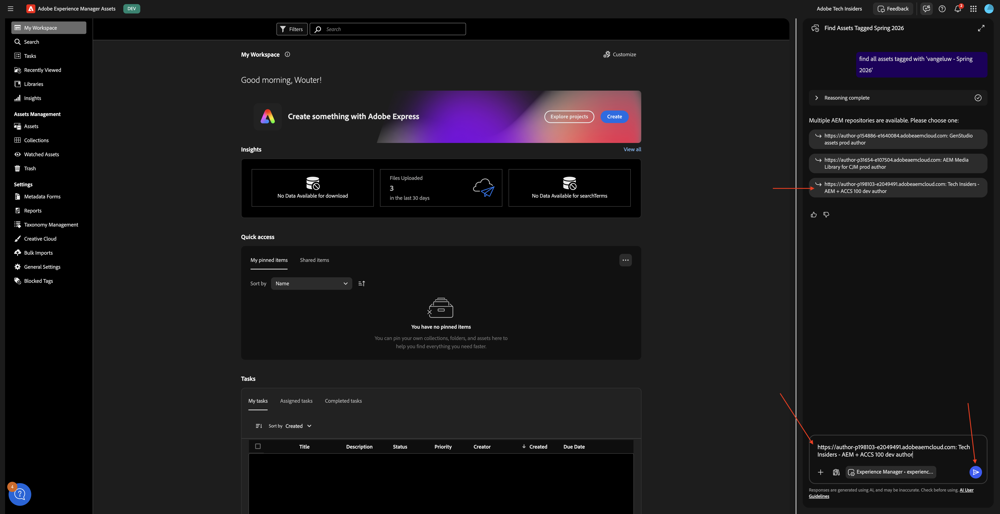

Dovresti vedere una risposta simile. Fai clic sull’icona per espandere l’Assistente AI a schermo intero.

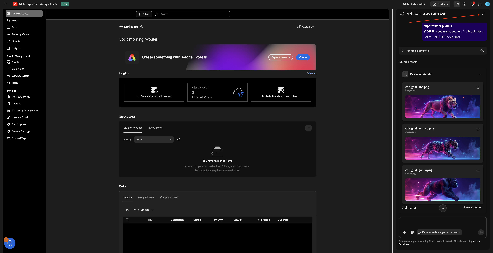

Rivedi le risposte.


Dall’interno della finestra dell’Assistente AI, puoi fare clic su per visualizzare queste risorse.


Verrai quindi portato direttamente in AEM Assets CS, all’immagine specifica.


Puoi quindi esaminare anche gli altri metadati disponibili.

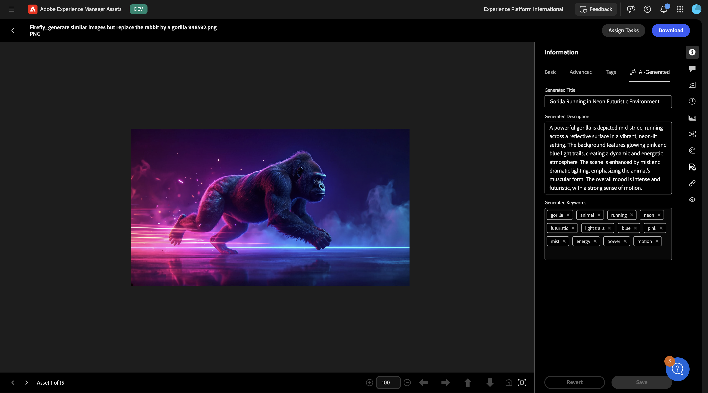

## 1.6.1.2 agente di produzione esperienza

### Aggiornamento contenuti - Assets

L’abilità Aggiornamento contenuto aggiorna facilmente i contenuti esistenti, inclusi frammenti di contenuto, pagine, moduli e risorse. L’agente può eseguire azioni quali l’aggiornamento, la rimozione, la sostituzione o l’aggiunta di elementi di contenuto per mantenere le esperienze accurate e correnti. Gli input possono essere descrizioni in linguaggio naturale e, se utilizzati con Jira PDF e screenshot, possono fornire anche input.

Torna alla schermata dell’Assistente AI.

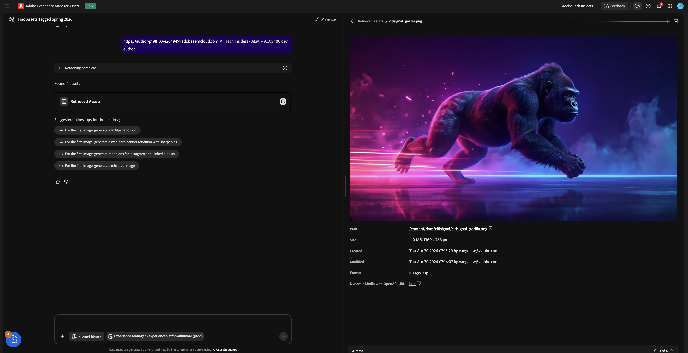

Immetti il seguente prompt e fai clic su **Invia**.

`Generate multiple social media formats (Instagram 1080x1920, Facebook 1200x630, Twitter 1200x675) for the third image`


Dopo un paio di minuti, dovrebbe verificarsi una risposta simile.


Rivedi le immagini generate.

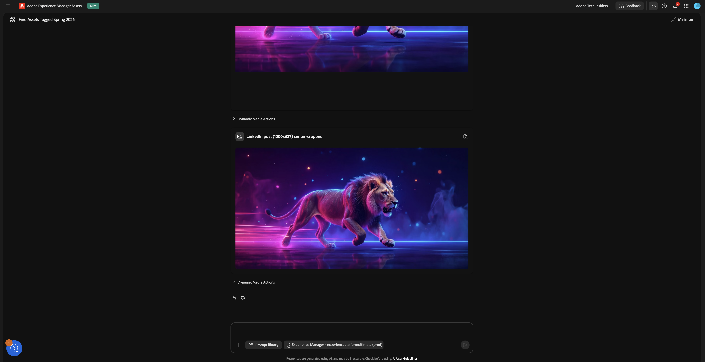

### Aggiornamento contenuti - Pagine

Torna all&#39;ambiente Adobe Experience Manager Author e passa a **Sites**.

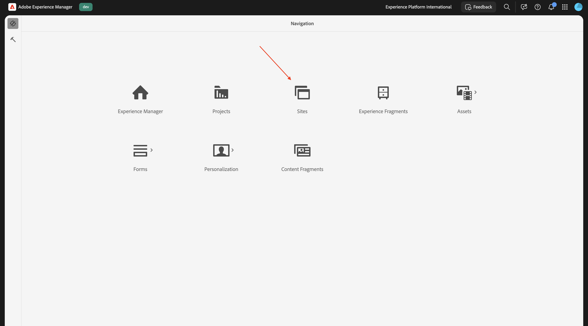

Vai a **CitiSignal**. Fai clic su **Crea** e seleziona **Pagina**.


Seleziona **Pagina** e fai clic su **Avanti**.


Immetti i seguenti valori:

- Titolo: **Fibra max**
- Nome: **fibre-max**
- Titolo pagina: **Fibra max**

Fai clic su **Crea**.


Seleziona **Apri**.


Dovresti vedere questo.

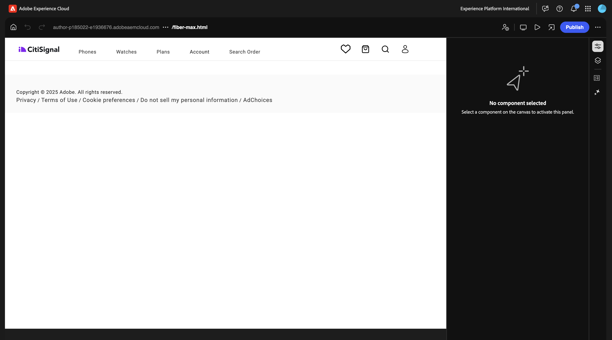

Fare clic nell&#39;area vuota per selezionare il componente **sezione**. Fai clic sull&#39;icona più **+** nel menu a destra e seleziona **Eroe**.


Dovresti vedere questo. Fare clic su **+ Aggiungi** per aggiungere un&#39;immagine.

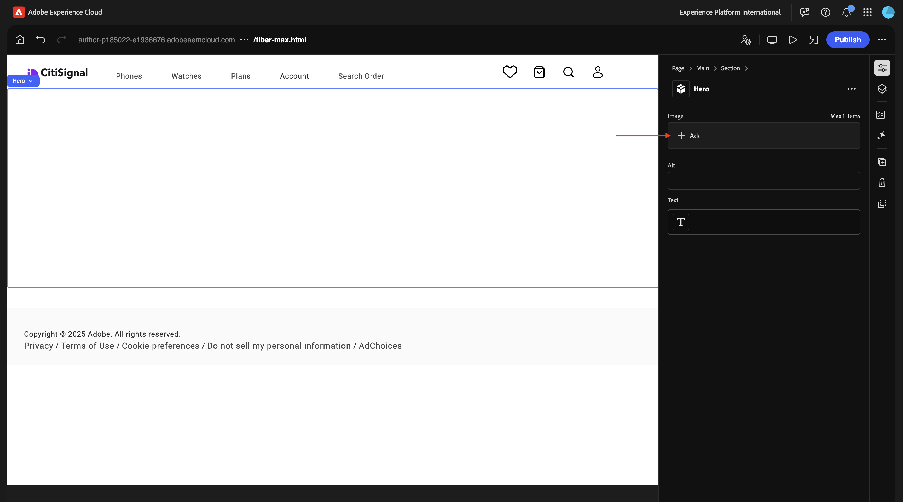

Seleziona l’archivio delle risorse. Aprire quindi la cartella **CitiSignal**.

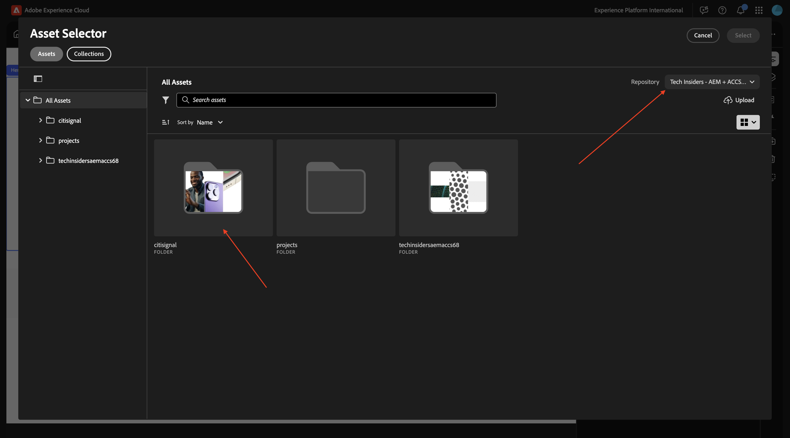

Scegli l&#39;immagine del leone caricata in precedenza. Fai clic su **Seleziona**.

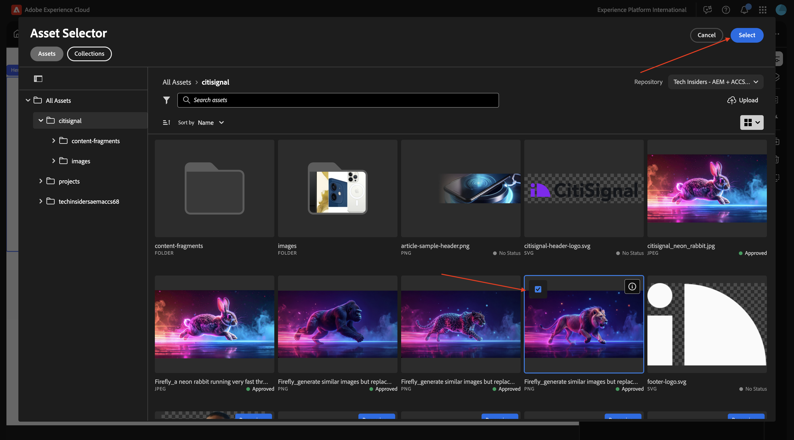

Dovresti vedere questo. Fare clic sull&#39;area **testo** per modificare il testo.


Incolla questo testo nelle:

```
This winter, be as fast as a lion.
```

Selezionare **Intestazione 1**, quindi fare clic su **Fine**.

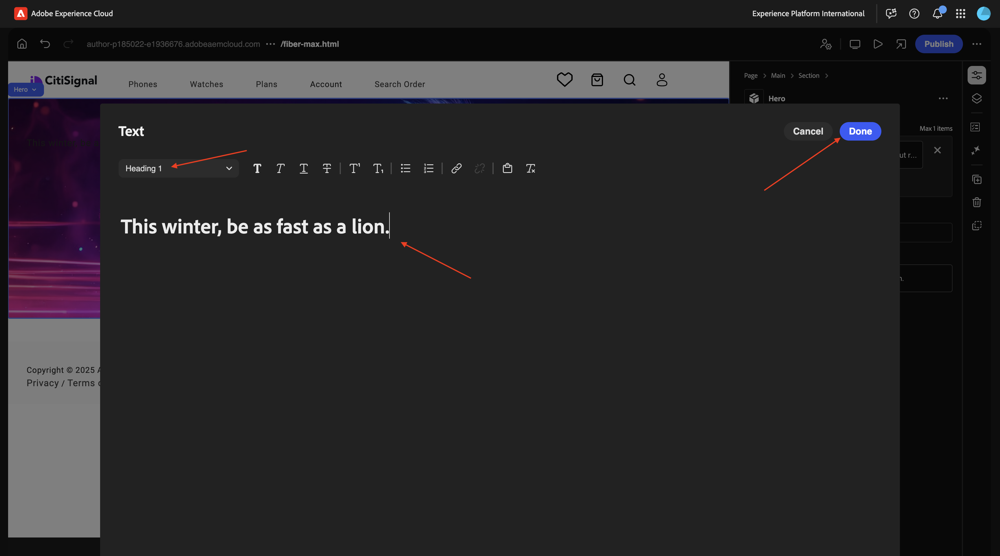

Dovresti vedere questo. Vai a **Struttura contenuto** e seleziona l&#39;area **Sezione**.


Fai clic sull&#39;icona **+**, quindi seleziona **Schede**.


Dovresti vedere questo. Assicurarsi che nella **Struttura contenuto** sia selezionato **Schede**.

Quindi, fare clic sul pulsante **+** 4 volte.

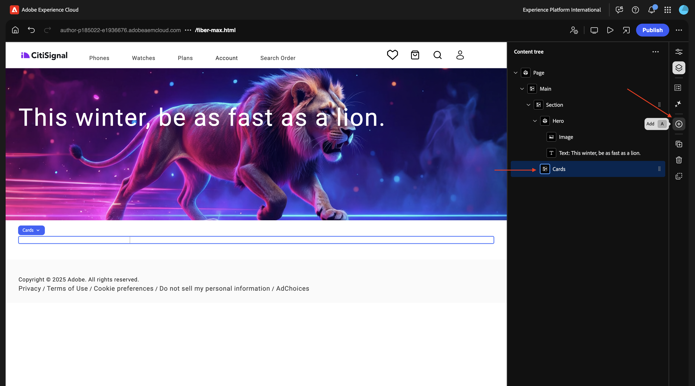

Ora dovresti vedere questo, dove ci sono 4 **oggetti Card** nell&#39;oggetto **Cards**.

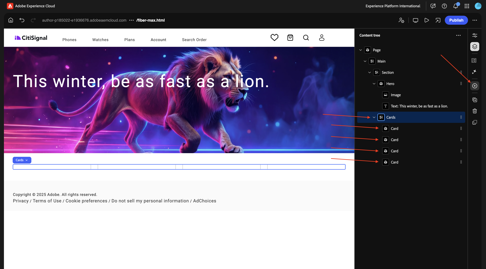

Seleziona la prima **scheda**. Fare clic sull&#39;area **testo** per modificare il testo.

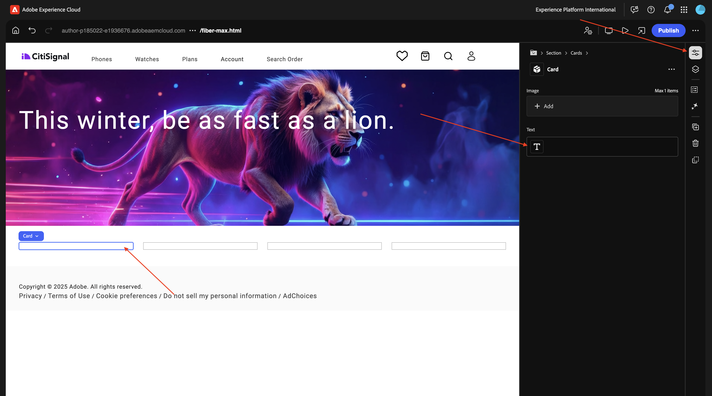

Incolla il testo seguente. Verificare che la prima riga di testo utilizzi **Intestazione 1**. Fai clic su **Fine**.

```
99.9% network reliability

Game, video chat and stream on multiple devices with ultra low lag.
```


Selezionare la seconda **scheda**. Fare clic sull&#39;area **testo** per modificare il testo.

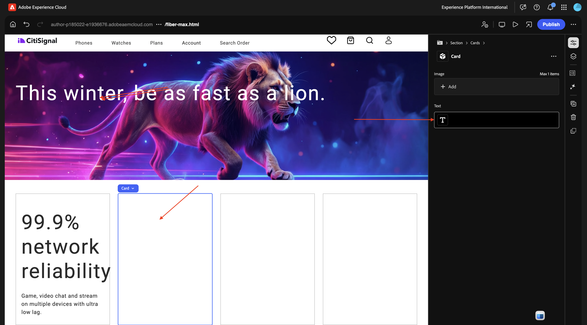

Incolla il testo seguente. Verificare che la prima riga di testo utilizzi **Intestazione 1**. Fai clic su **Fine**.

```
3-year

price lock guarantee

For new and existing Fiber Max customers on all internet plans.

No hidden fees.
```

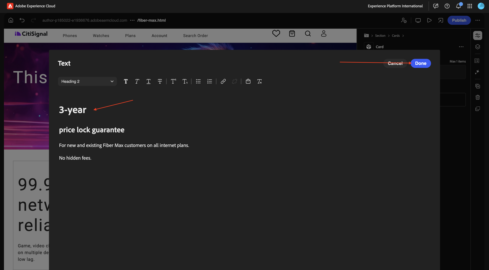

Seleziona la terza **scheda**. Fare clic sull&#39;area **testo** per modificare il testo.

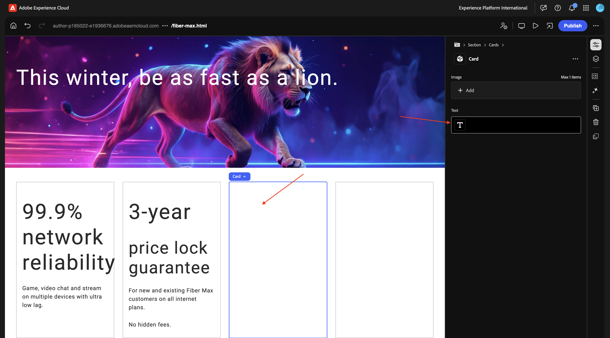

Incolla il testo seguente. Verificare che la prima riga di testo utilizzi **Intestazione 1**. Fai clic su **Fine**.

```
More ways to save

Save over 45% on the best entertainment with CitiSignal
```


Seleziona la quarta **scheda**. Fare clic sull&#39;area **testo** per modificare il testo.


Incolla il testo seguente. Verificare che la prima riga di testo utilizzi **Intestazione 1**. Fai clic su **Fine**.

```
Get Fiber Max now!

Fill out the form here to get started.
```

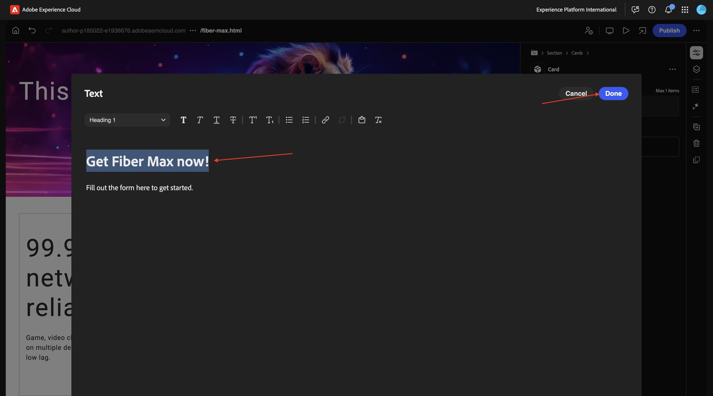

Ora dovresti avere questo. Fai clic su **Pubblica**.


Fai di nuovo clic su **Pubblica**.


Fai clic su **Apri pagina**.

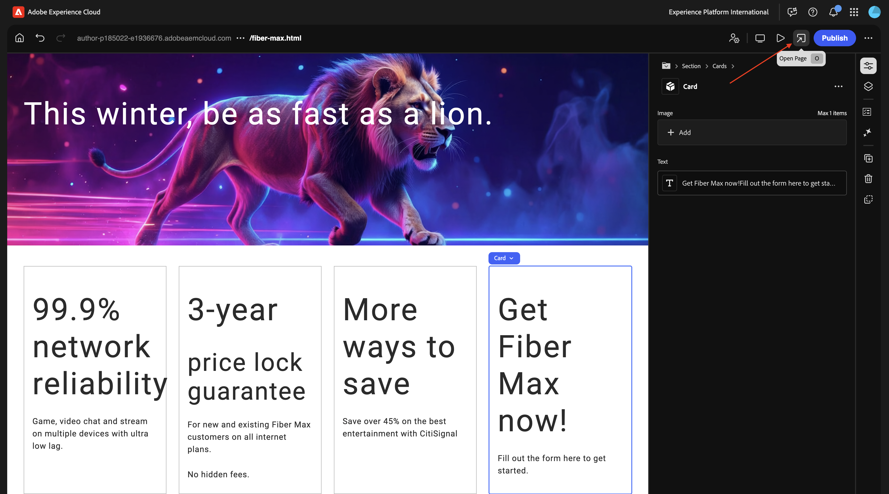

Copia l’URL della pagina in base alle tue esigenze.

L&#39;URL deve essere simile al seguente: `https://author-pXXXXXX-eXXXXXXX.adobeaemcloud.com/content/CitiSignal/fiber-max.html`.


Vai a [https://experience.adobe.com/#/experiencemanager/](https://experience.adobe.com/#/experiencemanager/). Fare clic per aprire **Assistente IA**.


Incolla il seguente prompt e fai clic su **invia**. Sostituisci XXX in questo prompt con l’URL copiato nel passaggio precedente.

```
On the page XXX, please make the following changes:

- change the word 'winter' to 'spring'
- change the word 'lion' to 'leopard'
- change the image in the hero block to use the image 'citisignal_leopard.png'
- change the text '99.9% network reliability' to '99.999% network reliability'
```

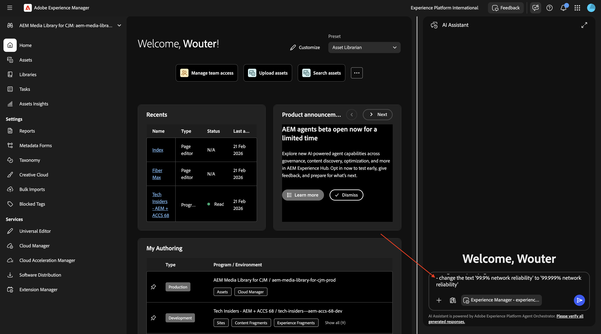

Dopo 1-2 minuti, dovresti vedere questo. Immettere il prompt `generate` e fare clic su **Invia**.

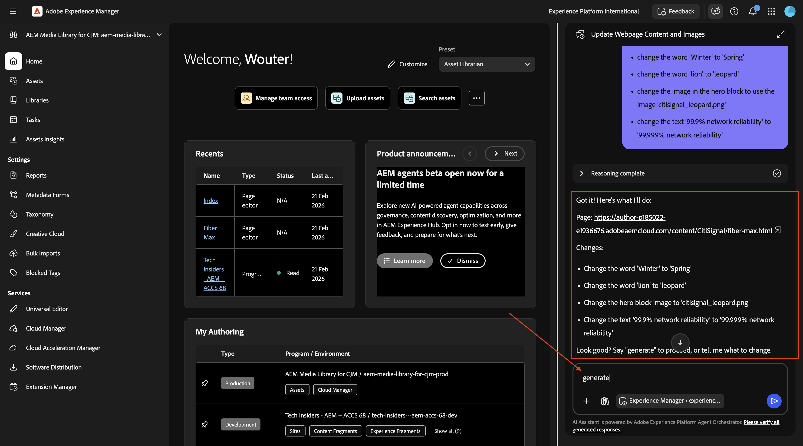

Un paio di minuti dopo, dovresti vedere una conferma del genere che le modifiche sono state eseguite. Fare clic su **Anteprima della pagina aggiornata**.


Ora ottieni una conferma visiva delle modifiche apportate. Questa pagina di anteprima ha uno scopo puramente informativo, non puoi intervenire da questa pagina.

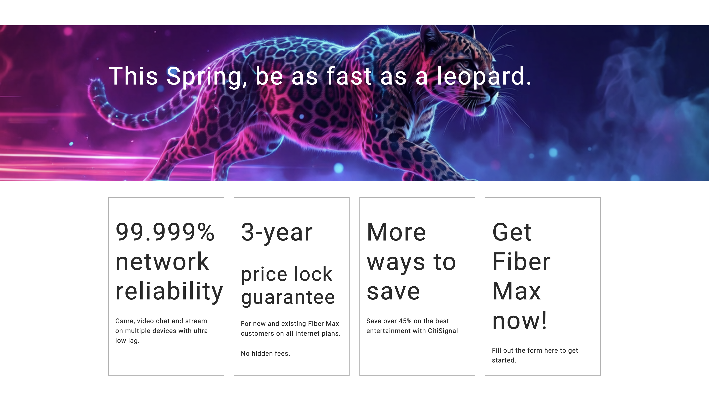

Per eseguire un&#39;azione, fare clic su **Modifica in AEM**.


Nell’Editor universale, ora puoi vedere tutte le modifiche in dettaglio, con la possibilità di modificare qualsiasi cosa. Dopo aver esaminato la pagina, fai clic su **Pubblica**.


Fai di nuovo clic su **Pubblica**. La modifica apportata non è ancora stata pubblicata nell&#39;ambiente di produzione. È stato invece pubblicato in **Lanci** in AEM.

I lanci consentono di sviluppare in modo efficiente i contenuti per una versione futura. Viene creato un lancio per consentire di apportare modifiche in preparazione alla pubblicazione futura, mantenendo al contempo le pagine correnti. Ciò significa che stai modificando effettivamente due versioni contemporaneamente: pagine attualmente pubblicate e una versione di tali pagine, da pubblicare in futuro. Una volta arrivato questo momento, puoi sostituire le pagine originali e pubblicare la nuova versione.


Per **Promuovere** le modifiche in sospeso per una versione futura, torna ad AEM. Fai clic su **Adobe Experience Manager** nella parte superiore della pagina, fai clic sull&#39;icona **martello**, quindi seleziona **Lanci**.

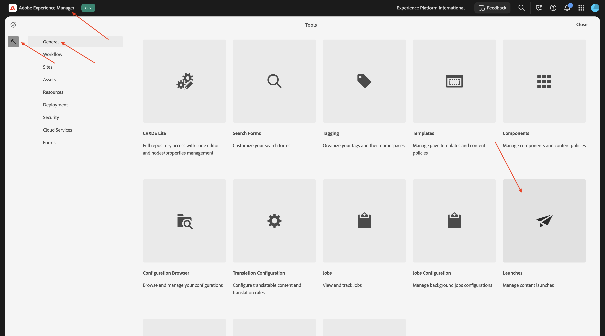

Ora dovresti vedere un **Launch** in sospeso. Selezionare la casella di controllo davanti al **lancio** in sospeso.


Fai clic su **Promuovi**.


Seleziona **Promuovi lancio completo** e fai clic su **Avanti**.

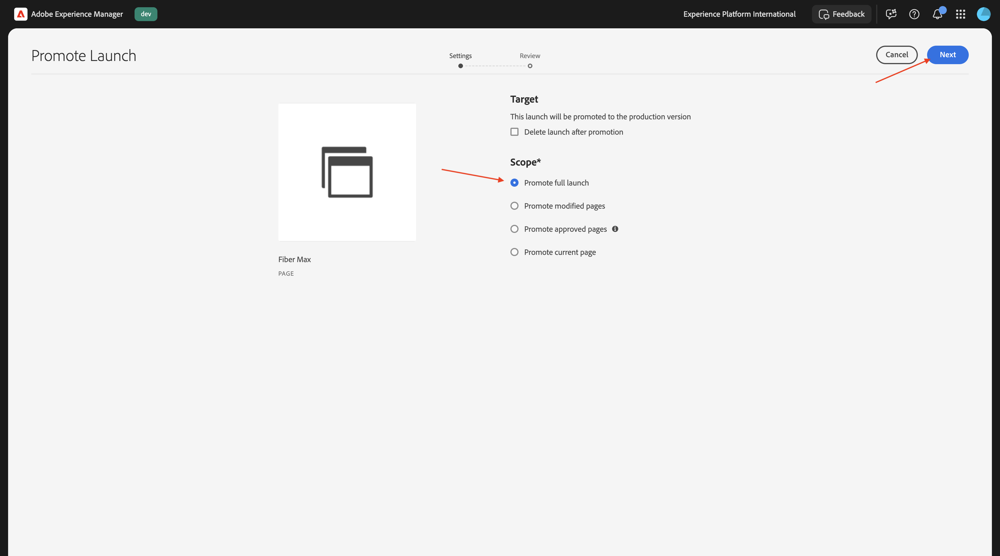

Fai clic su **Promuovi**.


Ora dovresti vedere questo. Le modifiche sono ora in produzione.


Aggiorna la pagina: tutte le modifiche dovrebbero essere visualizzate nella pagina pubblicata.


In alternativa, invece di eseguire il processo di promozione manuale, è possibile immettere il prompt `accept` nell&#39;Assistente IA.


Dovresti quindi ottenere una conferma della pubblicazione delle modifiche.


### Aggiornamento contenuto - Creazione modulo

Nel modulo [Adobe Experience Manager Forms con Edge Delivery Services](./../../asset-mgmt/module1.3/aemforms.md){target="_blank"} puoi trovare i passaggi necessari per creare un modulo in modo manuale.

L’abilità di Creazione di moduli ora consente agli utenti di creare moduli adattivi attraverso prompt in linguaggio naturale senza dipendere dai team di sviluppo o IT. Questa funzionalità accelera lo sviluppo dei moduli mantenendo al contempo la coerenza del marchio e consentendo agli utenti aziendali di creare moduli senza una profonda conoscenza tecnica dei prodotti.

Vai a [https://experience.adobe.com/#/ai-assistant/chat](https://experience.adobe.com/#/ai-assistant/chat).


Immetti il seguente prompt e fai clic su **invia**.

```
Create a new adaptive form using Edge Delivery Services with the following details:
- Form name: "citisignal-fiber-max-interest-2"
- Form fields: 4 text input fields are needed, for "first-name", "last-name", "email" and "city"
- When the form is submitted, send the submission to a spreadsheet, with this URL: https://docs.google.com/spreadsheets/d/1WwKrcM8mZ2d_W3sMheUAw3nFhP_OFk05TsqxhHkudfQ/edit?usp=sharing.
```


## Passaggi successivi

Torna a [AEM e agenti](./aemagents.md){target="_blank"}

[Torna a tutti i moduli](./../../../overview.md){target="_blank"}
