# 1.6.3 Scalabilità dei frammenti di contenuto con ChatGPT e il server MCP

>[!IMPORTANT]
>
>Per completare questo esercizio, devi avere accesso a un ambiente AEM Sites e Assets CS funzionante con EDS e i vari agenti AEM devono essere abilitati per l’organizzazione IMS in uso.
>
>Se non si dispone ancora di un ambiente di questo tipo, passare all&#39;esercizio [Adobe Experience Manager Cloud Service &amp; Edge Delivery Services](./../../../modules/asset-mgmt/module2.1/aemcs.md){target="_blank"}. Segui le istruzioni e potrai accedere a tale ambiente.

>[!IMPORTANT]
>
>Se in precedenza hai configurato un programma AEM CS con un ambiente AEM Sites e Assets CS, è possibile che la sandbox AEM CS sia stata sospesa. Dato che la disattivazione di una sandbox di questo tipo richiede 10-15 minuti, sarebbe opportuno avviare subito il processo di disattivazione in modo da non doverlo attendere in un secondo momento.

## 1.6.3.1 Crea modello per frammenti di contenuto

Torna all&#39;ambiente Adobe Experience Manager Author, vai a **Strumenti** e quindi a **Browser configurazioni**.

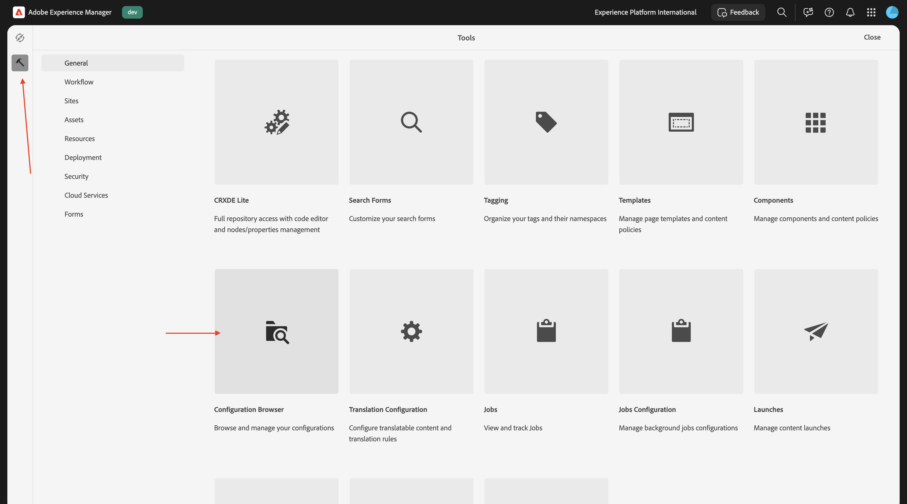

Fai clic su **Crea**.

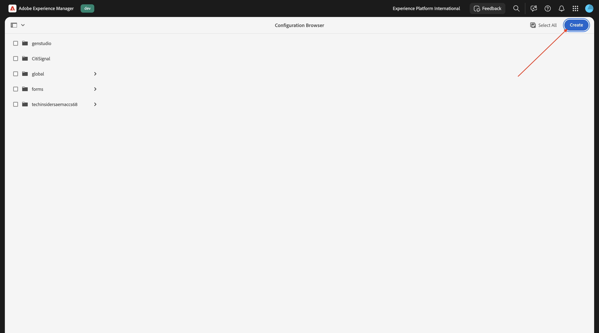

Utilizza `Content Fragments` per i campi **Titolo** e **Nome**.

Assicurati che le opzioni **Modelli per frammenti di contenuto** e **Query GraphQL persistenti** siano entrambe abilitate.

Fai clic su **Crea**.

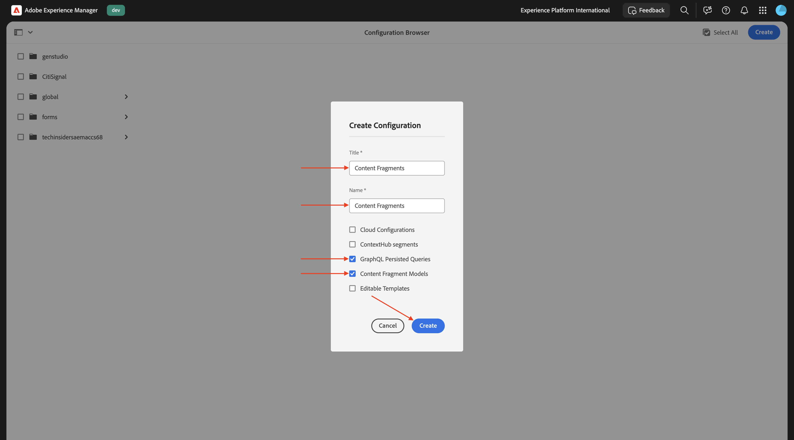

Torna all&#39;ambiente di authoring di Adobe Experience Manager, quindi vai a **Frammenti di contenuto**.


Vai a **Modelli per frammenti di contenuto**, seleziona la configurazione **Frammenti di contenuto**, quindi fai clic su **Crea**.


Utilizza il nome `--aepUserLdap-- - CitiSignal CFM`. Fai clic su **Crea e apri**.

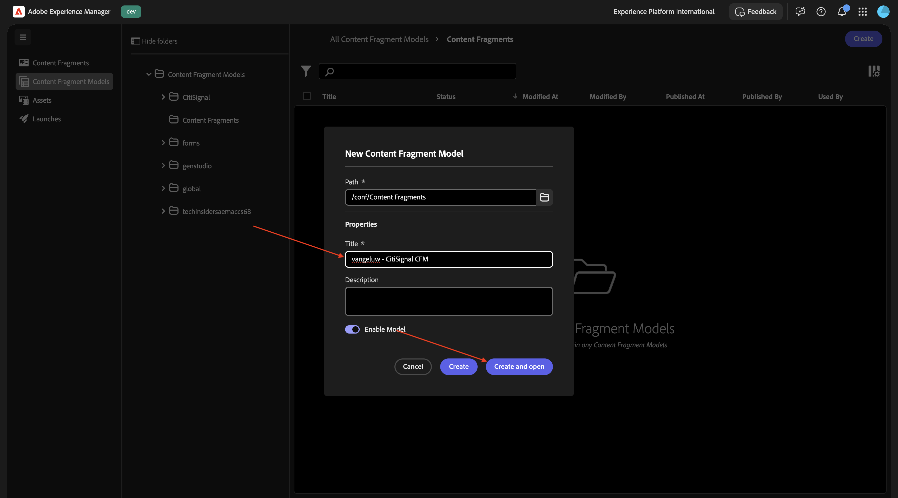

Dovresti vedere questo. Trascina e rilascia un campo **Testo su riga singola** nell&#39;area di lavoro.

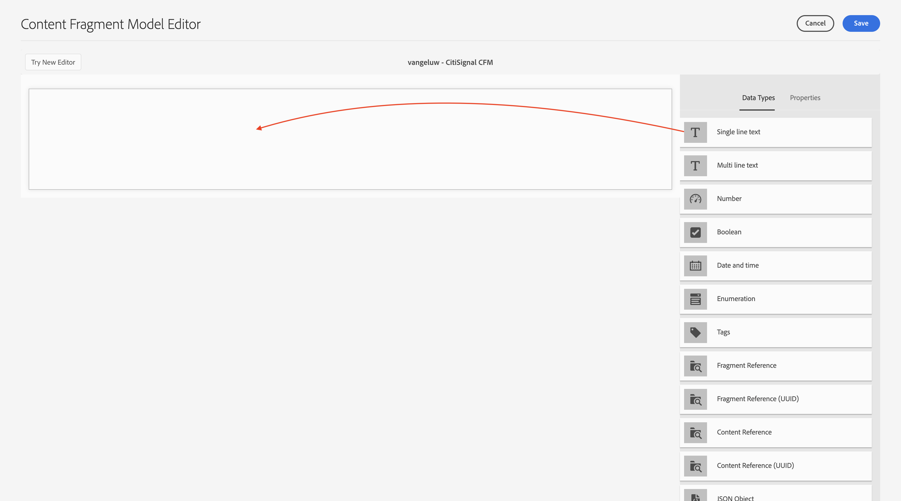

Cambia il campo **Etichetta campo** in `Header`.

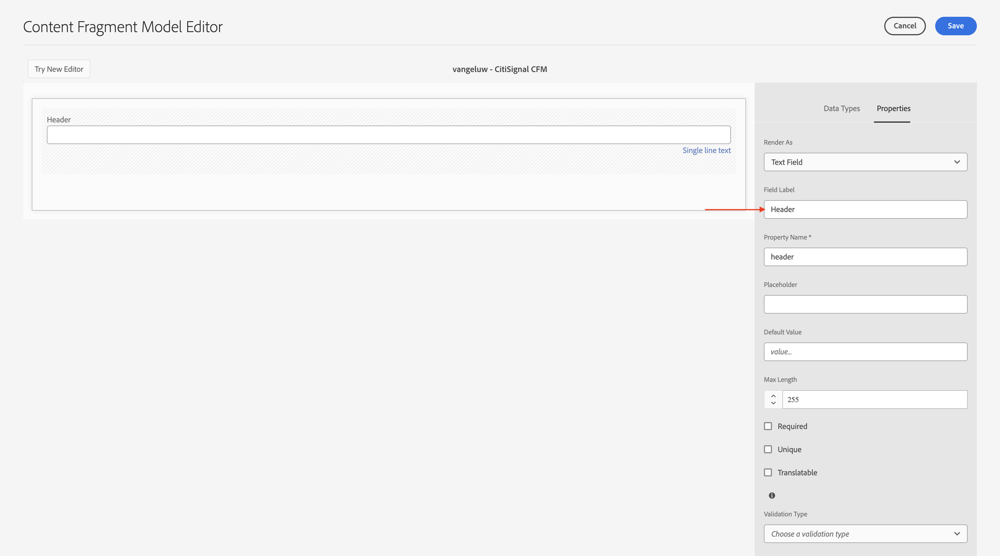

Torna a **Tipi di dati**. Trascina e rilascia un campo **Testo su riga singola** nell&#39;area di lavoro.

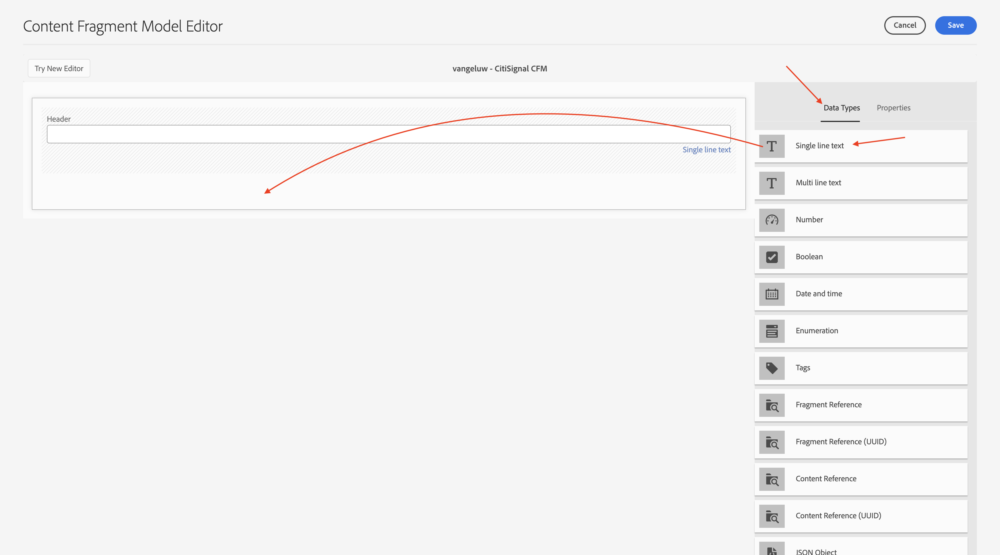

Cambia il campo **Etichetta campo** in `Subheader`.

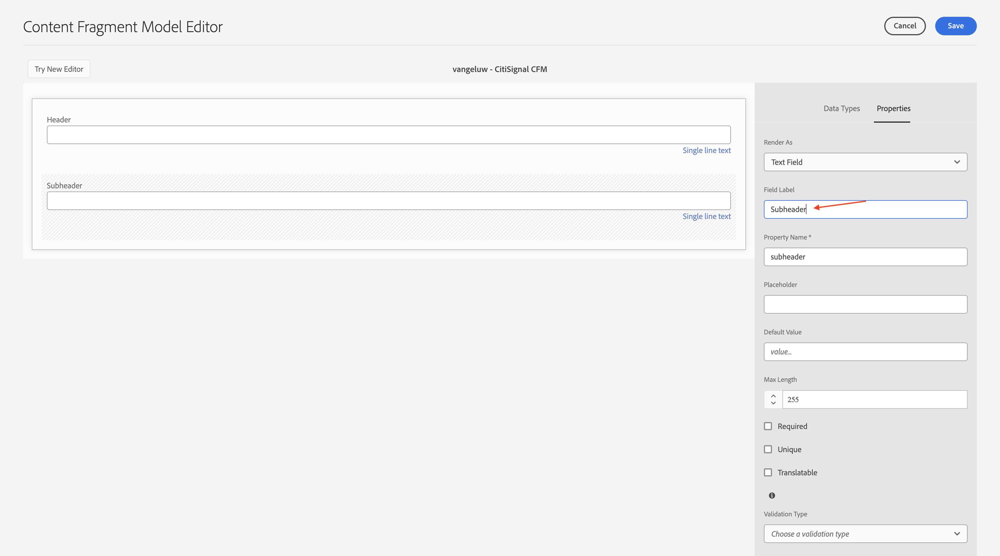

Torna a **Tipi di dati**. Trascina e rilascia un campo **Testo su più righe** nell&#39;area di lavoro.

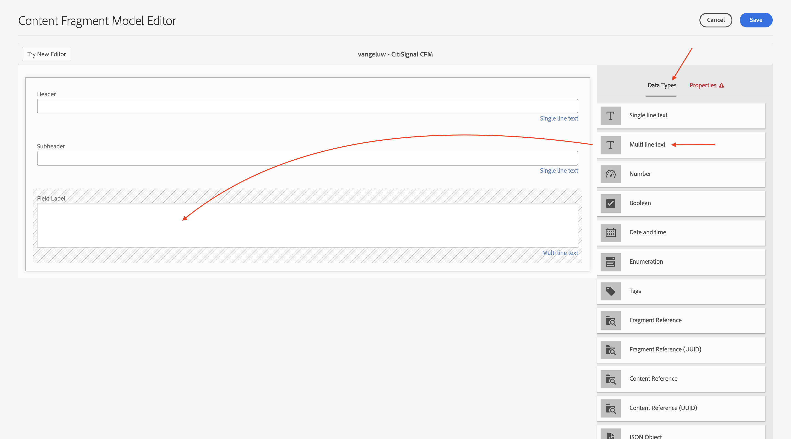

Cambia il campo **Etichetta campo** in `Detail Description`.


Torna a **Tipi di dati**. Trascina e rilascia un campo **Testo su riga singola** nell&#39;area di lavoro.


Cambia il campo **Etichetta campo** in `CTA Text`.


Torna a **Tipi di dati**. Trascina e rilascia un campo **Testo su riga singola** nell&#39;area di lavoro.


Cambia il campo **Etichetta campo** in `CTA Link`. Fai clic su **Salva**.

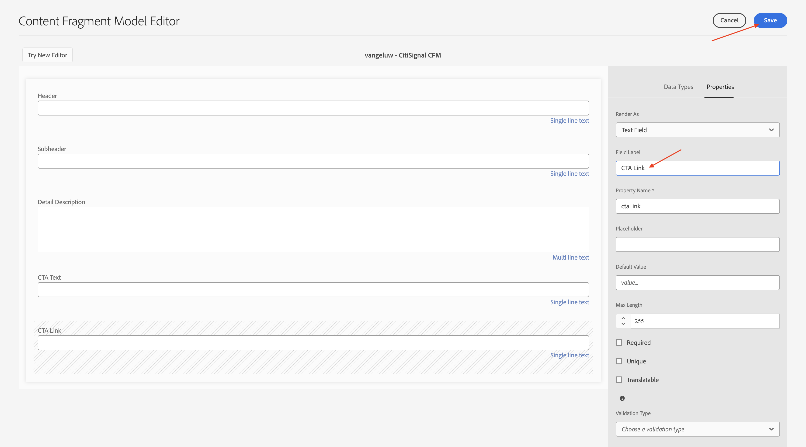

Dovresti vedere questo.


Seleziona il modello per frammenti di contenuto e fai clic su **Pubblica**.


Fai clic su **Pubblica**.


## 1.6.3.2 Crea frammento di contenuto

Torna all&#39;ambiente di authoring di Adobe Experience Manager, quindi vai a **Frammenti di contenuto**.


Dovresti vedere questo. Fai clic su **Crea**, quindi seleziona **Cartella**.

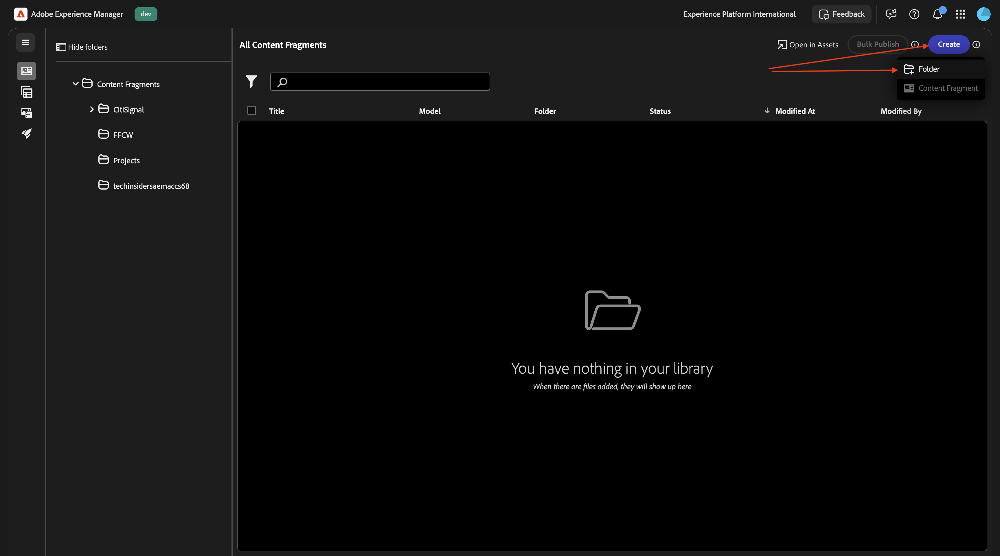

Immettere il titolo: `--aepUserLdap-- - CF`. Fai clic su **Crea**.


Torna all&#39;ambiente Adobe Experience Manager Author e passa a **Assets**.

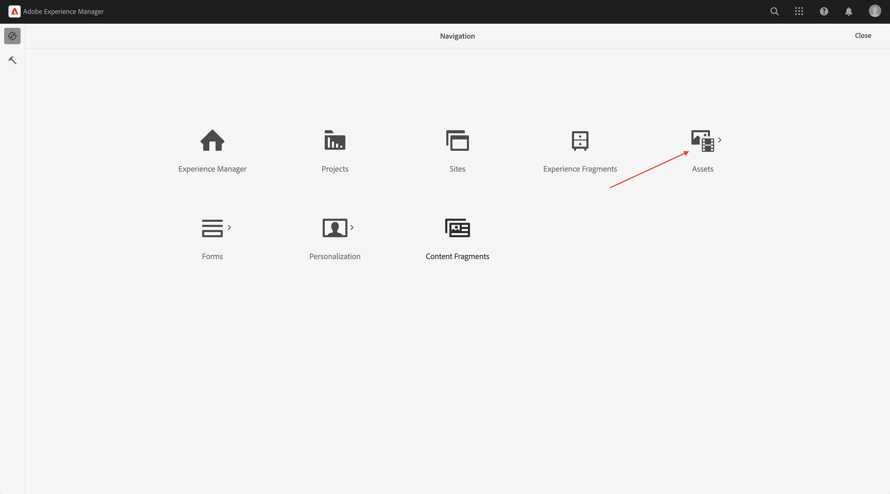

Vai a **File**.


Selezionare la cartella appena creata, che deve essere denominata `--aepUserLdap-- - CF`, quindi fare clic su **Proprietà**.

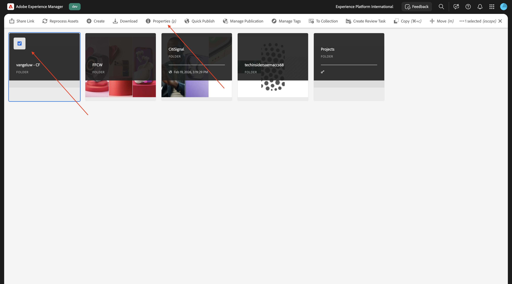

Vai a **Servizi cloud** e fai clic sull&#39;icona **cartella**.

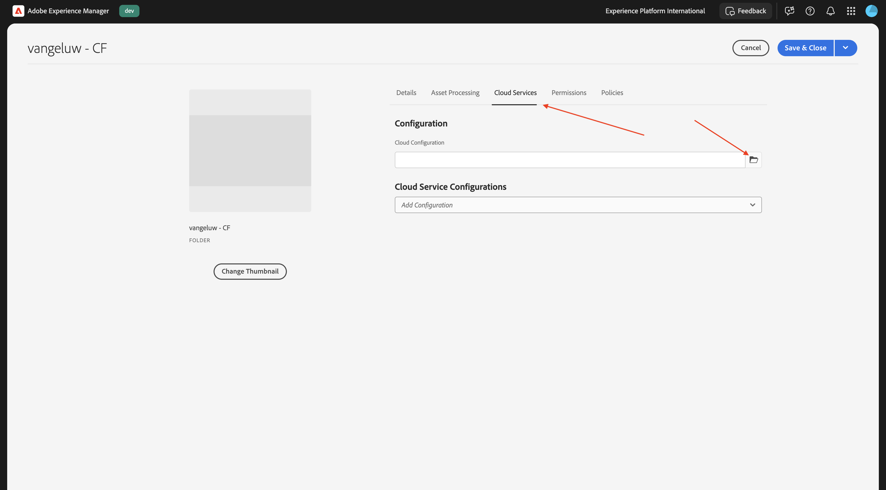

Seleziona la configurazione cloud creata in precedenza, che deve essere denominata **Frammenti di contenuto**. Fai clic su **Seleziona**.


Dovresti vedere questo. Fai clic su **Salva e chiudi**.

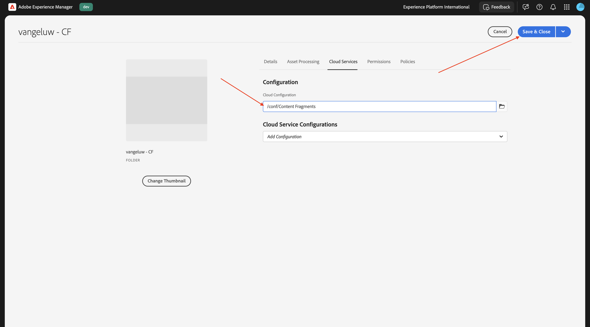

Torna all&#39;ambiente di authoring di Adobe Experience Manager, quindi vai a **Frammenti di contenuto**.


Dovresti vedere questo. Fai clic su **Crea**, quindi seleziona **Frammento di contenuto**.


Seleziona il **Modello per frammenti di contenuto** creato in precedenza, che deve essere denominato `--aepUserLdap-- - CitiSignal CFM`. Utilizza il nome `--aepUserLdap-- CitiSignal Fiber Max`.

Fai clic su **Crea e apri**.


Dovresti vedere questo.

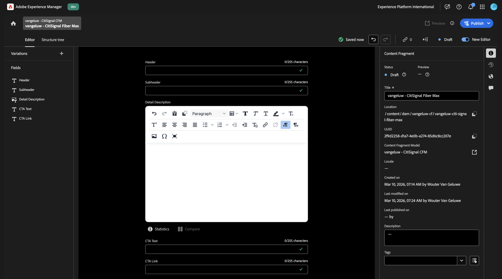

Compila i campi in questo modo:

- **Intestazione**: `CitiSignal Fiber Max`
- **Intestazione secondaria**: `Experience high speed internet now`
- **Descrizione dettagliata**:

```
Experience the future of connectivity with CitiSignal Fiber Max, the ultimate solution for high-speed internet. Designed for homes and businesses that demand performance, Fiber Max delivers blazing-fast fiber speeds, ensuring seamless streaming, ultra-responsive gaming, and crystal-clear video calls.

Key Features:

Unmatched Speed: Enjoy lightning-fast downloads and uploads powered by cutting-edge fiber technology.
Reliable Performance: Consistent connectivity for work, entertainment, and everything in between.
Future-Ready: Built to handle the growing demands of smart homes and digital lifestyles.
Unlimited Potential: No data caps, no throttling—just pure speed.
Why Choose CitiSignal Fiber Max? Stay ahead with internet that works as hard as you do. Whether you’re powering a remote office or streaming in 4K, Fiber Max ensures you never miss a beat.
```

**Testo CTA**: `Upgrade now by signing your new contract!`
**Collegamento CTA**: `https://techinsiders68.adobedemosystem.com/`

Fai clic su **Pubblica**, quindi seleziona **Ora**.


Fai clic su **Pubblica**.


## 1.6.3.3 Configurazione del server MCP in ChatGPT

>[!NOTE]
>
>L’utilizzo di Adobe Marketing Agent in ChatGPT richiede quanto segue:
>- una versione a pagamento di OpenAI ChatGPT Enterprise
>- utilizzo del client Web ChatGPT Enterprise

Vai a [https://chatgpt.com/](https://chatgpt.com/){target="_blank"} e accedi utilizzando i dettagli del tuo account. Una volta effettuato l’accesso, dovresti visualizzarlo. Fai clic sul tuo nome utente e seleziona **Impostazioni**.


Vai a **App** e seleziona **Impostazioni avanzate**.

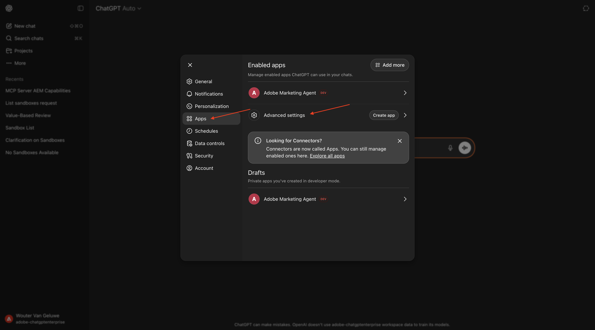

Attiva **Modalità sviluppatore**, quindi fai clic su **Indietro**.

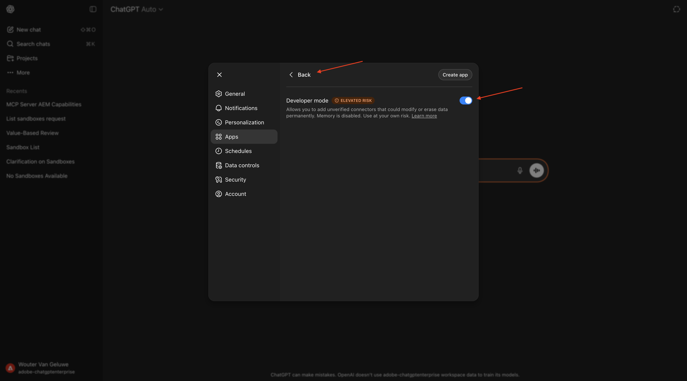

Fai clic su **Crea app**.

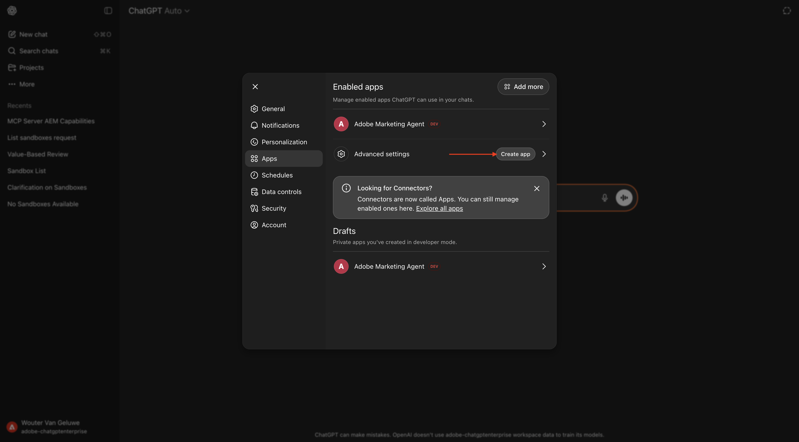

Compila i campi in questo modo:

- **Nome**: `aem`
- **URL server MCP**: `https://mcp.adobeaemcloud.com/adobe/mcp/content`
- **Autenticazione**: `OAuth`

Seleziona la casella di controllo per **Ho capito e voglio continuare**.

Fai clic su **Crea**.

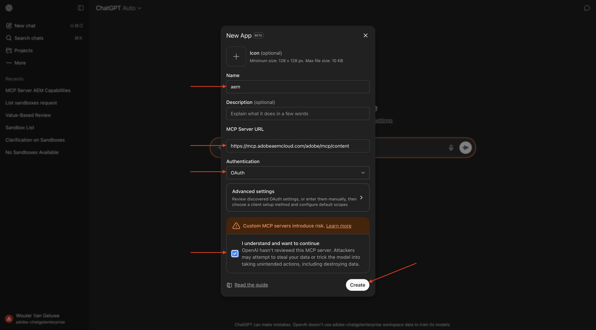

ChatGPT tenterà ora di connettersi al tuo account Adobe. Seleziona **Consenti accesso**, quindi dovrai accedere con il tuo account Adobe.

Dopo aver effettuato l’accesso, dovresti notare che il tuo Adobe Marketing Agent è ora connesso correttamente.


## 1.6.3.4 Utilizza il server AEM MCP in ChatGPT

Chiudi questa finestra.


Dovresti vedere questo. Fai clic sull&#39;icona **+**, passa a **Altro** e seleziona **aem**.


Immetti il seguente prompt e fai clic su **Invia**.

```
I just created a new custom mcp server named 'aem'. what can I do with that?
```

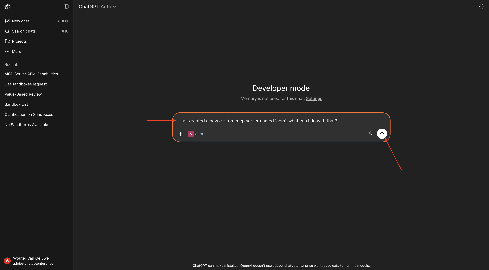

Dovresti vedere qualcosa del genere. Immetti il seguente prompt e fai clic su **Invia**.

```
use the author url https://author-pXXXXXX-eXXXXXXX.adobeaemcloud.com/ from now on
```

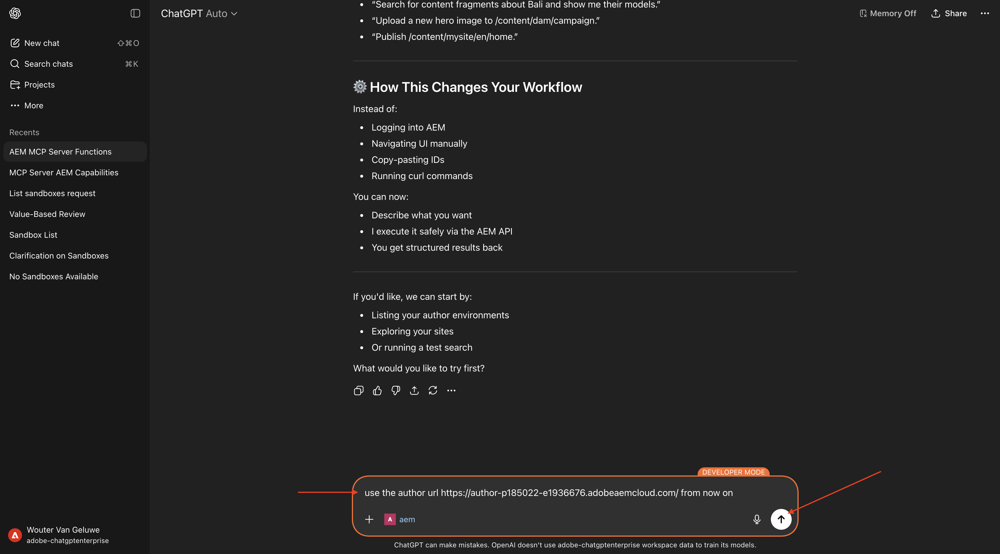

Dovresti vedere qualcosa del genere. Immetti il seguente prompt e fai clic su **Invia**.

```
find the content fragment --aepUserLdap-- - CitiSignal Fiber Max and make a variation called --aepUserLdap-- - CitiSignal Fiber Max (FR), then translate all fields into french
```


Fare clic su **CreaVarianteFrammento**.


Fare clic su **AggiornaFrammento**.


Dovresti vedere questo. La variante di frammento è stata creata correttamente.


Ora puoi visualizzare anche la nuova variante nell’interfaccia utente di AEM.

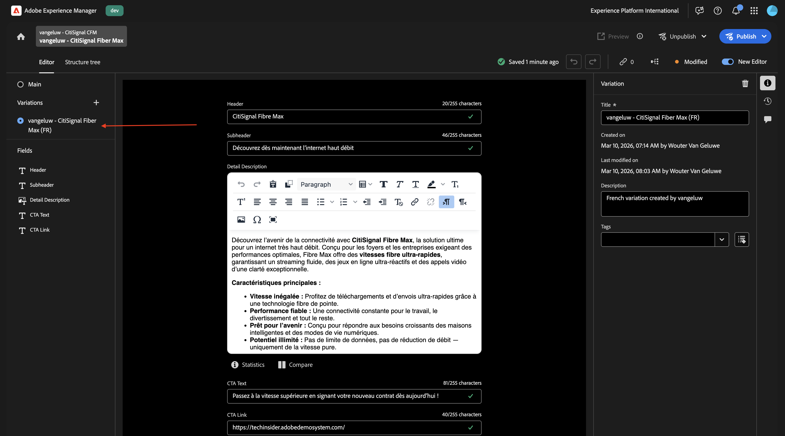

## Passaggi successivi

Torna a [AEM e agenti](./aemagents.md){target="_blank"}

[Torna a tutti i moduli](./../../../overview.md){target="_blank"}