# 1.3.1 Creare il primo modulo

>[!IMPORTANT]
>
>Per completare questo esercizio, devi avere accesso a un ambiente AEM Assets CS Author funzionante in cui sia abilitato AEM Assets Dynamic Media.
>
>Se non disponi di un ambiente di questo tipo, passa a [Adobe Experience Manager Cloud Service &amp; Edge Delivery Services](./../../../modules/asset-mgmt/module2.1/aemcs.md){target="_blank"}. Segui le istruzioni e potrai accedere a tale ambiente.

>[!IMPORTANT]
>
>Se in precedenza hai configurato un programma AEM CS con un ambiente AEM Assets CS, è possibile che la sandbox AEM CS sia stata sospesa. Dato che la disattivazione di una sandbox di questo tipo richiede 10-15 minuti, sarebbe opportuno avviare subito il processo di disattivazione in modo da non doverlo attendere in un secondo momento.

## 1.3.1.1 Requisiti dell&#39;ambiente per l&#39;utilizzo di AEM Forms con Edge Delivery Services

Prima di configurare il primo modulo, è necessario soddisfare una serie di requisiti prima di poter procedere come segue.

### Configurazione del programma

Nelle **soluzioni e componenti aggiuntivi** del programma Cloud Manager, è necessario abilitare **Forms**.

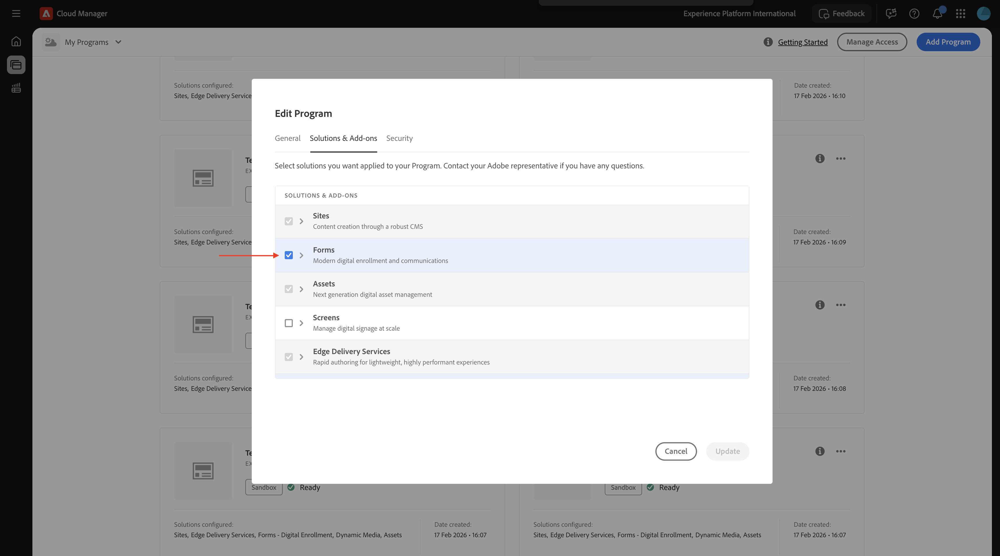

### blocchi

Nell’archivio Github, devi disporre dei seguenti blocchi:

- **modulo**
- **modulo-adattivo-incorporato**

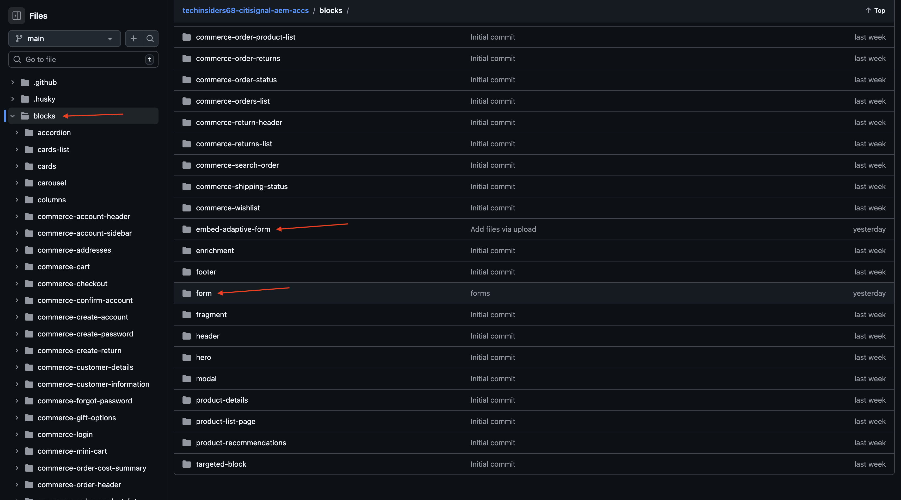

### script

Nell’archivio Github, è necessario disporre dei seguenti script:

- **editor-moduli-support.css**
- **editor-moduli-support.js**

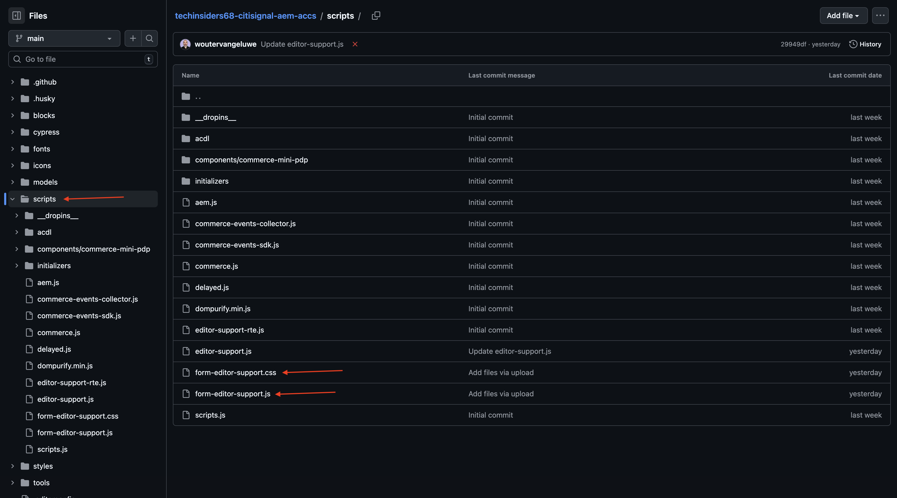

Inoltre, nel file **editor-support.js**, è necessario apportare le seguenti modifiche per abilitare la modifica dei moduli nell&#39;editor universale.

- cambia la dichiarazione della funzione da **attachEventListners(main)** a **attachEventListners(main)** asincrono
- aggiungere le righe 152 e 153:

```
const module = await import('./form-editor-support.js');
module.attachEventListners(main);
```

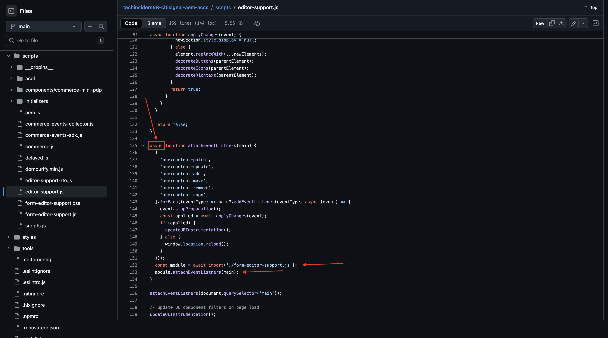

Inoltre, nel file **editor-support.js**, modifica le righe da 90 a 92 come segue:

```
if (block.dataset.aueModel === 'form') {
        return true;
      } else if (newBlock) {
```

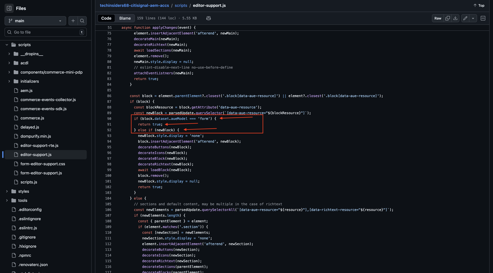

### paths.json

Verifica la configurazione dell&#39;archivio Github, in particolare nel file **paths.json**. Queste righe devono essere presenti nel file:

- Nelle mappature: **&quot;/content/forms/af/:/forms/&quot;**
- In include: **&quot;/content/forms/af/&quot;**

```json
{
  "mappings": [
    "/content/CitiSignal/:/",
    "/content/CitiSignal/configuration:/.helix/config.json",
    "/content/CitiSignal/headers:/.helix/headers.json",
    "/content/CitiSignal/metadata:/metadata.json",
    "/content/CitiSignal.resource/enrichment/enrichment.json:/enrichment/enrichment.json",
    "/content/forms/af/:/forms/"
  ],
  "includes": [
    "/content/CitiSignal/",
    "/content/forms/af/"
  ]
}
```

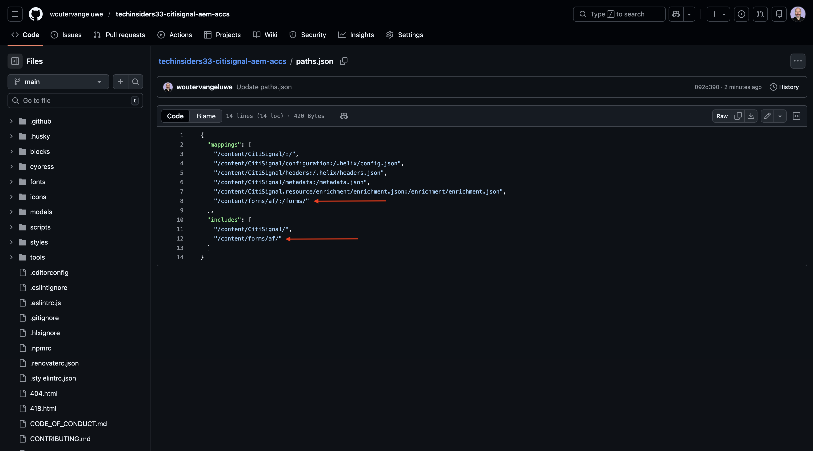

Con questi requisiti, puoi creare il primo modulo.

## 1.3.1.1 Crea modulo

Vai a [https://my.cloudmanager.adobe.com](https://my.cloudmanager.adobe.com){target="_blank"}. L&#39;organizzazione da selezionare è `--aepImsOrgName--`. Apri l’ambiente.


Vai a **Forms**.


Vai a **Forms e documenti**.


Fai clic su **Crea**, quindi seleziona **Modulo adattivo**.


Seleziona **Edge Delivery Services** e quindi **Pagina vuota**. Fai clic su **Crea**.


Dovresti vedere questo. Compila i campi seguenti:

- **Titolo**: `Fiber Max Interest Form`
- **Nome**: deve essere compilato automaticamente in base al campo **Titolo**.
- **URL Github**: fornisci il percorso dell&#39;archivio Github collegato al tuo sito Web

Fai clic su **Crea**.


Dopo aver fatto clic su **Crea**, l&#39;**Editor universale** dovrebbe aprirsi automaticamente e dovrebbe essere visualizzato qualcosa di simile. Fare clic sull&#39;icona per aprire la **Struttura contenuto**.


Nella **Struttura contenuto**, selezionare l&#39;oggetto **Modulo adattivo**.


Quindi fare clic sull&#39;icona **+** per aggiungere un nuovo elemento e selezionare **immissione testo**.


Nella **Struttura contenuto**, selezionare il campo **Input testo**.


Passare alla visualizzazione **Base**. Dovresti vedere questo.

Compila i campi seguenti:

- **Nome**: `first-name`
- **Titolo**: `First Name`

Quindi, vai a **Convalida**.


Capovolgere l&#39;interruttore per rendere obbligatorio il campo. Compila i campi seguenti:

- **Messaggio di errore**: `Enter your first name`
- **Pattern**: `[A-Za-z][A-Za-z ]+`
- **Messaggio di errore pattern**: `Letters only!`


Nella **Struttura contenuto**, seleziona il campo **Modulo adattivo**. Fai clic sull&#39;icona **+**, quindi seleziona **immissione testo**.


Nella **Struttura contenuto**, selezionare il campo appena creato **Input testo**. Vai a **Proprietà**.


Passare alla visualizzazione **Base**. Dovresti vedere questo.

Compila i campi seguenti:

- **Nome**: `last-name`
- **Titolo**: `Last Name`

Quindi, vai a **Convalida**.


Capovolgere l&#39;interruttore per rendere obbligatorio il campo. Compila i campi seguenti:

- **Messaggio di errore**: `Enter your last name`
- **Pattern**: `[A-Za-z][A-Za-z ]+`
- **Messaggio di errore pattern**: `Letters only!`


Nella **Struttura contenuto**, seleziona il campo **Modulo adattivo**. Fai clic sull&#39;icona **+**, quindi seleziona **immissione testo**.


Nella **Struttura contenuto**, selezionare il campo appena creato **Input testo**. Vai a **Proprietà**.


Passare alla visualizzazione **Base**. Dovresti vedere questo.

Compila i campi seguenti:

- **Nome**: `email`
- **Titolo**: `Email`

Quindi, vai a **Convalida**.


Capovolgere l&#39;interruttore per rendere obbligatorio il campo. Compila i campi seguenti:

- **Messaggio di errore**: `Enter your email address`
- **Pattern**: `^[^@]+@[^@]+\.[^@]+$`
- **Messaggio di errore pattern**: `Please verify your email address!`


Nella **Struttura contenuto**, seleziona il campo **Modulo adattivo**. Fai clic sull&#39;icona **+**, quindi seleziona **immissione testo**.


Nella **Struttura contenuto**, selezionare il campo appena creato **Input testo**.


Passare alla visualizzazione **Base**. Dovresti vedere questo.

Compila i campi seguenti:

- **Nome**: `city`
- **Titolo**: `city`

Quindi, vai a **Convalida**.


Capovolgere l&#39;interruttore per rendere obbligatorio il campo. Compila i campi seguenti:

- **Messaggio di errore**: `Enter your city`
- **Pattern**: `[A-Za-z][A-Za-z ]+`
- **Messaggio di errore pattern**: `Letters only!`


Fai clic su **Pubblica**.


Fai di nuovo clic su **Pubblica**.


Fare clic per aprire il modulo.


Sarà quindi possibile compilare il modulo, ma non è ancora possibile inviarlo.


Dopo la pubblicazione, il modulo è ora disponibile anche nel dominio Edge Delivery Services, che è simile al seguente:

`https://main--techinsidersXX-citisignal-aem-accs--woutervangeluwe.aem.page/forms/fiber-max-interest-form`

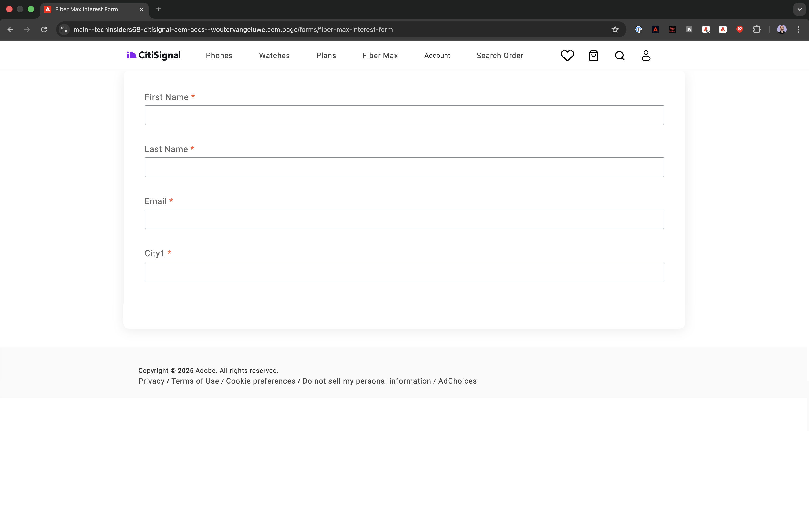

## 1.3.1.2 Invia modulo

Per inviare il modulo, sono necessari 2 elementi:

- un pulsante **Invia**
- un&#39;azione **Invia**

In questo esercizio è inoltre consigliabile utilizzare un foglio di calcolo di Google per registrare gli invii di questo modulo.

### Foglio di calcolo Google

Vai a [https://drive.google.com](https://drive.google.com) e crea un nuovo foglio di calcolo vuoto.

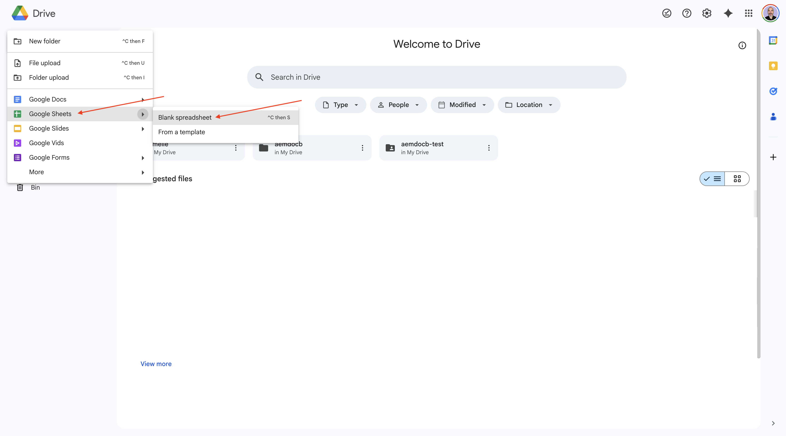

Denomina il file `citisignal-fiber-max-interest`.

Nella riga 1, nelle celle A-B-C-D, immettere i seguenti nomi di campo:

- nome
- cognome
- e-mail
- città

Quindi, fai clic su **Condividi**.

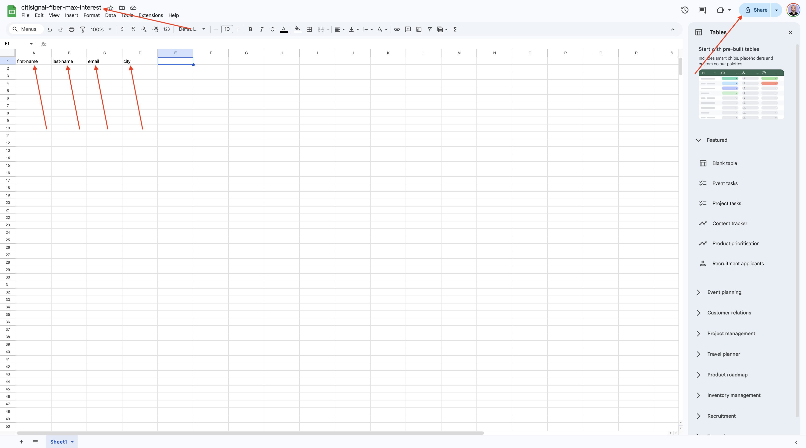

Condividi il file con **forms@adobe.com** con diritti di accesso di livello **Editor**.

Quindi fare clic su **Copia collegamento**.

Fai clic su **Invia**.

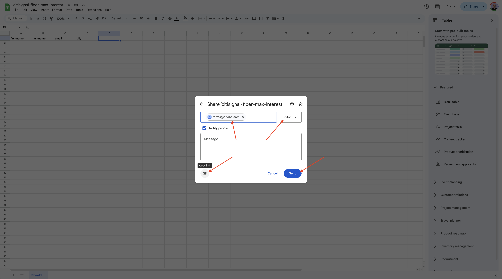

Nel passaggio successivo, dovrai utilizzare il collegamento copiato.

### Pulsante Invia

Per configurare il pulsante **Invia**, passa a **Struttura contenuto**, seleziona **Modulo adattivo**, fai clic sull&#39;icona **+**, quindi seleziona **Invia**.

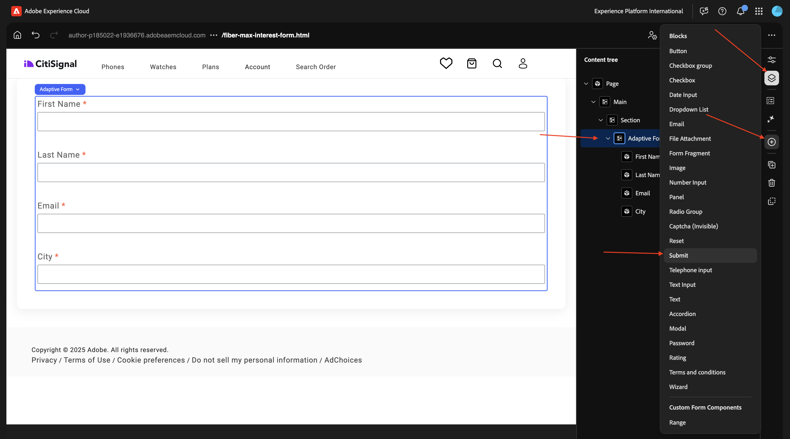

Dovresti vedere questo.

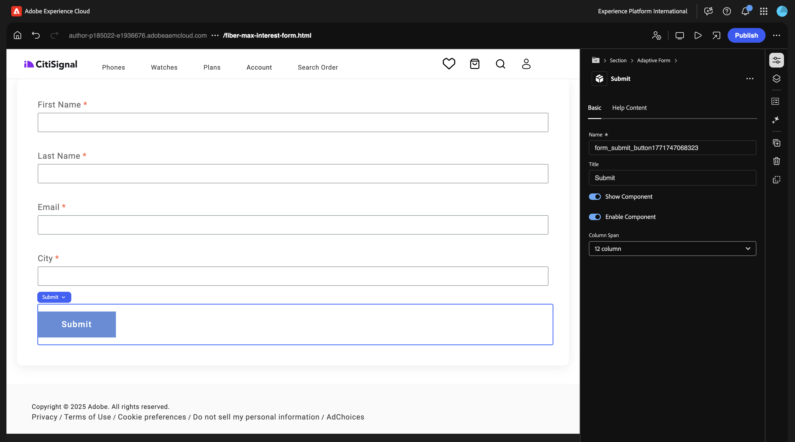

### Azione di invio

Le azioni di invio fanno parte di un’estensione per Universal Editor.

>[!NOTE]
>
>Se l&#39;icona **Modifica proprietà modulo** non è visibile, significa che l&#39;estensione non è ancora abilitata per l&#39;ambiente. Per abilitare questa estensione, vai a [https://experience.adobe.com/#/aem/extension-manager](https://experience.adobe.com/#/aem/extension-manager) e abilita l&#39;estensione **Modifica proprietà modulo**.
>
>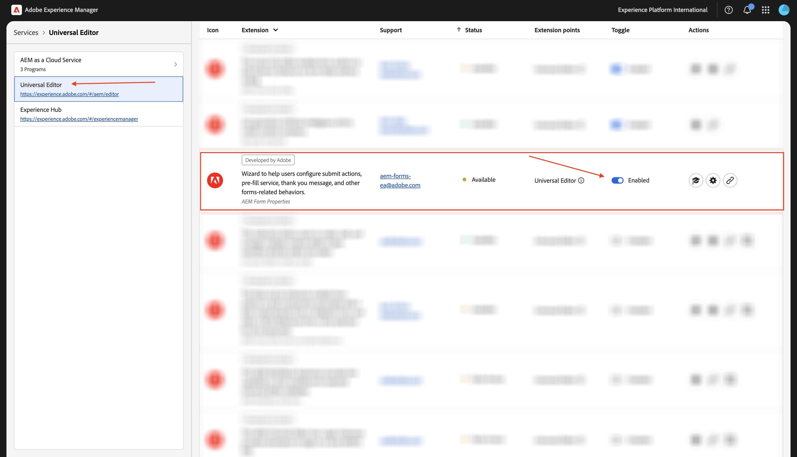

Fai clic sull&#39;icona **Modifica proprietà modulo**.

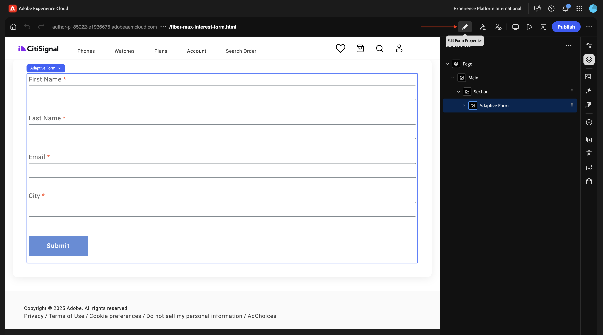

Selezionare **Invia a Spreadsheet**. Incolla l&#39;URL del foglio Google creato in precedenza.

Fai clic su **Salva e chiudi**.

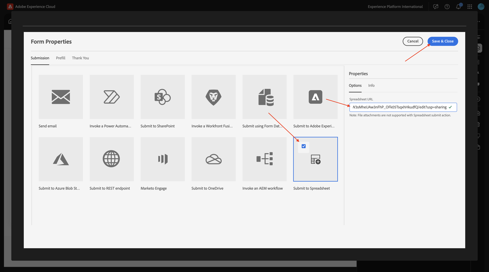

>[!NOTE]
>
>Se ricevi l’errore 401 - Non autorizzato, potrebbe essere. perché l’ambiente non è stato abilitato per l’utilizzo con i fogli di Google. Per abilitare il tuo ambiente, contatta il rappresentante Adobe.

Fai clic su **Pubblica**.

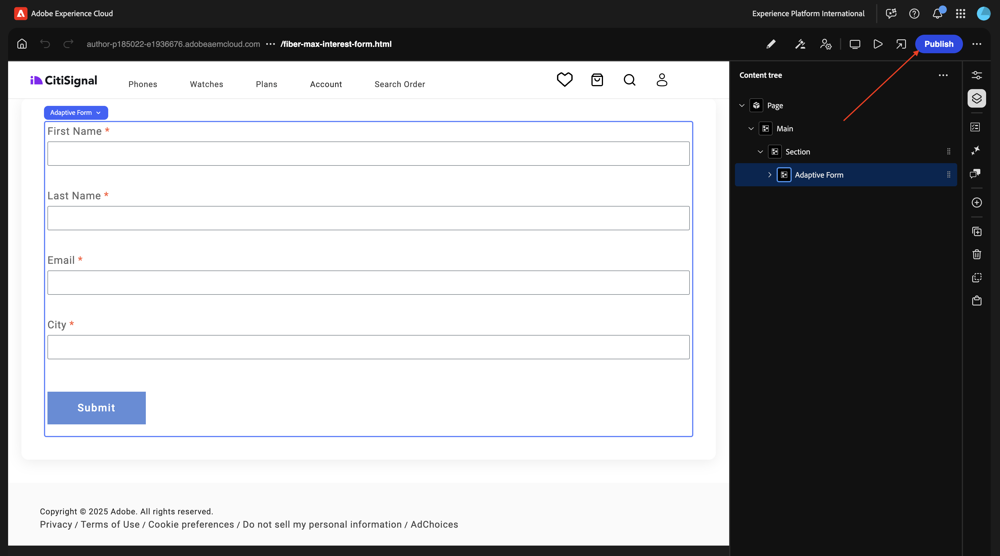

Fai di nuovo clic su **Pubblica**.

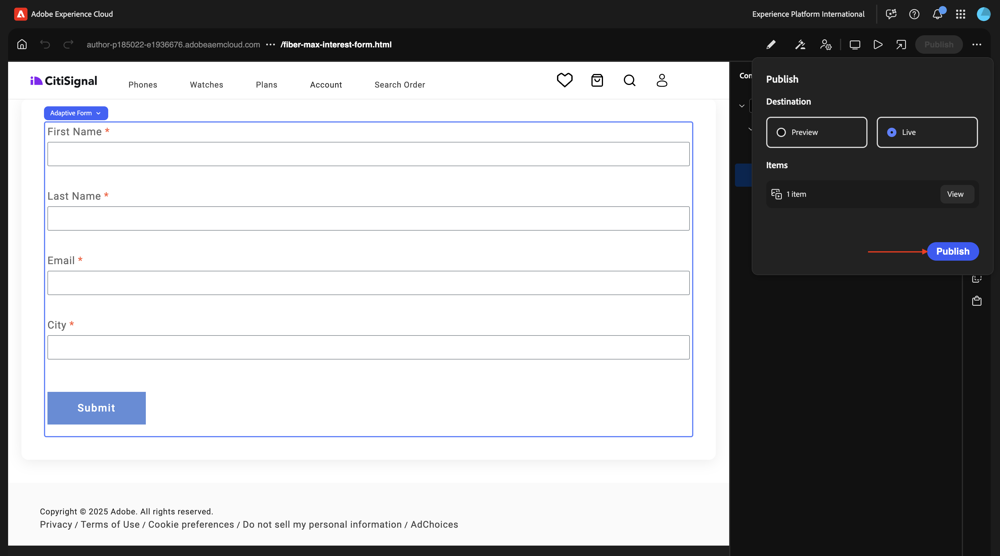

Puoi quindi aggiornare il tuo sito, compilare i moduli e fare clic su **Invia**.

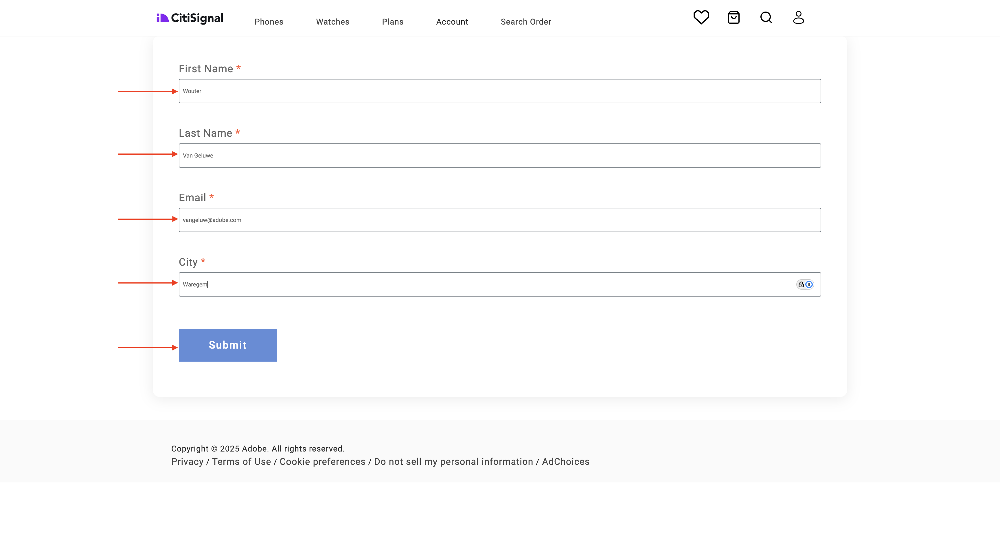

L’invio dovrebbe quindi avere esito positivo.

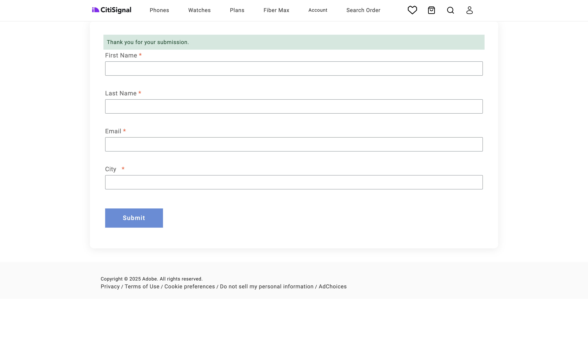

Se poi si dà un&#39;occhiata al foglio Google, si dovrebbe vedere l&#39;invio corretto anche lì.

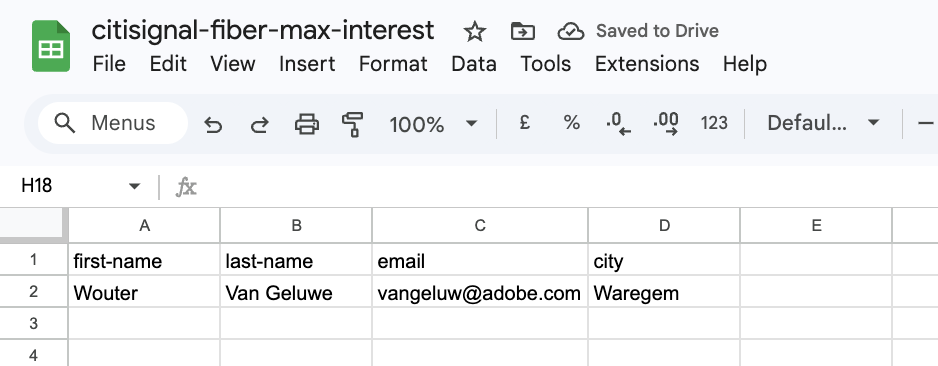

Hai completato correttamente questo esercizio.

## Passaggi successivi

Torna a [Adobe Experience Manager Forms con Edge Delivery Services](./aemforms.md){target="_blank"}

[Torna a tutti i moduli](./../../../overview.md){target="_blank"}
