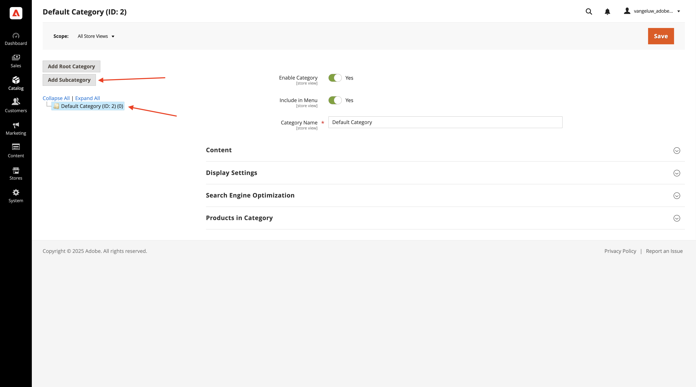
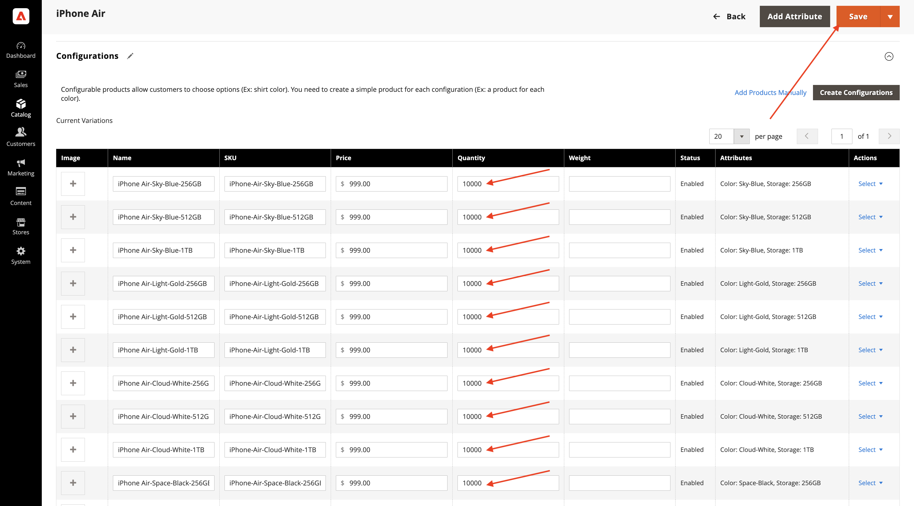

# 1.5.1 Guida introduttiva ad Adobe Commerce as a Cloud Service

Vai a [https://experience.adobe.com/](https://experience.adobe.com/){target="_blank"}. Assicurarsi di trovarsi nell&#39;ambiente corretto, che deve essere denominato `--aepImsOrgName--`. Fare clic su **Commerce**.

## 1.5.1.1 Crea la tua istanza ACS

Dovresti vedere questo. Fare clic su **+ Aggiungi istanza**.

Compila i campi in questo modo:

- **Nome istanza**: `--aepUserLdap-- - ACCS`
- **Ambiente**: `Sandbox`
- **Area**: `North America`

Fai clic su **Aggiungi istanza**.

Creazione dell’istanza in corso. Questa operazione può richiedere 5-10 minuti.

Quando l’istanza è pronta, fai clic sull’istanza per aprirla.

## 1.5.1.2 Imposta l&#39;archivio CitiSignal

Dovresti vedere questo. Fai clic su **Accedi con Adobe ID**, quindi accedi.

Dopo aver effettuato l’accesso, dovresti visualizzare questa pagina home. Il primo passo è configurare l&#39;archivio CitiSignal in Commerce. Fare clic su **Archivi**.

Fare clic su **Tutti gli archivi**.

Fai clic su **Crea sito Web**.

Compila i campi in questo modo:

- **Nome**: `CitiSignal`
- **Codice**: `citisignal`

Fare clic su **Salva sito Web**.

Allora dovresti tornare qui. Fai clic su **Crea archivio**.

Compila i campi in questo modo:

- **Sito Web**: `CitiSignal`
- **Nome**: `CitiSignal`
- **Codice**: `citisignal`
- **Categoria principale**: `Default Category`

Fai clic su **Salva archivio**.

Allora dovresti tornare qui. Fare clic su **Crea visualizzazione archivio**.

Compila i campi in questo modo:

- **Archivio**: `CitiSignal`
- **Nome**: `CitiSignal`
- **Codice**: `citisignal`
- **Stato**: `Enabled`

Fai clic su **Salva visualizzazione archivio**.

Dovresti visualizzare questo messaggio. Fai clic su **OK**.

Allora dovresti tornare qui. Fare clic sul sito Web **CitiSignal** per aprirlo.

Selezionare la casella di controllo per impostare il sito Web come sito Web predefinito.

Fare clic su **Salva sito Web**.

Allora dovresti tornare qui.

## 1.5.1.3 Configurare categorie e prodotti

Vai a **Catalogo** e seleziona **Categorie**.

Selezionare **Categoria predefinita**, quindi fare clic su **Aggiungi sottocategoria**.

Immettere il nome `Phones` e fare clic su **Salva**.

Selezionare **Categoria predefinita**, quindi fare di nuovo clic su **Aggiungi sottocategoria**.

Immettere il nome `Watches` e fare clic su **Salva**.

Dovresti quindi creare 2 categorie.

Quindi, passa a **Catalogo** e seleziona **Prodotti**.

Dovresti vedere questo. Fare clic su **Aggiungi prodotto**.

Configura il tuo prodotto in questo modo:

- **Nome prodotto**: `iPhone Air`
- **SKU**: `iPhone-Air`
- **Prezzo**: `999`
- **Quantità**: `10000`
- **Categorie**: selezionare `Phones`

Fai clic su **Salva**.

Scorri verso il basso fino a **Configurazioni** e fai clic su **Crea configurazioni**.

Dovresti vedere questo. Fare clic su **Crea nuovo attributo**.

Imposta **Etichetta predefinita** su `Storage`, quindi fai clic su **Aggiungi opzione** in **Gestisci opzioni**.

Configurare la prima opzione utilizzando il nome `256GB` in tutte e tre le colonne, quindi fare di nuovo clic su **Aggiungi opzione**.

Configurare la seconda opzione utilizzando il nome `512GB` in tutte e tre le colonne, quindi fare di nuovo clic su **Aggiungi opzione**.

Configurare la terza opzione utilizzando il nome `1TB` in tutte e 3 le colonne.

Scorri verso il basso fino a **Proprietà vetrina**. Imposta le seguenti opzioni su **Sì**:

- **Utilizzo nella ricerca**
- **Consenti tag HTML in Storefront**
- **Visibile nelle pagine del catalogo in Storefront**
- **Utilizzo nell&#39;elenco prodotti**

Scorri verso l&#39;alto e fai clic su **Salva attributo**.

Dovresti vedere questo. Selezionare entrambi gli attributi per **color** e **storage** e fare clic su **Next**.

Dovresti vedere questo. Ora devi aggiungere le opzioni di colore disponibili. A tale scopo, fare clic su **Crea nuovo valore**.

Immettere il valore `Sky-Blue` e fare clic su **Crea nuovo valore**.

Immettere il valore `Light-Gold` e fare clic su **Crea nuovo valore**.

Immettere il valore `Cloud-White` e fare clic su **Crea nuovo valore**.

Immettere il valore `Space-Black`. Fai clic su **Seleziona tutto**

Seleziona tutte e 3 le opzioni in **Archiviazione** e fai clic su **Avanti**.

Lascia le impostazioni predefinite e fai clic su **Avanti**.

Dovresti vedere questo. Fare clic su **Genera prodotti**.

Imposta la **quantità** di ciascun prodotto su `10000`. Fai clic su **Salva**.

Scorri verso il basso fino a **Prodotto nei siti Web** e seleziona la casella di controllo per **CitiSignal**.

Fai clic su **Salva**.

Fai clic su **Conferma**.

Dovresti vedere questo. Fai clic su **Indietro**.

Il prodotto **iPhone Air** e le relative varianti sono ora visualizzati nel catalogo prodotti.

Passaggio successivo: [Connetti ACS a AEM Sites CS/EDS Storefront](./ex2.md){target="_blank"}

Torna a [Adobe Commerce as a Cloud Service](./accs.md){target="_blank"}

[Torna a tutti i moduli](./../../../overview.md){target="_blank"}
