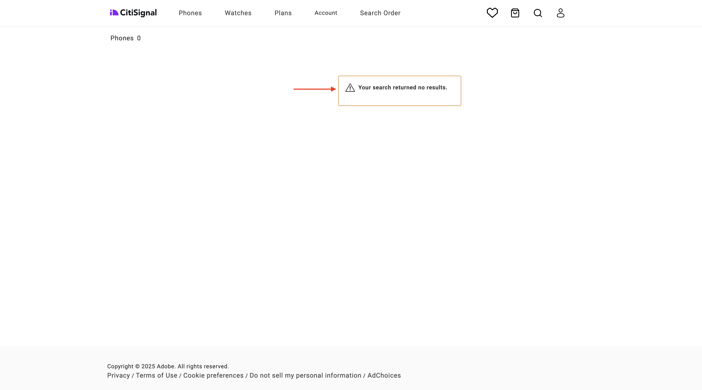
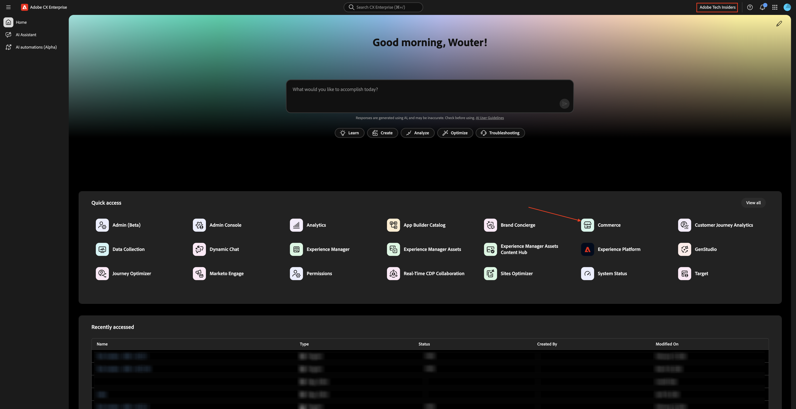
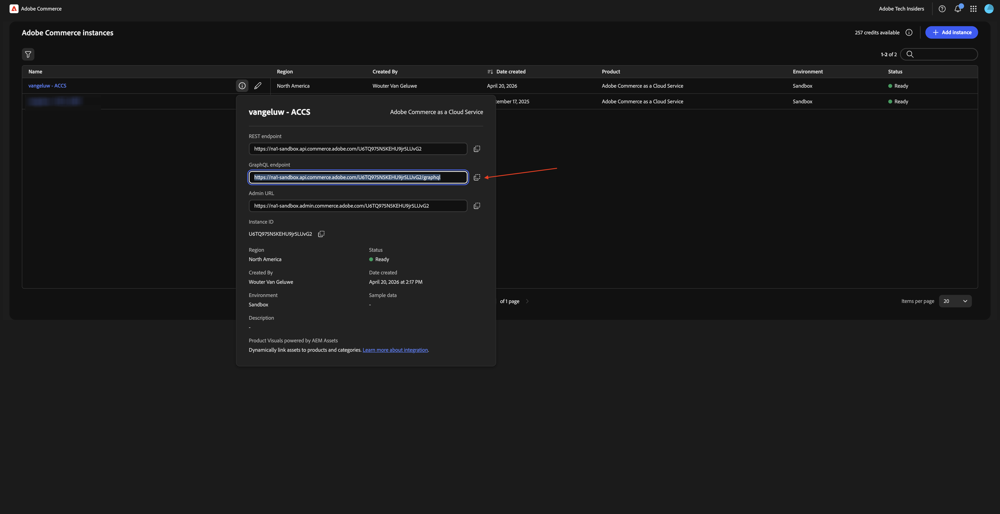
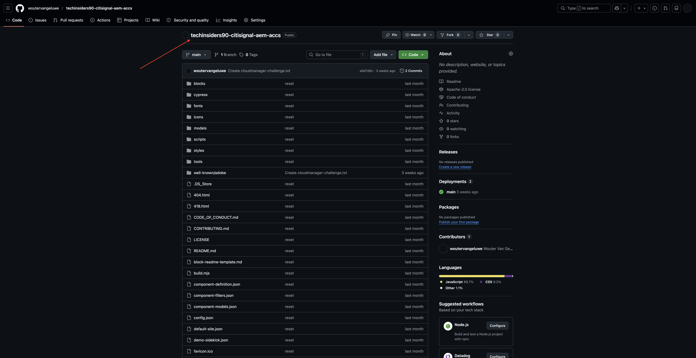
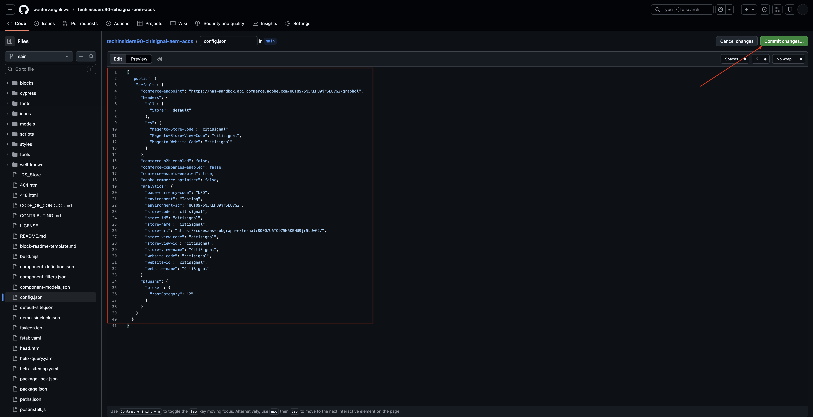
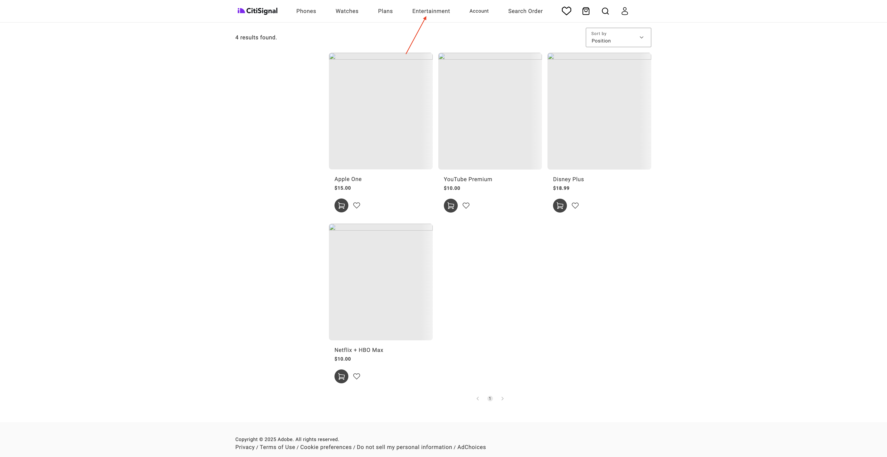

# 1.5.2 Collegamento di ACS ad AEM Sites CS/EDS Storefront

>[!IMPORTANT]
>
>Per completare questo esercizio, è necessario avere accesso a un ambiente AEM Sites e Assets CS funzionante con EDS.
>
>Se non si dispone ancora di un ambiente di questo tipo, passare all&#39;esercizio [Adobe Experience Manager Cloud Service &amp; Edge Delivery Services](./../../../modules/asset-mgmt/module2.1/aemcs.md){target="_blank"}. Segui le istruzioni e potrai accedere a tale ambiente.

>[!IMPORTANT]
>
>Se in precedenza hai configurato un programma AEM CS con un ambiente AEM Sites e Assets CS, è possibile che la sandbox AEM CS sia stata sospesa. Dato che la disattivazione di una sandbox di questo tipo richiede 10-15 minuti, sarebbe opportuno avviare subito il processo di disattivazione in modo da non doverlo attendere in un secondo momento.

In questo esercizio collegherai la vetrina AEM Sites CS/EDS al backend ACS. Al momento, quando apri la tua vetrina AEM Sites CS/EDS e vai alla pagina dell&#39;elenco dei prodotti **Phone**, non trovi ancora alcun prodotto.

Al termine di questo esercizio, i prodotti configurati nell&#39;esercizio precedente verranno visualizzati nella pagina dell&#39;elenco di prodotti **Telefoni/Orologi/Piani/Intrattenimento** dello Store AEM Sites CS/EDS.

Vai a [https://experience.adobe.com/](https://experience.adobe.com/){target="_blank"}. Assicurarsi di trovarsi nell&#39;ambiente corretto, che deve essere denominato `--aepImsOrgName--`. Fare clic su **Commerce**.

Fai clic sull&#39;icona **info** accanto all&#39;istanza ACS, che dovrebbe essere denominata `--aepUserLdap-- - ACCS`.

Dovresti vedere questo. Copia l&#39;**endpoint GraphQL**.

Vai a [https://da.live/app/adobe-commerce/storefront-tools/tools/config-generator/config-generator](https://da.live/app/adobe-commerce/storefront-tools/tools/config-generator/config-generator). Ora devi generare un file config.json che verrà utilizzato per collegare la vetrina AEM Sites CS al backend ACCS.

Nella pagina **Generatore di configurazioni**, incolla l&#39;**URL endpoint GraphQL** copiato.

Fai clic su **Genera**.

Fai clic su **Copia** per copiare il payload JSON completo.

Vai all’archivio GitHub creato durante la configurazione dell’ambiente AEM Sites CS/EDS. L&#39;archivio è stato creato nell&#39;esercizio [1.1.2 Configurare l&#39;ambiente AEM CS](./../../../modules/asset-mgmt/module2.1/ex3.md){target="_blank"} e deve essere denominato **citisignal-aem-accs** o **techinsidersodXX-citisignal-aem-accs** oppure, nel caso si partecipi a un corso di formazione live in-person, deve essere denominato **techinsidersXX-citisignal-aem-accs**.

Nella directory principale, scorrere verso il basso e fare clic per aprire il file **config.json**.

Fai clic sull&#39;icona **Modifica**.

Rimuovi tutto il testo corrente e sostituiscilo incollando il payload JSON copiato nella pagina **Generatore di configurazioni**.

Fare clic su **Commit changes...**.

Fai clic su **Commit changes**.

Il file **config.json** è stato aggiornato. Dovresti vedere le modifiche sul sito web entro un paio di minuti. Per verificare se le modifiche sono state selezionate correttamente, vai alla pagina del prodotto **Telefoni**. Dovresti vedere **iPhone Air** visualizzato nella pagina.

Apri il tuo sito web utilizzando gli URL **.page** o **.live**, quindi vai a **Telefoni**. Dovresti vedere questo.

Vai a **Orologi**. Dovresti vedere questo.

Vai a **Piani**. Dovresti vedere questo.

Vai a **Intrattenimento**. Dovresti vedere questo.

Anche se i prodotti sono ora visualizzati correttamente, non è ancora disponibile un’immagine per questi prodotti. Nel prossimo esercizio configurerai il collegamento con AEM Assets CS per le immagini del prodotto.

Passaggio successivo: [Connetti ACS ad AEM Assets CS](./ex3.md){target="_blank"}

Torna a [Adobe Commerce as a Cloud Service](./accs.md){target="_blank"}

[Torna a tutti i moduli](./../../../overview.md){target="_blank"}
