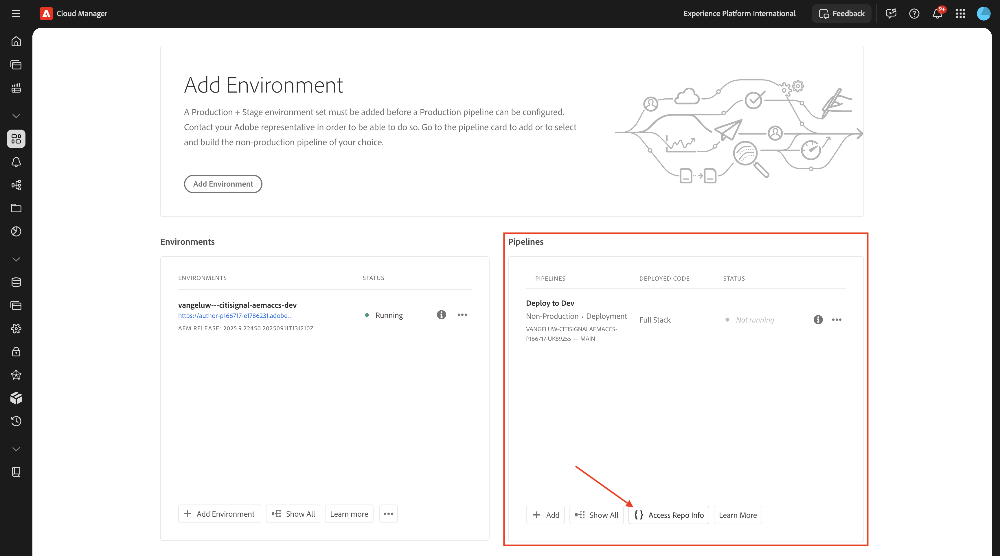
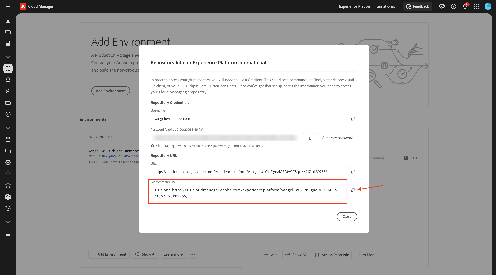
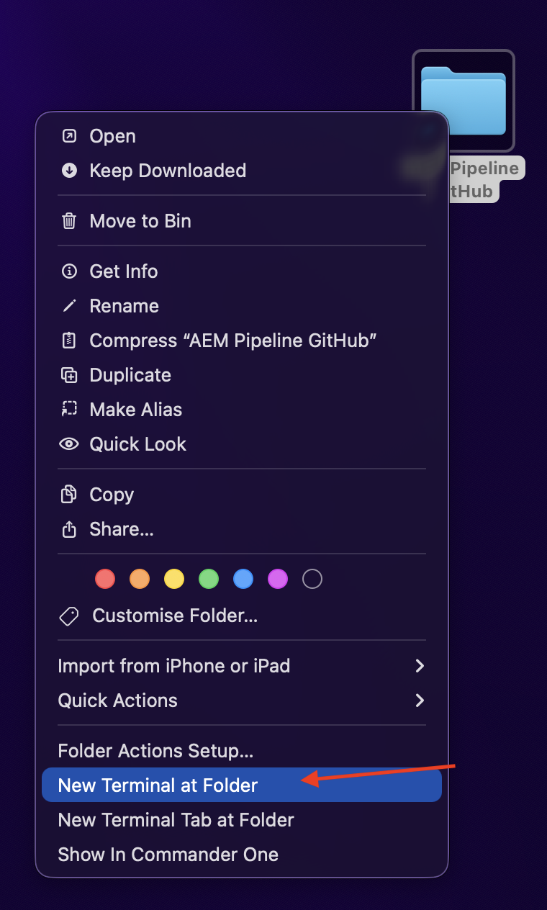
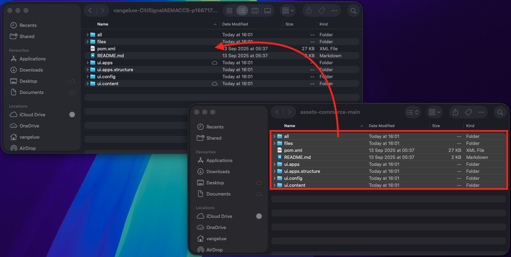
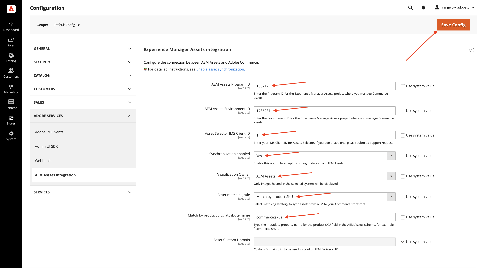
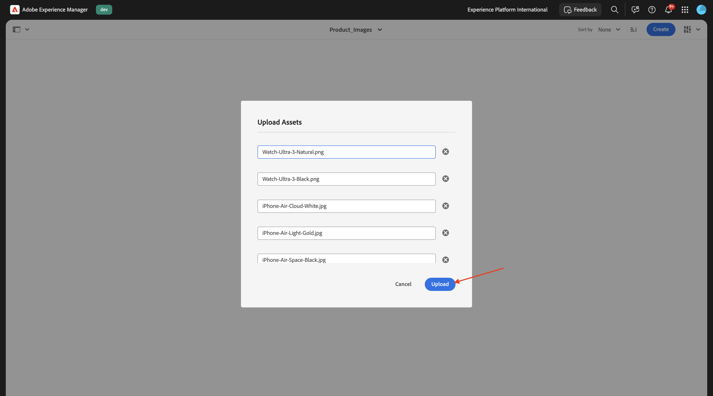

# 1.5.3 Collegare ACS ad AEM Assets CS

>[!IMPORTANT]
>
>Per completare questo esercizio, è necessario avere accesso a un ambiente AEM Sites e Assets CS funzionante con EDS.
>
>Se non si dispone ancora di un ambiente di questo tipo, passare all&#39;esercizio [Adobe Experience Manager Cloud Service &amp; Edge Delivery Services](./../../../modules/asset-mgmt/module2.1/aemcs.md){target="_blank"}. Segui le istruzioni e potrai accedere a tale ambiente.

>[!IMPORTANT]
>
>Se in precedenza hai configurato un programma AEM CS con un ambiente AEM Sites e Assets CS, è possibile che la sandbox AEM CS sia stata sospesa. Dato che la disattivazione di una sandbox di questo tipo richiede 10-15 minuti, sarebbe opportuno avviare subito il processo di disattivazione in modo da non doverlo attendere in un secondo momento.

Dopo aver completato l’esercizio precedente, è stato possibile vedere un prodotto restituito da ACCS al sito web, ma non disponeva ancora di un’immagine. Al termine di questo esercizio, dovresti vedere che viene restituita anche un’immagine.


## 1.5.3.1 Aggiorna configurazione pipeline

Vai a [https://my.cloudmanager.adobe.com](https://my.cloudmanager.adobe.com){target="_blank"}. L&#39;organizzazione da selezionare è `--aepImsOrgName--`.

Fare clic per aprire il programma Cloud Manager, che dovrebbe essere denominato `--aepUserLdap-- - CitiSignal AEM+ACCS`.


Scorrere verso il basso e quindi fare clic su **Accedi a dati archivio** nella scheda **Pipeline**.



Dovresti vedere questo. Fare clic su **Genera password**.


Fai di nuovo clic su **Genera password**.


Dovresti quindi disporre di una password. Fare clic sull&#39;icona **copia** accanto al campo **Riga di comando Git**.



Crea una nuova directory nel percorso desiderato sul computer e denominala **AEM Pipeline GitHub**.


Fare clic con il pulsante destro del mouse sulla cartella e selezionare **Nuovo terminale nella cartella**.



Dovresti vedere questo.


Incolla il comando **Git** copiato in precedenza nella finestra di Terminal.


Immettere un nome utente. Copia il nome utente dalla pipeline del programma Cloud Manager **Accedi a dati archivio** e premi **Invio**.


Quindi, devi immettere la password. Copia la password dalla pipeline del programma Cloud Manager **Accedi a dati archivio** e premi **Invio**.


Questo potrebbe richiedere un minuto. Una volta completato, avrai una copia locale dell’archivio Git collegata alla pipeline del programma.


Verrà visualizzata una nuova directory nella directory **GitHub della pipeline AEM**. Apri quella directory.


Selezionare tutti i file nella directory ed eliminarli tutti.


Assicurati che la directory sia vuota.


Vai a [https://github.com/ankumalh/assets-commerce](https://github.com/ankumalh/assets-commerce). Fai clic su **&lt;> Codice**, quindi seleziona **Scarica ZIP**. Scarica il file e rilascialo sul desktop.


Quindi, copia il file **assets-commerce-main.zip** sul desktop e decomprimi. Apri la cartella **assets-commerce-main**.


Copia tutti i file dalla directory **assets-commerce-main** nella directory vuota della directory dell&#39;archivio delle pipeline del programma.



Aprire quindi **Microsoft Visual Studio Code** e aprire la cartella contenente l&#39;archivio delle pipeline del programma in **Microsoft Visual Studio Code**.


Vai a **Cerca** nel menu a sinistra e cerca `<my-app>`. È necessario sostituire tutte le occorrenze di `<my-app>` con `--aepUserLdap--citisignalaemaccs`.

Fai clic sull&#39;icona **sostituisci tutto**.


Fare clic su **Sostituisci**.


I nuovi file sono ora pronti per essere caricati nuovamente nell’archivio Git collegato all’archivio delle pipeline del programma. Per farlo, apri la cartella **GitHub della pipeline AEM** e fai clic con il pulsante destro del mouse sulla cartella che contiene i nuovi file. Selezionare **Nuovo terminale nella cartella**.


Dovresti vedere questo. Incolla il comando `git add .` e premi **Invio**.


Dovresti vedere questo. Incolla il comando `git commit -m "add assets integration"` e premi **Invio**.


Dovresti vedere questo. Incolla il comando `git push origin main` e premi **Invio**.


Dovresti vedere questo. Le modifiche sono state distribuite nell’archivio Git della pipeline del programma.


Torna a Cloud Manager e fai clic su **Chiudi**.


Dopo aver apportato modifiche all&#39;archivio Git della pipeline, devi eseguire nuovamente la pipeline **Distribuisci su Dev**. Fare clic sui tre punti **...** e selezionare **Esegui**.


Fare clic su **Esegui**. L’esecuzione di una distribuzione della pipeline può richiedere 10-15 minuti. Prima di continuare, devi attendere il completamento della distribuzione della pipeline.


## 1.5.3.2 Abilitare l&#39;integrazione di AEM Assets in ACCS

Torna all’istanza ACS. Nel menu a sinistra, vai a **Archivi** e quindi seleziona **Configurazione**.


Scorri verso il basso nel menu fino a **ADOBE SERVICES**, quindi apri **AEM Assets Integration**. Dovresti vedere questo.


Compila le seguenti variabili:

- **ID programma AEM Assets**: puoi prendere l&#39;ID programma dall&#39;URL dell&#39;autore di AEM CS. In questo esempio, l&#39;ID del programma è `166717`.


- **ID ambiente AEM Assets**: puoi prendere l&#39;ID ambiente dall&#39;URL di authoring di AEM CS. In questo esempio, l&#39;ID ambiente è `1786231`.


- **ID client IMS selettore risorse**: impostato su `1`
- **Sincronizzazione abilitata**: impostata su `Yes`
- **Proprietario visualizzazione**: `AEM Assets`
- **Regola di corrispondenza risorse**: `Match by product SKU`
- **Corrispondenza per nome attributo SKU prodotto**: `commerce:skus`

Fai clic su **Salva configurazione**.



Dovresti vedere questo.


## 1.5.3.3 Aggiornamento config.json

Vai all’archivio GitHub creato durante la configurazione dell’ambiente AEM Sites CS/EDS. L&#39;archivio è stato creato nell&#39;esercizio [1.1.2 Configurare l&#39;ambiente AEM CS](./../../../modules/asset-mgmt/module2.1/ex3.md){target="_blank"} e deve essere denominato **citisignal-aem-accs**.

Nella directory principale, scorrere verso il basso e fare clic per aprire il file **config.json**. Fai clic sull&#39;icona **modifica** per apportare modifiche al file.


Aggiungere il frammento di codice seguente alla riga 5 `"commerce-endpoint": "https://na1-sandbox.api.commerce.adobe.com/XXX/graphql",`:

```json
 "commerce-assets-enabled": "true",
```

Fare clic su **Commit Changes...**.


Fai clic su **Commit Changes**.


La modifica è stata salvata e verrà pubblicata a breve. Potrebbero essere necessari un paio di minuti prima che la modifica sia visibile sulla vetrina.


## 1.5.3.4 Verifica campi Commerce in AEM Assets CS

Accedi all&#39;ambiente di authoring di AEM CS e passa a **Assets**.


Vai a **File**.


Apri la cartella **CitiSignal**.


Passa il puntatore del mouse su una risorsa e fai clic sull&#39;icona **info**.


Dovresti ora visualizzare una scheda **Commerce** contenente 2 nuovi attributi di metadati.


Il tuo ambiente AEM Assets CS ora supporta l’integrazione con Commerce. Ora puoi iniziare a caricare le immagini del prodotto.

## 1.5.3.4 Carica Assets prodotto e collega ai prodotti

[Scarica qui le immagini del prodotto](./images/Product_Images.zip). Una volta scaricati, esportare i file sul desktop.


Fai clic su **Crea**, quindi seleziona **Cartella**.


Immetti il valore **Product_Images** per i campi **Title** e **Name**. Fai clic su **Crea**.


Fai clic su per aprire la cartella appena creata.


Fai clic su **Crea**, quindi seleziona **File**.


Passa alla cartella **Product_Images** sul desktop, seleziona tutti i file e fai clic su **Apri**.


Fai clic su **Carica**.



Le immagini saranno quindi disponibili nella cartella. Passa il puntatore del mouse sul prodotto **iPhone-Air-Light-Gold.png** e fai clic sull&#39;icona **Proprietà**.


Scorri verso il basso e imposta il campo **Stato revisione** su **Approvato**. L’integrazione AEM Assets CS - ACCS funziona solo per le immagini approvate.


Scorri verso l&#39;alto, vai alla scheda **Commerce** e quindi fai clic su **Aggiungi** in **SKU prodotto**.


Aggiungi i seguenti SKU per questo prodotto:

| Chiave | Valore | Utilizzo |
|:-------------:| :---------------:| :---------------:| 
| `iPhone-Air-Light-Gold` | `1` | `thumbnail, image, swatch_image, small_image` |
| `iPhone-Air-Light-Gold-256GB` | `1` | `thumbnail, image, swatch_image, small_image` |
| `iPhone-Air-Light-Gold-512GB` | `1` | `thumbnail, image, swatch_image, small_image` |
| `iPhone-Air-Light-Gold-1TB` | `1` | `thumbnail, image, swatch_image, small_image` |

Dovresti avere questo. Fai clic su **Salva e chiudi**.


Passa il puntatore del mouse sul prodotto **iPhone-Air-Space-Black.png** e fai clic sull&#39;icona **Proprietà**.


Scorri verso il basso e imposta il campo **Stato revisione** su **Approvato**. L’integrazione AEM Assets CS - ACCS funziona solo per le immagini approvate.


Scorri verso l&#39;alto, vai alla scheda **Commerce** e quindi fai clic su **Aggiungi** in **SKU prodotto**.


Aggiungi i seguenti SKU per questo prodotto:

| Chiave | Valore | Utilizzo |
|:-------------:| :---------------:| :---------------:| 
| `iPhone-Air-Space-Black` | `1` | `thumbnail, image, swatch_image, small_image` |
| `iPhone-Air-Space-Black-256GB` | `1` | `thumbnail, image, swatch_image, small_image` |
| `iPhone-Air-Space-Black-512GB` | `1` | `thumbnail, image, swatch_image, small_image` |
| `iPhone-Air-Space-Black-1TB` | `1` | `thumbnail, image, swatch_image, small_image` |
| `iPhone-Air` | `1` | `thumbnail, image, swatch_image, small_image` |

Dovresti avere questo. Fai clic su **Salva e chiudi**.


Passa il puntatore del mouse sul prodotto **iPhone-Air-Sky-Blue.png** e fai clic sull&#39;icona **Proprietà**.


Scorri verso il basso e imposta il campo **Stato revisione** su **Approvato**. L’integrazione AEM Assets CS - ACCS funziona solo per le immagini approvate.


Scorri verso l&#39;alto, vai alla scheda **Commerce** e quindi fai clic su **Aggiungi** in **SKU prodotto**.


Aggiungi i seguenti SKU per questo prodotto:

| Chiave | Valore | Utilizzo |
|:-------------:| :---------------:| :---------------:| 
| `iPhone-Air-Sky-Blue` | `1` | `thumbnail, image, swatch_image, small_image` |
| `iPhone-Air-Sky-Blue-256GB` | `1` | `thumbnail, image, swatch_image, small_image` |
| `iPhone-Air-Sky-Blue-512GB` | `1` | `thumbnail, image, swatch_image, small_image` |
| `iPhone-Air-Sky-Blue-1TB` | `1` | `thumbnail, image, swatch_image, small_image` |

Dovresti avere questo. Fai clic su **Salva e chiudi**.


Passa il puntatore del mouse sul prodotto **iPhone-Air-Cloud-White.png** e fai clic sull&#39;icona **Proprietà**.


Scorri verso il basso e imposta il campo **Stato revisione** su **Approvato**. L’integrazione AEM Assets CS - ACCS funziona solo per le immagini approvate.


Scorri verso l&#39;alto, vai alla scheda **Commerce** e quindi fai clic su **Aggiungi** in **SKU prodotto**.


Aggiungi i seguenti SKU per questo prodotto:

| Chiave | Valore | Utilizzo |
|:-------------:| :---------------:| :---------------:| 
| `iPhone-Air-Cloud-White` | `1` | `thumbnail, image, swatch_image, small_image` |
| `iPhone-Air-Cloud-White-256GB` | `1` | `thumbnail, image, swatch_image, small_image` |
| `iPhone-Air-Cloud-White-512GB` | `1` | `thumbnail, image, swatch_image, small_image` |
| `iPhone-Air-Cloud-White-1TB` | `1` | `thumbnail, image, swatch_image, small_image` |

Dovresti avere questo. Fai clic su **Salva e chiudi**.


Ogni immagine di **iPhone Air** deve ora avere un pollice **verde in su**, che indica che la risorsa è stata approvata.


## 1.5.3.5 Verifica immagini prodotto in AEM Sites CS/EDS Storefront

>[!NOTE]
>
>Potrebbero essere necessari fino a 15 minuti prima che le modifiche apportate in precedenza vengano distribuite correttamente. Se l&#39;immagine non viene ancora visualizzata, attendere 15 minuti e riprovare.

Per verificare che l’integrazione funzioni, devi aprire il sito web di CitiSignal.

Per accedere al tuo sito web, vai a `main--citisignal-aem-accs--XXX.aem.page` e/o `main--citisignal-aem-accs--XXX.aem.live`, dopo aver sostituito XXX con il tuo account utente GitHub, che in questo esempio è `woutervangeluwe`.

In questo esempio, l’URL completo diventa:
`https://main--citisignal-aem-accs--woutervangeluwe.aem.page` e/o `https://main--citisignal-aem-accs--woutervangeluwe.aem.live`.

Dovresti vedere questo. Vai a **Telefoni**.


Dovresti quindi visualizzare un&#39;immagine del prodotto per **iPhone Air**. Fai clic su **iPhone Air**.


Dovresti vedere questo. Apporta una modifica alle opzioni di colore e archiviazione e vedrai le immagini cambiare dinamicamente in base alle scelte effettuate.


Di seguito è riportato un esempio di modifica del colore in **Light-Gold** e della dimensione di archiviazione in **256GB**.


Passaggio successivo: [Riepilogo e vantaggi](./summary.md){target="_blank"}

Torna a [Adobe Commerce as a Cloud Service](./accs.md){target="_blank"}

[Torna a tutti i moduli](./../../../overview.md){target="_blank"}
