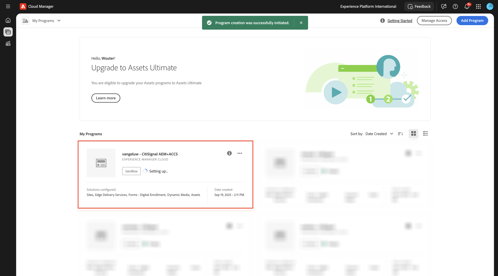
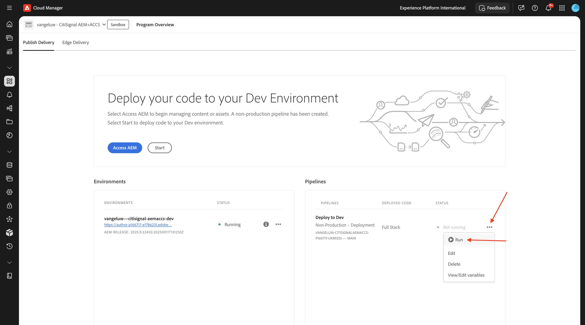

# 1.1.1 Creare un programma Cloud Manager

Vai a [https://my.cloudmanager.adobe.com](https://my.cloudmanager.adobe.com){target="_blank"}. L&#39;organizzazione da selezionare è `--aepImsOrgName--`. Poi vedrai qualcosa del genere. Fai clic su **Aggiungi programma**.

Per il **nome programma**, utilizzare `--aepUserLdap-- - CitiSignal`. Seleziona l&#39;opzione **Configura una sandbox**. Fai clic su **Continua**.

Accertati che siano selezionate le seguenti opzioni:

- Siti
- Forms
- Risorse

Fare clic sulla freccia per **Assets** per aprire l&#39;elenco delle opzioni.

Accertati che siano selezionate le seguenti opzioni:

- Content Hub

Scorri verso il basso nell’elenco.

Accertati che siano selezionate le seguenti opzioni:

- Edge Delivery Services
- Contenuti multimediali dinamici

Fai clic su **Crea**.

La creazione dell’ambiente richiede un po’ di tempo, 10-20 minuti.

Mentre attendi, puoi già iniziare con l&#39;esercizio [1.1.2 Crea il tuo sito Web basato su documenti](./ex2.md){target="_blank"}.

Una volta creati gli ambienti e pronti per l’uso, riceverai una conferma e-mail dopo la quale potrai tornare qui.

Dopo aver ricevuto la conferma e-mail, torna a [https://my.cloudmanager.adobe.com](https://my.cloudmanager.adobe.com){target="_blank"}. Lo stato del programma è cambiato in **Pronto**. Fai clic sul programma per aprirlo.

Osserva la scheda **Pipeline**. Fare clic sui tre punti **...** e quindi su **Esegui**.

Fare clic su **Esegui**.

Fare clic sui tre punti **...** nella scheda **Ambienti** e quindi su **Visualizza dettagli**.

Potrai quindi visualizzare i dettagli dell&#39;ambiente, incluso l&#39;URL dell&#39;ambiente **Author**, che ti serviranno nel prossimo esercizio.

Al termine dell’esecuzione della pipeline, puoi continuare con l’esercizio successivo.

Passaggio successivo: [1.1.2 Creare il sito Web basato su documenti](./ex2.md){target="_blank"}

Torna a [Adobe Experience Manager Cloud Service e Edge Delivery Services](./aemcs.md){target="_blank"}

[Torna a tutti i moduli](./../../../overview.md){target="_blank"}
