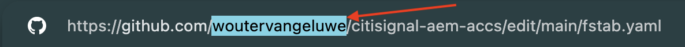
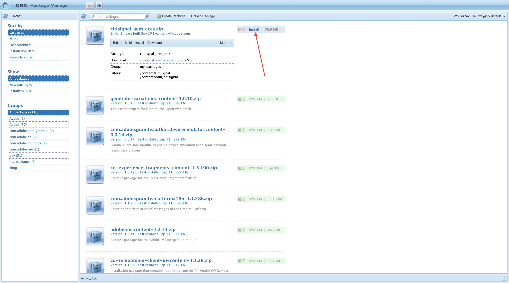
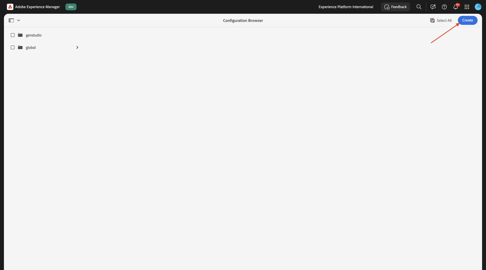
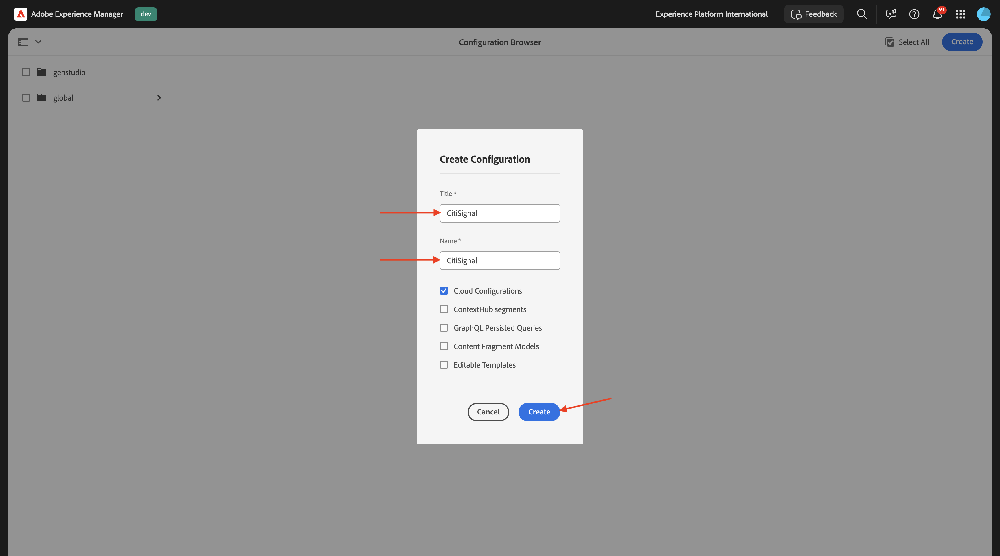
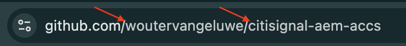
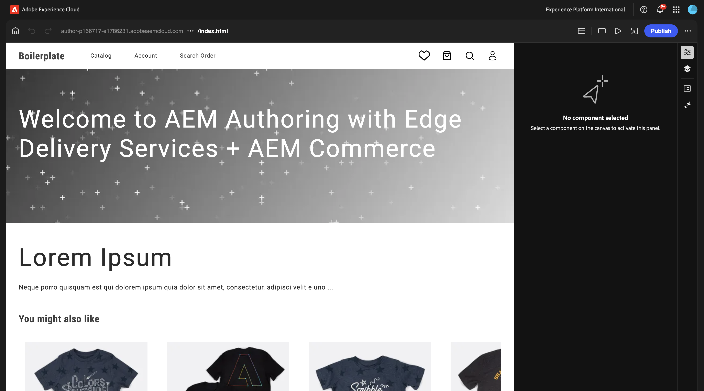
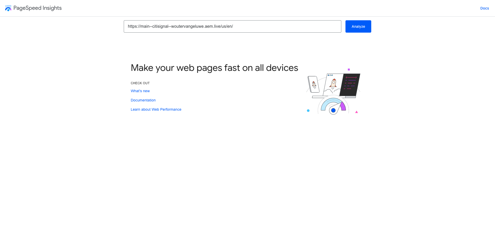

# 1.1.2 Configurare l’ambiente AEM CS

## 1.1.2.1 Configurare l&#39;archivio GitHub

Vai a [https://github.com](https://github.com){target="_blank"}. Fai clic su **Accedi**.

Immettere le credenziali. Fai clic su **Accedi**.

Una volta effettuato l’accesso, verrà visualizzata la dashboard di GitHub.

Vai a [https://github.com/adobe-rnd/aem-boilerplate-xcom](https://github.com/adobe-rnd/aem-boilerplate-xcom){target="_blank"}. Poi vedrai questo. Fare clic su **Usa questo modello** e quindi su **Crea nuovo repository**.

Per il **nome archivio**, utilizzare `citisignal-aem-accs`. Imposta la visibilità su **Privato**. Fare clic su **Crea repository**.

Dopo un paio di secondi, potrai creare l’archivio.

Quindi, vai a [https://github.com/apps/aem-code-sync](https://github.com/apps/aem-code-sync){target="_blank"}. Fare clic su **Installa** o **Configura**.

Fai clic sul pulsante **Continua** accanto al tuo account utente GitHub.

Fai clic su **Configura** accanto al tuo account utente GitHub.

Fai clic su **Seleziona solo archivi** e quindi aggiungi l&#39;archivio appena creato.

Scorri verso il basso e fai clic su **Salva**.

Riceverai questa conferma.

## 1.1.2.2 Aggiorna file fstab.yaml

Nel repository GitHub, fare clic per aprire il file `fstab.yaml`.

Fai clic sull&#39;icona **modifica**.

È ora necessario aggiornare il valore per il campo **url** nella riga 3.

È necessario sostituire il valore corrente con l’URL dell’ambiente AEM Sites CS specifico in combinazione con le impostazioni dell’archivio GitHub.

Valore corrente dell&#39;URL: `https://author-p130360-e1272151.adobeaemcloud.com/bin/franklin.delivery/adobe-rnd/aem-boilerplate-xcom/main`.

È necessario aggiornare 3 parti dell’URL

`https://XXX/bin/franklin.delivery/YYY/ZZZ/main`

XXX deve essere sostituito dall’URL dell’ambiente AEM CS Author.

YYY deve essere sostituito dall’account utente GitHub.

ZZZ deve essere sostituito dal nome dell’archivio GitHub utilizzato nell’esercizio precedente.

Per trovare l&#39;URL dell&#39;ambiente di authoring AEM CS, vai a [https://my.cloudmanager.adobe.com](https://my.cloudmanager.adobe.com){target="_blank"}. Fai clic sul **Programma** per aprirlo.

Fare clic sui tre punti **...** nella scheda **Ambienti** e quindi su **Visualizza dettagli**.

Visualizzerai quindi i dettagli dell&#39;ambiente, incluso l&#39;URL dell&#39;ambiente **Author**. Copia l’URL.

XXX = `author-p166717-e1786231.adobeaemcloud.com`

Per il nome dell’account utente GitHub, puoi trovarlo facilmente nell’URL del browser. In questo esempio, il nome dell&#39;account utente è `woutervangeluwe`.

AAAA = `woutervangeluwe`

Per il nome dell’archivio GitHub, puoi trovarlo anche nella finestra del browser che hai aperto in GitHub. In questo caso, il nome dell&#39;archivio è `citisignal`.

ZZZ = `citisignal-aem-accs`

Questi 3 valori combinati generano questo nuovo URL che deve essere configurato nel file `fstab.yaml`.

`https://author-p166717-e1786231.adobeaemcloud.com/bin/franklin.delivery/woutervangeluwe/citisignal-aem-accs/main`

Fare clic su **Commit changes...**.

Fai clic su **Commit changes**.

Il file `fstab.yaml` è stato aggiornato.

## 1.1.2.3 Carica risorse e sito CitiSignal

Vai a [https://my.cloudmanager.adobe.com](https://my.cloudmanager.adobe.com){target="_blank"}. Fai clic sul **Programma** per aprirlo.

Quindi, fai clic sull’URL dell’ambiente di authoring.

Fai clic su **Accedi con Adobe**.

Viene quindi visualizzato l’ambiente di authoring.

L&#39;URL sarà simile al seguente: `https://author-p166717-e1786231.adobeaemcloud.com/ui#/aem/aem/start.html?appId=aemshell`

È ora necessario accedere all&#39;ambiente **Gestione pacchetti CRX** di AEM. Per eseguire questa operazione, rimuovere `ui#/aem/aem/start.html?appId=aemshell` dall&#39;URL e sostituirlo con `crx/packmgr`, il che significa che l&#39;URL dovrebbe avere un aspetto simile al seguente:
`https://author-p166717-e1786231.adobeaemcloud.com/crx/packmgr`.
Premi **Invio** per caricare l&#39;ambiente di gestione dei pacchetti

Fare clic su **Carica pacchetto**.

Fai clic su **Sfoglia** per individuare il pacchetto da caricare.

Il pacchetto da caricare si chiama **citisignal-assets.zip** e può essere scaricato qui: [https://one-adobe-tech-insiders.s3.us-west-2.amazonaws.com/one-adobe/citisignal_aem_accs.zip](https://one-adobe-tech-insiders.s3.us-west-2.amazonaws.com/one-adobe/citisignal_aem_accs.zip){target="_blank"}.

Selezionare il pacchetto `citisignal_aem_accs.zip` e fare clic su **Apri**.

Fare clic su **OK**.

Il pacchetto verrà quindi caricato. Fai clic su **Installa** nel pacchetto appena caricato.

Fare clic su **Installa**.

Dopo un paio di minuti, il pacchetto verrà installato.

È ora possibile chiudere questa finestra.

## 1.1.2.4 risorse CitiSignal di pubblicazione

Vai a [https://my.cloudmanager.adobe.com](https://my.cloudmanager.adobe.com){target="_blank"}. Fai clic sul **Programma** per aprirlo.

Quindi, fai clic sull’URL dell’ambiente di authoring.

Fai clic su **Accedi con Adobe**.

Viene quindi visualizzato l’ambiente di authoring. Fare clic su **Assets**.

Fare clic su **File**.

Fare clic per selezionare la cartella **CitiSignal** e quindi fare clic su **Gestisci pubblicazione**.

Fai clic su **Avanti**.

Fai clic su **Pubblica**.

Le risorse sono state pubblicate.

## Sito Web CitiSignal di pubblicazione 1.1.2.5

Fai clic sul nome del prodotto **Adobe Experience Manager** nell&#39;angolo superiore sinistro dello schermo, quindi fai clic sulla **freccia** accanto a **Assets**.

Fare clic su **Sites**.

Dovresti quindi visualizzare il sito Web **CitiSignal** creato dopo l&#39;installazione del pacchetto precedente.

Per collegare il sito all&#39;archivio GitHub creato in precedenza, è necessario creare una **configurazione Edge Delivery Services**.

Il primo passaggio consiste nel creare una **configurazione cloud**.

A tale scopo, fai clic sul nome del prodotto **Adobe Experience Manager** nell&#39;angolo superiore sinistro dello schermo, quindi fai clic sull&#39;icona **strumenti** e seleziona **Generale**. Fare clic per aprire **Browser configurazioni**.

Dovresti vedere questo. Fai clic su **Crea**

Imposta i campi **Titolo** e **Nome** su `CitiSignal`. Abilita la casella di controllo per **Configurazioni cloud**.

Fai clic su **Crea**.

Dovresti avere questo.

Successivamente, devi aggiornare alcuni campi della **configurazione cloud** appena creata.

A tale scopo, fai clic sul nome del prodotto **Adobe Experience Manager** nell&#39;angolo in alto a sinistra dello schermo, quindi fai clic sull&#39;icona **strumenti** e seleziona **Servizi cloud**. Fare clic per aprire **Configurazione Edge Delivery Services**.

Seleziona **CitiSignal**, fai clic su **Crea** e seleziona **Configurazione**.

È ora necessario compilare i campi **Organizzazione** e **Nome sito**. Per farlo, controlla innanzitutto l’URL dell’archivio GitHub.

- **Organizzazione**: utilizza il nome dell&#39;organizzazione GitHub; in questo esempio è `woutervangeluwe`
- **Nome sito**: utilizzare il nome dell&#39;archivio GitHub, che deve essere `citisignal-aem-accs`.

Fai clic su **Salva e chiudi**.

Dovresti avere questo. Abilita la casella di controllo davanti alla configurazione cloud di Edge appena creata e fai clic su **Pubblica**.

## 1.1.2.6 Aggiorna percorsi file.json

Nel repository GitHub, fare clic per aprire il file `paths.json`.

Fai clic sull&#39;icona **modifica**.

È ora necessario aggiornare il testo sostitutivo `aem-boilerplate-commerce` con `CitiSignal` nelle righe 3, 4, 5, 6, 7 e 10.

Fai clic su **Commit Changes**.

Fai clic su **Commit Changes**.

Il file `paths.json` è stato aggiornato.

## Sito Web CitiSignal di pubblicazione 1.1.2.7

Fai clic sul nome del prodotto **Adobe Experience Manager** nell&#39;angolo superiore sinistro dello schermo, quindi seleziona **Sites**.

Fare clic sulla casella di controllo davanti a **CitiSignal**. Quindi fare clic su **Gestisci pubblicazione**.

Fai clic su **Avanti**.

Fare clic su **Includi impostazioni figlio**.

Fare clic per selezionare la casella di controllo **Includi elementi figlio** e quindi fare clic per deselezionare le altre caselle di controllo. Fai clic su **OK**.

Fai clic su **Pubblica**.

Allora verrai rimandato qui. Fai clic su **CitiSignal**, seleziona la casella di controllo davanti a **index**, quindi fai clic su **Modifica**.

Il sito Web verrà quindi aperto in **Universal Editor**.

Ora potrai accedere al tuo sito web da `main--citisignal-aem-accs--XXX.aem.page` e/o `main--citisignal-aem-accs--XXX.aem.live`, dopo aver sostituito XXX con il tuo account utente GitHub, che in questo esempio è `woutervangeluwe`.

In questo esempio, l’URL completo diventa:
`https://main--citisignal-aem-accs--woutervangeluwe.aem.page` e/o `https://main--citisignal-aem-accs--woutervangeluwe.aem.live`.

Potrebbero essere necessari alcuni minuti prima che tutte le risorse vengano visualizzate correttamente, in quanto devono essere pubblicate prima.

A questo punto viene visualizzato quanto segue:

## Prestazioni pagina di prova 1.1.2.8

Vai a [https://pagespeed.web.dev/](https://pagespeed.web.dev/){target="_blank"}. Immetti l&#39;URL e fai clic su **Analizza**.

Vedrai quindi che il tuo sito web, sia nella visualizzazione per dispositivi mobili che in quella desktop, ottiene un punteggio alto:

**Dispositivi mobili**:

**Desktop**:

Passaggio successivo: [sviluppare un blocco personalizzato](./ex3.md){target="_blank"}

Torna a [Adobe Experience Manager Cloud Service e Edge Delivery Services](./aemcs.md){target="_blank"}

[Torna a tutti i moduli](./../../../overview.md){target="_blank"}
