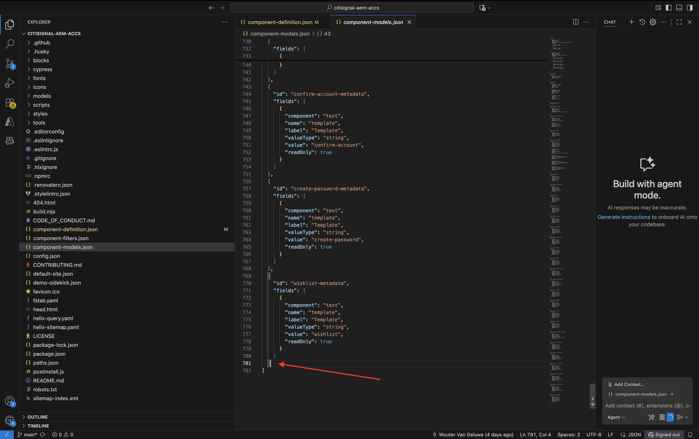
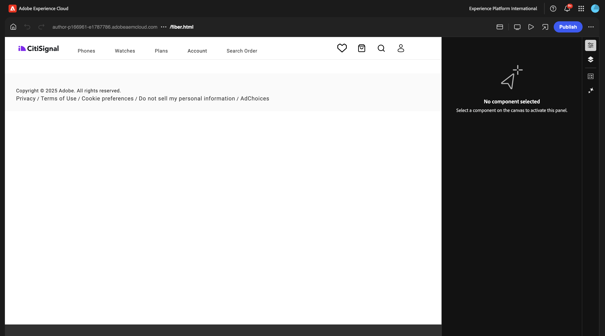
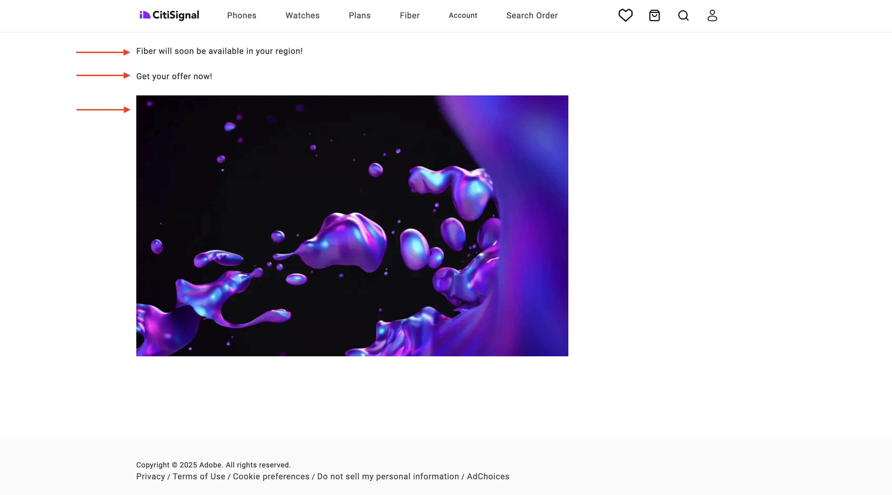

# 1.1.3 Sviluppare un blocco personalizzato di base

## 1.1.3.1 Imposta l&#39;ambiente di sviluppo locale

Vai a [https://desktop.github.com/download/](https://desktop.github.com/download/){target="_blank"}, scarica e installa **Github Desktop**.


Una volta installato Github Desktop, vai all’archivio GitHub creato nell’esercizio precedente. Fare clic su **&lt;> Codice** e quindi su **Apri con GitHub Desktop**.


L’archivio GitHub verrà quindi aperto in GitHub Desktop. Puoi cambiare il **percorso locale**. Fare clic su **Clona**.


Verrà ora creata una cartella locale.


Aprire Visual Studio Code. Vai a **File** > **Apri cartella**.


Seleziona la cartella utilizzata dalla configurazione GitHub per **citisignal-aem-accs**.


La cartella verrà aperta in Visual Studio Code e sarà possibile creare un nuovo blocco.


## 1.1.3.2 Crea un blocco personalizzato di base

Adobe consiglia di sviluppare blocchi in un approccio in tre fasi:

- Crea la definizione e il modello per il blocco, rivedilo e portalo in produzione.
- Crea contenuto con il nuovo blocco.
- Implementa la decorazione e gli stili per il nuovo blocco.

### component-definition.json

In Visual Studio Code aprire il file **component-definition.json**.


Scorri verso il basso fino a visualizzare i **blocchi**. Imposta il cursore sotto la parentesi quadra di chiusura del componente **Schede**


Incolla questo codice e immetti una virgola **,** dopo il blocco di codice:

```json
{
  "title": "FiberOffer",
  "id": "fiberoffer",
  "plugins": {
    "xwalk": {
      "page": {
        "resourceType": "core/franklin/components/block/v1/block",
        "template": {
          "name": "FiberOffer",
          "model": "fiberoffer",
          "offerText": "<p>Fiber will soon be available in your region!</p>",
          "offerCallToAction": "Get your offer now!",
          "offerImage": ""
        }
      }
    }
  }
}
```

Salva le modifiche.


### component-models.json

In Visual Studio Code aprire il file **component-models.json**.


Scorri verso il basso fino a visualizzare l’ultimo elemento. Impostare il cursore accanto alla parentesi quadra di chiusura dell&#39;ultimo componente.



Inserisci una virgola **,**, quindi premi Invio e, alla riga successiva, incolla questo codice:

```json
{
  "id": "fiberoffer",
  "fields": [
     {
       "component": "richtext",
       "name": "offerText",
       "value": "",
       "label": "Offer Text",
       "valueType": "string"
     },
     {
       "component": "richtext",
       "valueType": "string",
       "name": "offerCallToAction",
       "label": "Offer CTA",
       "value": ""
     },
     {
       "component": "reference",
       "valueType": "string",
       "name": "offerImage",
       "label": "Offer Image",
        "multi": false
     }
   ]
}
```

Salva le modifiche.


### component-filters.json

In Visual Studio Code aprire il file **component-filters.json**.


In **sezione**, inserisci una virgola `,` e incolla l&#39;ID del componente `"fiberoffer"` dopo l&#39;ultima riga corrente.

Salva le modifiche.


## 1.1.3.3 Eseguire il commit delle modifiche

Hai ora apportato diverse modifiche al progetto che devono essere salvate nell’archivio GitHub. Per farlo, apri **GitHub Desktop**.

Dovresti quindi visualizzare i 3 file appena modificati in **Modifiche**. Rivedi le modifiche.


Immettere un nome per la PR, `Fiber Offer custom block`. Fare clic su **Commit to main**.


Dovresti vedere questo. Fare clic su **Origine push**.


Dopo un paio di secondi, le modifiche sono state inviate all’archivio GitHub.


Nel browser, vai all’account GitHub e all’archivio creato per CitiSignal. Dovresti quindi vedere qualcosa di simile, che mostra che le modifiche sono state ricevute.


## 1.1.3.4 Aggiungi il blocco a una pagina

Ora che il blocco delle virgolette di base è definito e confermato nel progetto CitiSignal, puoi aggiungere un blocco **fiberoffer** a una pagina esistente.

Vai a [https://my.cloudmanager.adobe.com](https://my.cloudmanager.adobe.com){target="_blank"}. Fai clic sul **Programma** per aprirlo.


Fare clic sui tre punti **...** nella scheda **Ambienti** e quindi su **Visualizza dettagli**.


Visualizzerai quindi i dettagli dell’ambiente. Fai clic sull&#39;URL dell&#39;ambiente **Author**.

>[!NOTE]
>
>È possibile che l’ambiente sia ibernato. In questo caso, devi prima riattivare l’ambiente. Nel video seguente trovi le istruzioni per riattivare la funzione.

>[!VIDEO](https://video.tv.adobe.com/v/3478141?quality=12&learn=on)


Dovresti quindi visualizzare l’ambiente AEM Author. Vai a **Sites**.


Vai a **CitiSignal**. Fai clic su **Crea** e seleziona **Pagina**.


Seleziona **Pagina** e fai clic su **Avanti**.


Immetti i seguenti valori:

- Titolo: **Fibra**
- Nome: **fibra**
- Titolo pagina: **Fibra**

Fai clic su **Crea**.


Seleziona **Apri**.


Dovresti vedere questo.



Fare clic nell&#39;area vuota per selezionare il componente **sezione**. Quindi, fai clic sull&#39;icona più **+** nel menu a destra.


Dovresti quindi visualizzare il blocco personalizzato nell’elenco dei blocchi disponibili. Fai clic su per selezionarlo.


Vedrai quindi campi come **Testo offerta**, **CTA offerta** e **Immagine offerta** aggiunti all&#39;editor. Fai clic su **+ Aggiungi** nel campo **Immagine offerta** per selezionare un&#39;immagine.


Dovresti vedere questo. Fare clic per aprire la cartella **citisignal**.


Seleziona l&#39;immagine **product-richment-1.png**. Fai clic su **Seleziona**.


Dovresti avere questo. Fai clic su **Pubblica**.


Fai di nuovo clic su **Pubblica**.


La nuova pagina è stata pubblicata.

## 1.1.3.5 Aggiungi la nuova pagina al menu di navigazione

Nella panoramica di AEM Sites, vai a **CitiSignal** e seleziona la casella di controllo per il file **Header/nav**. Fai clic su **Modifica**.


Seleziona il campo **Testo** nella schermata di anteprima, quindi fai clic sul campo **Testo** sul lato destro della schermata per modificarlo.


Aggiungere un&#39;opzione di menu al menu di navigazione con il testo `Fiber`. Seleziona il testo **Fibre** e fai clic sull&#39;icona **link**.


Immetti questo valore per **URL** `/content/CitiSignal/fiber.html` e fai clic sull&#39;icona **V** per confermare.


Dovresti avere questo. Fai clic su **Fine**.


Dovresti avere questo. Fai clic su **Pubblica**.


Fai di nuovo clic su **Pubblica**.


Potrai visualizzare le modifiche apportate al tuo sito web andando su `main--citisignal--XXX.aem.page/us/en/` e/o `main--citisignal--XXX.aem.live/us/en/`, dopo aver sostituito XXX con il tuo account utente GitHub, che in questo esempio è `woutervangeluwe`.

In questo esempio, l’URL completo diventa:
`https://main--citisignal--woutervangeluwe.aem.page/us/en/` e/o `https://main--citisignal--woutervangeluwe.aem.live/us/en/`.

Dovresti vedere questo. Fare clic su **Fibra**.


Questo è il blocco personalizzato di base, ma ora è incluso nel rendering sul sito web.



Passaggio successivo: [Blocco personalizzato avanzato](./ex4.md){target="_blank"}

Torna a [Adobe Experience Manager Cloud Service e Edge Delivery Services](./aemcs.md){target="_blank"}

[Torna a tutti i moduli](./../../../overview.md){target="_blank"}
