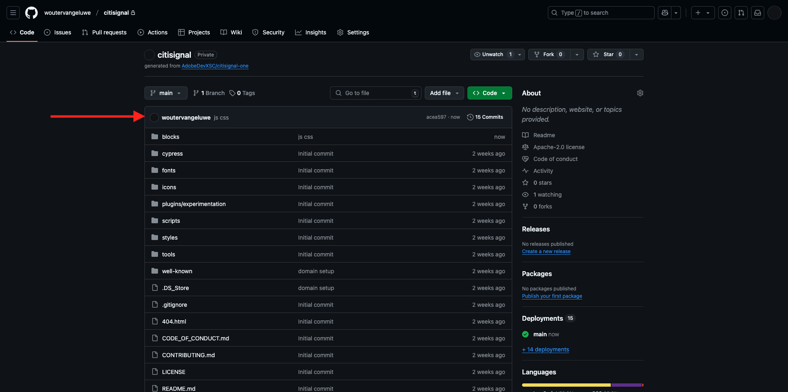
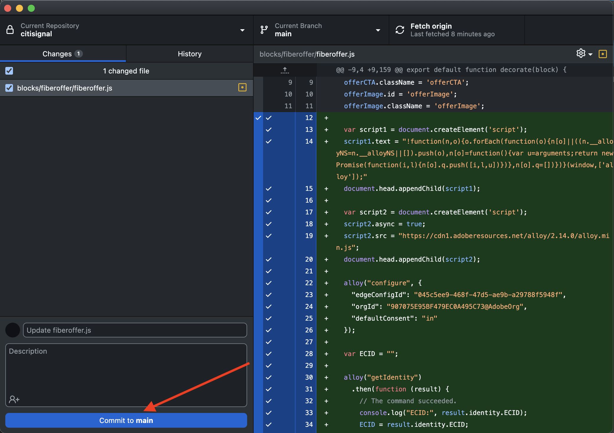

# 1.1.4 Blocco personalizzato avanzato

Nell&#39;esercizio precedente, hai configurato un blocco personalizzato di base denominato **Offerta Fibra** che mostra campi come **Testo offerta**, **CTA offerte** e **Immagine offerta** sul tuo sito Web.

Ora puoi continuare a lavorare su questo blocco.

{zoomable="yes"}

## 1.1.4.1 Personalizza lo stile del blocco

Ora che hai un blocco **fiberoffer** funzionante puoi applicarvi uno stile.

Torna a Visual Studio Code e apri la cartella **blocchi**. Ora dovrebbero essere presenti più cartelle che fanno riferimento ciascuna a un blocco specifico. Per rendere il blocco **fiberoffer** più avanzato, è ora necessario creare una cartella per il blocco personalizzato.

{zoomable="yes"}

Selezionare la cartella **blocca**, quindi fare clic sull&#39;icona **Crea nuova cartella**.

{zoomable="yes"}

Assegna un nome alla cartella `fiberoffer` e premi **Invio**.

{zoomable="yes"}

Selezionare la nuova cartella **fiberoffer** e fare clic sull&#39;icona **Crea nuovo file**.

{zoomable="yes"}

Viene creato un nuovo file. Immetti il nome **fiberoffer.js** e premi Invio.

{zoomable="yes"}

È ora possibile implementare la decorazione dei blocchi aggiungendo il seguente JavaScript al file **fiberoffer.js**.

Salva il file.

```js
export default function decorate(block) {
  const offerText = block.children[0];
  const offerCTA = block.children[1];
  const offerImage = block.children[2];

  offerText.id = 'offerText';
  offerText.className = 'offerText';
  offerCTA.id = 'offerCTA';
  offerCTA.className = 'offerCTA';
  offerImage.id = 'offerImage';
  offerImage.className = 'offerImage';
}
```

{zoomable="yes"}

Selezionare la nuova cartella **fiberoffer** e fare di nuovo clic sull&#39;icona **Crea nuovo file**.

{zoomable="yes"}

Viene creato un nuovo file. Immetti il nome **fiberoffer.css** e premi Invio.

{zoomable="yes"}

Copia e incolla il seguente codice CSS nel file appena creato.

```js
.offerText, .offerCTA, .offerImage{
    color: #14161A;
    font-size: 30px;
    padding: 0 0 24px;
    display: flex;
    flex-direction: column;
    margin: 1rem 0;
    text-align: center;
}
```

Salva le modifiche.

{zoomable="yes"}

Hai ora apportato diverse modifiche al progetto che devono essere salvate nell’archivio GitHub. Per farlo, apri **GitHub Desktop**.

Dovresti quindi visualizzare i 2 file appena modificati in **Modifiche**. Rivedi le modifiche.

Immettere un nome per la PR, `js css`. Fare clic su **Commit to main**.

{zoomable="yes"}

Dovresti vedere questo. Fare clic su **Origine push**.

{zoomable="yes"}

Nel browser, vai all’account GitHub e all’archivio creato per CitiSignal. Dovresti quindi vedere qualcosa di simile, che mostra che le modifiche sono state ricevute.

{zoomable="yes"}

Potrai visualizzare le modifiche apportate al tuo sito web andando su `main--citisignal-aem-accs--XXX.aem.page` e/o `main--citisignal-aem-accs--XXX.aem.live`, dopo aver sostituito XXX con il tuo account utente GitHub, che in questo esempio è `woutervangeluwe`.

In questo esempio, l’URL completo diventa:
`https://main--citisignal-aem-accs--woutervangeluwe.aem.page` e/o `https://main--citisignal-aem-accs--woutervangeluwe.aem.live`.

Dovresti visualizzarlo con lo stile applicato alla pagina.

{zoomable="yes"}

## 1.1.4.2 Aggiungere logica e caricare dati da un endpoint esterno

Per questo esercizio eseguirai una configurazione non elaborata del Web SDK di Adobe e richiederai la migliore offerta successiva da Adobe Journey Optimizer Offer Decisioning.

Per essere chiari: questa non è un’implementazione best practice di Web SDK per AEM as a Cloud Service. Nel prossimo esercizio implementerai la raccolta dati utilizzando un plug-in specifico che è stato sviluppato a tale scopo.

Questo esercizio ha lo scopo di mostrarti alcuni elementi di base in JavaScript, come il caricamento di una libreria JS esterna, l&#39;utilizzo della libreria **alloy.js**, l&#39;invio di una richiesta e altro ancora.

La libreria **alloy.js** è la libreria in esecuzione di Web SDK che consente di inviare richieste da un sito Web ad Adobe Edge Network e da lì applicazioni come Adobe Experience Platform, Adobe Analytics, Adobe Target e altro ancora.

Aggiungi questo codice nel codice precedente aggiunto per lo stile del blocco:

```javascript
var script1 = document.createElement('script');
  script1.text = "!function(n,o){o.forEach(function(o){n[o]||((n.__alloyNS=n.__alloyNS||[]).push(o),n[o]=function(){var u=arguments;return new Promise(function(i,l){n[o].q.push([i,l,u])})},n[o].q=[])})}(window,['alloy']);"
  document.head.appendChild(script1);

  var script2 = document.createElement('script');
  script2.async = true;
  script2.src = "https://cdn1.adoberesources.net/alloy/2.14.0/alloy.min.js";
  document.head.appendChild(script2);

  alloy("configure", {
    "edgeConfigId": "045c5ee9-468f-47d5-ae9b-a29788f5948f",
    "orgId": "907075E95BF479EC0A495C73@AdobeOrg",
    "defaultConsent": "in"
  });
```

Dovresti avere questo.

Il primo tag script (script1) aggiunto è una funzione utilizzata da Web SDK che crea un oggetto finestra denominato **alloy**.

Il secondo tag di script (script2) caricherà in modo asincrono la libreria alloy.js dal CDN di Adobe.

Il terzo blocco di codice configura fondamentalmente l’oggetto alloy per inviare dati a un’organizzazione Adobe IMS e a uno stream di dati specifici.

Nel modulo **Guida introduttiva**, hai già configurato uno stream di dati, denominato `--aepUserLdap-- - One Adobe Datastream`. Il campo **edgeConfigId** nel codice precedente fa riferimento all&#39;ID dello stream di dati configurato.

Al momento non è necessario modificare il campo **edgeConfigId**. Nel prossimo esercizio potrai eseguire questa operazione utilizzando il plug-in **MarTech**.

{zoomable="yes"}

Ora dovresti avere questo.

{zoomable="yes"}

Quindi, aggiungi questo blocco sotto il codice precedente aggiunto in.

```javascript
var ECID = "";

  alloy("getIdentity")
    .then(function (result) {
      // The command succeeded.
      console.log("ECID:", result.identity.ECID);
      ECID = result.identity.ECID;
      getOffer(ECID);

    })
    .catch(function (error) {
      // The command failed.
      // "error" will be an error object with additional information.
    });
```

Questo blocco di codice viene utilizzato per recuperare il valore dell’Experience Cloud ID (ECID). L’ECID è l’identificatore univoco del dispositivo del browser.

Come puoi vedere nel codice precedente, una volta recuperato l’ECID, viene chiamata un’altra funzione. Questa funzione si chiama **getOffer()** e verrà aggiunta successivamente.

{zoomable="yes"}

Quindi, aggiungi il codice seguente sotto a

```javascript
async function getOffer(ECID) {
  var url = "https://edge.adobedc.net/ee/irl1/v1/interact?configId=045c5ee9-468f-47d5-ae9b-a29788f5948f";

  var timestamp = new Date().toISOString();

  var offerRequest = {
    "events": [
      {
        "xdm": {
          "eventType": "decisioning.propositionDisplay",
          "timestamp": timestamp,
          "_experienceplatform": {
            "identification": {
              "core": {
                "ecid": ECID
              }
            }
          },
          "identityMap": {
            "ECID": [
              {
                "id": ECID
              }
            ]
          }
        },
        "query": {
          "personalization": {
            "schemas": [
              "https://ns.adobe.com/personalization/default-content-item",
              "https://ns.adobe.com/personalization/html-content-item",
              "https://ns.adobe.com/personalization/json-content-item",
              "https://ns.adobe.com/personalization/redirect-item",
              "https://ns.adobe.com/personalization/ruleset-item",
              "https://ns.adobe.com/personalization/message/in-app",
              "https://ns.adobe.com/personalization/message/content-card",
              "https://ns.adobe.com/personalization/dom-action"
            ],
            "decisionScopes": [
              "eyJ4ZG06YWN0aXZpdHlJZCI6ImRwczpvZmZlci1hY3Rpdml0eToxYTI3ODk3NzAzYTY5NWZmIiwieGRtOnBsYWNlbWVudElkIjoiZHBzOm9mZmVyLXBsYWNlbWVudDoxYTI0ZGM2MWJmYjJlMjIwIn0=",
              "eyJ4ZG06YWN0aXZpdHlJZCI6ImRwczpvZmZlci1hY3Rpdml0eToxYTI3ODk3NzAzYTY5NWZmIiwieGRtOnBsYWNlbWVudElkIjoiZHBzOm9mZmVyLXBsYWNlbWVudDoxYTI0ZGM0MzQyZjJlMjFlIn0="
            ]
          }
        }
      }
    ]
  }

  try {
    const response = await fetch(url, {
      method: "POST",
      headers: {
        "Content-Type": "application/json"
      },
      body: JSON.stringify(offerRequest),
    });

    if (response.status === 200) {
      var body = await response.json();
      console.log("Offer Decisioning Response: ", body);

      const decisions = body["handle"];

      decisions.forEach(decision => {
        if (decision["type"] == "personalization:decisions") {
          console.log("Offer Decisioning decision detail: ", decision);
          const payloads = decision["payload"];

          if (payloads === undefined || payloads.length == 0) {
            //do nothing
          } else {
            payloads.forEach(payload => {
              if (payload["placement"]["name"] == "Web - Image") {
                console.log("Web-Image payload");
                const items = payload["items"];
                items.forEach(item => {
                  if (item["id"].includes("dps:fallback-offer")) {
                    console.log("Item details: ", item);
                    const deliveryURL = item["data"]["deliveryURL"];

                    document.querySelector("#offerImage").innerHTML = "";
                  } else if (item["id"].includes("dps:personalized-offer")) {
                    console.log("Item details: ", item);
                    const deliveryURL = item["data"]["deliveryURL"];
                    console.log("Web-Image Personalized Offer Content: ", deliveryURL)

                    document.querySelector("#offerImage").innerHTML = "";
                  }
                });
              } else if (payload["placement"]["name"] == "Web - JSON") {
                console.log("Web-JSON payload");
                const items = payload["items"];
                items.forEach(item => {
                  if (item["id"].includes("dps:fallback-offer")) {
                    const content = JSON.parse(item["data"]["content"]);

                    console.log("Web-JSON Fallback Content: ", content)

                    document.querySelector("#offerText").innerHTML = content.text;
                    document.querySelector("#offerCTA").innerHTML = content.cta;
                  } else if (item["id"].includes("dps:personalized-offer")) {
                    const content = JSON.parse(item["data"]["content"]);

                    console.log("Web-JSON Personalized Offer Content: " + content);

                    document.querySelector("#offerText").innerHTML = content.text;
                    document.querySelector("#offerCTA").innerHTML = content.cta;
                  }
                });
              }
            });
          }
          document.querySelector("#offerImage").style.display = "block";
          document.querySelector("#offerText").style.display = "block";
          document.querySelector("#offerCTA").style.display = "block";
        }
      });
    } else {
      console.warn("Offer Decisioning Response unsuccessful:", response.body);
    }
  } catch (error) {
    console.error("Error when getting Offer Decisioning Response:", error);
  }
}
```

È molto importante che questo blocco di codice venga incollato al di sotto della parentesi quadra di chiusura, che puoi vedere alla riga 42 in questo esempio. Il codice appena incollato è una funzione separata che richiede la propria posizione in questo file e non può essere nidificato nella **funzione predefinita** di cui sopra.

{zoomable="yes"}

Il blocco di codice appena incollato simula una richiesta che verrebbe normalmente effettuata dal sito Web SDK/alloy.js. In questo esempio verrà effettuata una richiesta **fetch** a **edge.adobedc.net**.

Nella richiesta, sono specificati 2 **Ambiti decisionali** che chiederanno ad Adobe Journey Optimizer Offer Decisioning di fornire una decisione sull&#39;offerta da visualizzare con questo ECID.

Una volta ricevuta la risposta, questo codice analizzerà la risposta e filtrerà elementi come l’URL dell’immagine da visualizzare e anche la risposta JSON che contiene elementi come il testo dell’offerta e il CTA dell’offerta, dopo di che questi verranno visualizzati sul sito web.

Ricorda: questo approccio viene utilizzato solo a scopo di abilitazione e non è il modo migliore per implementare la raccolta dati.

Salva le modifiche. Quindi, apri **Github Desktop**, assegna un nome alla tua PR e fai clic su **Commit to main**.

{zoomable="yes"}

Fare clic su **Origine push**.

{zoomable="yes"}

Potrai visualizzare le modifiche apportate al tuo sito web andando su `main--citisignal-aem-accs--XXX.aem.page` e/o `main--citisignal-aem-accs--XXX.aem.live`, dopo aver sostituito XXX con il tuo account utente GitHub, che in questo esempio è `woutervangeluwe`.

In questo esempio, l’URL completo diventa:
`https://main--citisignal-aem-accs--woutervangeluwe.aem.page` e/o `https://main--citisignal-aem-accs--woutervangeluwe.aem.live`.

Dovresti vedere questo.

{zoomable="yes"}

Passaggio successivo: [Plug-in AEM Edge Delivery Services MarTech](./ex5.md){target="_blank"}

Torna a [Adobe Experience Manager Cloud Service e Edge Delivery Services](./aemcs.md){target="_blank"}

[Torna a tutti i moduli](./../../../overview.md){target="_blank"}
