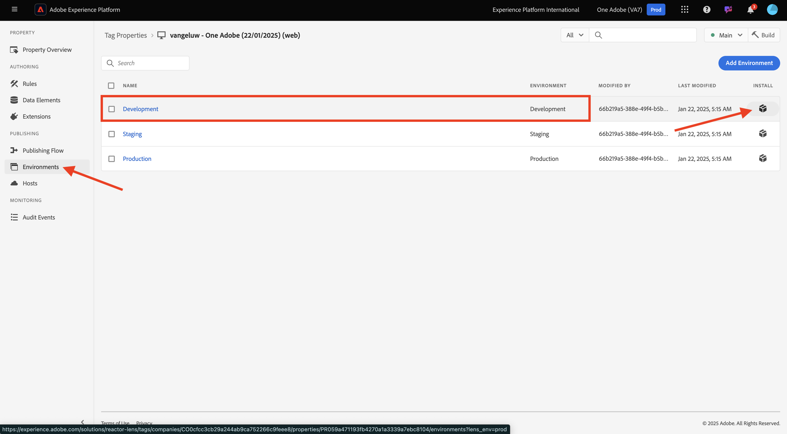
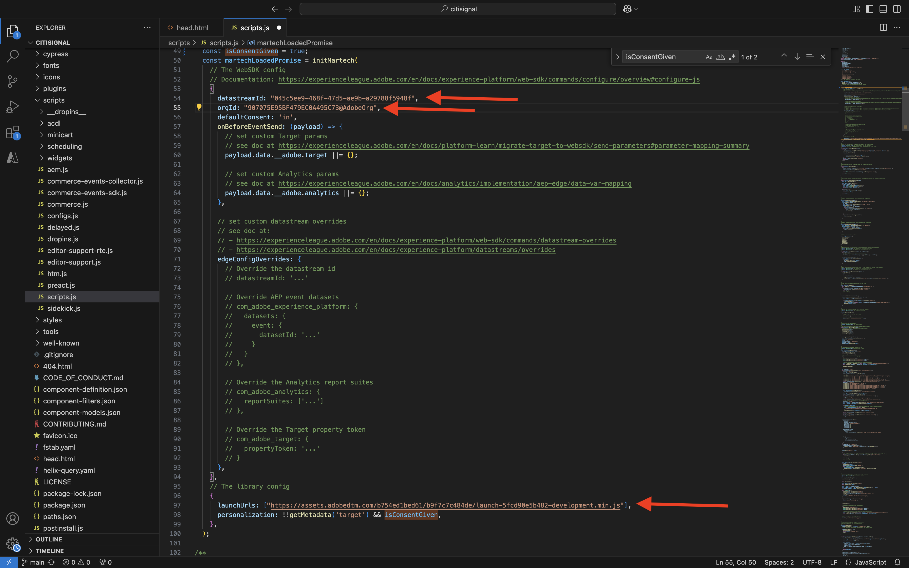
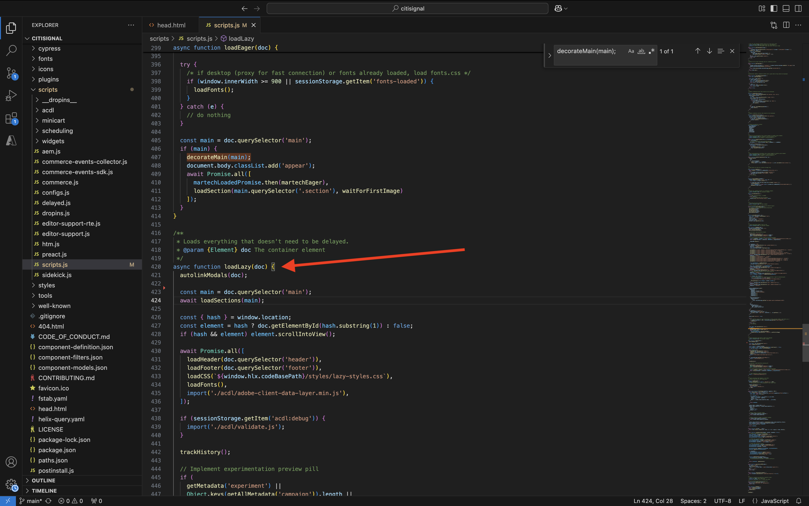

# 1.1.6 Plug-in AEM Edge Delivery Services MarTech

Il plug-in MarTech AEM consente di impostare rapidamente uno stack MarTech completo per il progetto AEM.

>[!NOTE]
>
>Questo plug-in è attualmente disponibile per i clienti in collaborazione con AEM Engineering tramite progetti di co-innovazione. Ulteriori informazioni sono disponibili su [https://github.com/adobe-rnd/aem-martech](https://github.com/adobe-rnd/aem-martech).

## 1.1.6.1 Aggiungi il plug-in al tuo archivio

Passa alla cartella in uso per l&#39;archivio GitHub **citisignal**. Fare clic con il pulsante destro del mouse sul nome della cartella, quindi selezionare **Nuovo terminale nella cartella**.

{zoomable="yes"}

Poi vedrai questo. Incolla il seguente comando e premi **invio**.

```
git subtree add --squash --prefix plugins/martech https://github.com/adobe-rnd/aem-martech.git main
```

Dovresti vedere questo.

{zoomable="yes"}

Passa alla cartella in uso per l&#39;archivio GitHub **citisignal**, apri la cartella **plugins**. Dovresti ora visualizzare una cartella denominata **martech**.

{zoomable="yes"}

## 1.1.6.2 head.html

In Visual Studio Code aprire il file **head.html**. Copiare il codice seguente e incollarlo nel file **head.html**.

```javascript
<link rel="preload" as="script" crossorigin="anonymous" href="/plugins/martech/src/index.js"/>
<link rel="preload" as="script" crossorigin="anonymous" href="/plugins/martech/src/alloy.min.js"/>
<link rel="preconnect" href="https://edge.adobedc.net"/>
<!-- change to adobedc.demdex.net if you enable third party cookies -->
```

Salva le modifiche.

{zoomable="yes"}

## 1.1.6.3 scripts.js

In Visual Studio Code, passare alla cartella **scripts** e aprire il file **scripts.js**. Copiare il codice seguente e incollarlo nel file **scripts.js**, negli script di importazione esistenti.

```javascript
import {
  initMartech,
  updateUserConsent,
  martechEager,
  martechLazy,
  martechDelayed,
} from '../plugins/martech/src/index.js';
```

Salva le modifiche.

{zoomable="yes"}

Nel codice di Visual Studio trovare il codice seguente nel file **scripts.js**:

```javascript
const AUDIENCES = {
  mobile: () => window.innerWidth < 600,
  desktop: () => window.innerWidth >= 600,
  // define your custom audiences here as needed
};
```

In **const AUDIENCES = {...};** incolla il codice seguente:

```javascript
  const isConsentGiven = true;
  const martechLoadedPromise = initMartech(
    // The WebSDK config
    // Documentation: https://experienceleague.adobe.com/it/docs/experience-platform/web-sdk/commands/configure/overview#configure-js
    {
      datastreamId: "XXX",
      orgId: "XXX",
      defaultConsent: 'in',
      onBeforeEventSend: (payload) => {
        // set custom Target params 
        // see doc at https://experienceleague.adobe.com/it/docs/platform-learn/migrate-target-to-websdk/send-parameters#parameter-mapping-summary
        payload.data.__adobe.target ||= {};

        // set custom Analytics params
        // see doc at https://experienceleague.adobe.com/it/docs/analytics/implementation/aep-edge/data-var-mapping
        payload.data.__adobe.analytics ||= {};
      },

      // set custom datastream overrides
      // see doc at:
      // - https://experienceleague.adobe.com/it/docs/experience-platform/web-sdk/commands/datastream-overrides
      // - https://experienceleague.adobe.com/it/docs/experience-platform/datastreams/overrides
      edgeConfigOverrides: {
        // Override the datastream id
        // datastreamId: '...'

        // Override AEP event datasets
        // com_adobe_experience_platform: {
        //   datasets: {
        //     event: {
        //       datasetId: '...'
        //     }
        //   }
        // },

        // Override the Analytics report suites
        // com_adobe_analytics: {
        //   reportSuites: ['...']
        // },

        // Override the Target property token
        // com_adobe_target: {
        //   propertyToken: '...'
        // }
      },
    },
    // The library config
    {
      launchUrls: ["XXX"],
      personalization: !!getMetadata('target') && isConsentGiven,
    },
  );
```

{zoomable="yes"}

Ci sono un paio di variabili che devi sostituire nel codice di cui sopra, con le variabili del tuo ambiente:

- `datastreamId: "XXX"`
- `orgId: "XXX"`
- `launchUrls: ["XXX"]`

Puoi trovare queste variabili seguendo queste istruzioni:

### datastreamId

Vai a [https://platform.adobe.com/](https://platform.adobe.com/) e quindi vai a **Datastreams** nel menu a sinistra. Verifica di trovarti nella sandbox corretta, che dovrebbe essere `--aepSandboxName--`. Cercare lo stream di dati creato nella sezione Guida introduttiva di questa esercitazione, che deve essere denominato `--aepUserLdap-- - One Adobe Datastream`. Fai clic sull&#39;icona **copia** per copiare l&#39;ID **Datastream** e incollarlo nel codice di Visual Studio, nel file **scripts.js**, sostituendo il valore segnaposto `XXX` accanto a `datastreamId:`.

{zoomable="yes"}

### orgId

Vai a [https://platform.adobe.com/](https://platform.adobe.com/) e quindi vai a **Query** nel menu a sinistra. In **Credenziali**, troverai **ID organizzazione IMS** come **Nome utente**. Fai clic sull&#39;icona **copia** per copiare l&#39;ID dell&#39;organizzazione **IMS** e incollarlo nel codice di Visual Studio, nel file **scripts.js**, sostituendo il valore segnaposto `XXX` accanto a `orgId:`.

{zoomable="yes"}

### launchUrls

Vai a [https://platform.adobe.com/](https://platform.adobe.com/) e quindi vai a **Tag** nel menu a sinistra. Cercare la proprietà utilizzando il proprio LDAP, che dovrebbe essere `--aepUserLdap--`. Apri la proprietà Web.

{zoomable="yes"}

Nel menu a sinistra, vai a **Ambienti**, quindi fai clic sull&#39;icona **Installa** per l&#39;ambiente **Sviluppo**.

{zoomable="yes"}

Troverai quindi l&#39;URL necessario, ma si trova all&#39;interno di un tag HTML `<script></script>`. È consigliabile copiare solo la parte che inizia alle `https` fino alle `.min.js`.

{zoomable="yes"}

L&#39;URL è simile al seguente: `https://assets.adobedtm.com/b754ed1bed61/b9f7c7c484de/launch-5fcd90e5b482-development.min.js`. Assicurati che non venga copiato altro testo, poiché ciò potrebbe causare errori. In Visual Studio Code, nel file **scripts.js**, sostituire il valore segnaposto `XXX` nell&#39;array `launchUrls:`.

Ora disponi delle tre variabili necessarie. Il file `scripts.js` dovrebbe ora avere un aspetto simile al seguente:

{zoomable="yes"}

Quindi, cerca questo blocco di codice:

```javascript
const main = doc.querySelector('main');
  if (main) {
    decorateMain(main);
    document.body.classList.add('appear');
    await loadSection(main.querySelector('.section'), waitForFirstImage);	
  }
```

{zoomable="yes"}

Sostituiscilo con questo blocco di codice:

```javascript
const main = doc.querySelector('main');
  if (main) {
    decorateMain(main);
    document.body.classList.add('appear');
    await Promise.all([
      martechLoadedPromise.then(martechEager),
      loadSection(main.querySelector('.section'), waitForFirstImage)
    ]);
  }
```

{zoomable="yes"}

Quindi, cercare e scorrere fino a `async function loadLazy(doc) {`.

{zoomable="yes"}

Alla riga `autolinkModals(doc);`, aggiungi questa riga di codice:

```javascript
await martechLazy();
```

{zoomable="yes"}

Quindi, cercare e scorrere verso il basso fino alla riga `function loadDelayed() {`.

{zoomable="yes"}

Aggiungere questo blocco di codice alla riga `// load anything that can be postponed to the latest here`.

```javascript
window.setTimeout(() => {
    martechDelayed();
    return import('./delayed.js');
  }, 3000);
```

{zoomable="yes"}

Quindi, cercare e passare alla riga contenente `window.adobeDataLayer.push`.

{zoomable="yes"}

L&#39;oggetto `pageContext` verrà definito in questo modo. È ora necessario aggiungere due oggetti in `pageContext`.

```javascript
	pageContext: {
      pageType,
      pageName: document.title,
      eventType: 'visibilityHidden',
      maxXOffset: 0,
      maxYOffset: 0,
      minXOffset: 0,
      minYOffset: 0,
    }
```

Questo è il codice che deve essere aggiunto:

```javascript
	,
    _experienceplatform: {
      identification:{
        core:{
          ecid: sessionStorage.getItem("com.adobe.reactor.dataElements.ECID")
        }
      }
    },
    web: {
      webPageDetails:{
        name: document.title,
        URL: window.location.href
      }
    }
```

**window.adobeDataLayer.push** dovrebbe ora essere simile al seguente:

```javascript
  window.adobeDataLayer.push({
    pageContext: {
      pageType,
      pageName: document.title,
      eventType: 'visibilityHidden',
      maxXOffset: 0,
      maxYOffset: 0,
      minXOffset: 0,
      minYOffset: 0,
    },
    _experienceplatform: {
      identification:{
        core:{
          ecid: sessionStorage.getItem("com.adobe.reactor.dataElements.ECID")
        }
      }
    },
    web: {
      webPageDetails:{
        name: document.title,
        URL: window.location.href
      }
    }
  });
```

{zoomable="yes"}

Sono state apportate tutte le modifiche necessarie al file **scripts.js**.

Apri il client GitHub Desktop e conferma le modifiche.

{zoomable="yes"}

Fai clic su **Push origin** per inviare le modifiche all&#39;archivio GitHub.

{zoomable="yes"}

## Estensione ACDL 1.1.6.4 nella proprietà Tags

Per il corretto funzionamento del plug-in AEM Edge Delivery Services MarTech, è necessario aggiungere l’estensione per

Vai a [https://experience.adobe.com/#/data-collection/](https://experience.adobe.com/it#/data-collection/). Cercare e aprire la proprietà Tags per Web, denominata `--aepUserLdap-- - One Adobe (DD/MM/YYYY)`.

{zoomable="yes"}

Vai a **Estensioni**, a **Catalogo**. Fare clic sull&#39;estensione **Adobe Client Data Layer** e quindi su **Installa**.

{zoomable="yes"}

Dovresti vedere questo. Non c&#39;è bisogno di cambiare nulla in questo momento. Fai clic su **Salva nella libreria**.

{zoomable="yes"}

L’estensione viene quindi aggiunta alla proprietà Tags.

{zoomable="yes"}

Vai a **Flusso di pubblicazione** e apri la libreria **Principale**. Fai clic su **Aggiungi tutte le risorse modificate**, quindi fai clic su **Salva e genera in sviluppo**.

{zoomable="yes"}

Le modifiche sono ora implementate.

## 1.1.6.5 Invia dati a Adobe Experience Platform Edge Network

Potrai visualizzare le modifiche apportate al tuo sito web andando su `main--citisignal--XXX.aem.page/us/en/` e/o `main--citisignal--XXX.aem.live/us/en/`, dopo aver sostituito XXX con il tuo account utente GitHub, che in questo esempio è `woutervangeluwe`.

In questo esempio, l’URL completo diventa:
`https://main--citisignal--woutervangeluwe.aem.page/us/en/` e/o `https://main--citisignal--woutervangeluwe.aem.live/us/en/`.

>[!NOTE]
>
>Prendi in considerazione l’apertura di una pagina web in incognito per assicurarti di iniziare la raccolta dati con un profilo nuovo e pulito. Questo è più facile per il debug e la risoluzione dei problemi.

{zoomable="yes"}

In Chrome, apri **Strumenti per sviluppatori** da **Altri strumenti** > **Strumenti per sviluppatori**.

{zoomable="yes"}

Nella visualizzazione **Console** sono presenti alcune righe che iniziano con `[alloy]`. Dai un&#39;occhiata alle richieste, una dovrebbe avere questo aspetto e avere il corpo della richiesta come indicato nell&#39;immagine.

`[alloy] Request 55a9ddbc-0521-4ba3-b527-3da2cb35328a: Sending request.`

Aprire il payload, espandere il campo `events[0].xdm._experienceplatform.identification.core.ecid` e copiare l&#39;ECID.

{zoomable="yes"}

## 1.1.6.6 Visualizza il profilo cliente in Adobe Experience Platform

Accedi a Adobe Experience Platform da questo URL: [https://experience.adobe.com/platform](https://experience.adobe.com/platform).

Dopo aver effettuato l’accesso, accedi alla home page di Adobe Experience Platform.

{zoomable="yes"}

Prima di continuare, devi selezionare una **sandbox**. La sandbox da selezionare è denominata ``--aepSandboxName--``. Dopo aver selezionato la sandbox appropriata, la schermata cambia e ora sei nella sandbox dedicata.

{zoomable="yes"}

Nel menu a sinistra, vai a **Cliente** > **Profili** > **Sfoglia**. Selezionare lo spazio dei nomi **Identity** di **ECID** e quindi superare il **ECID** copiato nel passaggio precedente. Fare clic su **Visualizza**. Dovresti quindi vedere un profilo mostrato nell’elenco. Fai clic su di esso per aprirlo.

{zoomable="yes"}

Viene quindi visualizzata la panoramica della **dashboard dei profili**, che mostra l&#39;ECID. Quindi, vai a **Eventi**.

{zoomable="yes"}

In **Eventi** verranno visualizzati diversi eventi di esperienza, incluso un evento con eventType **web.webpagedetails.pageViews**. Fare clic su **Visualizza JSON** per visualizzare tutti gli eventi raccolti.

{zoomable="yes"}

Nella visualizzazione **JSON**, verifica l&#39;evento con eventType **web.webpagedetails.pageViews** per visualizzare elementi come il **Nome pagina** e il **URL pagina**.

{zoomable="yes"}

Hai completato l&#39;esercizio.

Passaggio successivo: [Riepilogo e vantaggi](./summary.md){target="_blank"}

Torna a [Adobe Experience Manager Cloud Service e Edge Delivery Services](./aemcs.md){target="_blank"}

[Torna a tutti i moduli](./../../../overview.md){target="_blank"}
