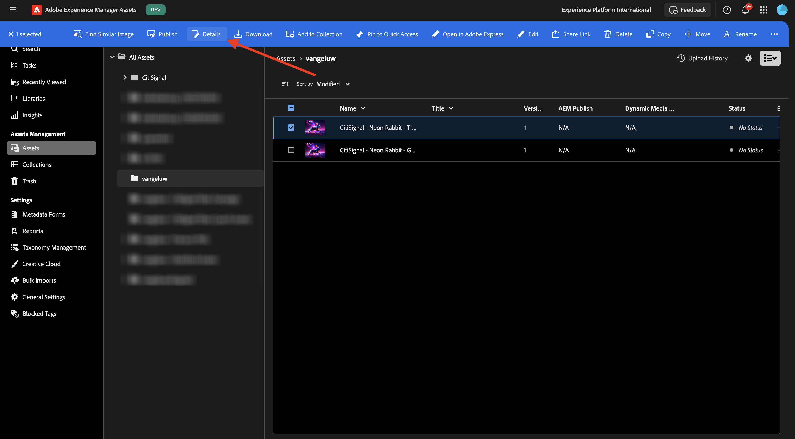

# 1.2.1 Guida introduttiva ad AEM Assets

Vai a [https://experience.adobe.com/](https://experience.adobe.com/){target="_blank"}. Assicurarsi di trovarsi nell&#39;ambiente corretto, che deve essere denominato `--aepImsOrgName--`.

Apri **Adobe Experience Manager Assets**.

Seleziona l’ambiente AEM Assets CS che ti è assegnato. In questo caso, l&#39;ambiente da selezionare è `--aepUserLdap-- - CitiSignal dev author`.

Dovresti vedere questo. Vai a **Assets**.

Utilizzare una cartella denominata `--aepUserLdap-- - CitiSignal Fiber Campaign`. Se non esiste ancora, fare clic su **Crea cartella**.

Immetti il nome `--aepUserLdap--` per la cartella e fai clic su **Crea**.

Apri la cartella appena creata. In uno degli esercizi precedenti sono state create 2 immagini denominate `CitiSignal - Neon Rabbit - Get On Board Now!.png` e `CitiSignal - Neon Rabbit - Timetravel now!.png`. Se ancora non sono presenti, è necessario caricare queste immagini in questa cartella.

Se non disponi più di questi file, puoi scaricarli [qui](./images/CitiSignal_Neon_Rabbit.zip){target="_blank"}.

Fare clic su **Aggiungi Assets**.

Seleziona le 2 immagini sopra menzionate. Fai clic su **Apri**.

Fai clic su **Carica**.

Fare clic su una delle immagini per selezionarla.

Fare clic su **Dettagli**.

Ora puoi visualizzare i metadati disponibili del file specifico.

Nel menu a destra, vai a **Rappresentazioni**. Vedrai quindi una serie di rappresentazioni predefinite dell’immagine selezionata con la possibilità di scaricarle.

Nel menu di destra, fai clic sull&#39;icona **forbici**. Puoi trovare diverse azioni di modifica disponibili, basate su Adobe Express. Fare clic su **Rimuovi sfondo**.

Dopo un paio di secondi, dovresti vedere qualcosa di simile a questo, con la possibilità di applicare le modifiche o scaricare il nuovo file. Chiudete la finestra a comparsa.

Ritaglia **Ritaglia immagine**.

Puoi testare alcune varianti di diverse dimensioni di ritaglio.

Nel menu a destra, vai a **Attività**. Fai clic su **Assegna attività**.

Imposta **Titolo attività** su `Review image & approve`. Assegnati. Fai clic su **Crea**.

Fai clic su **Visualizza** nella notifica.

In alternativa, aggiornare la schermata per visualizzare le nuove attività create nell&#39;elenco **Attività correlate**. Fai clic sul pulsante **Apri** per visualizzare i dettagli dell&#39;attività.

Dovresti vedere qualcosa del genere. Fai clic su **Approva**.

Conferma facendo clic su **Approva**.

La risorsa è ora approvata in AEM Assets.

Passaggio successivo: [Riepilogo e vantaggi](./summary.md){target="_blank"}

Torna a [Adobe Experience Manager Assets](./aemassets.md){target="_blank"}

[Torna a tutti i moduli](./../../../overview.md){target="_blank"}
