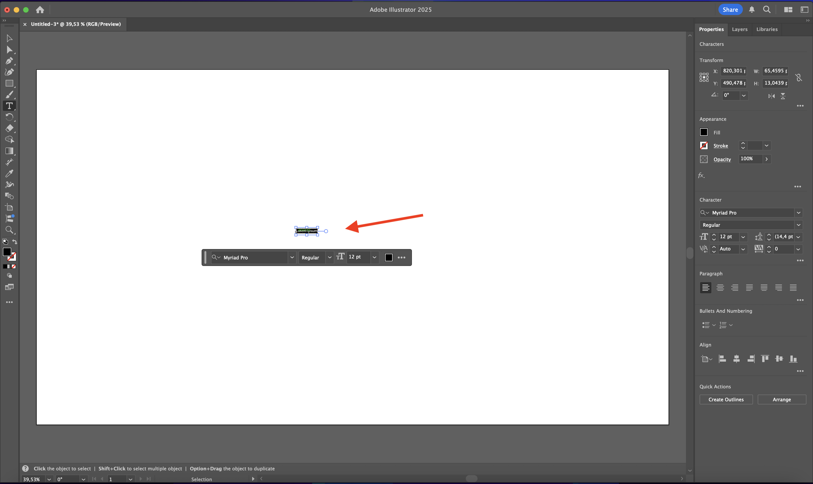
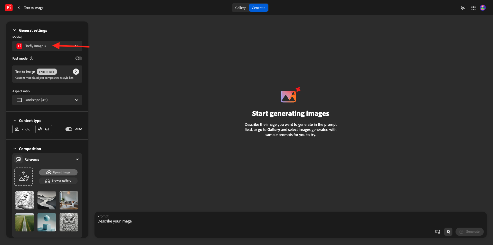
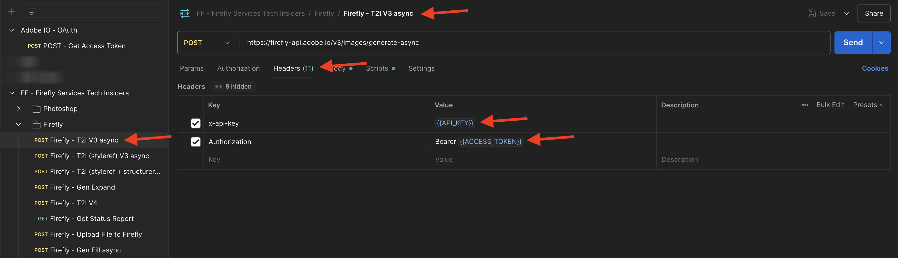
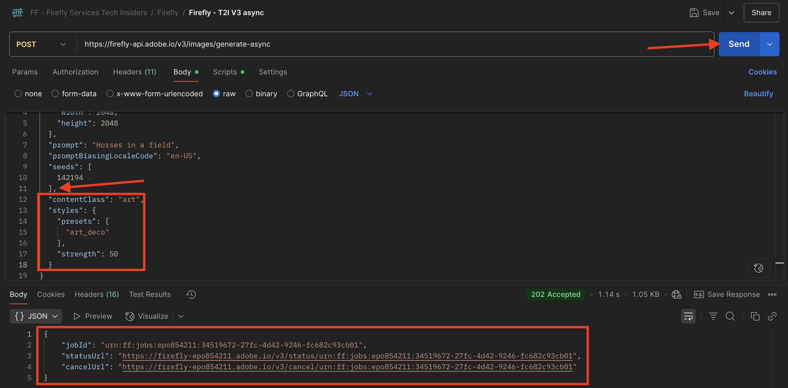
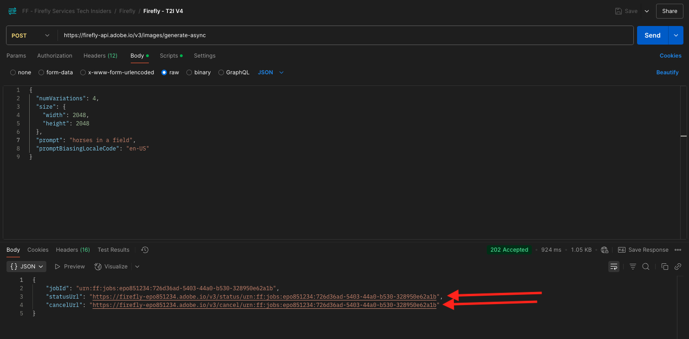
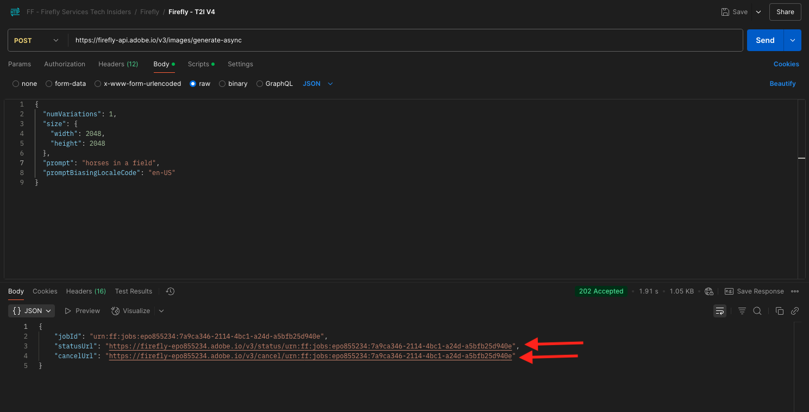

# 1.1.1 Guida introduttiva a Firefly Services

Firefly Services include **API Firefly**, **API Lightroom**, **API Photoshop**, **API InDesign** e **API di assegnazione tag contenuto**.

Queste suite di API combinano la potenza degli strumenti creativi di Adobe come Photoshop e Lightroom con funzioni AI/ML all’avanguardia come l’assegnazione di tag ai contenuti, il riempimento generativo, il passaggio da testo a immagine e altro ancora.

Con Firefly Services, non si tratta solo di creare, ma di automatizzare, scalare la produzione dei contenuti e sfruttare le più recenti tecnologie AI/ML per sovrascrivere i flussi di lavoro.

In questo esercizio imparerai a utilizzare Postman e Adobe I/O per lavorare con le varie API di Adobe Firefly Services.

Questo esercizio si concentra specificamente sulle API di Firefly, ad esempio:

- **API di generazione immagini Firefly**: questa API viene utilizzata per generare immagini utilizzando i modelli di Firefly
- **API per la generazione di immagini simili di Firefly**: questa API viene utilizzata per generare immagini simili a quelle già esistenti
- **API Espandi immagine Firefly**: questa API viene utilizzata per espandere un&#39;immagine esistente con proporzioni/dimensioni maggiori
- **API immagine di riempimento Firefly**: questa API riempie un&#39;area di un&#39;immagine esistente in base alle immagini generate da Firefly in base al prompt. Questa operazione viene eseguita utilizzando una maschera che definisce l&#39;area da riempire.
- **Firefly Generate Object Composite API**: questa API consente di fornire un&#39;immagine di input personale, che combina l&#39;immagine con le immagini generate da Firefly per creare un&#39;immagine composita o una scena.
- **API per modelli personalizzati Firefly**: questa API consente di utilizzare i propri modelli personalizzati Firefly per generare nuove immagini basate sul modello personalizzato Firefly

## 1.1.1.1 Prerequisiti

Prima di continuare con questo esercizio, devi aver completato la configurazione di [il tuo progetto Adobe I/O](./../../../modules/getting-started/gettingstarted/ex6.md) e devi anche aver configurato un&#39;applicazione per interagire con le API, ad esempio [Postman](./../../../modules/getting-started/gettingstarted/ex7.md) o [PostBuster](./../../../modules/getting-started/gettingstarted/ex8.md).

## Nozioni di base sull&#39;API 1.1.1.2

Esistono diversi tipi di richieste API:

- **GET**: viene utilizzato quando si tenta di recuperare informazioni da un endpoint API, ad esempio per ottenere un rapporto di stato
- **POST**: viene utilizzato quando è necessario eseguire una nuova operazione, ad esempio quando Adobe Firefly Services genera una nuova immagine
- **PUT**: utilizzato per aggiornare completamente i dati esistenti
- **PATCH**: utilizzato per aggiornare selettivamente i dati esistenti
- **DELETE**: utilizzato per eliminare i dati

Quando lavori con le API, noterai anche che i codici di risposta vengono restituiti dai vari endpoint API.

Sono disponibili 5 diverse categorie di risposte:

- **1xx risposta informativa**: richiesta ricevuta, processo in corso
- **2xx completato**: la richiesta è stata ricevuta, compresa e accettata
- **reindirizzamento 3xx**: è necessario eseguire ulteriori azioni per completare la richiesta
- **errore del client 4xx**: la richiesta contiene sintassi non valida o non può essere soddisfatta
- **5xx errore del server**: il server non ha soddisfatto una richiesta apparentemente valida

Di seguito è riportato un esempio di codici di risposta comuni:

- **200 OK**: valido, richiesta completata correttamente
- **201 creato**: ad esempio, l&#39;immagine è stata creata
- **202 Accettato**: la richiesta è valida e verrà elaborata
- **401 Non autorizzato**: non è valido, probabilmente il token di accesso non è valido
- **403 Non consentito**: non è un&#39;operazione corretta. Probabilmente non si dispone delle autorizzazioni necessarie per l&#39;azione che si sta tentando di eseguire
- **404 Non trovato**: non è valido, è probabile che l&#39;URL che stai tentando di raggiungere non esista
- **429 Troppe richieste**: non è corretto, probabilmente hai inviato molte richieste in un breve periodo. Riprova più tardi.

## 1.1.1.3 Esplora firefly.adobe.com - fase 1

Cominciamo ad esplorare Adobe Firefly Services. Per ulteriori informazioni, inizia con un esempio di generazione di immagini CitiSignal. Il team di progettazione di CitiSignal desidera generare una versione al neon del marchio CitiSignal. Vorrebbe usare Adobe Firefly Services per farlo.

La prima cosa che serve per ottenere questo risultato è una versione in bianco e nero del marchio CitiSignal, qualcosa di simile al seguente:


### 1.1.1.3.1 Crea l&#39;immagine di riferimento della composizione

Puoi utilizzare [questa immagine di esempio](./images/CitiSignal.jpg) oppure creare un testo personalizzato da sperimentare. Per creare un file di immagine personalizzato, segui i passaggi seguenti in Adobe Illustrator. Se si desidera utilizzare l&#39;immagine predefinita, saltare la sezione seguente e passare al passaggio **1.1.1.2.2 Generare direttamente l&#39;immagine**.

Apri **Adobe Illustrator**. Fare clic su **Nuovo file**.


Selezionare **Web-Large 1920 x 1080px**. Fai clic su **Crea**.


Dovresti avere questo. Fai clic sull&#39;icona di testo **T**.


Dovresti avere questo.



Modificare il tipo di carattere in un tipo di carattere scelto, in questo caso il tipo di carattere è **Adobe Clean Bold**.


Impostare la dimensione del carattere come preferita, in questo caso **250 pt**.


Dovresti avere questo.


Modificare il testo come desiderato, in questo caso **CitiSignal**.


Centra il testo nel file.


Vai a **File > Esporta > Salva per Web (versione precedente)**


Dovresti avere questo. Fai clic su **Salva**.


Assegna un nome al file e salvalo sul desktop. Fai clic su **Salva**.


### 1.1.1.3.2 Genera l&#39;immagine

Vai a [https://firefly.adobe.com](https://firefly.adobe.com). Fai clic sull&#39;icona **profilo** e accertati di aver effettuato l&#39;accesso all&#39;account **Account** a destra, che dovrebbe essere `--aepImsOrgName--`. Se necessario, fare clic su **Cambia profilo** per passare a tale account.


Immettere il prompt `neon light lettering on a brick wall of a night club`. Fai clic su **Genera**.


Dovresti avere qualcosa di simile a questo. Queste immagini non sono ancora utili. In **Composizione**, fare clic su **Carica immagine**.


Seleziona l&#39;immagine creata in precedenza, in questo caso **CitiSignal.jpg**. Fare clic su **Apri** e quindi su **Genera**.


Dovresti avere qualcosa di simile a questo. L&#39;applicazione del riferimento Composizione non è ancora ottimale. Per modificare questa impostazione, impostare il cursore **Forza** sul valore massimo. Fai di nuovo clic su **Genera**.


Sono ora disponibili diverse immagini che mostrano una versione neon del nome del marchio CitiSignal, che puoi utilizzare per eseguire ulteriori iterazioni.


Ora hai imparato a utilizzare Firefly per risolvere un problema di progettazione in pochi minuti.

## 1.1.1.4 Esplora firefly.adobe.com - fase 2

Vai a [https://firefly.adobe.com/generate/image](https://firefly.adobe.com/generate/image). Dovresti vedere questo. Fare clic sull&#39;elenco a discesa **Modello**. Sono disponibili 3 versioni di Adobe Firefly Services:

- Immagine Firefly 3
- Immagine Firefly 4
- Firefly Image 4 Ultra


>[!NOTE]
>
>Firefly Image 3 e Image 4 sono disponibili per tutti coloro che utilizzano Adobe Firefly Services, mentre Firefly Image 4 Ultra richiede una licenza Firefly Pro.

Fare clic per selezionare **Immagine Firefly 3** per questo esercizio.



Immettere il prompt `Horses in a field` e fare clic su **Genera**.


Dovresti vedere qualcosa di simile a questo.


Apri i **Strumenti per sviluppatori** nel browser.


Dovresti vedere questo. Passare alla scheda **Rete**. Quindi, fai di nuovo clic su **Genera**.


Immettere il termine di ricerca **generate-async**. Dovresti quindi visualizzare una richiesta denominata **generate-async**. Selezionala e passa a **Payload** dove visualizzerai i dettagli della richiesta.


La richiesta che vedi qui è la richiesta inviata al backend lato server di Firefly Services. Contiene diversi parametri importanti:

- **prompt**: questo è il prompt, che richiede che tipo di immagine deve essere generata da Firefly

- **seed**: in questa richiesta, i seed sono stati generati in modo casuale. Ogni volta che Firefly genera un&#39;immagine, per impostazione predefinita inizia il processo scegliendo un numero casuale denominato valore di inizializzazione. Questo numero casuale contribuisce a rendere univoca ogni immagine, il che è ottimo quando si desidera generare un’ampia varietà di immagini. Tuttavia, in alcuni casi potrebbe essere necessario generare immagini simili tra loro in più richieste. Ad esempio, quando Firefly genera un’immagine che desideri modificare utilizzando le altre opzioni di Firefly (come predefiniti di stile, immagini di riferimento, ecc.), utilizza il valore di inizializzazione di tale immagine nelle richieste HTTP future per limitare la casualità delle immagini future e specifica quello desiderato.


Dai un’occhiata di nuovo all’interfaccia utente. Modificare le **proporzioni** in **Widescreen (16:9)**.


Scorri verso il basso fino a **Effetti**, passa a **Temi** e seleziona un effetto come **Art deco**.


Assicurati che **Strumenti per sviluppatori** sia ancora aperto nel browser. Quindi, fare clic su **Genera** ed esaminare la richiesta di rete inviata.


Quando analizzi i dettagli della richiesta di rete, visualizzerai quanto segue:

- **prompt** non è stato modificato rispetto alla richiesta precedente
- **seed** sono cambiati rispetto alla richiesta precedente
- **dimensioni** è stato modificato in base alla modifica in **Proporzioni**.
- Sono stati aggiunti **stili** con un riferimento all&#39;effetto **art_deco** selezionato


Per il prossimo esercizio, dovrai utilizzare uno dei numeri **seed**. Annotare un numero di seed desiderato.

>[!NOTE]
>
>I numeri di seed sono numeri casuali scelti al momento del clic su **Genera**. Se desideri che l&#39;immagine generata abbia un aspetto coerente tra più richieste di **Generate**, è importante ricordare e specificare il **numero di seed** desiderato nelle richieste future.

Nel prossimo esercizio, eseguirai operazioni simili con Firefly Services, ma in seguito utilizzerai l’API invece dell’interfaccia utente. In questo esempio, il numero di seed è **142194** per la prima immagine, con 2 cavalli che si guardano l&#39;un l&#39;altro con le teste rivolte l&#39;uno verso l&#39;altro.

## 1.1.1.5 Adobe I/O - access_token

Nella raccolta **Adobe IO - OAuth**, selezionare la richiesta denominata **POST - Ottieni token di accesso** e selezionare **Invia**. La risposta deve contenere un nuovo **access_token**.


## API Firefly Services 1.1.1.6, immagine testo 2, immagine 3

Ora che disponi di un access_token valido e aggiornato, puoi inviare la tua prima richiesta alle API di Firefly Services.

La richiesta che utilizzerai è una richiesta **asincrona**, che ti fornisce una risposta contenente l&#39;URL del processo inviato, il che significa che dovrai utilizzare una seconda richiesta per controllare lo stato del processo e accedere all&#39;immagine generata.

>[!NOTE]
>
>Con il rilascio di Firefly Image 4 e Image 4 Ultra, le richieste sincrone diventeranno obsolete a favore delle richieste asincrone.

Selezionare la richiesta denominata **POST - Firefly - T2I V3 asincrona** dalla raccolta **FF - Firefly Services Tech Insiders**. Vai a **Intestazioni** e verifica le combinazioni chiave/valore.

| Chiave | Valore |
|:-------------:| :---------------:| 
| `x-api-key` | `{{API_KEY}}` |
| `Authorization` | `Bearer {{ACCESS_TOKEN}}` |

Entrambi i valori in questa richiesta fanno riferimento a variabili di ambiente definite in precedenza. `{{API_KEY}}` fa riferimento al campo **ID client** del progetto Adobe I/O. Come parte della sezione **Guida introduttiva** di questa esercitazione, l&#39;hai configurata in Postman.

Il valore del campo **Autorizzazione** è un po&#39; speciale: `Bearer {{ACCESS_TOKEN}}`. Contiene un riferimento al **token di accesso** generato nel passaggio precedente. Quando hai ricevuto il **Token di accesso** utilizzando la richiesta **POST - Ottieni token di accesso** nella raccolta **Adobe IO - OAuth**, è stato eseguito uno script in Postman in cui il campo **access_token** è archiviato come variabile di ambiente a cui viene ora fatto riferimento nella richiesta **POST - Firefly - T2I V3 asincrono**. Notare l&#39;aggiunta specifica della parola **Bearer** e uno spazio prima di `{{ACCESS_TOKEN}}`. La parola bearer fa distinzione tra maiuscole e minuscole ed è necessario specificare lo spazio. Se l&#39;operazione non viene eseguita correttamente, Adobe I/O restituirà un errore **401 Non autorizzato** poiché non sarà in grado di elaborare correttamente il **Token di accesso**.



Quindi, vai al **Corpo** e verifica il prompt. Fai clic su **Invia**.


Riceverai quindi una risposta immediata. Questa risposta non contiene gli URL immagine dell’immagine generata, ma un URL del rapporto sullo stato del processo avviato e un altro URL che consente di annullare il processo in esecuzione.

>[!NOTE]
>
>La raccolta Postman in uso è stata configurata per l&#39;utilizzo di variabili dinamiche. Ad esempio, il campo **statusUrl** è stato archiviato come variabile dinamica in Postman grazie agli **script** configurati in Postman.


Per controllare la relazione sullo stato del processo in esecuzione, selezionare la richiesta denominata **GET - Firefly - Ottieni relazione sullo stato** dalla raccolta **FF - Firefly Services Tech Insiders**. Fare clic per aprirlo e quindi su **Invia**. Seleziona l’URL dell’immagine generata e aprilo nel browser.

>[!NOTE]
>
>La raccolta Postman in uso è stata configurata per l&#39;utilizzo di variabili dinamiche. Ad esempio, il campo **statusUrl** della richiesta precedente è stato archiviato come variabile dinamica in Postman e ora viene utilizzato come URL per la richiesta **GET - Firefly - Get Status Report**.


Avresti dovuto ricevere una risposta simile. Panoramica del processo eseguito. È possibile visualizzare il campo **url**, che contiene l&#39;immagine generata. Copia (o fai clic) sull’URL dell’immagine dalla risposta e aprilo nel browser web per visualizzarla.


Dovresti vedere una bella immagine che rappresenta `horses in a field`.


Nel **Corpo** della richiesta **POST - Firefly - T2I V3 asincrono**, aggiungere quanto segue nel campo `"promptBiasingLocaleCode": "en-US"` e sostituire la variabile `XXX` con uno dei numeri di seed utilizzati in modo casuale dall&#39;interfaccia utente di Firefly Services. In questo esempio, il numero **seed** è `142194`.

```json
,
  "seeds": [
    XXX
  ]
```

Fai clic su **Invia**. Riceverai quindi di nuovo una risposta con un collegamento alla relazione sullo stato del processo appena inviato.


Per controllare la relazione sullo stato del processo in esecuzione, selezionare la richiesta denominata **GET - Firefly - Ottieni relazione sullo stato** dalla raccolta **FF - Firefly Services Tech Insiders**. Fare clic per aprirlo e quindi su **Invia**. Seleziona l’URL dell’immagine generata e aprilo nel browser.


Dovresti quindi visualizzare una nuova immagine con lievi differenze, in base al **seed** utilizzato. Il seme `142194` aveva 2 cavalli che si guardavano l&#39;un l&#39;altro con la testa rivolta verso l&#39;altro.


Quindi, in **Body** della richiesta **POST - Firefly - T2I V3 asincrono**, incolla l&#39;oggetto **styles** seguente sotto l&#39;oggetto **seed**. Lo stile dell&#39;immagine generata verrà modificato in **art_deco**.

```json
,
  "contentClass": "art",
  "styles": {
    "presets": [
      "art_deco"
    ],
    "strength": 50
  }
```

Dovresti avere questo. Fai clic su **Invia**. Riceverai quindi di nuovo una risposta con un collegamento alla relazione sullo stato del processo appena inviato.



Per controllare la relazione sullo stato del processo in esecuzione, selezionare la richiesta denominata **GET - Firefly - Ottieni relazione sullo stato** dalla raccolta **FF - Firefly Services Tech Insiders**. Fare clic per aprirlo e quindi su **Invia**. Seleziona l’URL dell’immagine generata e aprilo nel browser.


L&#39;immagine è cambiata un po&#39;. Quando applicate i predefiniti di stile, l&#39;immagine di partenza non viene più applicata come prima. Nel complesso, con l’intelligenza artificiale generativa, è molto difficile garantire che la stessa combinazione di parametri inpunt porti alla generazione della stessa immagine.


Rimuovi il codice per l&#39;oggetto **seed** da **Body** della richiesta **POST - Firefly - T2I V3 asincrona**. Fai clic su **Invia**, quindi fai clic sull&#39;URL dell&#39;immagine che ottieni dalla risposta. Riceverai quindi di nuovo una risposta con un collegamento alla relazione sullo stato del processo appena inviato.

```json
,
  "seeds": [
    XXX
  ]
```


Per controllare la relazione sullo stato del processo in esecuzione, selezionare la richiesta denominata **GET - Firefly - Ottieni relazione sullo stato** dalla raccolta **FF - Firefly Services Tech Insiders**. Fare clic per aprirlo e quindi su **Invia**. Seleziona l’URL dell’immagine generata e aprilo nel browser.


L&#39;immagine è cambiata di nuovo un po&#39;.


## API Firefly Services 1.1.1.7, Gen Expand

Seleziona la richiesta denominata **POST - Firefly - Gen Expand async** dalla raccolta **FF - Firefly Services Tech Insiders** e passa a **Body** della richiesta.

- **size**: immettere la risoluzione desiderata. Il valore inserito in questo campo deve essere maggiore delle dimensioni originali dell&#39;immagine e non può essere maggiore di 3999.
- **image.source.url**: questo campo richiede un collegamento all&#39;immagine che deve essere espanso. In questo esempio, viene utilizzata una variabile per fare riferimento all&#39;immagine generata nell&#39;esercizio precedente.

- **allineamento orizzontale**: valori accettati: `"center"`,`"left`, `"right"`.
- **allineamento verticale**: valori accettati: `"center"`,`"top`, `"bottom"`.


Riceverai quindi di nuovo una risposta con un collegamento alla relazione sullo stato del processo appena inviato.


Per controllare la relazione sullo stato del processo in esecuzione, selezionare la richiesta denominata **GET - Firefly - Ottieni relazione sullo stato** dalla raccolta **FF - Firefly Services Tech Insiders**. Fare clic per aprirlo e quindi su **Invia**. Seleziona l’URL dell’immagine generata e aprilo nel browser.


Ora l&#39;immagine generata nell&#39;esercizio precedente è stata espansa alla risoluzione di 3999x3999.


Genera una nuova immagine utilizzando la richiesta **Firefly - T2I V3 asincrona**.


Per controllare la relazione sullo stato del processo in esecuzione, selezionare la richiesta denominata **GET - Firefly - Ottieni relazione sullo stato** dalla raccolta **FF - Firefly Services Tech Insiders**. Fare clic per aprirlo e quindi su **Invia**. Seleziona l’URL dell’immagine generata e aprilo nel browser.


Dovresti vedere un’immagine simile.


Seleziona la richiesta denominata **POST - Firefly - Gen Expand async** dalla raccolta **FF - Firefly Services Tech Insiders** e passa a **Body** della richiesta.

Quando modificate l&#39;allineamento del posizionamento, anche l&#39;output sarà leggermente diverso. In questo esempio, il posizionamento viene modificato in **left, bottom**. Fai clic su **Invia**. Riceverai quindi di nuovo una risposta con un collegamento alla relazione sullo stato del processo appena inviato.


Per controllare la relazione sullo stato del processo in esecuzione, selezionare la richiesta denominata **GET - Firefly - Ottieni relazione sullo stato** dalla raccolta **FF - Firefly Services Tech Insiders**. Fare clic per aprirlo e quindi su **Invia**. Seleziona l’URL dell’immagine generata e aprilo nel browser.


Dovreste quindi vedere che l&#39;immagine originale viene utilizzata in un posizionamento diverso, che influenza l&#39;intera immagine.


## API Firefly Services 1.1.1.8, immagine Text 2, immagine Image 4 e immagine 4 Ultra

Con la recente versione di Firefly Image Model 4, sono stati resi disponibili diversi miglioramenti:

- Firefly Image Model 4 offre un output con risoluzione 2K con definizione e dettagli migliorati.
- Firefly Image Model 4 offre miglioramenti significativi nel rendering del testo, negli esseri umani, negli animali e nell’architettura.
- Firefly Image Model 4 conferma l&#39;impegno di Adobe per un&#39;intelligenza artificiale generativa compatibile con le reti IP e commercialmente sicura.

Firefly Image Model 4 offre immagini eccezionali di persone, animali e scene dettagliate e consente di utilizzare Image Model 4 Ultra per generare immagini con interazioni umane iperrealistiche, elementi architettonici e paesaggi complessi&#x200B;

### 1.1.1.8.1 image4_standard

Seleziona la richiesta denominata **POST - Firefly - T2I V4** dalla raccolta **FF - Firefly Services Tech Insiders** e passa alle **Intestazioni** della richiesta.

Noterai che l&#39;URL della richiesta è diverso dalla richiesta **Firefly Services API, Text 2 Image, Image 3**, che era **https://firefly-api.adobe.io/v3/images/generate**. Questo URL punta a **https://firefly-api.adobe.io/v3/images/generate-async**. L&#39;aggiunta di **-async** nell&#39;URL indica che si sta utilizzando l&#39;endpoint asincrono.

Nelle variabili **Header** noterai una nuova variabile denominata **x-model-version**. Questa è un’intestazione obbligatoria quando si interagisce con Firefly Image 4 e Image 4 Ultra. Per utilizzare Firefly Image 4 o Image 4 Ultra durante la generazione delle immagini, il valore dell&#39;intestazione deve essere impostato su `image4_standard` o `image4_ultra`. In questo esempio utilizzerai `image4_standard`.

Se non si imposta **x-model-version** su `image4_standard` o `image4_ultra`, per impostazione predefinita Firefly Services utilizzerà `image3` al momento.


Vai al **Corpo** della richiesta. Dovresti notare che nel corpo sono richieste 4 varianti di immagini. Il prompt è invariato rispetto a prima e richiede la generazione di **cavalli in un campo**. Fai clic su **Invia**


Riceverai quindi una risposta immediata. Questa risposta non contiene gli URL immagine dell’immagine generata, ma un URL del rapporto sullo stato del processo avviato e un altro URL che consente di annullare il processo in esecuzione.



Per controllare la relazione sullo stato del processo in esecuzione, selezionare la richiesta denominata **GET - Firefly - Ottieni relazione sullo stato** dalla raccolta **FF - Firefly Services Tech Insiders**. Fare clic per aprirlo e quindi su **Invia**.


Viene quindi visualizzato il rapporto sullo stato del processo di generazione delle immagini appena avviato. Verificare il campo **status**, poiché potrebbe essere impostato su **running**, il che significa che il processo non è ancora stato completato. In questo esempio, lo stato del processo è impostato su **completato**, il che significa che le immagini richieste sono state generate.


Scorri verso il basso nella risposta per vedere un totale di 4 varianti di immagine restituite da Adobe Firefly Services. Fai clic sull’URL di una delle immagini (o copialo) e aprilo nel browser.


Dovresti quindi vedere un&#39;immagine iperrealistica di **cavalli in un campo**.


### 1.1.1.8.2 image4_ultra

Torna alla richiesta denominata **POST - Firefly - T2I V4** dalla raccolta **FF - Firefly Services Tech Insiders** e passa alle **Intestazioni** della richiesta.

Modificare la variabile **x-model-version** in `image4_ultra`. In questo esempio utilizzerai `image4_standard`.


Vai al **Corpo** della richiesta. Nel corpo, modifica il numero di varianti di immagine in 1 come con Firefly Image 4 Ultra, è possibile generare solo 1 immagine alla volta. Il prompt è invariato rispetto a prima e richiede la generazione di **cavalli in un campo**. Fai clic su **Invia**


La risposta contiene nuovamente un URL del rapporto sullo stato del processo avviato e un altro URL che consente di annullare il processo in esecuzione.



Per controllare la relazione sullo stato del processo in esecuzione, selezionare la richiesta denominata **GET - Firefly - Ottieni relazione sullo stato** dalla raccolta **FF - Firefly Services Tech Insiders**. Fare clic per aprirlo e quindi su **Invia**.


Viene quindi visualizzato il rapporto sullo stato del processo di generazione delle immagini appena avviato. Verificare il campo **status**, poiché potrebbe essere impostato su **running**, il che significa che il processo non è ancora stato completato. In questo esempio, lo stato del processo è impostato su **completato**, il che significa che le immagini richieste sono state generate.


Dovresti quindi vedere un&#39;immagine iperrealistica di **cavalli in un campo**.


### Prompt negativo

Nel caso in cui si desideri richiedere a Firefly di non includere nell&#39;immagine qualcosa che verrà generato, è possibile includere il campo `negativePrompt` quando si utilizza l&#39;API (questa opzione non è attualmente esposta all&#39;interfaccia utente). Ad esempio, se non desideri includere fiori quando viene eseguito il prompt **cavalli in un campo**, puoi specificarlo nel **Corpo** della richiesta API:

```
"negativePrompt": "no flowers",
```

Vai alla richiesta **POST - Firefly - T2I V4** dalla raccolta **FF - Firefly Services Tech Insiders** e passa al **Body** della richiesta. Incolla il testo precedente nel corpo della richiesta. Fai clic su **Invia**.


Dovresti vedere questo.


Per controllare la relazione sullo stato del processo in esecuzione, selezionare la richiesta denominata **GET - Firefly - Ottieni relazione sullo stato** dalla raccolta **FF - Firefly Services Tech Insiders**. Fare clic per aprirlo e quindi su **Invia**. Seleziona l’URL dell’immagine generata e aprilo nel browser.


Viene quindi visualizzata l&#39;immagine generata, che non deve contenere fiori.


## Passaggi successivi

Vai a [Ottimizza il processo Firefly utilizzando Microsoft Azure e gli URL prefirmati](./ex2.md){target="_blank"}

Torna a [Panoramica di Adobe Firefly Services](./firefly-services.md){target="_blank"}

Torna a [Tutti i moduli](./../../../overview.md){target="_blank"}