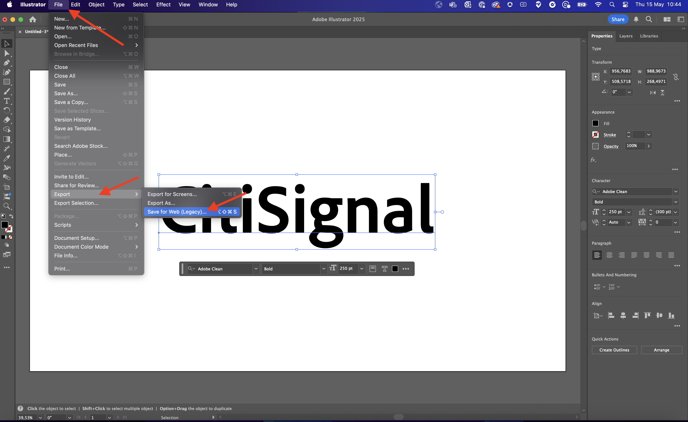
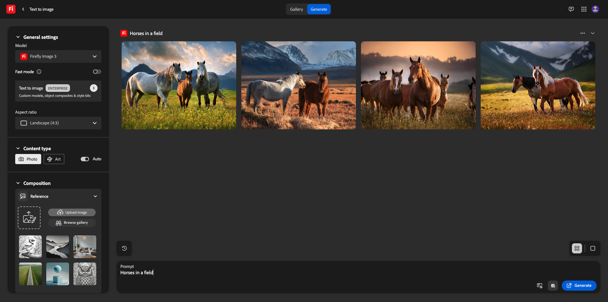

# 1.1.1 Guida introduttiva a Firefly Services

Scopri come utilizzare Postman e Adobe I/O per eseguire query sulle API di Adobe Firefly Services.

## 1.1.1.1 Prerequisiti

Prima di continuare con questo esercizio, devi aver completato la configurazione di [il tuo progetto Adobe I/O](./../../../modules/getting-started/gettingstarted/ex6.md) e devi anche aver configurato un&#39;applicazione per interagire con le API, ad esempio [Postman](./../../../modules/getting-started/gettingstarted/ex7.md) o [PostBuster](./../../../modules/getting-started/gettingstarted/ex8.md).

## 1.1.1.2 Esplora firefly.adobe.com - fase 1

Cominciamo ad esplorare Adobe Firefly Services. Per ulteriori informazioni, inizia con un esempio di generazione di immagini CitiSignal. Il team di progettazione di CitiSignal desidera generare una versione al neon del marchio CitiSignal. Vorrebbe usare Adobe Firefly Services per farlo.

La prima cosa che serve per ottenere questo risultato è una versione in bianco e nero del marchio CitiSignal, qualcosa di simile al seguente:


### 1.1.1.2.1 Crea l&#39;immagine di riferimento della composizione

Puoi utilizzare [questa immagine di esempio](./images/CitiSignal.jpg) oppure creare un testo personalizzato da sperimentare. Per creare un file di immagine personalizzato, segui i passaggi seguenti in Adobe Illustrator. Se si desidera utilizzare l&#39;immagine predefinita, saltare la sezione seguente e passare al passaggio **1.1.1.2.2 Generare direttamente l&#39;immagine**.

Apri **Adobe Illustrator**. Fare clic su **Nuovo file**.


Selezionare **Web-Large 1920 x 1080px**. Fai clic su **Crea**.


Dovresti avere questo. Fai clic sull&#39;icona di testo **T**.


Dovresti avere questo.


Modificare il tipo di carattere in un tipo di carattere scelto, in questo caso il tipo di carattere è **Adobe Clean Bold**.


Impostare la dimensione del carattere come preferita, in questo caso **250 pt**.


Dovresti avere questo.


Modificare il testo come desiderato, in questo caso **CitiSignal**.


Centra il testo nel file.


Vai a **File > Esporta > Salva per Web (versione precedente)**



Dovresti avere questo. Fai clic su **Salva**.


Assegna un nome al file e salvalo sul desktop. Fai clic su **Salva**.


### 1.1.1.2.2 Genera l&#39;immagine

Vai a [https://firefly.adobe.com](https://firefly.adobe.com). Fai clic sull&#39;icona **profilo** e accertati di aver effettuato l&#39;accesso all&#39;account **Account** a destra, che dovrebbe essere `--aepImsOrgName--`. Se necessario, fare clic su **Cambia profilo** per passare a tale account.


Immettere il prompt `neon light lettering on a brick wall of a night club`. Fai clic su **Genera**.


Dovresti avere qualcosa di simile a questo. Queste immagini non sono ancora utili. In **Composizione**, fare clic su **Carica immagine**.


Seleziona l&#39;immagine creata in precedenza, in questo caso **CitiSignal.jpg**. Fare clic su **Apri** e quindi su **Genera**.


Dovresti avere qualcosa di simile a questo. L&#39;applicazione del riferimento Composizione non è ancora ottimale. Per modificare questa impostazione, impostare il cursore **Forza** sul valore massimo. Fai di nuovo clic su **Genera**.


Sono ora disponibili diverse immagini che mostrano una versione neon del nome del marchio CitiSignal, che puoi utilizzare per eseguire ulteriori iterazioni.


Ora hai imparato a utilizzare Firefly per risolvere un problema di progettazione in pochi minuti.

## 1.1.1.3 Esplora firefly.adobe.com - fase 2

Vai a [https://firefly.adobe.com/generate/image](https://firefly.adobe.com/generate/image). Dovresti vedere questo. Fare clic sull&#39;elenco a discesa **Modello**. Sono disponibili 3 versioni di Adobe Firefly Services:

- Immagine Firefly 3
- Immagine Firefly 4
- Firefly Image 4 Ultra


>[!NOTE]
>
>Firefly Image 3 e Image 4 sono disponibili per tutti coloro che utilizzano Adobe Firefly Services, mentre Firefly Image 4 Ultra richiede una licenza Firefly Pro.

Fare clic per selezionare **Immagine Firefly 3** per questo esercizio.


Immettere il prompt `Horses in a field` e fare clic su **Genera**.


Dovresti vedere qualcosa di simile a questo.



Apri i **Strumenti per sviluppatori** nel browser.


Dovresti vedere questo. Passare alla scheda **Rete**. Quindi, fai di nuovo clic su **Genera**.


Immettere il termine di ricerca **generate-async**. Dovresti quindi visualizzare una richiesta denominata **generate-async**. Selezionala e passa a **Payload** dove visualizzerai i dettagli della richiesta.


La richiesta che vedi qui è la richiesta inviata al backend lato server di Firefly Services. Contiene diversi parametri importanti:

- **prompt**: questo è il prompt, che richiede che tipo di immagine deve essere generata da Firefly

- **seed**: in questa richiesta, i seed sono stati generati in modo casuale. Ogni volta che Firefly genera un&#39;immagine, per impostazione predefinita inizia il processo scegliendo un numero casuale denominato valore di inizializzazione. Questo numero casuale contribuisce a rendere univoca ogni immagine, il che è ottimo quando si desidera generare un’ampia varietà di immagini. Tuttavia, in alcuni casi potrebbe essere necessario generare immagini simili tra loro in più richieste. Ad esempio, quando Firefly genera un’immagine che desideri modificare utilizzando le altre opzioni di Firefly (come predefiniti di stile, immagini di riferimento, ecc.), utilizza il valore di inizializzazione di tale immagine nelle richieste HTTP future per limitare la casualità delle immagini future e specifica quello desiderato.


Dai un’occhiata di nuovo all’interfaccia utente. Modificare le **proporzioni** in **Widescreen (16:9)**.


Scorri verso il basso fino a **Effetti**, passa a **Temi** e seleziona un effetto come **Art deco**.


Assicurati che **Strumenti per sviluppatori** sia ancora aperto nel browser. Quindi, fare clic su **Genera** ed esaminare la richiesta di rete inviata.


Quando analizzi i dettagli della richiesta di rete, visualizzerai quanto segue:

- **prompt** non è stato modificato rispetto alla richiesta precedente
- **seed** sono cambiati rispetto alla richiesta precedente
- **dimensioni** è stato modificato in base alla modifica in **Proporzioni**.
- Sono stati aggiunti **stili** con un riferimento all&#39;effetto **art_deco** selezionato


Per il prossimo esercizio, dovrai utilizzare uno dei numeri **seed**. Annotare un numero di seed desiderato.

>[!NOTE]
>
>I numeri di seed sono numeri casuali scelti al momento del clic su **Genera**. Se desideri che l&#39;immagine generata abbia un aspetto coerente tra più richieste di **Generate**, è importante ricordare e specificare il **numero di seed** desiderato nelle richieste future.

Nel prossimo esercizio, eseguirai operazioni simili con Firefly Services, ma in seguito utilizzerai l’API invece dell’interfaccia utente. In questo esempio, il numero di seed è **142194** per la prima immagine, con 2 cavalli che si guardano l&#39;un l&#39;altro con le teste rivolte l&#39;uno verso l&#39;altro.

## 1.1.1.4 Adobe I/O - access_token

Nella raccolta **Adobe IO - OAuth**, selezionare la richiesta denominata **POST - Ottieni token di accesso** e selezionare **Invia**. La risposta deve contenere un nuovo **accestoken**.


## API Firefly Services 1.1.1.5, immagine testo 2, immagine 3

Ora che disponi di un access_token valido e aggiornato, puoi inviare la tua prima richiesta alle API di Firefly Services.

Seleziona la richiesta denominata **POST - Firefly - T2I V3** dalla raccolta **FF - Firefly Services Tech Insiders**. Vai al **Corpo** e verifica la richiesta. Fai clic su **Invia**.

La richiesta in uso è una **richiesta sincrona**, che fornisce una risposta contenente l&#39;immagine richiesta in pochi secondi.

>[!NOTE]
>
>Con il rilascio di Firefly Image 4 e Image 4 Ultra, le richieste sincrone diventeranno obsolete a favore delle richieste asincrone. Troverai esercizi sulle richieste asincrone più avanti in questa esercitazione.


Copia (o fai clic) sull’URL dell’immagine dalla risposta e aprilo nel browser web per visualizzarla.


Dovresti vedere una bella immagine che rappresenta `horses in a field`.


Nel **Corpo** della richiesta **POST - Firefly - T2I V3**, aggiungere quanto segue nel campo `"promptBiasingLocaleCode": "en-US"` e sostituire la variabile `XXX` con uno dei numeri di seed utilizzati in modo casuale dall&#39;interfaccia utente di Firefly Services. In questo esempio, il numero **seed** è `142194`.

```json
,
  "seeds": [
    XXX
  ]
```

Fai clic su **Invia**. Riceverai quindi una risposta con una nuova immagine generata da Firefly Services. Apri l’immagine per visualizzarla.


Dovresti quindi visualizzare una nuova immagine con lievi differenze, in base al **seed** utilizzato. Il seme `142194` aveva 2 cavalli che si guardavano l&#39;un l&#39;altro con la testa rivolta verso l&#39;altro.


Quindi, in **Body** della richiesta **POST - Firefly - T2I V3**, incolla l&#39;oggetto **styles** sotto l&#39;oggetto **seed**. Lo stile dell&#39;immagine generata verrà modificato in **art_deco**.

```json
,
  "contentClass": "art",
  "styles": {
    "presets": [
      "art_deco"
    ],
    "strength": 50
  }
```

Dovresti avere questo. Fai clic su **Invia**.


Fai clic sull’URL dell’immagine per aprirlo.


L&#39;immagine è cambiata un po&#39;. Quando applicate i predefiniti di stile, l&#39;immagine di partenza non viene più applicata come prima. Nel complesso, con l’intelligenza artificiale generativa, è molto difficile garantire che la stessa combinazione di parametri inpunt porti alla generazione della stessa immagine.


Rimuovi il codice per l&#39;oggetto **seed** dal **Body** della richiesta. Fai clic su **Invia**, quindi fai clic sull&#39;URL dell&#39;immagine che ottieni dalla risposta.

```json
,
  "seeds": [
    XXX
  ]
```


L&#39;immagine è cambiata di nuovo un po&#39;.


## API Firefly Services 1.1.1.6, Gen Expand

Seleziona la richiesta denominata **POST - Firefly - Gen Expand** dalla raccolta **FF - Firefly Services Tech Insiders** e passa al **Body** della richiesta.

- **size**: immettere la risoluzione desiderata. Il valore inserito in questo campo deve essere maggiore delle dimensioni originali dell&#39;immagine e non può essere maggiore di 3999.
- **image.source.url**: questo campo richiede un collegamento all&#39;immagine che deve essere espanso. In questo esempio, viene utilizzata una variabile per fare riferimento all&#39;immagine generata nell&#39;esercizio precedente.

- **allineamento orizzontale**: valori accettati: `"center"`,`"left`, `"right"`.
- **allineamento verticale**: valori accettati: `"center"`,`"top`, `"bottom"`.


Fai clic sull’URL dell’immagine che fa parte della risposta.


Ora l&#39;immagine generata nell&#39;esercizio precedente è stata espansa alla risoluzione di 3999x3999.


Quando modificate l&#39;allineamento del posizionamento, anche l&#39;output sarà leggermente diverso. In questo esempio, il posizionamento viene modificato in **left, bottom**. Fai clic su **Invia** e quindi su per aprire l&#39;URL dell&#39;immagine generata.


Dovreste quindi vedere che l&#39;immagine originale viene utilizzata in un posizionamento diverso, che influenza l&#39;intera immagine.


## API Firefly Services 1.1.1.7, immagine Text 2, immagine Image 4 e immagine 4 Ultra

### 1.1.1.7.1 image4_standard

Seleziona la richiesta denominata **POST - Firefly - T2I V4** dalla raccolta **FF - Firefly Services Tech Insiders** e passa alle **Intestazioni** della richiesta.

Noterai che l&#39;URL della richiesta è diverso dalla richiesta **Firefly Services API, Text 2 Image, Image 3**, che era **https://firefly-api.adobe.io/v3/images/generate**. Questo URL punta a **https://firefly-api.adobe.io/v3/images/generate-async**. L&#39;aggiunta di **-async** nell&#39;URL indica che si sta utilizzando l&#39;endpoint asincrono.

Nelle variabili **Header** noterai una nuova variabile denominata **x-model-version**. Questa è un’intestazione obbligatoria quando si interagisce con Firefly Image 4 e Image 4 Ultra. Per utilizzare Firefly Image 4 o Image 4 Ultra durante la generazione delle immagini, il valore dell&#39;intestazione deve essere impostato su `image4_standard` o `image4_ultra`. In questo esempio utilizzerai `image4_standard`.


Vai al **Corpo** della richiesta. Dovresti notare che nel corpo sono richieste 4 varianti di immagini. Il prompt è invariato rispetto a prima e richiede la generazione di **cavalli in un campo**. Fai clic su **Invia**


Riceverai quindi una risposta immediata. A differenza delle precedenti richieste sincrone utilizzate, questa risposta non contiene gli URL immagine delle immagini generate. Non contiene l&#39;URL del rapporto sullo stato del processo avviato e contiene un altro URL che consente di annullare il processo in esecuzione.


Per controllare la relazione sullo stato del processo in esecuzione, selezionare la richiesta denominata **GET - Firefly - Ottieni relazione sullo stato** dalla raccolta **FF - Firefly Services Tech Insiders**. Fare clic per aprirlo e quindi su **Invia**.


Viene quindi visualizzato il rapporto sullo stato del processo di generazione delle immagini appena avviato. Verificare il campo **status**, poiché potrebbe essere impostato su **running**, il che significa che il processo non è ancora stato completato. In questo esempio, lo stato del processo è impostato su **completato**, il che significa che le immagini richieste sono state generate.


Scorri verso il basso nella risposta per vedere un totale di 4 varianti di immagine restituite da Adobe Firefly Services. Fai clic sull’URL di una delle immagini (o copialo) e aprilo nel browser.


Dovresti quindi vedere un&#39;immagine iperrealistica di **cavalli in un campo**.


### 1.1.1.7.2 image4_ultra

Torna alla richiesta denominata **POST - Firefly - T2I V4** dalla raccolta **FF - Firefly Services Tech Insiders** e passa alle **Intestazioni** della richiesta.

Modificare la variabile **x-model-version** in `image4_ultra`. In questo esempio utilizzerai `image4_standard`.


Vai al **Corpo** della richiesta. Nel corpo, modifica il numero di varianti di immagine in 1 come con Firefly Image 4 Ultra, è possibile generare solo 1 immagine alla volta. Il prompt è invariato rispetto a prima e richiede la generazione di **cavalli in un campo**. Fai clic su **Invia**


La risposta contiene nuovamente un URL del rapporto sullo stato del processo avviato e un altro URL che consente di annullare il processo in esecuzione.


Per controllare la relazione sullo stato del processo in esecuzione, selezionare la richiesta denominata **GET - Firefly - Ottieni relazione sullo stato** dalla raccolta **FF - Firefly Services Tech Insiders**. Fare clic per aprirlo e quindi su **Invia**.


Viene quindi visualizzato il rapporto sullo stato del processo di generazione delle immagini appena avviato. Verificare il campo **status**, poiché potrebbe essere impostato su **running**, il che significa che il processo non è ancora stato completato. In questo esempio, lo stato del processo è impostato su **completato**, il che significa che le immagini richieste sono state generate.


Dovresti quindi vedere un&#39;immagine iperrealistica di **cavalli in un campo**.


## Passaggi successivi

Vai a [Ottimizza il processo Firefly utilizzando Microsoft Azure e gli URL prefirmati](./ex2.md){target="_blank"}

Torna a [Panoramica di Adobe Firefly Services](./firefly-services.md){target="_blank"}

Torna a [Tutti i moduli](./../../../overview.md){target="_blank"}
