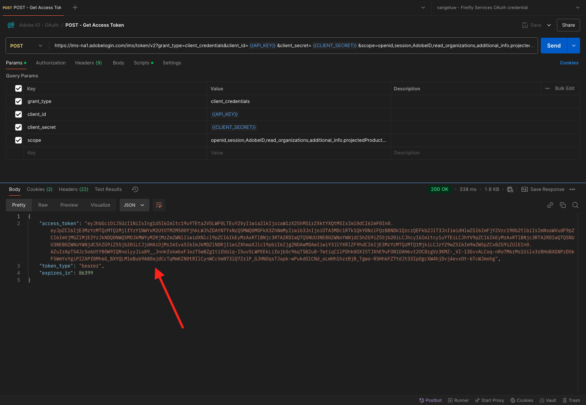
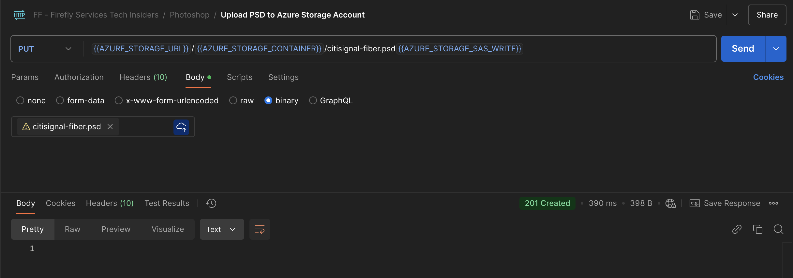

# 1.1.3 Utilizzo delle API di Photoshop

Scopri come utilizzare le API di Photoshop e Firefly Services.

## 1.1.3.1 Prerequisiti

Prima di continuare con questo esercizio, devi aver completato la configurazione di [il tuo progetto Adobe I/O](./../../../modules/getting-started/gettingstarted/ex6.md) e devi anche aver configurato un&#39;applicazione per interagire con le API, ad esempio [Postman](./../../../modules/getting-started/gettingstarted/ex7.md) o [PostBuster](./../../../modules/getting-started/gettingstarted/ex8.md).

## 1.1.3.2 Adobe I/O - access_token

Nella raccolta **Adobe IO - OAuth**, selezionare la richiesta denominata **POST - Ottieni token di accesso** e selezionare **Invia**. La risposta deve contenere un nuovo **accestoken**.

{zoomable="yes"}

## 1.1.3.3 interagisce a livello di programmazione con un file PSD

Scarica [citisignal-fiber.psd](./../../../assets/ff/citisignal-fiber.psd){target="_blank"} sul desktop.

Apri **citisignal-fiber.psd** in Photoshop.

{zoomable="yes"}

Nel riquadro **Livelli**, l&#39;autore del file ha assegnato un nome univoco a ogni livello. Potete visualizzare le informazioni sui livelli aprendo il file PSD in Photoshop, ma potete anche farlo a livello di programmazione.

Inviiamo la tua prima richiesta API alle API di Photoshop.

### API Photoshop - Hello World

Ora, supponiamo di salutare le API di Photoshop per verificare se tutte le autorizzazioni e l’accesso sono impostati correttamente.

Nella raccolta **Photoshop**, apri la richiesta **Photoshop Hello (autenticazione test).**. Seleziona **Invia**.

{zoomable="yes"}

Dovresti ricevere la risposta **Benvenuto nell&#39;API Photoshop!**.

{zoomable="yes"}

Quindi, per interagire a livello di programmazione con il file PSD **citisignal-fiber.psd**, devi caricarlo nel tuo account di archiviazione. Puoi farlo manualmente trascinandolo nel contenitore utilizzando Azure Storage Explorer, ma questa volta dovresti farlo tramite l’API.

### Carica PSD in Azure

In Postman, apri la richiesta **Carica PSD nell&#39;account di archiviazione Azure**. Nell’esercizio precedente, hai configurato queste variabili di ambiente in Postman, che utilizzerai ora:

- `AZURE_STORAGE_URL`
- `AZURE_STORAGE_CONTAINER`
- `AZURE_STORAGE_SAS_READ`
- `AZURE_STORAGE_SAS_WRITE`

Come è possibile vedere nella richiesta **Carica PSD nell&#39;account di archiviazione Azure**, l&#39;URL è configurato per utilizzare queste variabili.

{zoomable="yes"}

In **Body**, selezionare il file **citisignal-fiber.psd**.

{zoomable="yes"}

Lo schermo dovrebbe essere simile al seguente. Seleziona **Invia**.

{zoomable="yes"}

È necessario ottenere questa risposta vuota da Azure, il che significa che il file è archiviato nel contenitore nell’account di archiviazione di Azure.

{zoomable="yes"}

Se utilizzi Azure Storage Explorer per esaminare il file, assicurati di aggiornare la cartella.

{zoomable="yes"}

### API Photoshop - Ottieni manifesto

Successivamente, devi ottenere il file manifesto del tuo file PSD.

In Postman aprire la richiesta **Photoshop - Ottieni manifesto PSD**. Vai a **Corpo**.

Il corpo deve essere simile al seguente:

```json
  {
    "inputs": [
      {
        "storage": "external",
        "href": "{{AZURE_STORAGE_URL}}/{{AZURE_STORAGE_CONTAINER}}/citisignal-fiber.psd{{AZURE_STORAGE_SAS_READ}}"
      }
    ],
    "options": {
      "thumbnails": {
        "type": "image/jpeg"
      }
    }
  }
```

Seleziona **Invia**.

Nella risposta viene visualizzato un collegamento. Poiché il completamento delle operazioni in Photoshop a volte può richiedere un po’ di tempo, Photoshop fornisce un file di stato come risposta alla maggior parte delle richieste in arrivo. Per capire cosa sta succedendo con la tua richiesta, devi leggere il file di stato.

{zoomable="yes"}

Per leggere il file di stato, aprire la richiesta **Photoshop - Ottieni stato PS**. È possibile vedere che questa richiesta utilizza una variabile come URL, che è una variabile impostata dalla richiesta precedente inviata, **Photoshop - Ottieni manifesto PSD**. Le variabili sono impostate negli **Script** di ogni richiesta. Seleziona **Invia**.

{zoomable="yes"}

Lo schermo dovrebbe essere simile al seguente. Attualmente, lo stato è impostato su **in sospeso**, il che significa che il processo non è ancora completato.

{zoomable="yes"}

Selezionare invia altre volte in **Photoshop - Ottieni stato PS**, fino a quando lo stato non cambia in **completato**. L&#39;operazione potrebbe richiedere alcuni minuti.

Quando la risposta è disponibile, puoi vedere che il file json contiene informazioni su tutti i livelli del file PSD. Si tratta di informazioni utili, in quanto è possibile identificare elementi come il nome o l’ID del livello.

{zoomable="yes"}

Ad esempio, cercare il testo `2048x2048-cta`. Lo schermo dovrebbe essere simile al seguente:

{zoomable="yes"}

### API Photoshop - Modifica testo

Successivamente, devi modificare il testo per call to action utilizzando le API.

In Postman, apri la richiesta **Photoshop - Cambia testo** e passa a **Corpo**.

Lo schermo dovrebbe essere simile al seguente:

- viene innanzitutto specificato un file di input: `citisignal-fiber.psd`
- in secondo luogo, viene specificato il livello da modificare, con il testo da modificare in
- terzo, è specificato un file di output: `citisignal-fiber-changed-text.psd`

```json
  {
    "inputs": [
      {
        "storage": "external",
        "href": "{{AZURE_STORAGE_URL}}/{{AZURE_STORAGE_CONTAINER}}/citisignal-fiber.psd{{AZURE_STORAGE_SAS_READ}}"
      }
    ],
    "options": {
      "layers": [
        {
          "name": "2048x2048-cta",
          "text": {
            "content": "Get Fiber now!"
          }
        }
      ]
    },
    "outputs": [
      {
        "storage": "azure",
        "href": "{{AZURE_STORAGE_URL}}/{{AZURE_STORAGE_CONTAINER}}/citisignal-fiber-changed-text.psd{{AZURE_STORAGE_SAS_WRITE}}",
        "type": "vnd.adobe.photoshop",
        "overwrite": true
      }
    ]
  }
```

Il nome del file di output è diverso, in quanto non si desidera ignorare il file di input originale.

Seleziona **Invia**.

{zoomable="yes"}

Proprio come prima, la risposta contiene un collegamento che punta al file di stato che tiene traccia dell’avanzamento.

{zoomable="yes"}

Per leggere il file di stato, apri la richiesta **Photoshop - Ottieni stato PS** e seleziona **Invia**. Se lo stato non è impostato su **completato** immediatamente, attendere alcuni secondi e selezionare di nuovo **Invia**.

Seleziona l’URL per scaricare il file di output.

{zoomable="yes"}

Apri **citisignal-fiber-changed-text.psd** dopo aver scaricato il file sul computer. Dovresti vedere che il segnaposto per call to action è stato sostituito dal testo **Get Fiber now!**.

{zoomable="yes"}

Puoi anche visualizzare questo file nel contenitore utilizzando Azure Storage Explorer.

{zoomable="yes"}

## Passaggi successivi

Vai a [API modelli personalizzati Firefly](./ex4.md){target="_blank"}

Torna a [Panoramica di Adobe Firefly Services](./firefly-services.md){target="_blank"}

Torna a [Tutti i moduli](./../../../overview.md){target="_blank"}