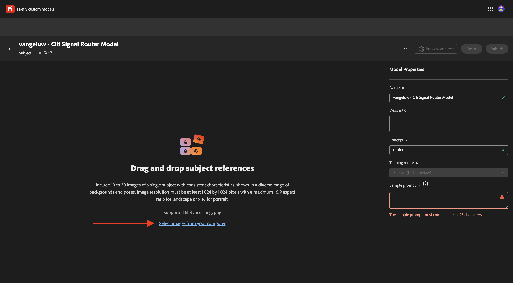
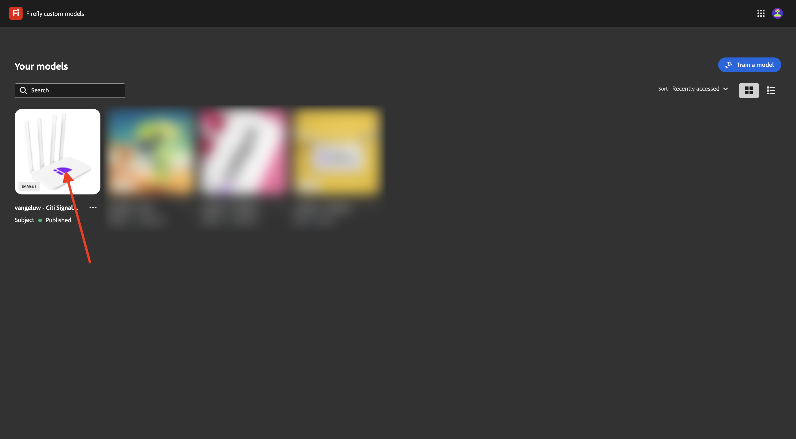
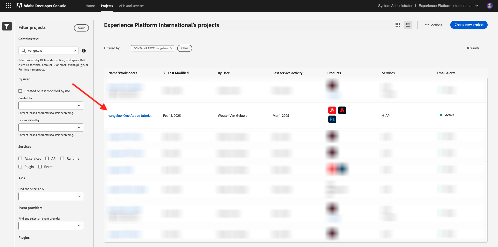

# API per modelli personalizzati Firefly 1.1.4

## 1.1.4.1 Cosa sono i modelli personalizzati di Firefly?

Con i modelli personalizzati di Firefly, puoi generare varianti di immagine allineate al tuo marchio utilizzando la funzione Testo in immagine. Addestrando questi modelli con le tue immagini, puoi generare contenuti che riflettono l’identità del tuo marchio.
Trasforma il tuo stile o il tuo oggetto per esplorare nuove idee, visualizzare ambienti diversi, generare contenuti innovativi e adattare i contenuti a segmenti specifici.

Con i modelli personalizzati di Firefly puoi...

- Creare idee e concetti sul marchio
- Produrre temi di carattere con stili coerenti
- Creare stili di brand coerenti per espandere rapidamente le campagne

Per ottenere questo risultato, i modelli personalizzati di Firefly supportano:

- Modelli di oggetto personalizzati
- Modelli di stile personalizzati

### Modelli di oggetto personalizzati

Quando si addestrano modelli personalizzati su un argomento specifico, che si tratti di oggetti o di caratteri, l’obiettivo è quello di identificare le caratteristiche essenziali del soggetto e aiutare il modello a replicarle in vari contesti e posizioni.

Durante la formazione di un modello di soggetto, cerca le immagini con le seguenti caratteristiche:

- Coerenza oggetto: fornire immagini della stessa marca e dello stesso modello del soggetto, assicurandosi che il soggetto non sia molto diverso tra le immagini. Evitare di mescolare più colori e garantire un tema o un motivo comune tra le immagini. Tuttavia, il soggetto può variare tra scene, pose, vestiti e sfondo.
- Focus sull’oggetto: utilizza immagini del soggetto in chiaro focus senza distrazioni inutili. Tenere il soggetto vicino al centro dell&#39;immagine e assicurarsi che occupi almeno il 25% dell&#39;area dell&#39;immagine.
- Contesto ambientale: fornire immagini del soggetto in diversi punti di vista e contesti, visualizzandole in varie condizioni di illuminazione. Anche se è possibile utilizzare immagini con sfondi bianchi o trasparenti, è meglio utilizzare un mix con ambienti più complessi.
- Evita altri oggetti: evita elementi di grandi dimensioni sullo sfondo o associati al carattere. Qualsiasi elemento di grandi dimensioni mostrato nelle immagini viene memorizzato dal modello e viene visualizzato nelle immagini generate, in modo simile allo stesso elemento nel set di dati di apprendimento.

### Modelli di stile personalizzati

I modelli personalizzati addestrati su uno stile identificano l’aspetto delle risorse per generare immagini simili quando richiesto.

Per addestrare un modello di stile efficace:

- Estetica simile: Includi immagini che mostrano varie scene e oggetti mantenendo lo stesso aspetto.
- Usa varie immagini: usa quante più immagini possibili per evitare che il modello si concentri troppo su oggetti o soggetti indesiderati.
- Evita frasi fisse: un modello fisso ha un peso maggiore rispetto ad altre frasi. Ad esempio, se ogni didascalia contiene &quot;Lo sfondo è di colore nero puro&quot; o &quot;stili di fumetto graziosi&quot;, il modello dipenderà da questa frase e qualsiasi richiesta di test senza di essa non genererà i risultati desiderati.

## 1.1.4.2 Configura il modello personalizzato

Vai a [https://firefly.adobe.com/](https://firefly.adobe.com/). Fare clic su **Modelli personalizzati**.

{zoomable="yes"}

È possibile che questo messaggio venga visualizzato. In caso contrario, fare clic su **Accetto** per continuare.

{zoomable="yes"}

Dovresti vedere questo. Fai clic su **Addestra un modello**.

{zoomable="yes"}

Configura i campi seguenti:

- **Nome**: utilizzare `--aepUserLdap-- - Citi Signal Router Model`
- **Modalità di formazione**: seleziona **Oggetto (anteprima tecnica)**
- **Concetto**: immettere `router`
- **Salva in**: apri l&#39;elenco a discesa e fai clic su **+ Crea nuovo progetto**

{zoomable="yes"}

Assegnare un nome al nuovo progetto: `--aepUserLdap-- - Custom Models`. Fai clic su **Crea**.

{zoomable="yes"}

Dovresti vedere questo. Fai clic su **Crea**.

{zoomable="yes"}

Ora devi fornire le immagini di riferimento per il modello personalizzato da addestrare. Fai clic su **Seleziona immagini dal computer**.

{zoomable="yes"}

Scarica le immagini di riferimento [qui](https://tech-insiders.s3.us-west-2.amazonaws.com/CitiSignal_router.zip). Decomprimi il file di download, che ti fornirà questo.

{zoomable="yes"}

Passare alla cartella contenente i file dell&#39;immagine di download. Selezionali tutti e fai clic su **Apri**.

{zoomable="yes"}

Si vedrà che le immagini vengono caricate.

{zoomable="yes"}

Dopo alcuni minuti, le immagini vengono caricate correttamente. È possibile che alcune immagini presentino un errore, dovuto al fatto che la didascalia dell’immagine non è stata generata o non è sufficientemente lunga. Esaminate ogni immagine con un errore e immettete una didascalia che soddisfi i requisiti e descriva l&#39;immagine.

{zoomable="yes"}

Una volta che tutte le immagini hanno sottotitoli che soddisfano i requisiti, è comunque necessario fornire un prompt di esempio. Immettere un prompt che utilizzi la parola &quot;router&quot;. Dopo aver fatto questo, puoi iniziare ad addestrare il tuo modello. Fai clic su **Addestra**.

{zoomable="yes"}

Poi vedrai questo. La formazione del modello può richiedere dai 20 ai 30 minuti o più.

{zoomable="yes"}

Dopo 20-30 minuti, il modello è ora addestrato e può essere pubblicato. Fai clic su **Pubblica**.

{zoomable="yes"}

Fai di nuovo clic su **Pubblica**.

{zoomable="yes"}

Chiudere la finestra a comparsa **Condividi modello personalizzato**.

{zoomable="yes"}

## 1.1.4.3 Utilizza il tuo modello personalizzato nell&#39;interfaccia utente

Vai a [https://firefly.adobe.com/cme/train](https://firefly.adobe.com/cme/train). Fai clic sul modello personalizzato per aprirlo.

{zoomable="yes"}

Fare clic su **Anteprima e prova**.

{zoomable="yes"}

Viene quindi visualizzato il prompt di esempio immesso prima dell&#39;esecuzione.

{zoomable="yes"}

## 1.1.4.4 Abilita il tuo modello personalizzato per l&#39;API dei modelli personalizzati di Firefly Services

Una volta che il modello personalizzato è stato addestrato, può essere utilizzato anche tramite l’API. Nell’esercizio 1.1.1 hai già configurato il progetto Adobe I/O per l’interazione con Firefly Services tramite l’API.

Vai a [https://firefly.adobe.com/cme/train](https://firefly.adobe.com/cme/train). Fai clic sul modello personalizzato per aprirlo.

{zoomable="yes"}

Fare clic sui tre punti **...** e quindi su **Condividi**.

{zoomable="yes"}

Per accedere a un modello personalizzato di Firefly, il modello personalizzato deve essere condiviso nella **e-mail account tecnico** del progetto Adobe I/O.

Per recuperare l&#39;**e-mail account tecnico**, vai a [https://developer.adobe.com/console/projects](https://developer.adobe.com/console/projects). Fare clic per aprire il progetto, denominato `--aepUserLdap-- One Adobe tutorial`.

{zoomable="yes"}

Fare clic su **Server-to-Server OAuth**.

{zoomable="yes"}

Fai clic per copiare l&#39;**e-mail account tecnico**.

{zoomable="yes"}

Incolla la **e-mail account tecnico** e fai clic su **Invita a modificare**.

{zoomable="yes"}

L&#39;**e-mail account tecnico** dovrebbe ora essere in grado di accedere al modello personalizzato.

{zoomable="yes"}

## 1.1.4.5 interagisce con l&#39;API dei modelli personalizzati di Firefly Services

Nell&#39;esercizio 1.1.1 Guida introduttiva a Firefly Services, hai scaricato il file [postman-ff.zip](./../../../assets/postman/postman-ff.zip) sul desktop locale e quindi hai importato la raccolta in Postman.

Apri Postman e vai alla cartella **FF - Modelli personalizzati API**.

{zoomable="yes"}

Apri la richiesta **1. FF - getCustomModels** e fare clic su **Invia**.

{zoomable="yes"}

Nella risposta dovrebbe essere visualizzato il modello personalizzato creato in precedenza, denominato `--aepUserLdap-- - Citi Signal Router Model`. Il campo **assetId** è l&#39;identificatore univoco del modello personalizzato a cui verrà fatto riferimento nella richiesta successiva.

{zoomable="yes"}

Apri la richiesta **2. Genera immagini asincrone**. In questo esempio, richiederai la generazione di 2 varianti in base al modello personalizzato. Puoi aggiornare il prompt che in questo caso è `a white router on a volcano in Africa`.

Fai clic su **Invia**.

{zoomable="yes"}

La risposta contiene un campo **jobId**. Il processo per generare queste 2 immagini è ora in esecuzione e puoi controllarne lo stato utilizzando la richiesta successiva.

{zoomable="yes"}

Apri la richiesta **3. Ottieni lo stato CM** e fai clic su **Invia**. A questo punto lo stato è impostato su In esecuzione.

{zoomable="yes"}

Dopo alcuni minuti, fare di nuovo clic su **Invia** per la richiesta **3. Ottieni stato CM**. Dovresti vedere che lo stato è cambiato in **completato** e che nell&#39;output dovrebbero essere presenti due URL di immagine. Fare clic per aprire entrambi i file.

{zoomable="yes"}

Questa è la prima immagine generata in questo esempio.

{zoomable="yes"}

Questa è la seconda immagine generata in questo esempio.

{zoomable="yes"}

Hai completato l&#39;esercizio.

## Passaggi successivi

Vai a [Riepilogo e vantaggi](./summary.md){target="_blank"}

Torna a [Utilizzo delle API di Photoshop](./ex3.md){target="_blank"}

Torna a [Panoramica di Adobe Firefly Services](./firefly-services.md){target="_blank"}
