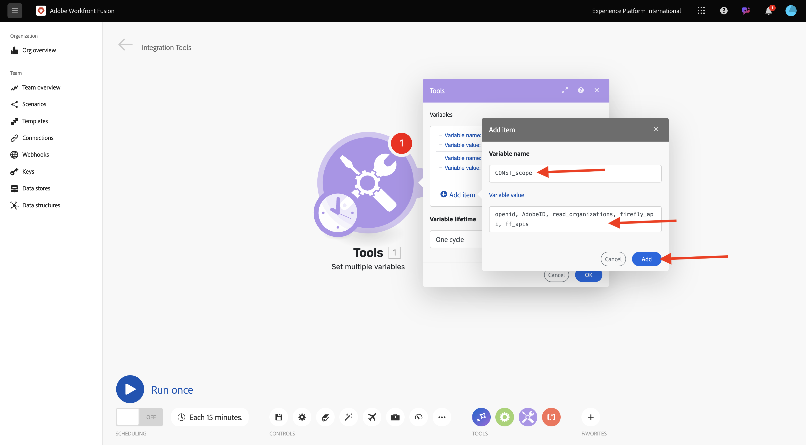
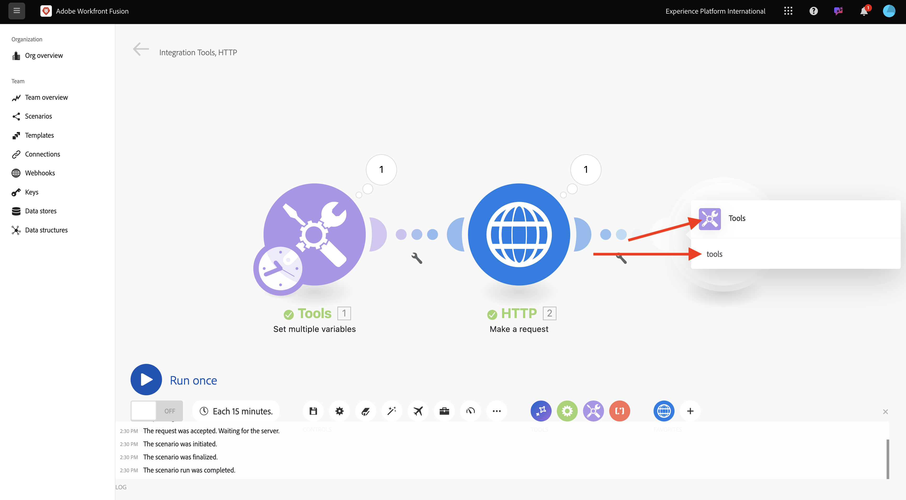
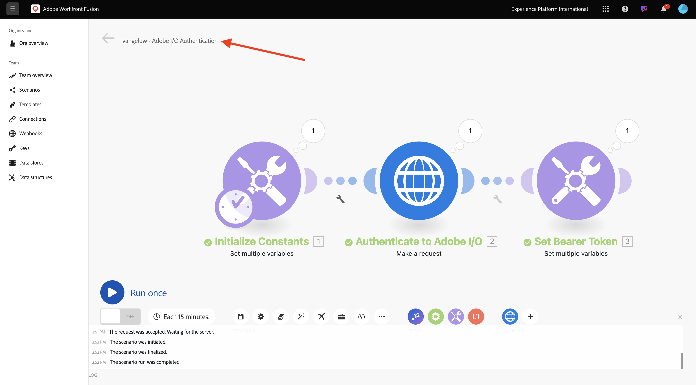

# 1.2.1 Guida introduttiva di Workfront Fusion

Scopri come utilizzare Workfront Fusion e Adobe I/O per eseguire query sulle API di Adobe Firefly Services.

## 1.2.1.1 Crea nuovo scenario

Vai a [https://experience.adobe.com/](https://experience.adobe.com/){target="_blank"}. Aprire **Workfront Fusion**.

Vai a **Scenari**.

Fai clic sull&#39;icona **+** per creare una nuova cartella per il tuo lavoro.

Assegna un nome alla cartella `--aepUserLdap--` e seleziona **Salva**.

Selezionare la cartella, quindi selezionare **Crea nuovo scenario**.

Viene visualizzato uno scenario vuoto. Selezionare **strumenti** e **Imposta più variabili**.

Sposta l&#39;icona **orologio** nelle **variabili multiple** appena aggiunte.

Lo schermo dovrebbe essere simile al seguente.

Fare clic con il pulsante destro del mouse sul punto interrogativo e selezionare **Elimina modulo**.

Fare clic con il pulsante destro del mouse su **Imposta più variabili** e selezionare **Impostazioni**.

## 1.2.1.2 Configurare l&#39;autenticazione Adobe I/O

Ora devi configurare le variabili necessarie per l’autenticazione in Adobe I/O. Nell’esercizio precedente, hai creato un progetto Adobe I/O. Le variabili di tale progetto Adobe I/O ora devono essere definite in Workfront Fusion.

È necessario definire le seguenti variabili:

| Chiave | Valore |
|:-------------:| :---------------:| 
| `CONST_client_id` | ID client del progetto Adobe I/O |
| `CONST_client_secret` | Segreto client del progetto Adobe I/O |
| `CONST_scope` | ambito del progetto Adobe I/O |

Trova queste variabili da [https://developer.adobe.com/console/projects](https://developer.adobe.com/console/projects){target="_blank"} e apri il tuo progetto Adobe I/O, che si chiama `--aepUserLdap-- One Adobe tutorial`.

Nel progetto, seleziona **OAuth Server-Server** per visualizzare i valori per le chiavi di cui sopra.

Utilizzando le chiavi e i valori di cui sopra, è possibile configurare l&#39;oggetto **Imposta più variabili**. Seleziona **Aggiungi elemento**.

Immetti il **Nome variabile**: **CONST_client_id** e il relativo **Valore variabile**, seleziona **Aggiungi**.

Seleziona **Aggiungi elemento**.

Immetti **Nome variabile**: **CONST_client_secret** e il relativo **Valore variabile**. Seleziona **Aggiungi**.

Seleziona **Aggiungi elemento**.

Immetti **Nome variabile**: **CONST_scope** e il relativo **Valore variabile**. Seleziona **Aggiungi**.

Selezionare **OK**.

Passa il puntatore del mouse su **Imposta più variabili** e seleziona l&#39;icona grande **+** per aggiungere un altro modulo.

Lo schermo dovrebbe essere simile al seguente.

Nella barra di ricerca immettere **http**. Seleziona **HTTP** per aprirlo.

Seleziona **Crea una richiesta**.

| Chiave | Valore |
|:-------------:| :---------------:| 
| `URL` | `https://ims-na1.adobelogin.com/ims/token/v3` |
| `Method` | `POST` |
| `Body Type` | `x-www-form-urlencoded` |

Seleziona **Aggiungi elemento**.

Aggiungi elementi per ciascuno dei seguenti valori:

| Chiave | Valore |
|:-------------:| :---------------:| 
| `client_id` | la variabile predefinita per `CONST_client_id` |
| `client_secret` | la variabile predefinita per `CONST_client_secret` |
| `scope` | la variabile predefinita per `CONST_scope` |
| `grant_type` | `client_credentials` |

Configurazione per `client_id`:

Configurazione per `client_secret`.

Configurazione per `scope`.

Configurazione per `grant_type`.

Scorri verso il basso e seleziona la casella per **Analizzare la risposta**. Selezionare **OK**.

Lo schermo dovrebbe essere simile al seguente. Selezionare **Esegui una volta**.

Una volta eseguito lo scenario, lo schermo dovrebbe essere simile al seguente:

Selezionare l&#39;icona **punto interrogativo** nell&#39;oggetto **Imposta più variabili** per visualizzare l&#39;evento che si è verificato durante l&#39;esecuzione dell&#39;oggetto.

Seleziona l&#39;icona **punto interrogativo** sull&#39;oggetto **HTTP - Richiedi** per visualizzare l&#39;evento che si è verificato durante l&#39;esecuzione dell&#39;oggetto. Nel **OUTPUT**, vedi il **access_token** restituito da Adobe I/O.

Passa il puntatore del mouse su **HTTP - Effettua una richiesta** e seleziona l&#39;icona **+** per aggiungere un altro modulo.

Nella barra di ricerca, cercare `tools`. Seleziona **Strumenti**.

Selezionare **Imposta più variabili**.

Seleziona **Aggiungi elemento**.

Imposta **Nome variabile** su `bearer_token`. Selezionare `access_token` come **valore di variabile** dinamico. Seleziona **Aggiungi**.

Lo schermo dovrebbe essere simile al seguente. Selezionare **OK**.

Seleziona di nuovo **Esegui**.

Una volta eseguito lo scenario, selezionare l&#39;icona **punto interrogativo** sull&#39;ultimo oggetto **Imposta più variabili**. Il token di accesso viene archiviato nella variabile `bearer_token`.

Fare quindi clic con il pulsante destro del mouse sul primo oggetto **Imposta più valori** e selezionare **Rinomina**.

Imposta il nome su **Inizializza costanti**. Selezionare **OK**.

Rinomina il secondo oggetto in **Autentica in Adobe I/O**. Selezionare **OK**.

Rinomina il terzo oggetto in **Imposta token Bearer**. Selezionare **OK**.

Lo schermo dovrebbe essere simile al seguente:

Quindi, cambia il nome dello scenario in `--aepUserLdap-- - Adobe I/O Authentication`.

Seleziona **Salva**.

## Passaggi successivi

Vai a [Utilizza le API di Adobe in Workfront Fusion](./ex2.md){target="_blank"}

Torna a [Automazione dei flussi di lavoro Creative con Workfront Fusion](./automation.md){target="_blank"}

Torna a [Tutti i moduli](./../../../overview.md){target="_blank"}
