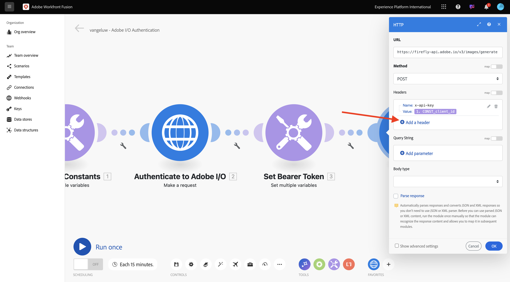
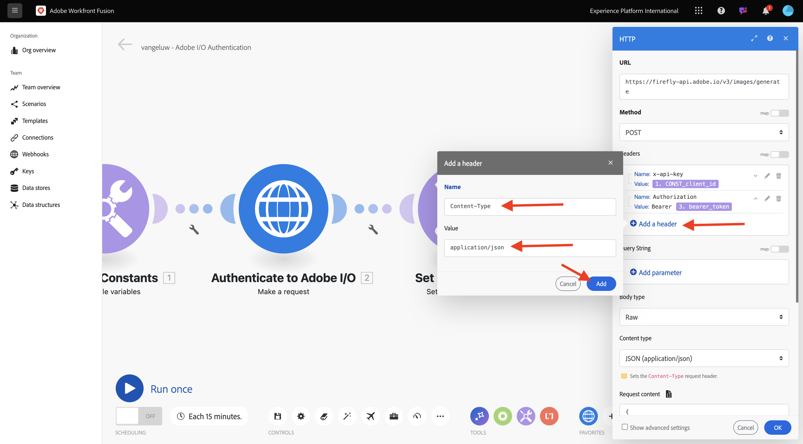
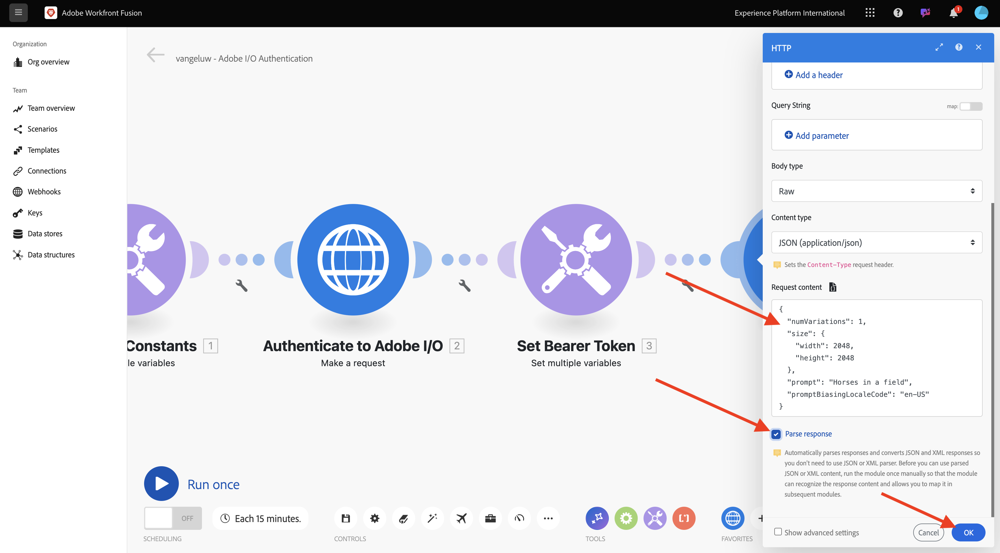
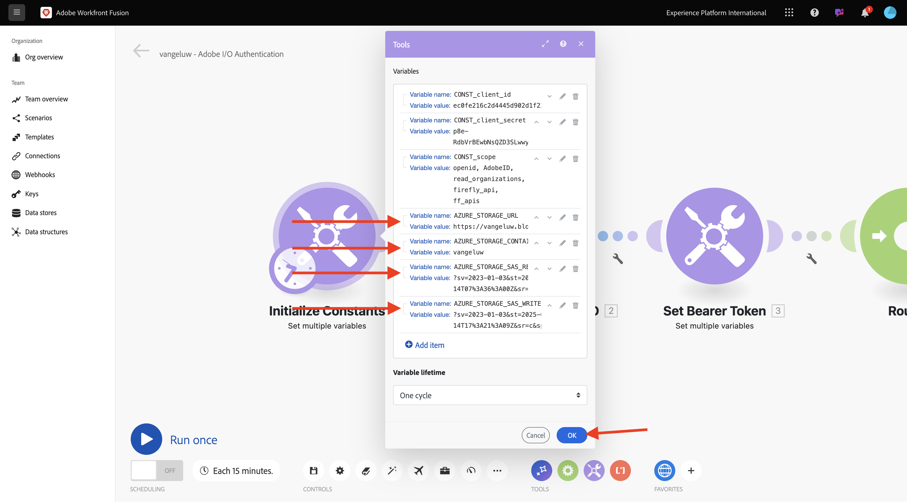
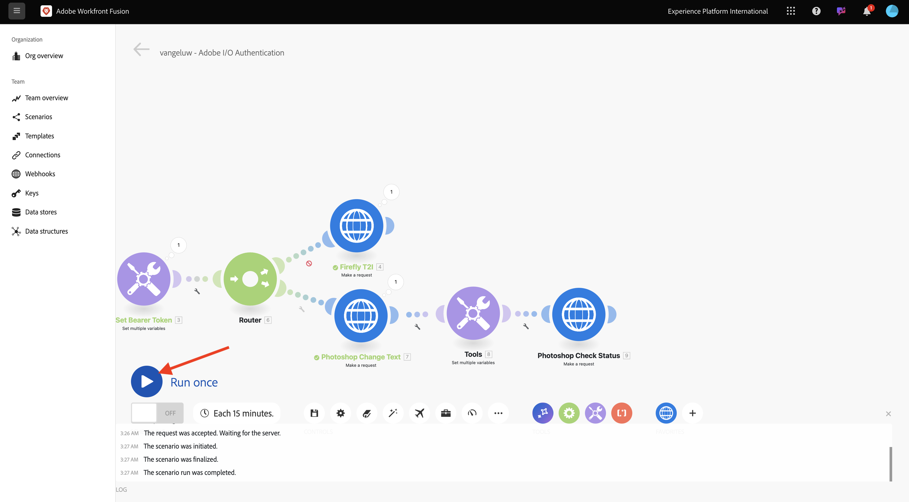
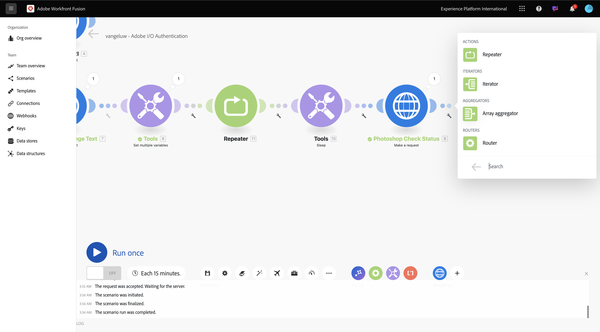
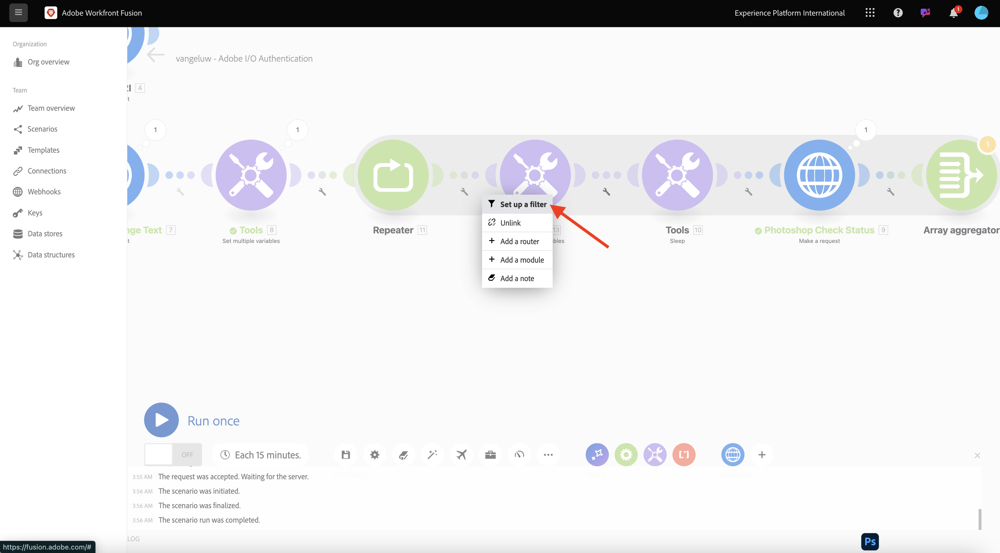
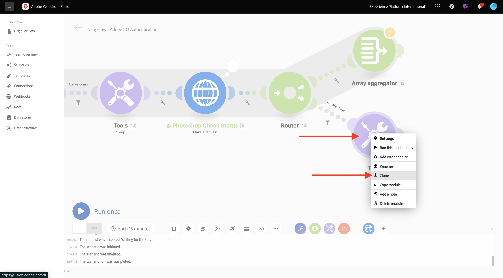
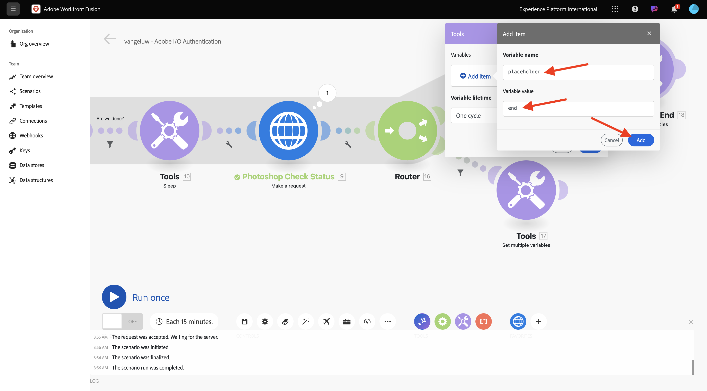

# 1.2.2 Utilizzare le API di Adobe in Workfront Fusion

Scopri come utilizzare le API di Adobe in Workfront Fusion.

## 1.2.2.1 Utilizzare Firefly Text To Image API con Workfront Fusion

1. Passa il puntatore del mouse sul secondo nodo **Imposta più variabili** e seleziona **+** per aggiungere un altro modulo.


1. Cerca **http** e seleziona **HTTP**.


1. Seleziona **Crea una richiesta**.


1. Seleziona queste variabili:

- **URL**: `https://firefly-api.adobe.io/v3/images/generate`
- **Metodo**: `POST`

1. Seleziona **Aggiungi un&#39;intestazione**.


1. Immetti le seguenti intestazioni:

| Chiave | Valore |
|:-------------:| :---------------:| 
| `x-api-key` | la variabile archiviata per `CONST_client_id` |
| `Authorization` | `Bearer ` + la variabile archiviata per `bearer_token` |
| `Content-Type` | `application/json` |
| `Accept` | `*/*` |

1. Immettere i dettagli per `x-api-key`. Seleziona **Aggiungi**.


1. Seleziona **Aggiungi un&#39;intestazione**.



1. Immettere i dettagli per `Authorization`. Seleziona **Aggiungi**.


1. Seleziona **Aggiungi un&#39;intestazione**. Immettere i dettagli per `Content-Type`. Seleziona **Aggiungi**.



1. Seleziona **Aggiungi un&#39;intestazione**. Immettere i dettagli per `Accept`. Seleziona **Aggiungi**.


1. Imposta **Body type** su **Raw**. Per **Tipo di contenuto**, selezionare **JSON (application/json)**.


1. Incolla questo payload nel campo **Contenuto richiesta**.

```json
{
  "numVariations": 1,
  "size": {
    "width": 2048,
    "height": 2048
  },
  "prompt": "Horses in a field",
  "promptBiasingLocaleCode": "en-US"
}
```

1. Seleziona la casella per **Risposta di analisi**. Selezionare **OK**.



1. Selezionare **Esegui una volta**.


Lo schermo dovrebbe essere simile al seguente.


1. Selezionare **?Icona** sul quarto nodo HTTP per visualizzare la risposta. Dovresti trovare un file di immagine nella risposta.


1. Copia l’URL dell’immagine e aprilo in una finestra del browser. Lo schermo dovrebbe essere simile al seguente:


1. Fare clic con il pulsante destro del mouse su **HTTP** e rinominare **Firefly T2I**.


1. Seleziona **Salva** per salvare le modifiche.


## 1.2.2.2 Utilizzare l’API Photoshop con Workfront Fusion

1. Selezionare **chiave inglese** tra i nodi **Imposta token Bearer** e **Firefly T2I**. Selezionare **Aggiungi un router**.


1. Fare clic con il pulsante destro del mouse sull&#39;oggetto **Firefly T2I** e selezionare **Clone**.


1. Trascina e rilascia l&#39;oggetto clonato vicino all&#39;oggetto **Router**, che si connette automaticamente al **Router**. Lo schermo dovrebbe essere simile al seguente:


È ora disponibile una copia identica basata sulla richiesta HTTP **Firefly T2I**. Alcune impostazioni della richiesta HTTP **Firefly T2I** sono simili a quelle necessarie per interagire con l&#39;**API Photoshop**, che consente di risparmiare tempo. Ora devi solo modificare le variabili che non sono uguali, come l’URL della richiesta e il payload.

1. Cambia **URL** in `https://image.adobe.io/pie/psdService/text`.


1. Sostituisci **Richiedi contenuto** con il seguente payload:

```json
{
  "inputs": [
    {
      "storage": "external",
      "href": "{{AZURE_STORAGE_URL}}/{{AZURE_STORAGE_CONTAINER}}/citisignal-fiber.psd{{AZURE_STORAGE_SAS_READ}}"
    }
  ],
  "options": {
    "layers": [
      {
        "name": "2048x2048-button-text",
        "text": {
          "content": "Click here"
        }
      },
      {
        "name": "2048x2048-cta",
        "text": {
          "content": "Buy this stuff"
        }
      }
    ]
  },
  "outputs": [
    {
      "storage": "azure",
      "href": "{{AZURE_STORAGE_URL}}/{{AZURE_STORAGE_CONTAINER}}/citisignal-fiber-changed-text.psd{{AZURE_STORAGE_SAS_WRITE}}",
      "type": "vnd.adobe.photoshop",
      "overwrite": true
    }
  ]
}
```


Per il corretto funzionamento di **Richiedi contenuto**, mancano alcune variabili:

- `AZURE_STORAGE_URL`
- `AZURE_STORAGE_CONTAINER`
- `AZURE_STORAGE_SAS_READ`
- `AZURE_STORAGE_SAS_WRITE`

1. Torna al primo nodo, seleziona **Inizializza costanti**, quindi scegli **Aggiungi elemento** per ciascuna di queste variabili.


| Chiave | Esempio di valore |
|:-------------:| :---------------:| 
| `AZURE_STORAGE_URL` | `https://vangeluw.blob.core.windows.net` |
| `AZURE_STORAGE_CONTAINER` | `vangeluw` |
| `AZURE_STORAGE_SAS_READ` | `?sv=2023-01-03&st=2025-01-13T07%3A36%3A35Z&se=2026-01-14T07%3A36%3A00Z&sr=c&sp=rl&sig=4r%2FcSJLlt%2BSt9HdFdN0VzWURxRK6UqhB8TEvbWkmAag%3D` |
| `AZURE_STORAGE_SAS_WRITE` | `?sv=2023-01-03&st=2025-01-13T17%3A21%3A09Z&se=2025-01-14T17%3A21%3A09Z&sr=c&sp=racwl&sig=FD4m0YyyqUj%2B5T8YyTFJDi55RiTDC9xKtLTgW0CShps%3D` |

Puoi trovare le variabili tornando a Postman e aprendo **Variabili di ambiente**.


1. Copiate questi valori in Workfront Fusion e aggiungete un nuovo elemento per ciascuna di queste 4 variabili.

1. Lo schermo dovrebbe essere simile al seguente. Selezionare **OK**.



Quindi, torna alla richiesta HTTP clonata per aggiornare il **contenuto della richiesta**. Osserva le variabili nere in **Contenuto richiesta**, che sono le variabili copiate da Postman. È necessario passare alle variabili appena definite in Workfront Fusion. Sostituire ciascuna variabile con una eliminando il testo nero e sostituendolo con la variabile corretta.


1. Apporta queste 3 modifiche nella sezione **input**. Selezionare **OK**.


1. Apporta queste 3 modifiche nella sezione **output**. Selezionare **OK**.


1. Fare clic con il pulsante destro del mouse sul nodo clonato e selezionare **Rinomina**. Cambia il nome in **Testo modifica Photoshop**.


Lo schermo dovrebbe essere simile al seguente:


1. Selezionare **Esegui una volta**.


1. Seleziona l&#39;icona **ricerca** nel nodo **Testo di modifica di Photoshop** per visualizzare la risposta. Dovresti avere una risposta simile a questa, con un collegamento a un file di stato.


1. Prima di continuare con le interazioni API di Photoshop, disabilita la route al nodo **Firefly T2I** per non inviare chiamate API non necessarie all&#39;endpoint API. Selezionare l&#39;icona **chiave inglese**, quindi selezionare **Disattiva route**.


Lo schermo dovrebbe essere simile al seguente:


1. Quindi, aggiungere un altro nodo **Imposta più variabili**.


1. Inseriscilo dopo il nodo **Testo modifica Photoshop**.


1. Selezionare il nodo **Imposta più variabili**, selezionare **Aggiungi elemento**. Seleziona il valore della variabile dalla risposta della richiesta precedente.

| Nome variabile | Valore variabile |
|:-------------:| :---------------:| 
| `psdStatusUrl` | `data > _links > self > href` |

1. Seleziona **Aggiungi**.


1. Selezionare **OK**.


1. Fare clic con il pulsante destro del mouse sul nodo **Testo modifica Photoshop** e selezionare **Clona**.


1. Trascina la richiesta HTTP clonata dopo il nodo **Imposta più variabili** appena creato.


1. Fai clic con il pulsante destro del mouse sulla richiesta HTTP clonata, seleziona **Rinomina** e cambia il nome in **Stato controllo Photoshop**.


1. Seleziona per aprire la richiesta HTTP. Modificare l&#39;URL in modo che faccia riferimento alla variabile creata nel passaggio precedente e impostare **Method** su **GET**.


1. Rimuovi **Corpo** selezionando l&#39;opzione vuota.


1. Selezionare **OK**.


1. Selezionare **Esegui una volta**.



Viene visualizzata una risposta contenente il campo **status** con stato impostato su **running**. Photoshop impiega un paio di secondi per completare il processo.


Ora che sai che la risposta richiede un po’ più di tempo per essere completata, potrebbe essere una buona idea aggiungere un timer prima di questa richiesta HTTP in modo che non venga eseguita immediatamente.

1. Seleziona il nodo **Strumenti**, quindi seleziona **Sospendi**.


1. Posizionare il nodo **Sospendi** tra **Impostare più variabili** e **Stato controllo Photoshop**. Imposta **Delay** su **5** secondi. Selezionare **OK**.


Lo schermo dovrebbe essere simile al seguente. La sfida con la configurazione seguente è che 5 secondi di attesa possono essere sufficienti, ma forse non lo sono. In realtà, sarebbe meglio avere una soluzione più intelligente come un ciclo do...while che controlla lo stato ogni 5 secondi fino a quando lo stato non è uguale a **success**. Quindi, puoi implementare una tale tattica nei passaggi successivi.


1. Seleziona l&#39;icona **chiave inglese** tra **Imposta più variabili** e **Sospendi**. Seleziona **Aggiungi modulo**.


1. Cercare `flow`, quindi selezionare **Controllo flusso**.


1. Seleziona **Ripetitore**.


1. Imposta **Ripetizioni** su **20**. Selezionare **OK**.


1. Quindi, seleziona **+** in **Stato controllo Photoshop** per aggiungere un altro modulo.


1. Cerca **flusso** e seleziona **Controllo flusso**.


1. Selezionare **Aggregatore Array**.



1. Imposta **Modulo Source** su **Ripetitore**. Selezionare **OK**.


Lo schermo dovrebbe essere simile al seguente:


1. Seleziona l&#39;icona **chiave inglese** e seleziona **Aggiungi modulo**.


1. Cerca **strumenti** e seleziona **Strumenti**.


1. Selezionare **Ottieni più variabili**.


1. Selezionare **+ Aggiungi elemento** e impostare **Nome variabile** su `done`.


1. Selezionare **OK**.


1. Selezionare il nodo **Imposta più variabili** configurato in precedenza. Per inizializzare la variabile **done**, è necessario impostarla qui su `false`. Selezionare **+ Aggiungi elemento**.


1. Usa `done` per **Nome variabile**

1. Per impostare lo stato, è necessario un valore booleano. Per trovare il valore booleano, selezionare **gear**, quindi selezionare `false`. Seleziona **Aggiungi**.


1. Selezionare **OK**.


1. Quindi, seleziona l&#39;icona **chiave inglese** dopo il nodo **Get multiple variables** configurato.


1. Selezionare **Configura filtro**. È ora necessario controllare il valore della variabile **done**. Se tale valore è impostato su **false**, è necessario eseguire la parte successiva del ciclo. Se il valore è impostato su **true**, significa che il processo è già stato completato correttamente, quindi non è necessario continuare con la parte successiva del ciclo.



1. Per l&#39;etichetta, utilizzare **L&#39;operazione è completata?**. Imposta **Condition** utilizzando la variabile già esistente **done**. L&#39;operatore deve essere impostato su **Equal to** e il valore deve essere la variabile booleana `false`. Selezionare **OK**.


1. Fare quindi spazio tra i nodi **Stato controllo Photoshop** e **Aggregatore array**. Quindi, selezionare l&#39;icona **chiave inglese** e selezionare **Aggiungi router**. Stai effettuando questa operazione perché dopo aver controllato lo stato del file Photoshop, dovrebbero essere presenti 2 percorsi. Se lo stato è `succeeded`, la variabile di **done** deve essere impostata su `true`. Se lo stato non è uguale a `succeeded`, il ciclo deve continuare. Il router consentirà di controllare e impostare questo valore.


1. Dopo aver aggiunto il router, seleziona l&#39;icona **chiave inglese** e seleziona **Configura filtro**.


1. Per l&#39;etichetta, utilizzare **Operazione completata**. Imposta la **condizione** utilizzando la risposta del nodo **Stato controllo Photoshop** scegliendo il campo di risposta **dati.output[].stato**. L&#39;operatore deve essere impostato su **Uguale a** e il valore deve essere `succeeded`. Selezionare **OK**.


1. Quindi, seleziona il nodo vuoto con il punto interrogativo e cerca **strumenti**. Quindi, seleziona **Strumenti**.


1. Selezionare **Imposta più variabili**.


1. Quando si utilizza questo ramo del router, lo stato della creazione del file Photoshop è stato completato correttamente. Ciò significa che il ciclo do...while non deve più continuare a controllare lo stato in Photoshop, pertanto è necessario impostare la variabile `done` su `true`.

1. Per **Nome variabile**, utilizzare `done`.

1. Per il **valore di variabile**, utilizzare il valore booleano `true`. Seleziona l&#39;icona **ingranaggio**, quindi seleziona `true`. Seleziona **Aggiungi**.


1. Selezionare **OK**.


1. Fare clic con il pulsante destro del mouse sul nodo **Imposta più variabili** appena creato e selezionare **Clona**.



1. Trascinare il nodo clonato in modo che si connetta con l&#39;**aggregatore di matrici**. Quindi fare clic con il pulsante destro del mouse sul nodo e selezionare **Rinomina**, quindi modificare il nome in `Placeholder End`.


1. Rimuovi la variabile esistente e seleziona **+ Aggiungi elemento**. Per **Nome variabile**, utilizzare `placeholder`, per **Valore variabile**, utilizzare `end`. Seleziona **Aggiungi**, quindi seleziona **OK**.



1. Seleziona **Salva** per salvare lo scenario. Quindi, seleziona   **Esegui una volta**.


Lo scenario viene quindi eseguito e dovrebbe essere completato correttamente. Il ciclo do...while configurato funziona correttamente. Nell&#39;esecuzione seguente, è possibile vedere che il **Repeater** è stato eseguito 20 volte in base alla bolla nel nodo **Tools > Get multiple variables**. Dopo tale nodo, hai configurato un filtro che controllava lo stato e solo se lo stato non era uguale a **completato**, sono stati eseguiti i nodi successivi. In questa esecuzione, la parte dopo il filtro è stata eseguita una sola volta, perché lo stato era già **riuscito** nella prima esecuzione.


1. Puoi verificare lo stato della creazione del nuovo file Photoshop facendo clic sul fumetto nella richiesta HTTP **Photoshop Check Status** ed eseguendo l&#39;espansione al campo **status**.


Ora hai configurato la versione di base di uno scenario ripetibile che automatizza una serie di passaggi. Nell&#39;esercizio successivo, verrà eseguita un&#39;iterazione aggiungendo complessità.

## Passaggi successivi

Vai a [Automazione dei processi con Workfront Fusion](./ex3.md){target="_blank"}

Torna a [Automazione dei servizi Adobe Firefly](./automation.md){target="_blank"}

Torna a [Tutti i moduli](./../../../overview.md){target="_blank"}
