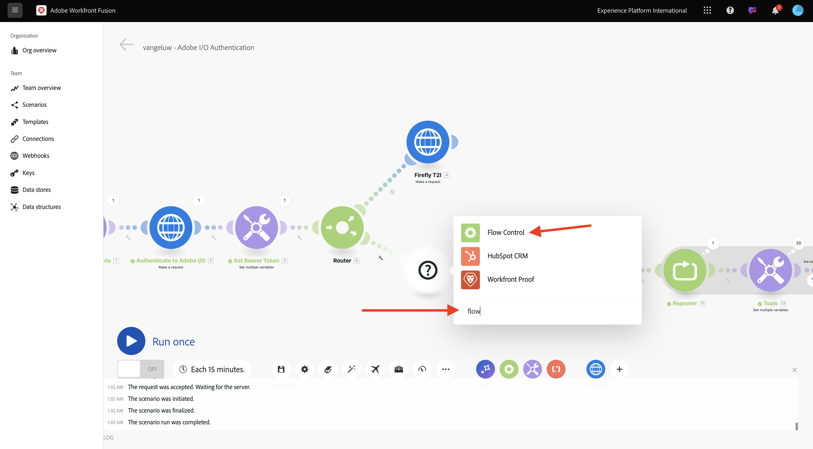

# 1.2.3 Automazione dei processi con Workfront Fusion

Scopri come eseguire l’automazione dei processi con Workfront Fusion.

## 1.2.3.1 iterazione su più valori

Lo scenario dovrebbe essere simile al seguente:


Finora hai modificato il testo in un file Photoshop di un valore statico. Per ridimensionare e automatizzare i flussi di lavoro di creazione dei contenuti, è necessario scorrere un elenco di valori e inserirli in modo dinamico nel file Photoshop. Nei passaggi successivi, aggiungerai un messaggio per eseguire iterazioni sui valori nello scenario esistente.

1. Tra il nodo **Router** e il nodo **Testo modifica Photoshop**, selezionare l&#39;icona **chiave inglese** e selezionare **Aggiungi modulo**.

   

1. Cercare `flow` e selezionare **Controllo flusso**.

   

1. Selezionare **Iteratore**.

   

   Lo schermo dovrebbe essere simile al seguente:

   

   Anche se è possibile leggere file di input come i file CSV, per il momento devi utilizzare una versione di base di un file CSV definendo una stringa di testo e dividendo il file di testo.

1. Per trovare la funzione **split**, seleziona l&#39;icona **T**, in cui sono visualizzate tutte le funzioni disponibili per manipolare i valori di testo. Seleziona la funzione **split**, quindi dovresti visualizzarla.

   

1. La funzione split prevede una matrice di valori prima del punto e virgola e specifica il separatore dopo il punto e virgola. Per questo test, è necessario utilizzare un array semplice con 2 campi, **Acquista ora** e **Fai clic qui** e il separatore da utilizzare è **,**.

1. Immetti questo valore nel campo **Array** sostituendo la funzione **split** attualmente vuota: `{{split("Buy now, Click here "; ",")}}`. Selezionare **OK**.

   


1. Selezionare **Testo modifica Photoshop** per aggiungere alcune variabili anziché valori statici per i campi di input e output.

   

   In **Contenuto richiesta**, è il testo **Fare clic qui**. Questo testo deve essere sostituito dai valori provenienti dall’array.

   

1. Eliminare il testo **Fare clic qui** e sostituirlo selezionando la variabile **Value** dal nodo **Iterator**. In questo modo il testo sul pulsante nel documento Photoshop viene aggiornato in modo dinamico.

   

   È inoltre necessario aggiornare il nome del file utilizzato per scrivere il file nell’account di archiviazione Azure. Se il nome del file è statico, ogni nuova iterazione sovrascrive semplicemente il file precedente e, come tale, perde i file personalizzati. Il nome del file statico corrente è **citisignal-fiber-changed-text.psd** ed è ora necessario aggiornarlo.

1. Posizionare il cursore dietro la parola `text`.

   

1. Aggiungere un trattino `-`, quindi selezionare il valore **Posizione ordine bundle**. In questo modo, per la prima iterazione, Workfront Fusion aggiunge `-1` al nome del file, per la seconda iterazione `-2` e così via. Selezionare **OK**.

   

1. Salva lo scenario e seleziona **Esegui una volta**.

   

   Una volta eseguito lo scenario, torna ad Azure Storage Explorer e aggiorna la cartella. Dovresti quindi visualizzare i 2 file appena creati.

   

1. Scarica e apri ciascun file. Dovresti avere vari testi sui pulsanti. Questo è il file `citisignal-fiber-changed-text-1.psd`.

   

   Questo è il file `citisignal-fiber-changed-text-2.psd`.

   

## 1.2.3.2 Attiva lo scenario utilizzando un webhook

Finora lo scenario è stato eseguito manualmente per essere testato. Aggiorniamo ora lo scenario con un webhook, in modo che possa essere attivato da un ambiente esterno.

1. Seleziona **+**, cerca **webhook**, quindi seleziona **Webhook**.

   

1. Seleziona **WebHook personalizzato**.

1. Trascinare e connettere il nodo **Webhook personalizzato** in modo che si connetta al primo nodo dell&#39;area di lavoro, denominato **Inizializza costanti**.

   

1. Seleziona il nodo **Webhook personalizzato**. Quindi, selezionare **Aggiungi**.

   

1. Imposta **Nome webhook** su `--aepUserLdap-- - Tutorial 1.2`.

   

1. Seleziona la casella per **Ottieni intestazioni richiesta**. Seleziona **Salva**.

   

1. L’URL del webhook è ora disponibile. Copia l’URL.

   

1. Apri Postman e aggiungi una nuova cartella nella raccolta **FF - Firefly Services Tech Insiders**.

   

1. Denomina la cartella `--aepUserLdap-- - Workfront Fusion`.

   

1. Nella cartella appena creata, seleziona i tre punti **...** e seleziona **Aggiungi richiesta**.

   

1. Imposta il **tipo di metodo** su **POST** e incolla l&#39;URL del webhook nella barra degli indirizzi.

   

   È necessario inviare un corpo personalizzato, in modo che gli elementi della variabile possano essere forniti da un’origine esterna allo scenario Workfront Fusion.

1. Vai a **Body** e seleziona **raw**.

   

1. Incolla il testo seguente nel corpo della richiesta. Seleziona **Invia**.

   ```json
   {
       "psdTemplate": "placeholder",
       "xlsFile": "placeholder"
   }
   ```

   

1. In Workfront Fusion, sul webhook personalizzato viene visualizzato un messaggio con il seguente messaggio: **Determinato correttamente**.

   

1. Seleziona **Salva**, quindi seleziona **Esegui una volta**. Il tuo scenario ora è attivo ma non verrà eseguito finché non avrai selezionato di nuovo **Invia** in Postman.

   

1. In Postman, seleziona **Invia** di nuovo.

   

   Lo scenario viene eseguito nuovamente e crea i 2 file come in precedenza.

   

1. Modifica il nome della richiesta Postman in `POST - Send Request to Workfront Fusion Webhook`.

   

   Ora devi iniziare a utilizzare la variabile **psdTemplate**. Invece di codificare la posizione del file di input nel nodo **Testo di modifica di Photoshop**, utilizzerai la variabile in ingresso dalla richiesta di Postman.

1. Apri il nodo **Testo modifica Photoshop** e passa a **Contenuto richiesta**. Selezionare il nome di file hardcoded **citisignal-fiber.psd** in **inputs** ed eliminarlo.

   

1. Selezionare la variabile **psdTemplate**. Seleziona **OK**, quindi salva lo scenario.

   

1. Seleziona **ON** per attivare lo scenario. Il tuo scenario ora è in esecuzione senza interruzioni.

   

1. In Postman, immetti il nome file `citisignal-fiber.psd` come valore per la variabile **psdTemplate** e seleziona **Invia** di nuovo per eseguire di nuovo lo scenario.

   

   Specificando il modello PSD come variabile fornita da un sistema esterno, ora è stato creato uno scenario riutilizzabile.

   Ora hai completato questo esercizio.

## Passaggi successivi

Vai a [1.2.4 Automazione tramite connettori](./ex4.md){target="_blank"}

Torna a [Automazione dei servizi Adobe Firefly](./automation.md){target="_blank"}

Torna a [Tutti i moduli](./../../../overview.md){target="_blank"}
