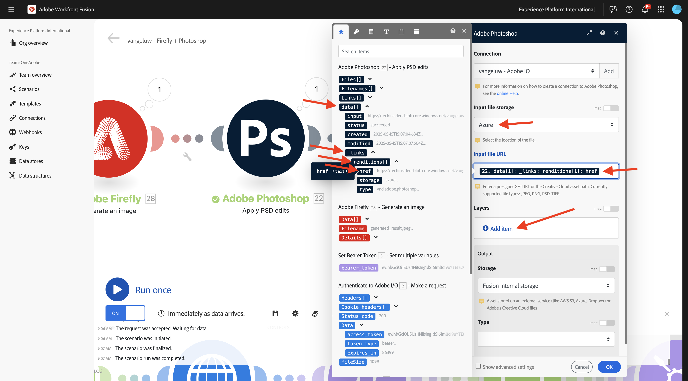
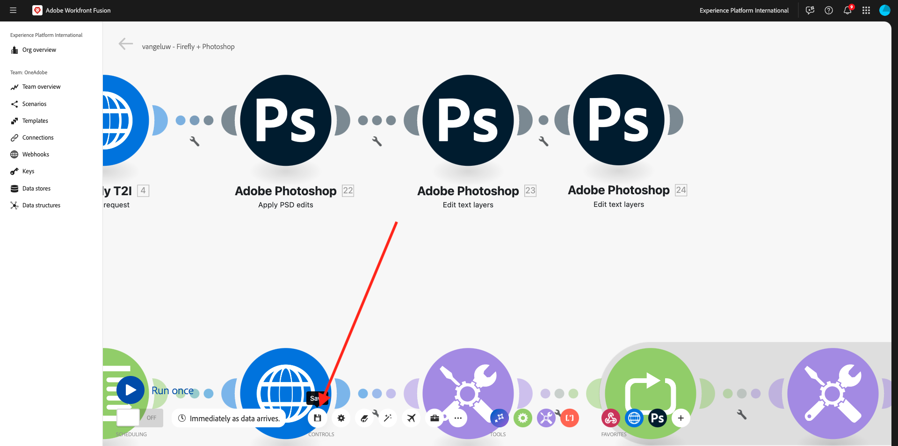

# 1.2.4 Automazione tramite connettori

Ora inizierai a utilizzare i connettori predefiniti di Workfront Fusion per Photoshop e connetterai la richiesta Firefly Text-2-Image e le richieste Photoshop in un unico scenario.

## 1.2.4.1 Duplica e prepara lo scenario

Nel menu a sinistra, vai a **Scenari** e seleziona la cartella `--aepUserLdap--`. Dovresti quindi visualizzare lo scenario creato in precedenza, denominato `--aepUSerLdap-- - Adobe I/O Authentication`.


Fare clic sulla freccia per aprire il menu a discesa e selezionare **Clone**.


Imposta **Name** dello scenario clonato su `--aepUserLdap-- - Firefly + Photoshop` e seleziona il **team di destinazione** appropriato. Fai clic su **Aggiungi** per aggiungere un nuovo webhook.


Imposta **Nome webhook** su `--aepUserLdap-- - Firefly + Photoshop Webhook`. Fai clic su **Salva**.


Dovresti vedere questo. Fai clic su **Salva**.


Dovresti vedere questo. Fare clic sul nodo **Webhook**.


Fare clic su **Copia indirizzo negli Appunti** e quindi su **Ridetermina la struttura dei dati**.


Apri Postman. Aggiungi una nuova richiesta nella stessa cartella che utilizzavi in precedenza.


Accertarsi che siano applicate le seguenti impostazioni:

- Nome richiesta: `POST - Send Request to Workfront Fusion Webhook Firefly + Photoshop`
- Tipo di richiesta: `POST`
- URL richiesta: incolla l’URL copiato dal webhook dello scenario Workfront Fusion.

Vai a **Body** e imposta **Body Type** su **raw** - **JSON**. Incolla il seguente payload nel **Corpo**.

```json
{
    "psdTemplate": "citisignal-fiber.psd",
    "xlsFile": "placeholder",
    "prompt":"misty meadows",
    "cta": "Buy this now!",
    "button": "Click here to buy!"
}
```

Questo nuovo payload garantirà che tutte le informazioni sulle variabili vengano fornite dall’esterno dello scenario, anziché essere codificate nello scenario. In uno scenario aziendale, un’organizzazione deve definire uno scenario in modo riutilizzabile, il che significa che è necessario fornire una serie di variabili come variabili di input invece di averle codificate nello scenario.

Dovresti avere questo. Fai clic su **Invia**.


Il webhook di Workfront Fusion è ancora in attesa di input.


Dopo aver fatto clic su **Invia**, il messaggio dovrebbe cambiare **Determinato correttamente**. Fai clic su **OK**.


## 1.2.4.2 Aggiorna nodo Firefly T2I

Fare clic sul nodo **Firefly T2I**. Dovresti vedere questo. Il prompt di questa richiesta era stato precedentemente codificato in **cavalli in un campo**. Ora rimuoverai tale testo hardcoded e lo sostituirai con un campo proveniente dal webhook.


Rimuovi il testo **cavalli in un campo** e sostituiscilo con la variabile **prompt** che si trova nelle variabili **Webhook**. Fai clic su **OK** per salvare le modifiche.


## 1.2.4.2 Cambia lo sfondo del file PSD

Ora aggiornerai lo scenario per renderlo più intelligente utilizzando connettori predefiniti. Collegherai inoltre l’output da Firefly a Photoshop, in modo che l’immagine di sfondo del file PSD cambi dinamicamente utilizzando l’output dell’azione Genera immagine di Firefly.

Nell&#39;esercizio precedente, la route **Firefly T2I** è stata disabilitata. Ora dovresti annullarla. Fai clic sull&#39;icona **stop** per abilitare nuovamente la route.


L&#39;icona **stop** scompare. Fare clic sull&#39;icona **chiave inglese** sull&#39;altra route verso la configurazione dell&#39;esercizio precedente e selezionare **Disattiva route**.


Dovresti vedere questo. Passa il puntatore del mouse sul nodo **Firefly T2I** e fai clic sull&#39;icona **+**.


Nel menu Cerca, immetti `Photoshop`e quindi fai clic sull&#39;azione **Adobe Photoshop**.


Selezionare **Applica modifiche PSD**.


Dovresti vedere questo. Fai clic su **Aggiungi** per aggiungere una nuova connessione ad Adobe Photoshop.


Configura la connessione come segue:

- Tipo di connessione: selezionare **Adobe Photoshop (server-to-server)**
- Nome connessione: immetti `--aepUserLdap-- - Adobe IO`
- ID client: incolla l’ID client
- Segreto client: incolla il segreto client

Fai clic su **Continua**.


Per trovare il **ID client** e il **Segreto client**, vai a [https://developer.adobe.com/console/home](https://developer.adobe.com/console/projects){target="_blank"} e apri il progetto Adobe I/O, denominato `--aepUserLdap-- One Adobe tutorial`. Vai a **OAuth Server-to-Server** per trovare l&#39;ID client e il segreto client. Copiare tali valori e incollarli nella configurazione della connessione in Workfront Fusion.


Dopo aver fatto clic su **Continua**, verrà visualizzata brevemente una finestra popup durante la verifica delle credenziali. Una volta fatto, dovresti vedere questo.


È ora necessario immettere la posizione del file PSD con cui si desidera utilizzare Fusion. Per **Archiviazione**, selezionare **Azure** e per **Percorso file**, immettere `{{1.AZURE_STORAGE_URL}}/{{1.AZURE_STORAGE_CONTAINER}}/{{1.AZURE_STORAGE_SAS_READ}}`. Posizionare il cursore accanto al secondo `/`. Quindi, controlla le variabili disponibili e scorri verso il basso per trovare la variabile **psdTemplate**. Fai clic sulla variabile **psdTemplate** per selezionarla.


Dovresti vedere questo.


Scorri fino in fondo fino a visualizzare **Livelli**. Fare clic su **Aggiungi elemento**.


Dovresti vedere questo. Ora devi immettere il nome del livello nel modello Photoshop PSD utilizzato come sfondo del file.


Nel file **citisignal-fiber.psd**, troverai il livello utilizzato per lo sfondo. In questo esempio, il livello è denominato **2048x2048-background**.


Incolla il nome **2048x2048-background** nella finestra di dialogo di Workfront Fusion.


Scorri verso il basso fino a visualizzare **Input**. Ora è necessario definire cosa deve essere inserito nel livello di sfondo. In questo caso, è necessario selezionare l&#39;output dell&#39;oggetto Firefly T2I, che contiene l&#39;immagine generata dinamicamente.

Per **Archiviazione**, selezionare **Esterna**. Per **Percorso file**, cercare e trovare la variabile `data.outputs[].image.url` dall&#39;output della richiesta **Firefly T2I**.


Quindi scorri verso il basso fino a visualizzare **Modifica**. Imposta **Modifica** su **Sì** e **Tipo** su **Livello**. Fai clic su **Aggiungi**.


Dovresti vedere questo. Successivamente, devi definire l’output dell’azione. Fai clic su **Aggiungi elemento** in **output**.


Seleziona **Azure** per **Archiviazione**, incolla `{{1.AZURE_STORAGE_URL}}/{{1.AZURE_STORAGE_CONTAINER}}/citisignal-fiber-replacedbg.psd{{1.AZURE_STORAGE_SAS_WRITE}}` in **Posizione file** e seleziona **vnd.adobe.photoshop** in **Tipo**. Fare clic per abilitare **Mostra impostazioni avanzate**.


In **Impostazioni avanzate**, selezionare **Sì** per sovrascrivere i file con lo stesso nome.
Fai clic su **Aggiungi**.


Dovresti avere questo. Fai clic su **OK**.


## 1.2.4.3 Modificare i livelli di testo del file PSD

### Testo invito all&#39;azione

Passa il puntatore del mouse sul nodo **Adobe Photoshop - Applica modifiche PSD** e fai clic sull&#39;icona **+**.


Seleziona **Adobe Photoshop**.


Selezionare **Modifica livelli di testo**.


Dovresti vedere questo. Selezionare innanzitutto la connessione Adobe Photoshop già configurata in precedenza, che deve essere denominata `--aepUserLdap-- Adobe IO`.

È ora necessario definire il percorso del **file di input**, che è l&#39;output del passaggio precedente e in **Livelli**, è necessario immettere il **Nome** del livello di testo che si desidera modificare.


Per il **file di input**, selezionare **Azure** per **Archiviazione file di input** e assicurarsi di selezionare l&#39;output della richiesta precedente, **Adobe Photoshop - Applica modifiche PSD**, che è possibile utilizzare da qui: `data[]._links.renditions[].href`



Apri il file **citisignal-fiber.psd**. Nel file, noterai che il livello contenente l&#39;invito all&#39;azione è denominato **2048x2048-cta**.


Immetti il nome **2048x2048-cta** in **Nome** nella finestra di dialogo.


Scorri verso il basso fino a visualizzare **Testo** > **Contenuto**. Selezionare la variabile **cta** dal payload del webhook.


Scorri verso il basso fino a visualizzare **Output**. Per **Archiviazione**, selezionare **Azure**. Per **Percorso file**, immettere il percorso seguente. Si noti l&#39;aggiunta della variabile `{{timestamp}}` al nome file utilizzata per garantire che ogni file generato abbia un nome univoco. Impostare inoltre **Type** su **vnd.adobe.photoshop**. Fai clic su **OK**.

`{{1.AZURE_STORAGE_URL}}/{{1.AZURE_STORAGE_CONTAINER}}/citisignal-fiber-changed-text-{{timestamp}}.psd{{1.AZURE_STORAGE_SAS_WRITE}}`


### Testo pulsante

Fare clic con il pulsante destro del mouse sul nodo appena creato e selezionare **Clone**. Verrà creato un secondo oggetto simile.


Dovresti vedere questo. Selezionare innanzitutto la connessione Adobe Photoshop già configurata in precedenza, che deve essere denominata `--aepUserLdap-- Adobe IO`.

È ora necessario definire il percorso del **file di input**, che è l&#39;output del passaggio precedente e in **Livelli**, è necessario immettere il **Nome** del livello di testo che si desidera modificare.


Per il **file di input**, selezionare **Azure** per **Archiviazione file di input** e assicurarsi di selezionare l&#39;output della richiesta precedente, **Adobe Photoshop - Modifica livelli di testo**, che è possibile utilizzare da qui: `data[]._links.renditions[].href`

Apri il file **citisignal-fiber.psd**. Nel file, noterai che il livello contenente l&#39;invito all&#39;azione è denominato **2048x2048-button-text**.


Immetti il nome **2048x2048-cta** in **Nome** nella finestra di dialogo.


Scorri verso il basso fino a visualizzare **Testo** > **Contenuto**. Selezionare la variabile **cta** dal payload del webhook.


Scorri verso il basso fino a visualizzare **Output**. Per **Archiviazione**, selezionare **Azure**. Per **Percorso file**, immettere il percorso seguente. Si noti l&#39;aggiunta della variabile `{{timestamp}}` al nome file utilizzata per garantire che ogni file generato abbia un nome univoco. Impostare inoltre **Type** su **vnd.adobe.photoshop**. Fai clic su **OK**.

`{{1.AZURE_STORAGE_URL}}/{{1.AZURE_STORAGE_CONTAINER}}/citisignal-fiber-changed-text-{{timestamp}}.psd{{1.AZURE_STORAGE_SAS_WRITE}}`


Fai clic su **Salva** per salvare le modifiche.



## 1.2.4.4 risposta webhook

Dopo aver applicato queste modifiche al tuo file Photoshop, ora devi configurare una **risposta webhook** che verrà rimandata a qualsiasi applicazione abbia attivato questo scenario.

Passa il puntatore del mouse sul nodo **Adobe Photoshop - Modifica livelli di testo** e fai clic sull&#39;icona **+**.


Cerca **webhook** e seleziona **Webhook**.


Seleziona **Risposta webhook**.


Dovresti vedere questo. Incolla il payload seguente in **Body**.

```json
{
    "newPsdTemplate": ""
}
```


Selezionare il percorso `data[]._links.renditions[].href` dall&#39;output della richiesta precedente. Abilitare la casella di controllo per **Mostra impostazioni avanzate**, quindi fare clic su **Aggiungi elemento**.


Nel campo **Chiave** immettere `Content-Type`. Nel campo **Valore** immettere `application/json`. Fai clic su **Salva**.


Dovresti avere questo. Fai clic su **OK**.


Fare clic su **Allineamento automatico**.


Dovresti vedere questo. Fare clic su **Esegui una volta**.


Torna a Postman e fai clic su **Invia**. Il prompt utilizzato è **nebbiosi prati**.


Lo scenario verrà quindi attivato e, dopo un certo periodo di tempo, in Postman verrà visualizzata una risposta contenente l’URL del file PSD appena creato.


Come promemoria: una volta che lo scenario è stato eseguito in Workfront Fusion, potrai visualizzare le informazioni su ciascun nodo facendo clic sulla bolla sopra ogni nodo.


Utilizzando Azure Storage Explorer, è quindi possibile trovare e aprire il file PSD appena creato facendo doppio clic su di esso in Azure Storage Explorer.


Il file dovrebbe quindi essere simile al seguente, con lo sfondo sostituito da uno sfondo con **prati nebbiosi**.


Se esegui nuovamente lo scenario e invii una nuova richiesta da Postman utilizzando un prompt diverso, vedrai quanto lo scenario è diventato semplice e riutilizzabile. In questo esempio, il nuovo prompt utilizzato è **deserto soleggiato**.


E un paio di minuti dopo, è stato generato un nuovo file PSD con un nuovo sfondo.


## Passaggi successivi

Vai a [Riepilogo e vantaggi di Firefly Services Automation](./summary.md){target="_blank"}

Torna a [Automazione dei servizi Adobe Firefly](./automation.md){target="_blank"}

Torna a [Tutti i moduli](./../../../overview.md){target="_blank"}
