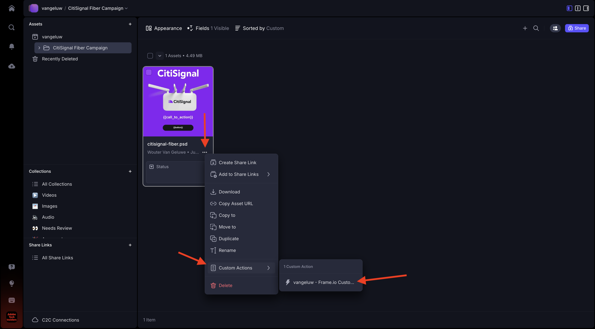
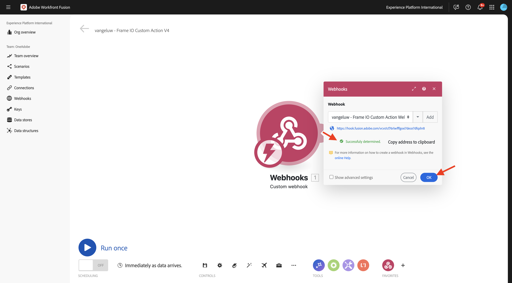
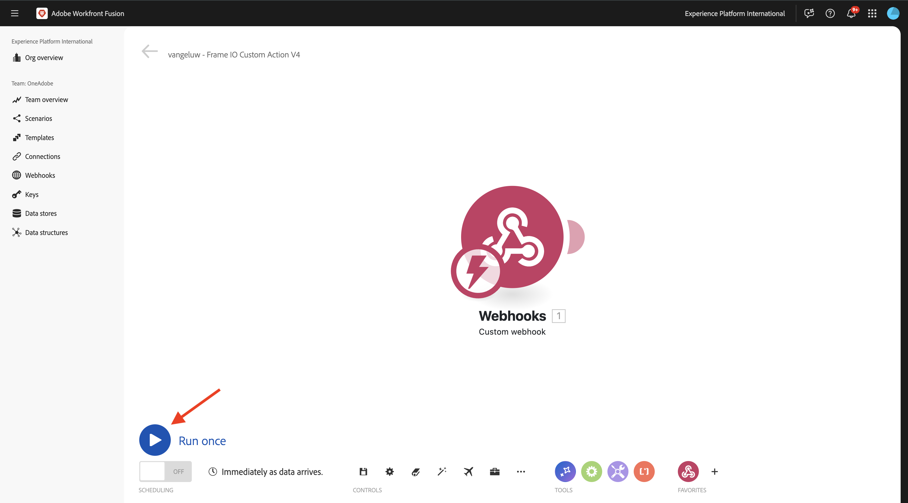
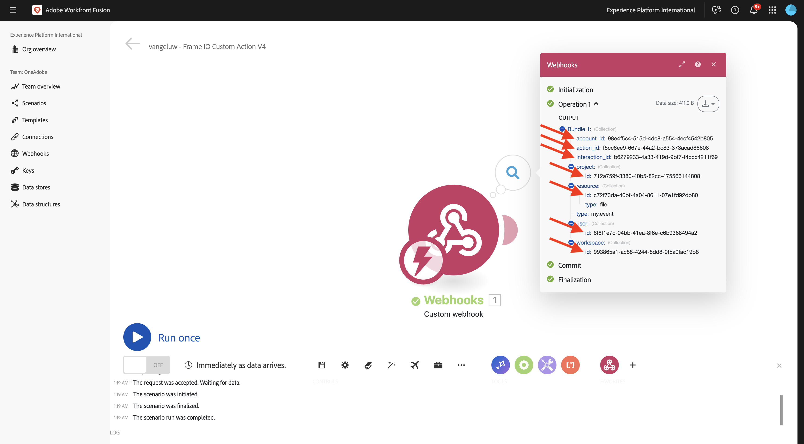

# 1.2.3 Frame.io e Workfront Fusion

Nell&#39;esercizio precedente è stato configurato lo scenario `--aepUserLdap-- - Firefly + Photoshop` e un webhook in ingresso per attivare lo scenario e una risposta del webhook al completamento dello scenario. Hai quindi utilizzato Postman per attivare tale scenario. Postman è un ottimo strumento per i test, ma in uno scenario di business reale, gli utenti aziendali non utilizzerebbero Postman per attivare uno scenario. Al contrario, utilizzerebbero un’altra applicazione e si aspetterebbero che quest’ultima attivi uno scenario in Workfront Fusion. In questo esercizio, questo è esattamente ciò che si farà con Frame.io.

>[!NOTE]
>
>Questo esercizio è stato creato per Frame.io V4. Alcune delle seguenti funzionalità utilizzate nell’esercizio sono attualmente in formato alfa e non sono ancora generalmente disponibili.

## 1.2.3.1 Prerequisiti

Prima di continuare con questo esercizio, devi aver completato la configurazione di [il tuo progetto Adobe I/O](./../../../modules/getting-started/gettingstarted/ex6.md), inclusa l&#39;aggiunta dell&#39;API **Frame.io** al progetto Adobe I/O, nonché aver configurato un&#39;applicazione per interagire con le API, ad esempio [Postman](./../../../modules/getting-started/gettingstarted/ex7.md) o [PostBuster](./../../../modules/getting-started/gettingstarted/ex8.md).

## 1.2.3.2 Accesso a Frame.io

Vai a [https://next.frame.io/](https://next.frame.io/){target="_blank"}.


Per verificare a quale istanza hai effettuato l’accesso, fai clic sull’icona dell’istanza. Scegliere l&#39;istanza a cui è stato concesso l&#39;accesso, che deve essere `--aepImsOrgName--`.

Fare clic su **+ Nuovo progetto** per creare un progetto personalizzato in Frame.io.


Seleziona il modello **Vuoto** e immetti il nome `--aepUserLdap--` per il progetto. Fare clic su **Crea nuovo progetto**.


Il progetto verrà quindi visualizzato nel menu a sinistra. Fai clic sull&#39;icona **+**, quindi seleziona **Nuova cartella**.


Immettere il nome `CitiSignal Fiber Campaign`, quindi fare doppio clic sulla cartella per aprirla.


Fai clic su **Carica**.


In uno degli esercizi precedenti, hai scaricato [citisignal-fiber.psd](./../../../assets/ff/citisignal-fiber.psd){target="_blank"}. Selezionare il file e fare clic su **Apri**.


Il file **citisignal-fiber.psd** sarà quindi disponibile nella cartella appena creata.


## 1.2.3.3 Workfront Fusion e Frame.io

Nell&#39;esercizio precedente è stato creato lo scenario `--aepUserLdap-- - Firefly + Photoshop`, che è iniziato con un webhook personalizzato e si è concluso con una risposta del webhook. L’utilizzo dei webhook è stato quindi testato utilizzando Postman, ma ovviamente, il punto di tale scenario è essere chiamato da un’applicazione esterna. Come indicato in precedenza, Frame.io sarà quell&#39;esercizio, ma tra Frame.io e `--aepUserLdap-- - Firefly + Photoshop` è necessario un altro scenario Workfront Fusion. ora configurerai quello scenario.

Vai a [https://experience.adobe.com/](https://experience.adobe.com/){target="_blank"}. Aprire **Workfront Fusion**.


Nel menu a sinistra, vai a **Scenari** e seleziona la cartella `--aepUserLdap--`. Fai clic su **Crea un nuovo scenario**.


Utilizza il nome `--aepUserLdap-- - Frame IO Custom Action V4`.


Fare clic sull&#39;**oggetto punto interrogativo** nell&#39;area di lavoro. Immettere il testo `webhook` nella casella di ricerca e fare clic su **Webhook**.


Fai clic su **WebHook personalizzato**.


Fai clic su **Aggiungi** per creare un nuovo URL del webhook.


Per il **nome webhook**, utilizzare `--aepUserLdap-- - Frame IO Custom Action Webhook`. Fai clic su **Salva**.


Dovresti vedere questo. Lascia aperta e inalterata questa schermata come ti servirà in un passaggio successivo. Sarà necessario copiare l&#39;URL del webhook in un passaggio successivo, facendo clic su **Copia indirizzo negli Appunti**.


## 1.2.3.4 API azioni personalizzate Frame.io V4

Vai a Postman e apri la richiesta **POST - Ottieni token di accesso** nella raccolta **Adobe IO - OAuth**. Verifica il campo **ambito** in **Parametri**. Il campo **ambito** deve includere l&#39;ambito `frame.s2s.all`. Se manca, aggiungilo. Fai clic su **Invia** per richiedere un nuovo **access_token**.


Apri la richiesta **GET - Elenca account** nella raccolta **Frame.io V4 - Tech Insiders**. Fai clic su **Invia**.


Dovresti quindi visualizzare una risposta simile che contiene uno o più account. Rivedi la risposta e individua il campo **id** per l&#39;account Frame.io V4 in uso. Puoi trovare il nome dell’account nell’interfaccia utente di Frame.io V4:


Copia il valore del campo **id**.


Nel menu a sinistra, vai a **Ambienti** e seleziona l&#39;ambiente che stai utilizzando. Trova la variabile **`FRAME_IO_ACCOUNT_ID`** e incolla il **id** ottenuto dalla richiesta precedente sia nella colonna **Valore iniziale** che nella colonna **Valore corrente**. Fai clic su **Salva**.


Nel menu a sinistra, torna a **Raccolte**. Apri la richiesta **GET - Elenca aree di lavoro** nella raccolta **Frame.io V4 - Tech Insiders**. Fai clic su **Invia**.


Dovresti quindi visualizzare una risposta simile che contiene uno o più account. Rivedi la risposta e individua il campo **id** per il Workspace Frame.io V4 in uso. Copia il valore del campo **id**.


Nel menu a sinistra, vai a **Ambienti** e seleziona l&#39;ambiente che stai utilizzando. Trova la variabile **`FRAME_IO_WORKSPACE_ID`** e incolla il **id** ottenuto dalla richiesta precedente sia nella colonna **Valore iniziale** che nella colonna **Valore corrente**. Fai clic su **Salva**.


Nel menu a sinistra, torna a **Raccolte**. Apri la richiesta **POST - Crea azione personalizzata** nella raccolta **Frame.io V4 - Tech Insiders**, nella cartella **Azioni personalizzate**.

Vai al **Corpo** della richiesta. Cambia il campo **name** in `--aepUserLdap--  - Frame.io Custom Action V4`, quindi cambia il campo **url** con il valore dell&#39;URL del webhook copiato da Workfront Fusion.

Fai clic su **Invia**.


L&#39;azione personalizzata Frame.io V4 è stata creata.


Torna a [https://next.frame.io/](https://next.frame.io/){target="_blank"} e passa alla cartella **Campagna Fibre Signal** creata nel progetto `--aepUserLdap--`. Aggiorna la pagina.


Dopo aver aggiornato la pagina, fai clic sui tre punti **...** della risorsa **citisignal-fiber.psd** e apri il menu **Azioni personalizzate**. Dovresti quindi visualizzare l’azione personalizzata creata in precedenza nel menu visualizzato. Fare clic sull&#39;azione personalizzata `--aepUserLdap-- - Frame IO Custom Action Fusion V4`.



Dovresti quindi visualizzare un pop-up **Azione personalizzata** simile. Questa finestra a comparsa è il risultato della comunicazione tra Frame.io e Workfront Fusion.


Tornate a Workfront Fusion nella schermata. **Determinato correttamente** viene visualizzato nell&#39;oggetto webhook personalizzato. Fai clic su **OK**.



Fare clic su **Esegui una volta** per attivare la modalità di test e verificare di nuovo la comunicazione con Frame.io.



Tornare a Frame.io e fare di nuovo clic sull&#39;azione personalizzata `--aepUserLdap-- - Frame IO Custom Action Fusion V4`.


Riportare lo schermo a Workfront Fusion. A questo punto dovrebbe essere visualizzato un segno di spunta verde e una bolla che mostra **1**. Fai clic sulla bolla per visualizzare i dettagli.


La vista dettagliata della bolla mostra i dati ricevuti da Frame.io. Dovresti visualizzare diversi ID. Ad esempio, il campo **resource.id** mostra l&#39;ID univoco in Frame.io della risorsa **citisignal-fiber.psd**.



Ora che è stata stabilita la comunicazione tra Frame.io e Workfront Fusion, è possibile continuare la configurazione.

## 1.2.3.5 Fornitura di una risposta del modulo personalizzato a Frame.io

Quando l&#39;azione personalizzata viene richiamata in Frame.io, Frame.io prevede di ricevere una risposta da Workfront Fusion. Se si ripensa allo scenario creato nell&#39;esercizio precedente, sono necessarie diverse variabili per aggiornare il file Photoshop PSD standard. Tali variabili sono definite nel payload utilizzato:

```json
{
    "psdTemplate": "citisignal-fiber.psd",
    "xlsFile": "placeholder",
    "prompt":"misty meadows",
    "cta": "Buy this now!",
    "button": "Click here to buy!"
}
```

Per eseguire correttamente lo scenario `--aepUserLdap-- - Firefly + Photoshop`, sono necessari campi come **prompt**, **cta**, **button** e **psdTemplate**.

I primi 3 campi, **prompt**, **cta**, **button**, richiedono l&#39;input dell&#39;utente che deve essere raccolto in Frame.io quando l&#39;utente richiama l&#39;azione personalizzata. Pertanto, la prima cosa da fare all&#39;interno di Workfront Fusion è verificare se queste variabili sono disponibili o meno e, in caso contrario, Workfront Fusion deve rispondere a Frame.io richiedendo che tali variabili vengano immesse. Per ottenere questo risultato, si utilizza un modulo in Frame.io.

Tornare a Workfront Fusion e aprire lo scenario `--aepUserLdap-- - Frame IO Custom Action`. Passa il puntatore sull&#39;oggetto **webhook personalizzato** e fai clic sull&#39;icona **+** per aggiungere un altro modulo.


Cercare `Flow Control` e fare clic su **Controllo flusso**.


Fare clic per selezionare **Router**.


Dovresti vedere questo.


Fare clic su **?** oggetto e quindi fare clic per selezionare **Webhook**.


Seleziona **Risposta webhook**.


Dovresti vedere questo.


Copia il codice JSON seguente e incollalo nel campo **Corpo**.


```json
{
  "title": "What do you want Firefly to generate?",
  "description": "Enter your Firefly prompt.",
  "fields": [
    {
      "type": "text",
      "label": "Prompt",
      "name": "Prompt",
      "value": ""
    },
    {
      "type": "text",
      "label": "CTA Text",
      "name": "CTA Text",
      "value": ""
    },
    {
      "type": "text",
      "label": "Button Text",
      "name": "Button Text",
      "value": ""
    }
  ]
}
```

Fai clic sull’icona per pulire e abbellire il codice JSON. Quindi fare clic su **OK**.


Fai clic su **Salva** per salvare le modifiche.


Successivamente, devi impostare un filtro per garantire che questo percorso dello scenario venga eseguito solo quando non è disponibile alcun prompt. Fai clic sull&#39;icona **chiave inglese**, quindi seleziona **Configura filtro**.


Configura i campi seguenti:

- **Etichetta**: utilizzare `Prompt isn't available`.
- **Condizione**: utilizzare `{{1.data.Prompt}}`.
- **Operatori di base**: selezionare **Non esiste**.

>[!NOTE]
>
>È possibile specificare manualmente le variabili in Workfront Fusion utilizzando la seguente sintassi: `{{1.data.Prompt}}`. Il numero nella variabile fa riferimento al modulo nello scenario. In questo esempio, puoi vedere che il primo modulo nello scenario è denominato **Webhook** e ha un numero di sequenza di **1**. Ciò significa che la variabile `{{1.data.Prompt}}` accederà al campo **data.Prompt** dal modulo con numero di sequenza 1. I numeri di sequenza a volte possono essere diversi, quindi fai attenzione quando copi/incolla tali variabili e verifica sempre che il numero di sequenza utilizzato sia quello corretto.

Fai clic su **OK**.


Dovresti vedere questo. Fai clic prima sull&#39;icona **Salva**, quindi fai clic su **Esegui una volta** per verificare lo scenario.


Dovresti vedere questo.


Torna a Frame.io e fai di nuovo clic sull&#39;azione personalizzata `--aepUserLdap-- - Frame IO Custom Action Fusion` sulla risorsa **citisignal-fiber.psd**.


Ora dovresti visualizzare un prompt all’interno di Frame.io. Non compilare ancora i campi e non inviare il modulo. Questo prompt viene visualizzato in base alla risposta di Workfront Fusion appena configurata.


Torna a Workfront Fusion e fai clic sul fumetto nel modulo **Risposta webhook**. In **INPUT** verrà visualizzato il corpo contenente il payload JSON per il modulo. Fai di nuovo clic su **Esegui**.


Dovresti vederlo di nuovo.


Torna a Frame.io e compila i campi come indicato.

- **Prompt**: raggi laser futuristici che scorrono nello spazio
- **CTA**: Timetravel now!
- **Testo pulsante**: Entra a bordo!

Fai clic su **Invia**.


Dovresti quindi visualizzare una finestra a comparsa in Frame.io che si presenta così.


Torna a Workfront Fusion e fai clic sul fumetto nel modulo **Webhook personalizzato**. Nell&#39;operazione 1, in **OUTPUT**, è ora possibile visualizzare un nuovo oggetto **data** contenente campi come **Testo pulsante**, **Testo CTA** e **Prompt**. Con queste variabili di input utente disponibili nel tuo scenario, hai abbastanza per continuare la configurazione.


## 1.2.3.6 Recupera percorso file da Frame.io

Come già accennato, per il corretto funzionamento di questo scenario sono necessari campi come **prompt**, **cta**, **button** e **psdTemplate**. I primi 3 campi sono già disponibili, ma manca ancora il **psdTemplate** da utilizzare. **psdTemplate** farà ora riferimento a una posizione Frame.io poiché il file **citisignal-fiber.psd** è ospitato in Frame.io. Per recuperare la posizione del file, è necessario configurare e utilizzare la connessione Frame.io in Workfront Fusion.

Tornare a Workfront Fusion e aprire lo scenario `--aepUserLdap-- - Frame IO Custom Action V4`. Passare il cursore su **?Modulo**, fai clic sull&#39;icona **+** per aggiungere un altro modulo e cercare `frame`. Fare clic su **Frame.io**.


Fare clic su **Frame.io**.


Fai clic su **Effettua una chiamata API personalizzata**.


Per utilizzare la connessione Frame.io, è necessario prima configurarla. Fai clic su **Aggiungi** per eseguire l&#39;operazione.


Selezionare il tipo di connessione **Tipo di connessione** **Server IMS al server** e immettere il nome `--aepUserLdap-- - Adobe I/O - Frame.io S2S`.


Quindi, devi immettere l&#39;**ID client** e il **Segreto client** del progetto Adobe I/O configurato come parte del modulo **Guida introduttiva**. Puoi trovare **ID client** e **Segreto client** del progetto Adobe I/O [qui](https://developer.adobe.com/console/projects.){target="_blank"}.


Torna allo scenario in Workfront Fusion. Incolla i valori di **ID client** e **Segreto client** nel rispettivo campo nella finestra di configurazione della connessione. Fai clic su **Continua**. La connessione verrà ora testata da Workfront Fusion.


Se la connessione è stata testata correttamente, verrà visualizzata automaticamente in **Connessione**. Ora disponi di una connessione riuscita e devi completare la configurazione per ottenere tutti i dettagli della risorsa da Frame.io, inclusa la posizione del file. A tale scopo, è necessario utilizzare **ID risorsa**.


Il campo **ID risorsa** è condiviso da Frame.io a Workfront Fusion come parte della comunicazione **webhook personalizzato** iniziale ed è disponibile nel campo **resource.id**.

Per la configurazione del modulo **Frame.io - Effettuare una chiamata API personalizzata**, utilizzare l&#39;URL: `/v4/accounts/{{1.account_id}}/files/{{1.resource.id}}`.

>[!NOTE]
>
>È possibile specificare manualmente le variabili in Workfront Fusion utilizzando la seguente sintassi: `{{1.account_id}}` e `{{1.resource.id}}`. Il numero nella variabile fa riferimento al modulo nello scenario. In questo esempio, puoi vedere che il primo modulo nello scenario è denominato **Webhook** e ha un numero di sequenza di **1**. Ciò significa che le variabili `{{1.account_id}}` e `{{1.resource.id}}` accederanno a quel campo dal modulo con il numero di sequenza 1. I numeri di sequenza a volte possono essere diversi, quindi fai attenzione quando copi/incolla tali variabili e verifica sempre che il numero di sequenza utilizzato sia quello corretto.

Fare clic su **+ Aggiungi elemento** in **Stringa di query**.


Immetti questi valori e fai clic su **Aggiungi**.

| Chiave | Valore |
|:-------------:| :---------------:| 
| `include` | `media_links.original` |


Ora dovresti avere questo. Fai clic su **OK**.


Successivamente, devi impostare un filtro per garantire che questo percorso dello scenario venga eseguito solo quando non è disponibile alcun prompt. Fai clic sull&#39;icona **chiave inglese**, quindi seleziona **Configura filtro**.


Configura i campi seguenti:

- **Etichetta**: utilizzare `Prompt is available`.
- **Condizione**: utilizzare `{{1.data.Prompt}}`.
- **Operatori di base**: selezionare **Esiste**.

>[!NOTE]
>
>È possibile specificare manualmente le variabili in Workfront Fusion utilizzando la seguente sintassi: `{{1.data.Prompt}}`. Il numero nella variabile fa riferimento al modulo nello scenario. In questo esempio, puoi vedere che il primo modulo nello scenario è denominato **Webhook** e ha un numero di sequenza di **1**. Ciò significa che la variabile `{{1.data.Prompt}}` accederà al campo **data.Prompt** dal modulo con numero di sequenza 1. I numeri di sequenza a volte possono essere diversi, quindi fai attenzione quando copi/incolla tali variabili e verifica sempre che il numero di sequenza utilizzato sia quello corretto.

Fai clic su **OK**.


Ora dovresti vedere questo. Salva le modifiche e fai clic su **Esegui una volta** per verificare lo scenario.


Torna a Frame.io e fai di nuovo clic sull&#39;azione personalizzata `--aepUserLdap-- - Frame IO Custom Action Fusion V4` sulla risorsa **citisignal-fiber.psd**.


Ora dovresti visualizzare un prompt all’interno di Frame.io. Non compilare ancora i campi e non inviare il modulo. Questo prompt viene visualizzato in base alla risposta di Workfront Fusion appena configurata.


Tornare a Workfront Fusion. Fai di nuovo clic su **Esegui**.


Torna a Frame.io e compila i campi come indicato. Fai clic su **Invia**.

- **Prompt**: raggi laser futuristici che scorrono nello spazio
- **CTA**: Timetravel now!
- **Testo pulsante**: Entra a bordo!


Torna a Workfront Fusion e fai clic sul fumetto nel modulo **Frame.io - Esegui una chiamata API personalizzata**.


In **OUTPUT** > **Body** > **data** è ora possibile visualizzare molti metadati sulla risorsa specifica **citisignal-fiber.psd**.


Le informazioni specifiche necessarie per questo caso d&#39;uso sono l&#39;URL del percorso del file **citisignal-fiber.psd**, che puoi trovare scorrendo verso il basso fino al campo **media_links** > **Original** > **download_url**.


Sono ora disponibili tutte le informazioni (**prompt**, **cta**, **button** e **psdTemplate**) necessarie per il funzionamento di questo caso d&#39;uso.

## 1.2.3.7 richiama scenario Workfront

Nell&#39;esercizio precedente è stato configurato lo scenario `--aepUserLdap-- - Firefly + Photoshop`. Ora è necessario apportare una modifica minore a tale scenario.

Apri lo scenario `--aepUserLdap-- - Firefly + Photoshop` in un&#39;altra scheda e fai clic sul primo modulo **Adobe Photoshop - Applica modifiche PSD**. È ora possibile vedere che il file di input è configurato per utilizzare una posizione dinamica in Microsoft Azure. Dato che per questo caso d’uso il file di input non viene più archiviato in Microsoft Azure, ma utilizza invece l’archiviazione Frame.io, devi modificare queste impostazioni.


Cambia **Archiviazione** in **Esterna** e cambia **Posizione file** per utilizzare solo la variabile **psdTemplate** presa dal modulo **Webhook personalizzato** in ingresso. Fai clic su **OK** e quindi su **Salva** per salvare le modifiche.


Fare clic sul modulo **Webhook personalizzato** e quindi su **Copia indirizzo negli Appunti**. È necessario copiare l’URL, in quanto sarà necessario utilizzarlo nell’altro scenario.


Torna allo scenario `--aepUserLdap-- - Frame IO Custom Action V4`. Passa il puntatore del mouse su **Frame.io - Effettua una chiamata API personalizzata** e fai clic sull&#39;icona **+**.


Immettere `http` e quindi fare clic su **HTTP**.


Seleziona **Crea una richiesta**.


Incolla l&#39;URL del webhook personalizzato nel campo **URL**. Impostare **Method** su **POST**.


Imposta **Tipo corpo** su **Raw** e **Tipo contenuto** su **JSON (application/json)**.
Incolla il seguente payload JSON nel campo **Richiedi contenuto** e abilita la casella di controllo per **Analizza risposta**.

```json
{
    "psdTemplate": "citisignal-fiber.psd",
    "xlsFile": "placeholder",
    "prompt":"misty meadows",
    "cta": "Buy this now!",
    "button": "Click here to buy!"
}
```

Ora disponi di un payload statico configurato, ma deve diventare dinamico utilizzando le variabili raccolte in precedenza.


Per il campo **psdTemplate**, sostituire la variabile statica **citisignal-fiber.psd** con la variabile **`Body > data > media_links > original > download_url`**.


Per i campi **prompt**, **cta** e **button**, sostituire le variabili statiche con le variabili dinamiche inserite nello scenario dalla richiesta del webhook in ingresso da Frame.io, ovvero i campi **data.Prompt**, **data.CTA Text** e **data.Button Text**.

Abilitare inoltre la casella di controllo per **Analisi risposta**.

Fai clic su **OK**.


Fai clic su **Salva** per salvare le modifiche.


## 1.2.3.8 Salva nuova risorsa in Frame.io

Una volta richiamato l’altro scenario Workfront Fusion, verrà generato un nuovo modello Photoshop PSD disponibile. Il file PSD deve essere memorizzato nuovamente in Frame.io, che è l&#39;ultimo passaggio di questo scenario.

Passa il puntatore del mouse sul modulo **HTTP - Esegui una richiesta** e fai clic sull&#39;icona **+**.


Seleziona **Frame.io**.


Selezionare **Effettuare una chiamata API personalizzata**.


La connessione Frame.io verrà selezionata automaticamente.


Per la configurazione del modulo **Frame.io - Effettuare una chiamata API personalizzata**, utilizzare l&#39;URL: `/v4/accounts/{{1.account_id}}/folders/{{4.body.data.parent_id}}/files/remote_upload`.

>[!NOTE]
>
>Come indicato in precedenza, è possibile specificare manualmente le variabili in Workfront Fusion utilizzando la sintassi seguente: `{{1.account_id}}` e `{{4.body.data.parent_id}}`. Il numero nella variabile fa riferimento al modulo nello scenario.
>In questo esempio, puoi vedere che il primo modulo nello scenario è denominato **Webhook** e ha un numero di sequenza di **1**. Ciò significa che la variabile `{{1.account_id}}` accederà a tale campo dal modulo con il numero di sequenza 1.
>In questo esempio, puoi vedere che il quarto modulo nello scenario è denominato **Frame.io - Effettua una chiamata API personalizzata** e ha un numero di sequenza **4**. Ciò significa che la variabile `{{4.body.data.parent_id}}` accederà a tale campo dal modulo con il numero di sequenza 4.
>Se i numeri di sequenza dei moduli sono diversi, dovrai aggiornare le variabili nell’URL precedente per collegarle al modulo corretto.


Modificare il campo **Metodo** in **POST**.

Copia e incolla il frammento JSON seguente nel campo **Body**.

```json
{
  "data": {
    "name": "citisignal-fiber-{{timestamp}}.psd",
    "source_url": "{{6.data.newPsdTemplate}}"
  }
}
```

>[!NOTE]
>
>È possibile specificare manualmente le variabili in Workfront Fusion utilizzando la seguente sintassi: `{{6.data.newPsdTemplate}}`. Il numero nella variabile fa riferimento al modulo nello scenario. In questo esempio, puoi vedere che il sesto modulo nello scenario si chiama **HTTP - Fai una richiesta** e ha un numero di sequenza di **6**. Ciò significa che la variabile `{{6.data.newPsdTemplate}}` accederà al campo **data.newPsdTemplate** dal modulo con numero di sequenza 6.
>Se i numeri di sequenza del modulo sono diversi, dovrai aggiornare la variabile nell’URL precedente per collegarla al modulo corretto.

Fai clic su **OK**.


Fai clic su **Salva** per salvare le modifiche.


## 1.2.3.9 Verifica il tuo caso d&#39;uso end-to-end

Fai clic su **Esegui una volta** nello scenario `--aepUserLdap-- - Frame IO Custom Action`.


Torna a Frame.io e fai di nuovo clic sull&#39;azione personalizzata `--aepUserLdap-- - Frame IO Custom Action Fusion V4` sulla risorsa **citisignal-fiber.psd**.


Ora dovresti visualizzare un prompt all’interno di Frame.io. Non compilare ancora i campi e non inviare il modulo. Questo prompt viene visualizzato in base alla risposta di Workfront Fusion appena configurata.


Tornare a Workfront Fusion. Fai clic su **Esegui una volta** nello scenario `--aepUserLdap-- - Frame IO Custom Action V4`.


In Workfront Fusion, aprire lo scenario `--aepUserLdap-- - Firefly + Photoshop` e fare clic su **Esegui una volta** in tale scenario.


Torna a Frame.io e compila i campi come indicato. Fai clic su **Invia**.

- **Prompt**: raggi laser futuristici che scorrono nello spazio
- **CTA**: Timetravel now!
- **Testo pulsante**: Entra a bordo!


Dopo 1-2 minuti, dovrebbe apparire automaticamente una nuova risorsa in Frame.io. Fai doppio clic sulla nuova risorsa per aprirla.


Ora è possibile vedere chiaramente che tutte le variabili di input dell’utente sono state applicate automaticamente.


Hai completato correttamente questo esercizio.

## Passaggi successivi

Vai a [1.2.6 Frame.io per passare a Fusion to AEM Assets](./ex6.md){target="_blank"}

Torna a [Automazione dei flussi di lavoro Creative con Workfront Fusion](./automation.md){target="_blank"}

Torna a [Tutti i moduli](./../../../overview.md){target="_blank"}

