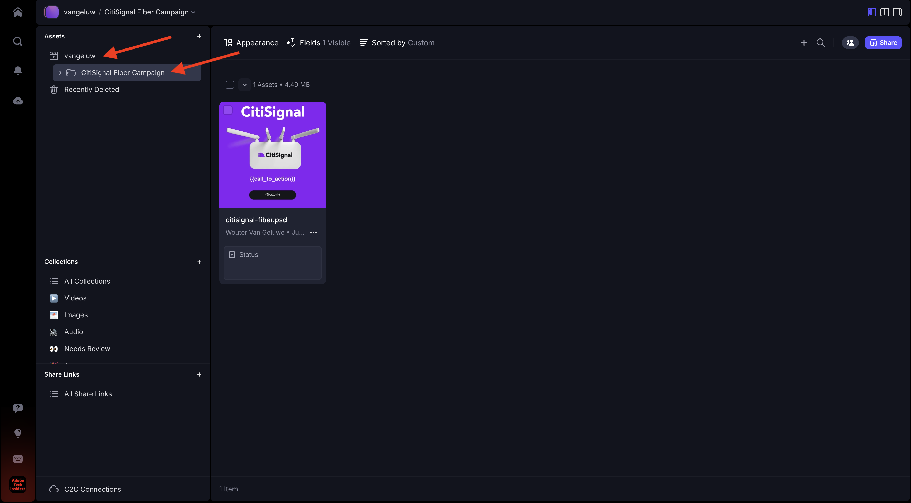
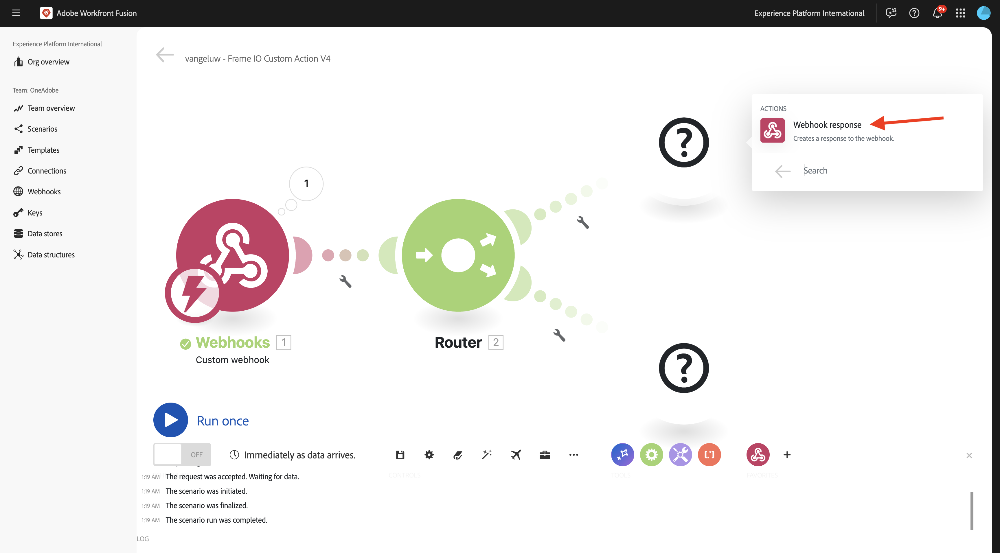
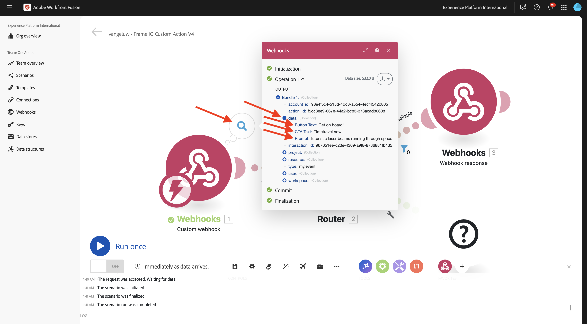
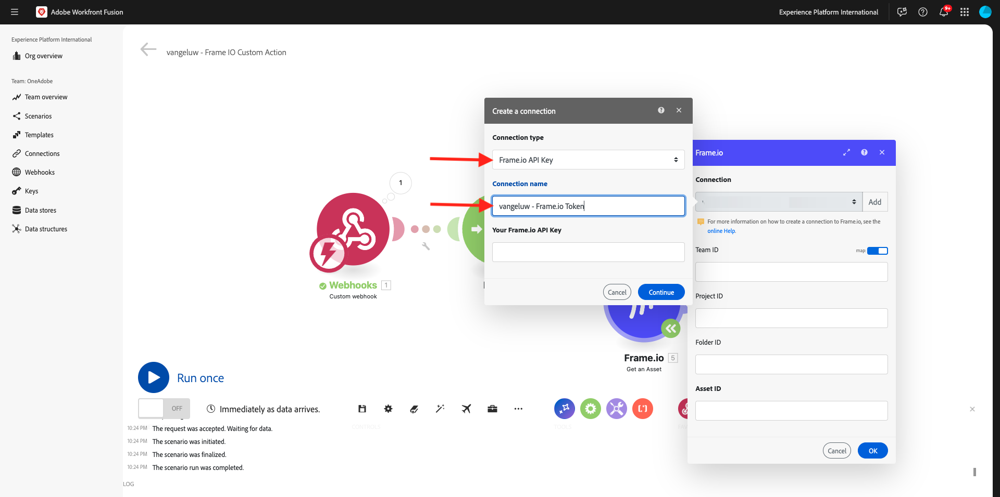
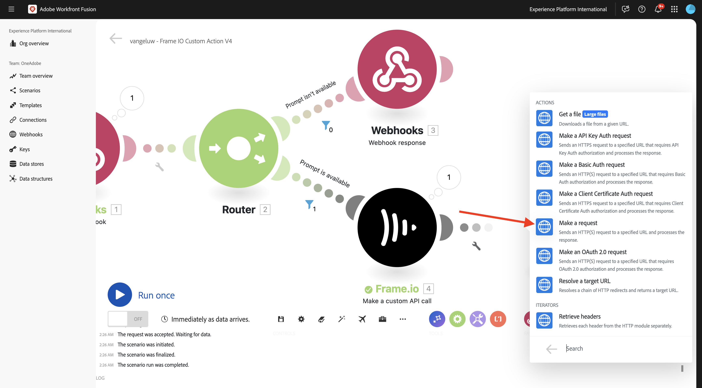
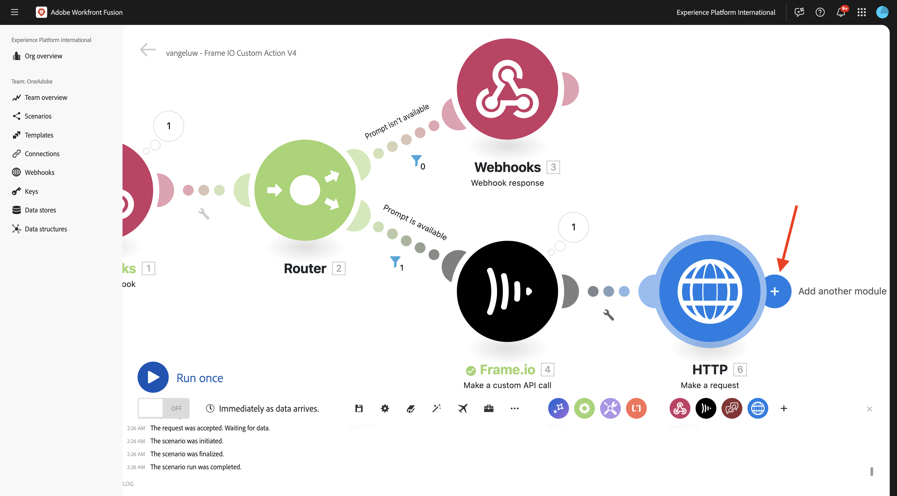
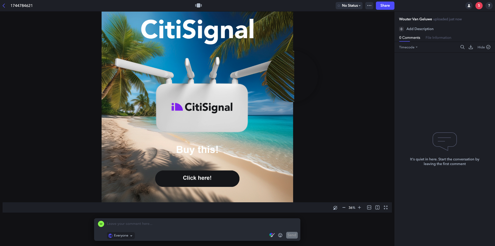

# 1.2.5 Frame.io e Workfront Fusion

Nell&#39;esercizio precedente è stato configurato lo scenario `--aepUserLdap-- - Firefly + Photoshop` e un webhook in ingresso per attivare lo scenario e una risposta del webhook al completamento dello scenario. Hai quindi utilizzato Postman per attivare tale scenario. Postman è un ottimo strumento per i test, ma in uno scenario di business reale, gli utenti aziendali non utilizzerebbero Postman per attivare uno scenario. Al contrario, utilizzerebbero un’altra applicazione e si aspetterebbero che quest’ultima attivi uno scenario in Workfront Fusion. In questo esercizio, questo è esattamente ciò che si farà con Frame.io.

>[!NOTE]
>
>Per completare correttamente questo esercizio, devi essere un utente amministratore nel tuo account Frame.io. L&#39;esercizio seguente è stato creato per Frame.io V3 e verrà aggiornato in una fase successiva per Frame.io V4.

## 1.2.5.1 Accesso a Frame.io

Vai a [https://app.frame.io/projects](https://app.frame.io/projects).

Fai clic sull&#39;icona **+** per creare un progetto personalizzato in Frame.io.


Immettere il nome `--aepUserLdap--` e fare clic su **Crea progetto**.


Il progetto verrà quindi visualizzato nel menu a sinistra.
In uno degli esercizi precedenti, hai scaricato [citisignal-fiber.psd](./../../../assets/ff/citisignal-fiber.psd){target="_blank"} sul desktop. Seleziona il file, quindi trascinalo nella cartella del progetto appena creata.


## 1.2.5.2 Workfront Fusion e Frame.io

Nell&#39;esercizio precedente è stato creato lo scenario `--aepUserLdap-- - Firefly + Photoshop`, che è iniziato con un webhook personalizzato e si è concluso con una risposta del webhook. L’utilizzo dei webhook è stato quindi testato utilizzando Postman, ma ovviamente, il punto di tale scenario è essere chiamato da un’applicazione esterna. Come indicato in precedenza, Frame.io sarà quell&#39;esercizio, ma tra Frame.io e `--aepUserLdap-- - Firefly + Photoshop` è necessario un altro scenario Workfront Fusion. ora configurerai quello scenario.

Nel menu a sinistra, vai a **Scenari** e seleziona la cartella `--aepUserLdap--`. Fai clic su **Crea un nuovo scenario**.


Utilizza il nome `--aepUserLdap-- - Frame IO Custom Action`.


Fare clic sull&#39;**oggetto punto interrogativo** nell&#39;area di lavoro. Immettere il testo `webhook` nella casella di ricerca e fare clic su **Webhook**.


Fai clic su **WebHook personalizzato**.


Fai clic su **Aggiungi** per creare un nuovo URL del webhook.


Per il **nome webhook**, utilizzare `--aepUserLdap-- - Frame IO Custom Action Webhook`. Fai clic su **Salva**.


Dovresti vedere questo. Lascia aperta e inalterata questa schermata come ti servirà in un passaggio successivo. Sarà necessario copiare l&#39;URL del webhook in un passaggio successivo, facendo clic su **Copia indirizzo negli Appunti**.


Vai a [https://developer.frame.io/](https://developer.frame.io/). Fai clic su **STRUMENTI PER SVILUPPATORI**, quindi scegli **Azioni personalizzate**.


Fare clic su **Crea azione personalizzata**.


Immetti i seguenti valori:

- **NOME**: utilizzare `--aepUserLdap-- - Frame IO Custom Action Fusion`
- **DESCRIZIONE**: utilizzare `--aepUserLdap-- - Frame IO Custom Action Fusion`
- **EVENTO**: utilizzare `fusion.tutorial`.
- **URL**: immetti l&#39;URL del webhook appena creato in Workfront Fusion
- **TEAM**: seleziona il team Frame.io appropriato, in questo caso **One Adobe Tutorial**.

Fai clic su **Invia**.


Dovresti vedere questo.


Torna a [https://app.frame.io/projects](https://app.frame.io/projects). Aggiorna la pagina.



Dopo aver aggiornato la pagina, fai clic sui tre punti **...** della risorsa **citisignal-fiber.psd**. Dovresti quindi visualizzare l’azione personalizzata creata in precedenza nel menu visualizzato. Fare clic sull&#39;azione personalizzata `--aepUserLdap-- - Frame IO Custom Action Fusion`.


Dovresti quindi vedere un **esito positivo simile.Popup**. Questa finestra a comparsa è il risultato della comunicazione tra Frame.io e Workfront Fusion.


Tornate a Workfront Fusion nella schermata. Dovresti vedere **Determinato correttamente** visualizzato nell&#39;oggetto Webhook personalizzato. Fai clic su **OK**.


Fare clic su **Esegui una volta** per attivare la modalità di test e verificare di nuovo la comunicazione con Frame.io.


Tornare a Frame.io e fare di nuovo clic sull&#39;azione personalizzata `--aepUserLdap-- - Frame IO Custom Action Fusion`.


Riportare lo schermo a Workfront Fusion. A questo punto dovrebbe essere visualizzato un segno di spunta verde e una bolla che mostra **1**. Fai clic sulla bolla per visualizzare i dettagli.


La vista dettagliata della bolla mostra i dati ricevuti da Frame.io. Dovresti visualizzare diversi ID. Ad esempio, il campo **resource.id** mostra l&#39;ID univoco in Frame.io della risorsa **citisignal-fiber.psd**


Ora che è stata stabilita la comunicazione tra Frame.io e Workfront Fusion, è possibile continuare la configurazione.

## 1.2.5.3 Fornitura di una risposta del modulo personalizzato a Frame.io

Quando l&#39;azione personalizzata viene richiamata in Frame.io, Frame.io prevede di ricevere una risposta da Workfront Fusion. Se si ripensa allo scenario creato nell&#39;esercizio precedente, sono necessarie diverse variabili per aggiornare il file Photoshop PSD standard. Tali variabili sono definite nel payload utilizzato:

```json
{
    "psdTemplate": "citisignal-fiber.psd",
    "xlsFile": "placeholder",
    "prompt":"misty meadows",
    "cta": "Buy this now!",
    "button": "Click here to buy!"
}
```

Per eseguire correttamente lo scenario `--aepUserLdap-- - Firefly + Photoshop`, sono necessari campi come **prompt**, **cta**, **button** e **psdTemplate**.

I primi 3 campi, **prompt**, **cta**, **button**, richiedono l&#39;input dell&#39;utente che deve essere raccolto in Frame.io quando l&#39;utente richiama l&#39;azione personalizzata. Pertanto, la prima cosa da fare all&#39;interno di Workfront Fusion è verificare se queste variabili sono disponibili o meno e, in caso contrario, Workfront Fusion deve rispondere a Frame.io richiedendo che tali variabili vengano immesse. Per ottenere questo risultato, si utilizza un modulo in Frame.io.

Tornare a Workfront Fusion e aprire lo scenario `--aepUserLdap-- - Frame IO Custom Action`. Passa il puntatore sull&#39;oggetto **webhook personalizzato** e fai clic sull&#39;icona **+** per aggiungere un altro modulo.


Cercare `Flow Control` e fare clic su **Controllo flusso**.


Fare clic per selezionare **Router**.


Dovresti vedere questo.


Fare clic su **?** oggetto e quindi fare clic per selezionare **Webhook**.


Seleziona **Risposta webhook**.



Dovresti vedere questo.


Copia il codice JSON seguente e incollalo nel campo **Corpo**.


```json
{
  "title": "What do you want Firefly to generate?",
  "description": "Enter your Firefly prompt.",
  "fields": [
    {
      "type": "text",
      "label": "Prompt",
      "name": "Prompt",
      "value": ""
    },
    {
      "type": "text",
      "label": "CTA Text",
      "name": "CTA Text",
      "value": ""
    },
    {
      "type": "text",
      "label": "Button Text",
      "name": "Button Text",
      "value": ""
    }
  ]
}
```

Fai clic sull’icona per pulire e abbellire il codice JSON. Quindi fare clic su **OK**.


Fai clic su **Salva** per salvare le modifiche.


Successivamente, devi impostare un filtro per garantire che questo percorso dello scenario venga eseguito solo quando non è disponibile alcun prompt. Fai clic sull&#39;icona **chiave inglese**, quindi seleziona **Configura filtro**.


Configura i campi seguenti:

- **Etichetta**: utilizzare `Prompt isn't available`.
- **Condizione**: utilizzare `{{1.data.Prompt}}`.
- **Operatori di base**: selezionare **Non esiste**.

>[!NOTE]
>
>È possibile specificare manualmente le variabili in Workfront Fusion utilizzando la seguente sintassi: `{{1.data.Prompt}}`. Il numero nella variabile fa riferimento al modulo nello scenario. In questo esempio, puoi vedere che il primo modulo nello scenario è denominato **Webhook** e ha un numero di sequenza di **1**. Ciò significa che la variabile `{{1.data.Prompt}}` accederà al campo **data.Prompt** dal modulo con numero di sequenza 1. I numeri di sequenza a volte possono essere diversi, quindi fai attenzione quando copi/incolla tali variabili e verifica sempre che il numero di sequenza utilizzato sia quello corretto.

Fai clic su **OK**.


Dovresti vedere questo. Fai clic prima sull&#39;icona **Salva**, quindi fai clic su **Esegui una volta** per verificare lo scenario.


Dovresti vedere questo.


Torna a Frame.io e fai di nuovo clic sull&#39;azione personalizzata `--aepUserLdap-- - Frame IO Custom Action Fusion` sulla risorsa **citisignal-fiber.psd**.


Ora dovresti visualizzare un prompt all’interno di Frame.io. Non compilare ancora i campi e non inviare il modulo. Questo prompt viene visualizzato in base alla risposta di Workfront Fusion appena configurata.


Torna a Workfront Fusion e fai clic sul fumetto nel modulo **Risposta webhook**. In **OUTPUT** verrà visualizzato il corpo contenente il payload JSON per il modulo. Fai di nuovo clic su **Esegui**.


Dovresti vederlo di nuovo.


Torna a Frame.io e compila i campi come indicato. Fai clic su **Invia**.


Dovresti quindi vedere un **Operazione completata.Popup**.


Torna a Workfront Fusion e fai clic sul fumetto nel modulo **Webhook personalizzato**. Nell&#39;operazione 1, in **OUTPUT**, è ora possibile visualizzare un nuovo oggetto **data** contenente campi come **Testo pulsante**, **Testo CTA** e **Prompt**. Con queste variabili di input utente disponibili nel tuo scenario, hai abbastanza per continuare la configurazione.



## 1.2.5.4 Recupera percorso file da Frame.io

Come già accennato, per il corretto funzionamento di questo scenario sono necessari campi come **prompt**, **cta**, **button** e **psdTemplate**. I primi 3 campi sono già disponibili, ma manca ancora il **psdTemplate** da utilizzare. **psdTemplate** farà ora riferimento a una posizione Frame.io poiché il file **citisignal-fiber.psd** è ospitato in Frame.io. Per recuperare la posizione del file, è necessario configurare e utilizzare la connessione Frame.io in Workfront Fusion.

Tornare a Workfront Fusion e aprire lo scenario `--aepUserLdap-- - Frame IO Custom Action`. Passare il cursore su **?Modulo**, fai clic sull&#39;icona **+** per aggiungere un altro modulo e cercare `frame`. Fare clic su **Frame.io**.


Fare clic su **Frame.io (legacy)**.


Fai clic su **Ottieni una risorsa**.


Per utilizzare la connessione Frame.io, è necessario prima configurarla. Fai clic su **Aggiungi** per eseguire l&#39;operazione.


Apri il menu a discesa **Tipo di connessione**.


Selezionare **Chiave API Frame.io** e immettere il nome `--aepUserLdap-- - Frame.io Token`.



Per ottenere un token API, vai a [https://developer.frame.io/](https://developer.frame.io/). Fai clic su **STRUMENTI PER SVILUPPATORI**, quindi scegli **Token**.


Fai clic su **Crea un token**.


Utilizza **Descrizione** `--aepUserLdap-- - Frame.io Token` e fai clic su **Seleziona tutti gli ambiti**.


Scorri verso il basso e fai clic su **Invia**.


Il token è stato creato. Fai clic su **Copia** per copiarlo negli Appunti.


Torna allo scenario in Workfront Fusion. Incolla il token nel campo **Chiave API Frame.io**. Fare clic su **OK**. La connessione verrà ora testata da Workfront Fusion.


Se la connessione è stata testata correttamente, verrà visualizzata automaticamente in **Connessione**. Ora disponi di una connessione riuscita e devi completare la configurazione per ottenere tutti i dettagli della risorsa da Frame.io, inclusa la posizione del file. A questo scopo, devi fornire **ID risorsa**.


L&#39;**ID risorsa** è condiviso da Frame.io a Workfront Fusion come parte della comunicazione **webhook personalizzato** iniziale ed è disponibile nel campo **resource.id**. Seleziona **resource.id** e fai clic su **OK**.


Ora dovresti vedere questo. Salva le modifiche e fai clic su **Esegui una volta** per verificare lo scenario.


Torna a Frame.io e fai di nuovo clic sull&#39;azione personalizzata `--aepUserLdap-- - Frame IO Custom Action Fusion` sulla risorsa **citisignal-fiber.psd**.


Ora dovresti visualizzare un prompt all’interno di Frame.io. Non compilare ancora i campi e non inviare il modulo. Questo prompt viene visualizzato in base alla risposta di Workfront Fusion appena configurata.


Tornare a Workfront Fusion. Fai di nuovo clic su **Esegui**.


Torna a Frame.io e compila i campi come indicato. Fai clic su **Invia**.


Torna a Workfront Fusion e fai clic sul fumetto nel modulo **Frame.io - Ottieni una risorsa**.


Sono ora visibili molti metadati sulla risorsa specifica **citisignal-fiber.psd**.


Le informazioni specifiche necessarie per questo caso d&#39;uso sono l&#39;URL del percorso del file **citisignal-fiber.psd**, che puoi trovare scorrendo verso il basso fino al campo **Original**.


Sono ora disponibili tutti i campi (**prompt**, **cta**, **button** e **psdTemplate**) necessari per il funzionamento di questo scenario.

## 1.2.5.5 richiama scenario Workfront

Nell&#39;esercizio precedente è stato configurato lo scenario `--aepUserLdap-- - Firefly + Photoshop`. Ora è necessario apportare una modifica minore a tale scenario.

Apri lo scenario `--aepUserLdap-- - Firefly + Photoshop` in un&#39;altra scheda e fai clic sul primo modulo **Adobe Photoshop - Applica modifiche PSD**. È ora possibile vedere che il file di input è configurato per utilizzare una posizione dinamica in Microsoft Azure. Dato che per questo caso d’uso il file di input non viene più archiviato in Microsoft Azure, ma utilizza invece l’archiviazione Frame.io, devi modificare queste impostazioni.


Cambia **Archiviazione** in **Esterna** e cambia **Posizione file** per utilizzare solo la variabile **psdTemplate** presa dal modulo **Webhook personalizzato** in ingresso. Fai clic su **OK** e quindi su **Salva** per salvare le modifiche.


Fare clic sul modulo **Webhook personalizzato** e quindi su **Copia indirizzo negli Appunti**. È necessario copiare l’URL, in quanto sarà necessario utilizzarlo nell’altro scenario.


Torna allo scenario `--aepUserLdap-- - Frame IO Custom Action`. Passa il puntatore del mouse su **Frame.io - Ottieni una risorsa** e fai clic sull&#39;icona **+**.


Immettere `http` e quindi fare clic su **HTTP**.


Seleziona **Crea una richiesta**.



Incolla l&#39;URL del webhook personalizzato nel campo **URL**. Impostare **Method** su POST**.


Imposta **Tipo corpo** su **Raw** e **Tipo contenuto** su **JSON (application/json)**.
Incolla il seguente payload JSON nel campo **Richiedi contenuto** e abilita la casella di controllo per **Analizza risposta**.

```json
{
    "psdTemplate": "citisignal-fiber.psd",
    "xlsFile": "placeholder",
    "prompt":"misty meadows",
    "cta": "Buy this now!",
    "button": "Click here to buy!"
}
```

Ora disponi di un payload statico configurato, ma deve diventare dinamico utilizzando le variabili raccolte in precedenza.


Per il campo **psdTemplate**, sostituire la variabile statica **citisignal-fiber.psd** con la variabile **Original**.


Per i campi **prompt**, **cta** e **button**, sostituire le variabili statiche con le variabili dinamiche inserite nello scenario dalla richiesta del webhook in ingresso da Frame.io, ovvero i campi **data.Prompt**, **data.CTA Text** e **data.Button Text**.

Fai clic su **OK**.


Fai clic su **Salva** per salvare le modifiche.


## 1.2.5.6 Salva nuova risorsa in Frame.io

Una volta richiamato l’altro scenario Workfront Fusion, verrà generato un nuovo modello Photoshop PSD disponibile. Il file PSD deve essere memorizzato nuovamente in Frame.io, che è l&#39;ultimo passaggio di questo scenario.

Passa il puntatore del mouse sul modulo **HTTP - Esegui una richiesta** e fai clic sull&#39;icona **+**.



Seleziona **Frame.io (legacy)**.


Seleziona **Crea una risorsa**.


La connessione Frame.io verrà selezionata automaticamente.


Selezionare le opzioni seguenti:

- **ID team**: selezionare l&#39;ID team appropriato, in questo caso `One Adobe Tutorial`.
- **ID progetto**: utilizzare `--aepUserLdap--`.
- **ID cartella**: utilizzare `root`.
- **Tipo**: utilizzare `File`.


Per il campo **Name**, puoi utilizzare una variabile come **timestamp** (o modificarla in qualcosa che abbia più senso per te). Puoi trovare la variabile predefinita **timestamp** nella scheda **Data e ora**.


Per il campo **URL Source**, utilizza il codice JSON seguente.

```json
{{6.data.newPsdTemplate}}
```

>[!NOTE]
>
>È possibile specificare manualmente le variabili in Workfront Fusion utilizzando la seguente sintassi: `{{6.data.newPsdTemplate}}`. Il numero nella variabile fa riferimento al modulo nello scenario. In questo esempio, puoi vedere che il sesto modulo nello scenario si chiama **HTTP - Fai una richiesta** e ha un numero di sequenza di **6**. Ciò significa che la variabile `{{6.data.newPsdTemplate}}` accederà al campo **data.newPsdTemplate** dal modulo con numero di sequenza 6. I numeri di sequenza a volte possono essere diversi, quindi fai attenzione quando copi/incolla tali variabili e verifica sempre che il numero di sequenza utilizzato sia quello corretto.

Fai clic su **OK**.


Fai clic su **Salva** per salvare le modifiche.


Infine, devi impostare un filtro per garantire che questo percorso dello scenario venga eseguito solo quando è disponibile un prompt. Fai clic sull&#39;icona **chiave inglese**, quindi seleziona **Configura filtro**.


Configura i campi seguenti:

- **Etichetta**: utilizzare `Prompt is available`.
- **Condizione**: utilizzare `{{1.data.Prompt}}`.
- **Operatori di base**: selezionare **exists**.

>[!NOTE]
>
>È possibile specificare manualmente le variabili in Workfront Fusion utilizzando la seguente sintassi: `{{1.data.Prompt}}`. Il numero nella variabile fa riferimento al modulo nello scenario. In questo esempio, puoi vedere che il primo modulo nello scenario è denominato **Webhook** e ha un numero di sequenza di **1**. Ciò significa che la variabile `{{1.data.Prompt}}` accederà al campo **data.Prompt** dal modulo con numero di sequenza 1. I numeri di sequenza a volte possono essere diversi, quindi fai attenzione quando copi/incolla tali variabili e verifica sempre che il numero di sequenza utilizzato sia quello corretto.

Fai clic su **OK**.


Fai clic su **Salva** per salvare le modifiche.


## 1.2.5.7 Verifica il tuo caso d&#39;uso end-to-end

Fai clic su **Esegui una volta** nello scenario `--aepUserLdap-- - Frame IO Custom Action`.


Torna a Frame.io e fai di nuovo clic sull&#39;azione personalizzata `--aepUserLdap-- - Frame IO Custom Action Fusion` sulla risorsa **citisignal-fiber.psd**.


Ora dovresti visualizzare un prompt all’interno di Frame.io. Non compilare ancora i campi e non inviare il modulo. Questo prompt viene visualizzato in base alla risposta di Workfront Fusion appena configurata.


Tornare a Workfront Fusion. Fai clic su **Esegui una volta** nello scenario `--aepUserLdap-- - Frame IO Custom Action`.


In Workfront Fusion, aprire lo scenario `--aepUserLdap-- - Firefly + Photoshop` e fare clic su **Esegui una volta** in tale scenario.


Torna a Frame.io e compila i campi come indicato. Fai clic su **Invia**.


Dopo 1-2 minuti, dovrebbe apparire automaticamente una nuova risorsa in Frame.io. Fai doppio clic sulla nuova risorsa per aprirla.


Ora è possibile vedere chiaramente che tutte le variabili di input dell’utente sono state applicate automaticamente.



Hai completato correttamente questo esercizio.

## Passaggi successivi

Vai a [1.2.6 Frame.io per passare a Fusion to AEM Assets](./ex6.md){target="_blank"}

Torna a [Automazione dei flussi di lavoro Creative con Workfront Fusion](./automation.md){target="_blank"}

Torna a [Tutti i moduli](./../../../overview.md){target="_blank"}

