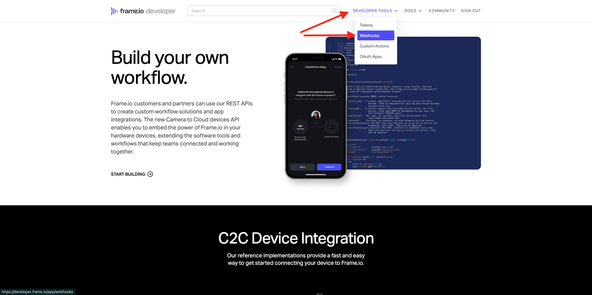
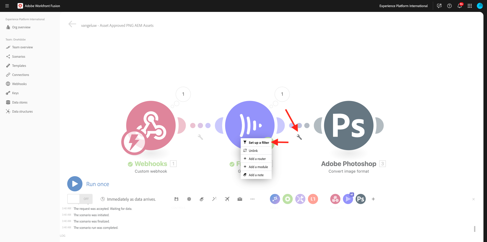
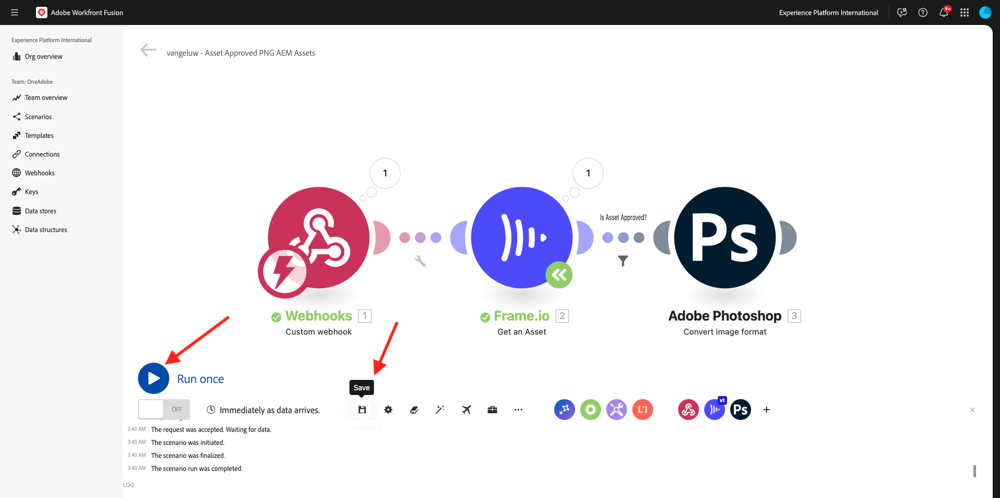
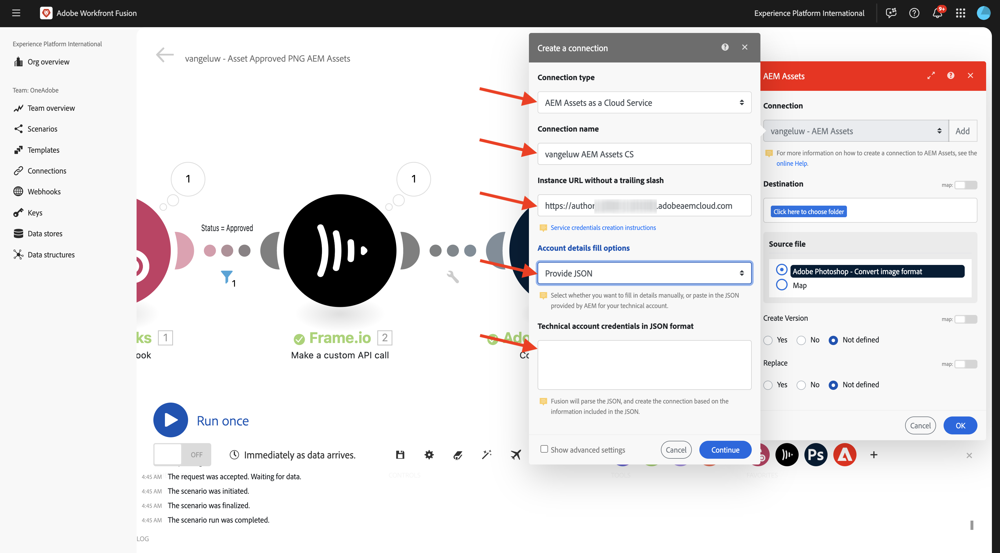
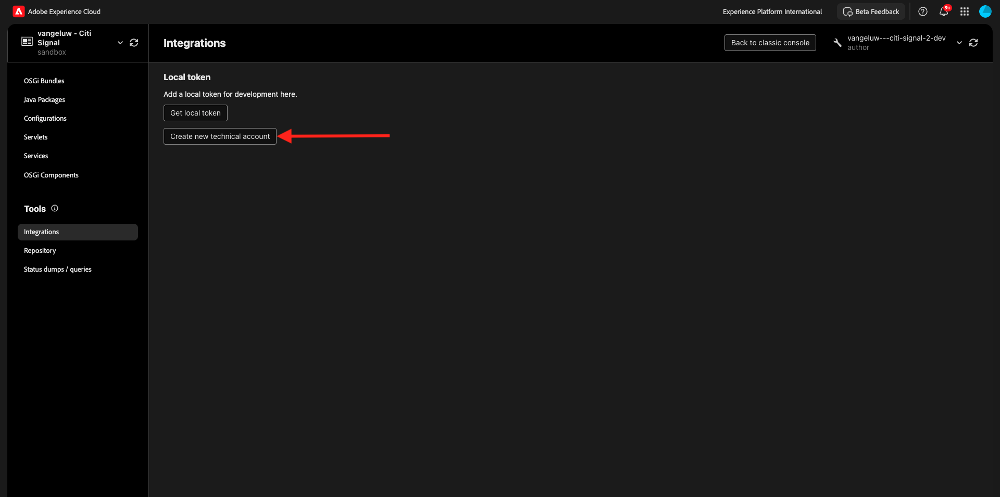
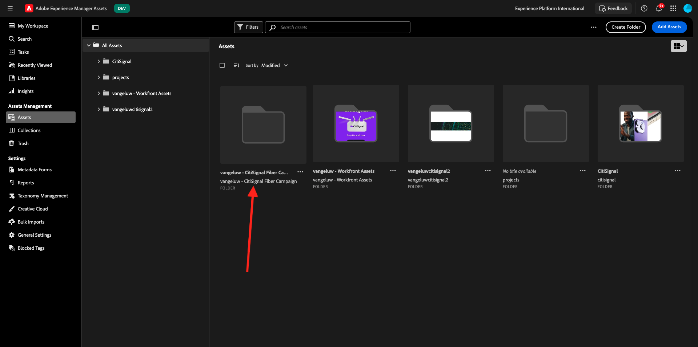

# I/O da 1.2.6 Frame a Workfront Fusion a AEM Assets

>[!IMPORTANT]
>
>Per completare questo esercizio, è necessario avere accesso a un ambiente AEM Assets CS Author funzionante. Se segui l&#39;esercizio [Adobe Experience Manager Cloud Service e Edge Delivery Services](./../../../modules/asset-mgmt/module2.1/aemcs.md){target="_blank"} potrai accedere a tale ambiente.

>[!IMPORTANT]
>
>Se in precedenza avete configurato un programma CS AEM Assets con un ambiente Autore, è possibile che la sandbox di AEM CS sia stata ibernata. Dato che la deibernazione di una sandbox di questo tipo richiede 10-15 minuti, sarebbe una buona idea iniziare il processo di ibernazione ora in modo da non rimanere bloccati in un secondo momento.

Nell&#39;esercizio precedente è stato configurato uno scenario che genera automaticamente varianti di un file PSD Adobe Photoshop utilizzando Adobe Systems Firefly, le API Photoshop e Workfront Fusion. L&#39;output di questo scenario era un nuovo file PSD Photoshop.

I team aziendali tuttavia non hanno bisogno di un file PSD, hanno bisogno di un file PNG o di un file JPG. In questo esercizio, configurerete una nuova automazione che comporterà la generazione di un file PNG una volta approvato il risorsa in Frame I/O e tale file PNG verrà archiviato in AEM Assets automaticamente.

## 1.2.6.1 Crea un nuovo scenario

Vai a [https://experience.adobe.com/](https://experience.adobe.com/). Aprire **Workfront Fusion**.

Nel menu a sinistra, vai a **Scenari** e seleziona la tua cartella `--aepUserLdap--`. Fare clic Crea **un nuovo scenario**.

Utilizza il nome `--aepUserLdap-- - Asset Approved PNG AEM Assets`. Fare clic su **?Modulo**, immetti il termine di ricerca `webhook` e fai clic su **Webhook**.

Fai clic su **WebHook personalizzato**.

Fai clic su **Aggiungi** per creare un nuovo webhook.

Utilizza il nome `--aepUserLdap-- - Frame.io Webhook`. Fai clic su **Salva**.

Dovresti vedere questo. Fare clic su **Copia indirizzo negli Appunti**.

## 1.2.6.2 Configurare il webhook in Frame.io

Vai a [https://developer.frame.io/](https://developer.frame.io/). Fai clic su **STRUMENTI PER SVILUPPATORI**, quindi scegli **Azioni personalizzate**.

Fai clic su **Crea un webhook**.

Immettere i seguenti valori:

- **NOME**: utilizzo `--aepUserLdap-- - Asset Labels Updated`
- **URL**: immetti l&#39;URL del webhook appena creato in Workfront Fusion
- **TEAM**: seleziona il team Frame.io appropriato, in questo caso **One Adobe Tutorial**.

Scorri verso il basso e abilita la casella di controllo accanto a **Etichette risorse - aggiornate**. Fai clic su **Invia**.

Dovresti vedere questo.

Vai a [https://app.frame.io/projects](https://app.frame.io/projects) e vai alla cartella creata in precedenza, che deve essere denominata `--aepUserLdap--`. Fai doppio clic per aprire la risorsa creata nell’esercizio precedente.

Dovresti vedere qualcosa del genere. Fare clic sul campo **Nessuno stato** e modificare lo stato in **In corso**.

Tornare a Workfront Fusion. Ora dovresti vedere che la connessione era **stabilita correttamente**.

Fare clic su **Salva** per salvare le modifiche e quindi su Esegui **una volta** per eseguire un test rapido.

Torna a Frame.io e fai clic sul campo **In corso** e modifica lo stato in **Rivedi da verificare**.

Torna a Workfront Fusion e fai clic sul fumetto nel modulo **Webhook personalizzato**.

La vista dettagliata della bolla mostra i dati ricevuti da Frame.io. Dovresti visualizzare diversi ID. Ad esempio, il campo **resource.id** mostra l&#39;ID univoco in Frame.io della risorsa **citisignal-fiber.psd**.

## 1.2.6.3 Ottieni dettagli risorsa da Frame.io

Ora che la comunicazione tra Frame.io e Workfront Fusion è stata stabilita tramite un webhook personalizzato, è necessario ottenere ulteriori dettagli sulla risorsa per la quale è stata aggiornata l’etichetta di stato. A questo scopo, utilizzerai nuovamente il connettore Frame.io in Workfront Fusion, in modo simile all’esercizio precedente.

Fare clic su **?Modulo** e immettere il termine di ricerca `frame`. Fare clic su **Frame.io**.

Fare clic su **Frame.io (versione precedente)**.

Fai clic su **Ottieni un risorsa**.

Verificare che la connessione sia impostata sulla stessa connessione creata nell&#39;esercizio precedente, che dovrebbe essere denominata `--aepUserLdap-- - Frame.io Token`.

Successivo, è necessario fornire l&#39;ID **risorsa**. L&#39;ID **** risorsa viene condiviso da Frame.io a Workfront Fusion come parte della comunicazione webhook **personalizzata iniziale** ed è disponibile nel campo **resource.id**. Selezionare **resource.id** e fare clic su **OK**.

Fai clic su **Salva** per salvare le modifiche, quindi fai clic su **Esegui una volta** per verificare la configurazione.

Torna a Frame.io e fai clic sul campo **Da rivedere** e modifica lo stato in **In corso**.

Torna a Workfront Fusion e fai clic sul fumetto nel modulo **Frame.io - Ottieni una risorsa**. Dovresti quindi visualizzare una panoramica simile.

Nei dettagli risorsa forniti da Frame.io è possibile trovare un campo denominato **Etichetta** impostato su **in_progress**. Sarà necessario utilizzare tale campo in un secondo momento per configurare un filtro.

## 1.2.6.4 Converti in PNG

Passa il puntatore del mouse sul modulo **Frame.io - Ottieni una risorsa** e fai clic sull&#39;icona **+**.

Immettere il termine di ricerca `photoshop` e quindi fare clic su **Adobe Photoshop**.

Fare clic su **Converti formato immagine**.

Verificare che il campo **Connessione** utilizzi la connessione creata in precedenza, denominata `--aepUserLdap-- - Adobe IO`.

In **Input**, imposta il campo **Archiviazione** su **Esterna** e imposta **Posizione file** per utilizzare la variabile **Originale** restituita dal modulo **Frame.io - Ottieni una risorsa**.

Fare clic su **Aggiungi elemento** in **Output**.

Per la configurazione di **Output**, impostare il campo **Archiviazione** su **Archiviazione interna di Fusion** e il **Tipo** su **immagine/png**. Fai clic su **Salva**.

Fai clic su **OK**.

Fare clic su **Salva** per salvare le modifiche.

Successivo, è necessario impostare un filtro per garantire che venga eseguito il rendering di un file PNG solo per i risorse con stato **Approvato**. Per fare ciò, fai clic sull&#39;icona **chiave** inglese tra i moduli **Frame.io - Ottieni un risorsa** e **Adobe Photoshop - Converti formato** immagine, quindi seleziona **Imposta un filtro**.

Configura i campi seguenti:

- **Etichetta**: utilizzare `Is Asset Approved`.
- **Condizione**: selezionare il campo **Etichetta** dalla risposta del **modulo Frame.io - Ottieni un risorsa** .
- **Operatori di base**: selezionare **Uguale a**.
- **Valore**: `approved`.

Fai clic su **OK**.

Fai clic su **Salva** per salvare le modifiche, quindi fai clic su **Esegui una volta** per verificare la configurazione.

Torna a Frame.io, fai clic sul campo **In corso** e modifica lo stato in **Approvato**.

Tornare a Workfront Fusion. Ora dovresti vedere che tutti i moduli nel tuo scenario sono stati eseguiti con successo. Fai clic sul fumetto sul **modulo Adobe Photoshop - Converti formato** immagine.

Nei dettagli dell&#39;esecuzione del modulo **Adobe Photoshop - Converti formato immagine** è stato generato un file PNG. Il passaggio successivo consiste nell’archiviare tale file in AEM Assets CS.

## PNG dell&#39;archivio 1.2.6.5 in AEM Assets CS

Passa il puntatore del mouse sul modulo **Adobe Photoshop - Converti formato immagine** e fai clic sull&#39;icona **+**.

Immetti il termine di ricerca `aem` e seleziona **AEM Assets**.

Fai clic su **Carica una risorsa**.

Ora devi configurare la connessione ad AEM Assets CS. Fai clic su **Aggiungi**.

Utilizza le seguenti impostazioni:

- **Tipo di** connessione: **AEM Assets come Cloud Service**.
- **Nome** connessione: `--aepUserLdap-- AEM Assets CS`.
- **Istanza URL**: copia il URL istanza dell&#39;ambiente Autore CS AEM Assets, che dovrebbe essere simile like questo: `https://author-pXXXXX-eXXXXXXX.adobeaemcloud.com`.
- **Opzioni di riempimento dettagli di accesso**: selezionare **Fornisci JSON**.

Ora è necessario fornire le credenziali di **account tecnica in formato** JSON. A tal fine, è necessario seguire una serie di passaggi utilizzando AEM Cloud Manager. Mentre lo fai, tieni aperta questa schermata.

Vai a [https://my.cloudmanager.adobe.com](https://my.cloudmanager.adobe.com){target="_blank"}. L&#39;organizzazione da selezionare è `--aepImsOrgName--`. Vedrai quindi qualcosa like questo. Fare clic per aprire il programma, che deve essere denominato `--aepUserLdap-- - Citi Signal`.

Fai clic sui tre punti **...** e seleziona **Developer Console**.

Fai clic su **Accedi con Adobe Systems**.

Si viene quindi indirizzati a **Developer Console**. Fai clic su **Crea nuovo account tecnico**.

Dovresti vedere qualcosa del genere. Copia l’intero payload JSON negli Appunti.

Torna a Workfront Fusion e incolla il payload JSON completo nel campo **Credenziali account tecnico in formato JSON**. Fai clic su **Continua**.

La connessione verrà quindi convalidata e, in caso di esito positivo, verrà selezionata automaticamente nel modulo AEM Assets. Passare quindi alla configurazione di una cartella. Come parte dell’esercizio, devi creare una nuova cartella dedicata.

Per creare una nuova cartella dedicata, vai a [https://experience.adobe.com](https://experience.adobe.com/). Assicurati che sia selezionata la istanza Experience Cloud corretta, che dovrebbe essere `--aepImsOrgName--`. Quindi fare clic su **Experience Manager Assets**.

Fare clic su **Seleziona** nell&#39;ambiente AEM Assets CS, che dovrebbe essere denominato `--aepUserLdap-- - Citi Signal dev`.

Vai a **Risorse e fai clic su** Crea **Cartella**.

Inserite il nome `--aepUserLdap-- - Frame.io PNG` e fate clic su **Crea**.

La cartella viene quindi creata.

Torna a Workfront Fusion, fai clic su **Fai clic qui per scegliere la cartella**, quindi scegli la cartella `--aepUserLdap-- - Frame.io PNG`.

Verificare che la destinazione sia impostata su `--aepUserLdap-- - Frame.io PNG`. Quindi, in **File Source**, seleziona **Mappa**.

In **Nome file**, scegliere la variabile `{{3.filenames[]}}`.

In **Dati**, scegliere la variabile `{{3.files[]}}`.

>[!NOTE]
>
>Le variabili in Workfront Fusion possono essere specificate manualmente utilizzando la sintassi seguente: `{{3.filenames[]}}`. Il numero nella variabile fa riferimento al modulo nello scenario. In questo esempio, puoi vedere che il terzo modulo nello scenario si chiama **Adobe Photoshop - Converti formato** immagine e ha un numero di sequenza pari **a 3**. Ciò significa che la variabile `{{3.filenames[]}}` accesso i nomi []**dei file del campo** dal modulo con numero di sequenza 3. I numeri di sequenza a volte possono essere diversi, quindi presta attenzione quando copi / incolla tali variabili e verifica sempre che il numero di sequenza utilizzato sia quello corretto.

Fai clic su **OK**.

Fai clic su **Salva** per salvare le modifiche.

Successivamente, devi impostare autorizzazioni specifiche per l’account tecnico appena creato. Quando l&#39;account è stato creato in **Developer Console** in **Cloud Manager**, gli sono stati concessi i diritti di accesso **Read**, ma per questo caso d&#39;uso sono necessari i diritti di accesso **Write**. Per farlo, vai all’ambiente AEM CS Author.

Vai a [https://my.cloudmanager.adobe.com](https://my.cloudmanager.adobe.com){target="_blank"}. L&#39;organizzazione da selezionare è `--aepImsOrgName--`. Fare clic per aprire il programma, che deve essere denominato `--aepUserLdap-- - Citi Signal`. Poi vedrai qualcosa del genere. Fai clic sull’URL dell’autore.

Fai clic su **Accedi con Adobe**.

Vai a **Impostazioni** > **Sicurezza** > **Utenti**.

Fare clic per aprire l&#39;account tecnico utente account.

Vai a **Gruppi** e aggiungi questo utente dell&#39;account tecnico al gruppo **DAM-utenti**.

Fai clic su **Salva e Chiudi**.

Tornare a Workfront Fusion. Fai clic su **Esegui una volta** per verificare lo scenario.

Torna a Frame.io e assicurati che lo stato della risorsa sia nuovamente **Approvato**.

>[!NOTE]
>
>Potrebbe essere necessario modificarlo di nuovo in **In corso** o **È necessario rivederlo**, quindi modificarlo di nuovo in **Approvato**.

Lo scenario Workfront Fusio verrà quindi attivato e dovrebbe essere completato correttamente. Visualizzando le informazioni nel fumetto del modulo **AEM Assets**, è già possibile vedere che il file PNG è stato archiviato correttamente in AEM Assets CS.

Tornare a AEM Assets CS e aprire la cartella `--aepUserLdap-- - Frame.io PNG`. Ora dovresti vedere il file PNG generato come parte dello scenario Workfront Fusion. Fare doppio clic sul file per aprirlo.

Ora puoi visualizzare ulteriori dettagli sui metadati del file PNG generato.

Hai completato correttamente questo esercizio.

## Passaggi successivi

Vai a [Riepilogo e vantaggi di Creative Workflow Automation con Workfront Fusion](./summary.md){target="_blank"}

Torna a [Automazione dei flussi di lavoro Creative con Workfront Fusion](./automation.md){target="_blank"}

Torna a [Tutti i moduli](./../../../overview.md){target="_blank"}
