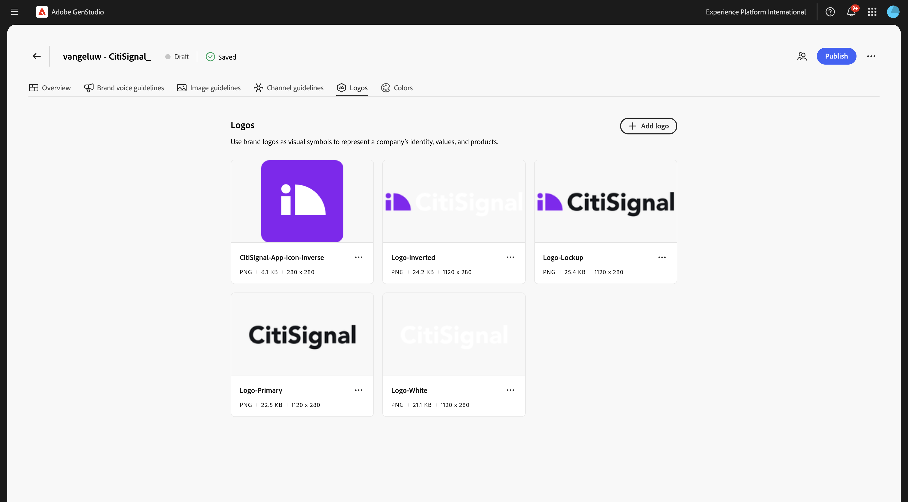
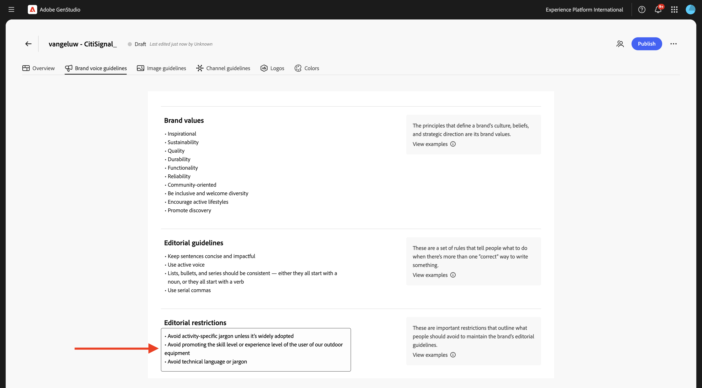

# 1.3.1 Configurazione: marchio

Un marchio distingue un’organizzazione, un prodotto, un servizio o un concetto dagli altri. Alcuni aspetti di un marchio sono oggettivi, come un logo, mentre altri sono soggettivi, come il tono di voce.

GenStudio for Performance Marketing utilizza la vasta gamma di informazioni sul brand del cliente, le associa a informazioni sui prodotti e sulle persone fisiche e crea un’identità del brand completa. Questa identità del brand viene utilizzata per informare la creazione di contenuti on-brand utilizzando la tecnologia AI generativa di Adobe.

Per iniziare a creare il tuo marchio, segui i passaggi seguenti.

Vai a [https://experience.adobe.com/](https://experience.adobe.com/){target="_blank"}. Apri **GenStudio**.


Dovresti vedere questo.


La prima cosa da fare per utilizzare GenStudio for Performance Marketing è configurare il brand. Fai clic sull&#39;icona **Marchi**.


Fare clic su **+ Aggiungi marchio**.


Immetti il nome `--aepUserLdap-- - CitiSignal` per il tuo marchio. Seleziona **Aggiungi manualmente**, quindi fai clic su **Aggiungi marchio**.


## 1.3.1.1 colori

Dovresti vedere questo. Fare clic su **Colori**.


Fare clic su **+ Aggiungi colore**.


Sono disponibili 4 colori diversi da aggiungere:

- `#8821F4`
- `#14161A`
- `#EEEEEE`
- `#FF006C`

Immettere il codice esadecimale per il colore `#8821F4`. Fai clic su **Aggiungi**.


Fare clic su **+ Aggiungi colore**.


Immettere il codice esadecimale per il colore `#14161A`. Fai clic su **Aggiungi**.


Fare clic su **+ Aggiungi colore**.


Immettere il codice esadecimale per il colore `#EEEEEE `. Fai clic su **Aggiungi**.


Fare clic su **+ Aggiungi colore**.


Immettere il codice esadecimale per il colore `#FF006C `. Fai clic su **Aggiungi**.


Ora dovresti avere questo.


## 1.3.1.2 Logo

Scarica il file [CitiSignal-GSPeM-assets.zip](../../../assets/gspem/CitiSignal-GSPeM-assets.zip) sul desktop e decomprimi.


Quindi, vai a **Logo**. Fare clic su **+ Aggiungi logo**.


Fare clic su **Sfoglia**.


Vai alla cartella **CitiSignal-GSPeM-assets** > **logos** e seleziona questi file. Fai clic su **Apri**.


Dovresti avere questo. Fare clic su **Aggiungi logo**.


Dovresti avere questo.



## 1.3.1.3 linee guida per Brand Voice

Quindi, vai a **Linee guida per la voce del marchio**.


Per **Tono e voce**, utilizzare:

```
• Convey a sense of exploration and adventure
• Be authentic and conversational
• Evoke excitement and curiosity
• Speak honestly and straightforwardly
• Be approachable and relatable
• Use everyday language
```


Per **Valori marchio**, utilizza:

```
• Inspirational
• Sustainability
• Quality
• Durability
• Functionality
• Reliability
• Community-oriented
• Be inclusive and welcome diversity
• Encourage active lifestyles
• Promote discovery
```


Per **Linee guida editoriali**, utilizzare:

```
• Keep sentences concise and impactful
• Use active voice
• Lists, bullets, and series should be consistent — either they all start with a noun, or they all start with a verb
• Use serial commas
```


Per **Restrizioni editoriali**, utilizzare:

```
• Avoid activity-specific jargon unless it’s widely adopted
• Avoid promoting the skill level or experience level of the user of our outdoor equipment
• Avoid technical language or jargon
```



## 1.3.1.4 linee guida per le immagini

Quindi, vai a **Linee guida per le immagini**.


Imposta **Tipo di contenuto** su **Arte** e per **Descrizione**, utilizza:

```
Capture candid, unposed shots of real people and futuristic animals engaging with technology in their daily lives to convey authenticity and relatability.
```


Per **Composizione**, utilizzare:

```
Focus on the experiences, speed and emotions of using technology, rather than just the products themselves.
```


Per **Ambiente**, utilizzare:

```
Highlight futuristic, clean, and professional settings that reflect innovation and connectivity.
```


Per **Colore**, utilizzare:

```
Use a palette inspired by technology, including sleek metallics, cool purple and blue, and neutral tones.
```


Per **Illuminazione**, utilizzare:

```
Utilize bright, natural lighting to create a welcoming and dynamic atmosphere.
```


Per **Mood**, utilizza:

```
Each image should evoke a feeling of speed, innovation and being part of the future.
```


Per **Restrizioni**, utilizzare:

```
Avoid cluttered or busy backgrounds that detract from the main subject.
```


## 1.3.1.4 linee guida per il canale

Quindi, vai a **Linee guida per il canale**.


Per **E-mail**, usa i seguenti valori:

- **Generale**

```
• Use simple, short sentences
• Be clear and concise
• Invoke a sense of adventure and exploration
```

- **Oggetto**

```
• Limit to less than 8 words
• Provide specific details about what’s inside the email
• Use sentence case
• Do not use end punctuation
```

- **Preheader**

```
• Limit to less than 80 characters
• Provide specific details about what’s inside the email
• Use sentence case
• Use ending punctuation
```

- **Titolo**

```
• Limit to less than 12 words
• Generate excitement through compelling and exciting statements
• Use sentence case
```

- **Sottotitolo**: lascia vuoto per il momento

- **Corpo**

```
• Limit to less than 120 words
• Use bullet points for lists containing more than 3 items
• Use between 0 to 4 headings within the body to separate main ideas
• Use sentence case
• Use ending punctuation
```

- **Call-to-action (CTA)**

```
• Limit to between 1 to 3 short words
• Limit to less than 20 characters
• Use an action-oriented verb as the first word and intended action the end-user should take
• Avoid ending punctuation
• Use title case
```


Per **Meta ads**, usa i seguenti valori:

- **Generale**

```
• Use simple, short sentences
• Be clear and concise
• Invoke a sense of adventure and exploration
• Make product names prominent
• Use community-building concepts and language
```

- **Titolo**

```
• Limit  to less than 8 words
• Limit to less than 27 characters
• Make it clear what action the reader should take
• Use sentence case
• Avoid ending punctuation
```

- **Corpo**

```
• Limit to less than 125 characters
• Use sentence case
• Use ending punctuation
```

- **Sul testo immagine**: lascia vuoto per il momento


Per **Banner e annunci di visualizzazione**, usa i seguenti valori:

- **Generale**

```
• Make readers feel inspired, interested, and sure of the next step
• Avoid word repetition
• Make product names prominent
```

- **Titolo**

```
• Clearly state the main benefit of the offer
• Use sentence case
• Use ending punctuation
• Limit to less than 60 characters
```

- **Sottotitolo**: lascia vuoto per il momento

- **Corpo**

```
• Communicate the benefits of clicking into the offer
• Use sentence case
• Use ending punctuation
```

- **Call-to-action (CTA)**

```
• Limit to between 1 to 3 short words
• Limit to less than 20 characters
• Use an action-oriented verb as the first word
• Use title case
• Avoid ending punctuation
```


Per **LinkedIn**, utilizzare i valori seguenti:

- **Generale**: lascia vuoto per il momento

- **Titolo**: lascia vuoto per adesso

- **Descrizione**: lascia vuoto per il momento

- **Testo introduttivo**: lasciare vuoto per il momento

- **Sul testo immagine**: lascia vuoto per il momento


Infine, vai a **Panoramica**. Ora puoi vedere una panoramica di tutto ciò che hai configurato. C&#39;è un&#39;ultima cosa da fare. Fai clic su **+ Aggiungi** in **Quando utilizzare questo marchio**.


Immettere il testo seguente e fare clic su **Salva modifiche**.

```
This is the default brand for CitiSignal marketing campaign. Use the CitiSignal brand for all brand and product campaigns that don't require specific guidelines.
```


Fai clic su **Pubblica**.


Fai di nuovo clic su **Pubblica**.


Il tuo marchio è ora pubblicato e può essere utilizzato per creare contenuti con marchio. Fai clic su **Fine**.


## Passaggi successivi

Vai a [Configurazione: utenti tipo, prodotti e modelli](./ex2.md){target="_blank"}

Torna a [GenStudio for Performance Marketing](./genstudio.md){target="_blank"}

Torna a [Tutti i moduli](./../../../overview.md){target="_blank"}
