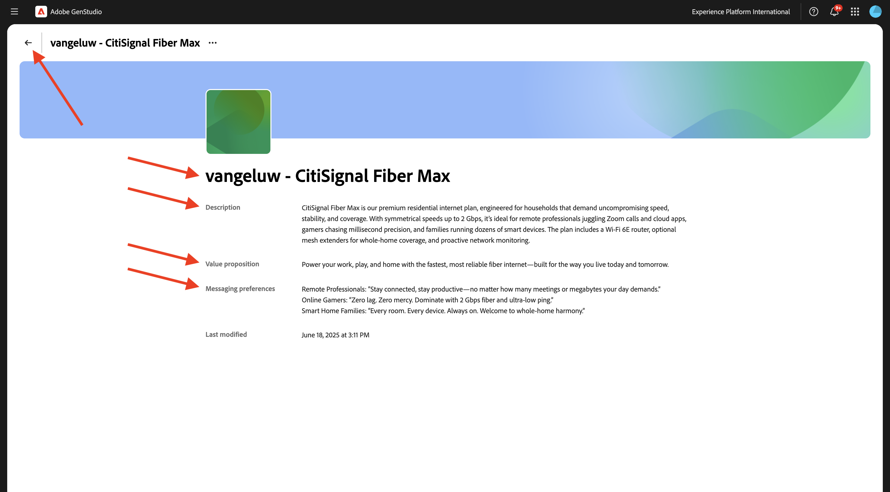
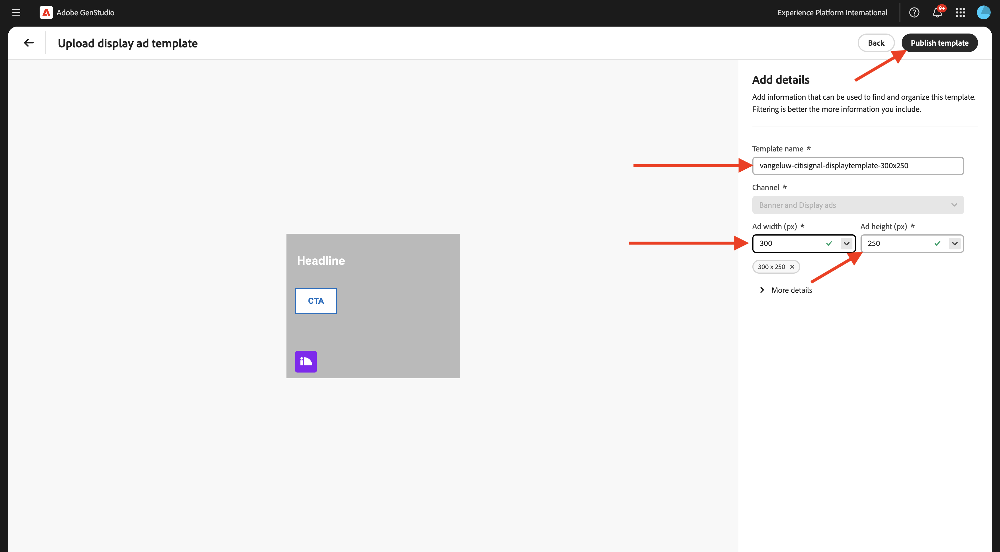

# 1.3.2 Configurazione: utenti tipo, prodotti e modelli

In questo esercizio configurerai utenti tipo, prodotti e modelli in GenStudio for Performance Marketing.

## 1.3.2.1 prodotti

I prodotti GenStudio for Performance Marketing sfruttano una conoscenza approfondita delle specifiche dei prodotti, dei vantaggi e dei fattori di differenziazione per generare contenuti di forte impatto.

I prodotti comprendono tutti gli elementi di un prodotto specifico, come immagini, descrizioni e proposte di valore, per creare una rappresentazione coerente del marchio. Sfruttando la tecnologia di intelligenza artificiale avanzata di Adobe, le linee guida di GenStudio for Performance Marketing (marchi, prodotti e utenti tipo) collaborano per generare contenuti coinvolgenti che presentino i punti di forza dei prodotti e garantiscano la coerenza di tutti i messaggi.

Per iniziare a creare i tuoi prodotti, fai clic sui tre punti **...**, quindi seleziona **Prodotti**.


Fare clic su **+ Aggiungi prodotto**.


Seleziona **Aggiungi manualmente** e fai clic su **Continua**.


Dovresti vedere questo.


Per il nome del prodotto, utilizza `--aepUserLdap-- - CitiSignal Mobile Flex Plan`.

Per il campo **Descrizione**, utilizza:

```
CitiSignal Mobile Flex is a next-gen 5G mobile plan that adapts to your lifestyle. Choose from Unlimited, Family Share, or Data Saver tiers, with optional add-ons like international roaming, hotspot tethering, and SmartFamily™ parental controls. All plans include priority access to CitiSignal’s 5G UltraWide network and seamless integration with CitiSignal Fiber for unified billing, shared data pools, and SmartSwitch™ connectivity. 
```

Per il campo **Proposta di valore**, utilizza:

```
A mobile plan that flexes with your life—fast, fair, and fully connected to your world.
```

Per il campo **Preferenze di messaggistica**, utilizza:

```
Remote Professionals: “Work from anywhere with a mobile plan that’s as flexible as your schedule.”
Online Gamers: “Unlimited 5G. No throttling. Just pure performance—on the go.”
Smart Home Families: “One plan. One bill. One less thing to worry about.”
```

La configurazione del prodotto dovrebbe ora essere simile a questa. Fai clic sull&#39;icona **indietro**.


Fare clic su **+ Aggiungi prodotto**.


Seleziona **Aggiungi manualmente** e fai clic su **Continua**.


Dovresti vedere questo.


Per il nome del prodotto, utilizza `--aepUserLdap-- - CitiSignal Fiber Max`.

Per il campo **Descrizione**, utilizza:

```
CitiSignal Fiber Max is our premium residential internet plan, engineered for households that demand uncompromising speed, stability, and coverage. With symmetrical speeds up to 2 Gbps, it’s ideal for remote professionals juggling Zoom calls and cloud apps, gamers chasing millisecond precision, and families running dozens of smart devices. The plan includes a Wi-Fi 6E router, optional mesh extenders for whole-home coverage, and proactive network monitoring. 
```

Per il campo **Proposta di valore**, utilizza:

```
Power your work, play, and home with the fastest, most reliable fiber internet—built for the way you live today and tomorrow.
```

Per il campo **Preferenze di messaggistica**, utilizza:

```
Remote Professionals: “Stay connected, stay productive—no matter how many meetings or megabytes your day demands.”
Online Gamers: “Zero lag. Zero mercy. Dominate with 2 Gbps fiber and ultra-low ping.”
Smart Home Families: “Every room. Every device. Always on. Welcome to whole-home harmony.”
```

La configurazione del prodotto dovrebbe ora essere simile a questa. Fai clic sull&#39;icona **indietro**.



Dovresti quindi visualizzare i 2 prodotti configurati.


## 1.3.2.2 utenti tipo

Gli utenti tipo forniscono un’autentica rappresentazione dei segmenti di clienti, comprese informazioni, interessi, punti critici, preferenze e caratteristiche comportamentali.

GenStudio for Performance Marketing sfrutta la potenza delle linee guida (marchi, prodotti e utenti tipo) e la tecnologia AI generativa di Adobe per curare contenuti di marketing personalizzati per i clienti target&#x200B;.

Per iniziare a creare i tuoi utenti tipo, fai clic sui tre punti **...**, quindi seleziona **Utenti tipo**.


Fare clic su **+ Aggiungi persona**.


Seleziona **Aggiungi manualmente** e fai clic su **Continua**.


Dovresti vedere questo.


Per il nome dell&#39;utente tipo, utilizza `--aepUserLdap-- - Smart Home Families`.

Per il campo **Descrizione**, utilizza:

```
These are tech-forward households with multiple connected devices—smart TVs, thermostats, security systems, voice assistants, and more. They value convenience, automation, and seamless connectivity across the home. They often have children and are concerned about online safety, parental controls, and whole-home coverage.
```

Per il campo **Preferenze di messaggistica**, utilizza:

```
Friendly, family-oriented tone
Visuals showing whole-home coverage and device compatibility
Messaging that highlights security, parental controls, and easy setup
Bundled offers (e.g., mesh Wi-Fi, smart home consultations)
How-to content or setup guides for non-tech-savvy users
```

La configurazione utente dovrebbe essere simile a questa. Fai clic sull&#39;icona **indietro**.


Fare clic su **+ Aggiungi persona**.


Seleziona **Aggiungi manualmente** e fai clic su **Continua**.


Dovresti vedere questo.


Per il nome dell&#39;utente tipo, utilizza `--aepUserLdap-- - Online Gamers`.

Per il campo **Descrizione**, utilizza:

```
This persona includes competitive and casual gamers who demand ultra-fast, low-latency internet. They often stream gameplay, participate in multiplayer matches, and use voice chat platforms. They are highly sensitive to lag, jitter, and packet loss, and they’re vocal about their experiences online. Many are early adopters of new tech and value performance above all else.
```

Per il campo **Preferenze di messaggistica**, utilizza:

```
Bold, energetic tone with gaming lingo
Metrics like ping time, jitter, and upload/download speeds
Visuals showing latency improvements or side-by-side comparisons
Endorsements from gaming influencers or esports teams
Promotions tied to gaming platforms or bundles (e.g., free months of Xbox Game Pass)
```

La configurazione utente dovrebbe essere simile a questa. Fai clic sull&#39;icona **indietro**.


Fare clic su **+ Aggiungi persona**.


Seleziona **Aggiungi manualmente** e fai clic su **Continua**.


Dovresti vedere questo.


Per il nome dell&#39;utente tipo, utilizza `--aepUserLdap-- - Remote Professionals`.

Per il campo **Descrizione**, utilizza:

```
These are knowledge workers, freelancers, consultants, and hybrid employees who rely on a stable, high-speed internet connection to maintain productivity from home. Their workdays are filled with video calls, cloud-based collaboration, and large file transfers. They often use multiple devices simultaneously and expect seamless performance across all of them. Many are tech-savvy and value proactive customer support and service transparency.
```

Per il campo **Preferenze di messaggistica**, utilizza:

```
Clear, professional tone with a focus on productivity and reliability
Testimonials or case studies from similar professionals
Visuals like speed comparison charts and uptime guarantees
Emphasis on 24/7 support and service-level agreements
Messaging that highlights “work-from-anywhere” flexibility
```

La configurazione utente dovrebbe essere simile a questa. Fai clic sull&#39;icona **indietro**.


Dovresti quindi visualizzare i 3 utenti tipo configurati.


## 1.3.2.3 modelli

GenStudio for Performance Marketing consente ai creatori di contenuti di produrre rapidamente contenuti di marketing coerenti sul marchio utilizzando i modelli. Un modello riduce in modo significativo il tempo e l’impegno necessari per generare nuovi contenuti, fornendo un punto di partenza che include layout preconfigurati ed elementi di progettazione.

Anche se GenStudio for Performance Marketing non supporta la creazione diretta di modelli all’interno dell’applicazione, è possibile progettare e preparare facilmente i modelli utilizzando i più diffusi strumenti di progettazione, come Adobe InDesign, Illustrator o Express. Una volta completato il progetto, puoi adattarlo per l’utilizzo in GenStudio for Performance Marketing. In questo esercizio verrà importata una serie di modelli predefiniti in GenStudio for Performance Marketing.

Nell&#39;esercizio precedente, hai scaricato il file [CitiSignal-GSPeM-assets.zip](../../../assets/gspem/CitiSignal-GSPeM-assets.zip) sul desktop e lo hai decompresso. Tale cartella contiene 4 modelli di esempio che ora è necessario importare in GenStudio.


Vai a **Contenuto** > **Modelli**. Fare clic su **+ Aggiungi modello**.


Seleziona **Annunci metadati** e fai clic su **Sfoglia**.


Nella cartella contenente i file scaricati di **CitiSignal-GSPeM-assets**, passa alla cartella **templates**. Seleziona il file **citisignal-meta-ad.html** e fai clic su **Apri**.


Dovresti vedere questo. Fai clic su **Avanti**.


Fai clic su **Avanti**.


Usa questo per il campo **Nome modello**:
`--aepUserLdap---citisignal-meta-ad` e impostare le proporzioni su **1:1**. Fai clic su **Pubblica modello**.


Il modello è stato salvato ed è disponibile nella libreria di modelli.


Fare clic su **+ Aggiungi modello**.


Seleziona **Banner e annunci di visualizzazione**, quindi fai clic su **Sfoglia**.


Nella cartella contenente i file scaricati di **CitiSignal-GSPeM-assets**, passa alla cartella **templates**. Selezionare il file **citisignal-displaytemplate-300x250.html** e fare clic su **Apri**.


Dovresti vedere questo. Fai clic su **Avanti**.


Fai clic su **Avanti**.


Usa questo per il campo **Nome modello**:
`--aepUserLdap---citisignal-displaytemplate-300x250` e impostare **Larghezza annuncio** e **Altezza annuncio** su **300x250**. Fai clic su **Pubblica modello**.



Il modello è stato salvato ed è disponibile nella libreria di modelli.


Fare clic su **+ Aggiungi modello**.


Seleziona **Banner e annunci di visualizzazione**, quindi fai clic su **Sfoglia**.


Nella cartella contenente i file scaricati di **CitiSignal-GSPeM-assets**, passa alla cartella **templates**. Selezionare il file **citisignal-displaytemplate-300x600.html** e fare clic su **Apri**.


Dovresti vedere questo. Fai clic su **Avanti**.


Fai clic su **Avanti**.


Usa questo per il campo **Nome modello**:
`--aepUserLdap---citisignal-displaytemplate-300x600` e impostare **Larghezza annuncio** e **Altezza annuncio** su **300x600**. Fai clic su **Pubblica modello**.


Il modello è stato salvato ed è disponibile nella libreria di modelli.


Fare clic su **+ Aggiungi modello**.


Seleziona **Banner e annunci di visualizzazione**, quindi fai clic su **Sfoglia**.


Nella cartella contenente i file scaricati di **CitiSignal-GSPeM-assets**, passa alla cartella **templates**. Selezionare il file **citisignal-displaytemplate-970x250.html** e fare clic su **Apri**.


Dovresti vedere questo. Fai clic su **Avanti**.


Fai clic su **Avanti**.


Usa questo per il campo **Nome modello**:
`--aepUserLdap---citisignal-displaytemplate-970x250` e impostare **Larghezza annuncio** e **Altezza annuncio** su **970x250**. Fai clic su **Pubblica modello**.


Il modello è stato salvato ed è disponibile nella libreria di modelli.


Ora hai configurato i modelli necessari per l’esercizio successivo.

## Passaggi successivi

Vai a [Attivazione campagna in formato meta](./ex3.md){target="_blank"}

Torna a [GenStudio for Performance Marketing](./genstudio.md){target="_blank"}

Torna a [Tutti i moduli](./../../../overview.md){target="_blank"}
