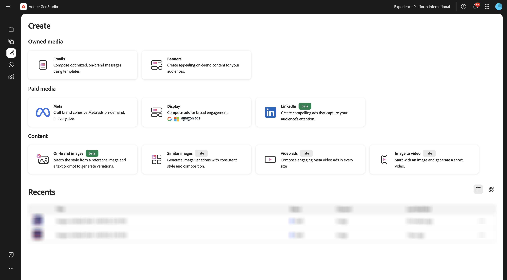

# 1.3.3 Attivazione della campagna per l’metadati

Vai a [https://experience.adobe.com/](https://experience.adobe.com/){target="_blank"}. Apri **GenStudio**.

Dovresti vedere questo.

## Passaggi successivi

Vai a [Riepilogo e vantaggi](./summary.md){target="_blank"}

Torna a [GenStudio for Performance Marketing](./genstudio.md){target="_blank"}

Torna a [Tutti i moduli](./../../../overview.md){target="_blank"}
