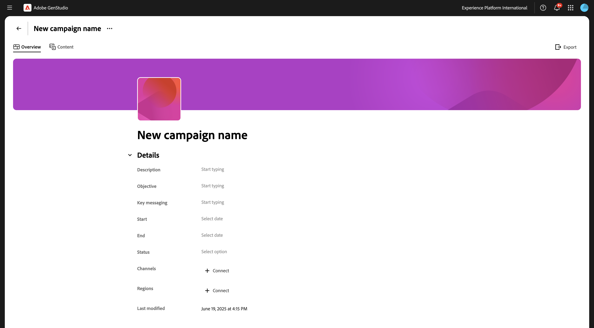
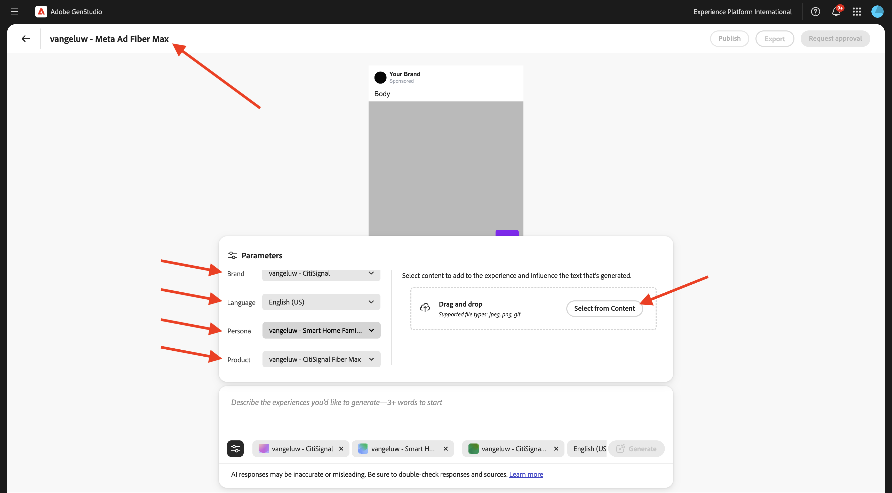
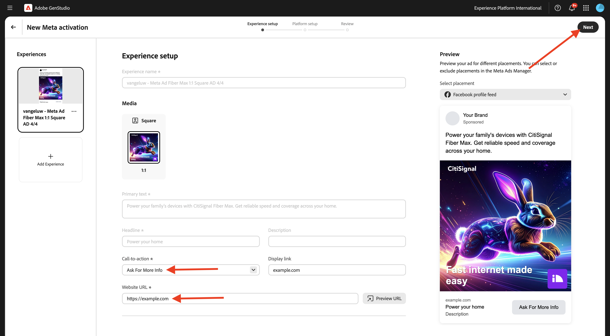
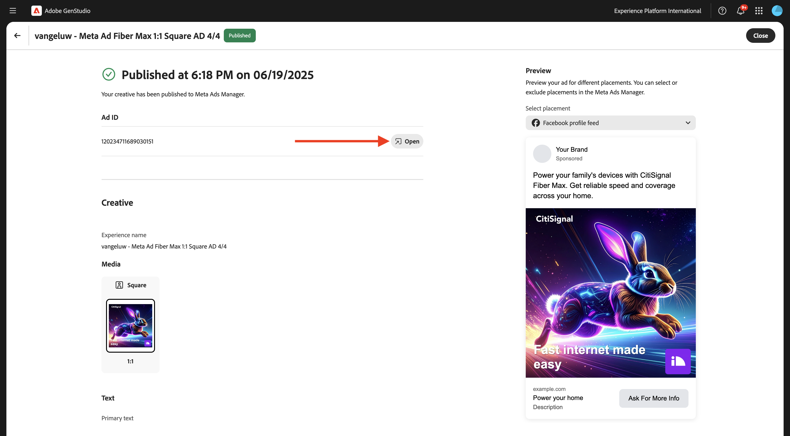

# 1.3.3 Attivazione della campagna per l’metadati

>[!IMPORTANT]
>
>Per completare questo esercizio, devi avere accesso a un ambiente AEM Assets CS Author funzionante in cui sia abilitato AEM Assets Content Hub.
>
>Ci sono 2 opzioni da considerare:
>
>- Se stai partecipando al workshop di abilitazione tecnica di GenStudio for CSC, i tuoi istruttori hanno creato un ambiente AEM Assets CS Author per te. Verifica con loro il nome e come procedere.
>
>- Se stai seguendo il percorso completo dell&#39;esercitazione di One Adobe, vai all&#39;esercizio [Adobe Experience Manager Cloud Service &amp; Edge Delivery Services](./../../../modules/asset-mgmt/module2.1/aemcs.md){target="_blank"}. Segui le istruzioni e potrai accedere a tale ambiente.

>[!IMPORTANT]
>
>Per eseguire tutti i passaggi di questo esercizio, devi avere accesso a un ambiente Adobe Workfront esistente e in tale ambiente devi aver creato un progetto e un flusso di lavoro di approvazione. Se segui l&#39;esercizio [Gestione dei flussi di lavoro con Adobe Workfront](./../../../modules/workflow-planning/module1.2/workfront.md){target="_blank"} avrai a disposizione la configurazione necessaria.

>[!IMPORTANT]
>
>Se in precedenza hai configurato un programma AEM Assets CS con un ambiente Author e AEM Assets, è possibile che la sandbox AEM CS sia stata sospesa. Dato che la disattivazione di una sandbox di questo tipo richiede 10-15 minuti, sarebbe opportuno avviare subito il processo di disattivazione in modo da non doverlo attendere in un secondo momento.

## 1.3.3.1 Crea campagna

In **GenStudio for Performance Marketing**, vai a **Campagne** nel menu a sinistra. Fare clic su **+ Aggiungi campagna**.


Dovresti quindi visualizzare una panoramica vuota della campagna.



Per il nome del campo, utilizzare `--aepUserLdap-- - CitiSignal Fiber Launch Campaign`.

Per il campo **Descrizione**, utilizzare il testo seguente.

```
The CitiSignal Fiber Launch campaign introduces CitiSignal’s flagship fiber internet service—CitiSignal Fiber Max—to key residential markets. This campaign is designed to build awareness, drive sign-ups, and establish CitiSignal as the go-to provider for ultra-fast, reliable, and future-ready internet. The campaign will highlight the product’s benefits for remote professionals, online gamers, and smart home families, using persona-driven messaging across digital and physical channels.
```

Per il campo **Obiettivo**, utilizzare il testo seguente.

```
Generate brand awareness in target regions
Drive early sign-ups and pre-orders for CitiSignal Fiber Max
Position CitiSignal as a premium, customer-first fiber internet provider
Educate consumers on the benefits of fiber over cable or DSL
```

Per il campo **Messaggi chiave**, utilizza il testo seguente.

```
Supporting Points:
Symmetrical speeds up to 2 Gbps
Whole-home Wi-Fi 6E coverage
99.99% uptime guarantee
24/7 concierge support
No data caps or throttling
 Channels:
Digital Advertising: Google Display, YouTube pre-roll, Meta (Facebook/Instagram), TikTok (for gamers)
Email Marketing: Persona-segmented drip campaigns
Social Media: Organic and paid posts with testimonials, speed demos, and influencer partnerships
Out-of-Home (OOH): Billboards, transit ads in suburban commuter corridors
Local Events: Pop-up booths at tech expos, family festivals, and gaming tournaments
Direct Mail: Personalized flyers with QR codes for early sign-up discounts
 
Target Regions:
Primary Launch Markets:
Denver Metro Area, CO
Austin, TX
Raleigh-Durham, NC
Salt Lake City, UT
Demographic Focus:
Suburban neighborhoods with high remote work density
Areas with high smart home adoption
Zip codes with underserved or dissatisfied cable customers
```

A questo punto dovresti avere:


Scorri verso il basso per visualizzare altri campi:


Per il campo **Inizio**, impostalo sulla data odierna.

Per il campo **Fine**, impostalo su una data che cade tra un mese.

Per il campo **Stato**, impostarlo su **Attivo**.

Per il campo **Canali**, impostarlo su **Meta**, **E-mail**, **Supporti a pagamento**, **Visualizzazione**.

Per il campo **Aree**, selezionare un&#39;area di scelta.

Per il campo Per il campo **Riferimenti** > **Prodotti**: scegliere il prodotto `--aepUserLdap-- - CitiSignal Fiber Max`.

**Riferimenti** > **Utenti tipo**: scegliere gli utenti tipo `--aepUserLdap-- - Remote Professionals`, `--aepUserLdap-- - Online Gamers`, `--aepUserLdap-- - Smart Home Families`

Dovresti quindi vedere quanto segue:


La campagna è ora pronta. Fai clic sulla **freccia** per tornare indietro.


La campagna verrà quindi visualizzata nell’elenco. Fai clic sull’icona della vista calendario per passare al calendario della campagna.


Dovresti quindi visualizzare un calendario delle campagne che offre un’idea più visiva delle campagne attive in un determinato momento.


## 1.3.3.2 Imposta connessione a Meta

>[!IMPORTANT]
>
>Per configurare la connessione a Meta, è necessario disporre di un account utente Meta disponibile e tale account utente deve essere aggiunto a un account Meta Business.

Per impostare la connessione a Meta, fare clic sui tre punti **...** e selezionare **Impostazioni**.


Fai clic su **Connetti** per **Meta Ads**.


Accedi con il tuo account Meta. Fai clic su **Continua**.


Se il tuo account è collegato a un account Meta Business, potrai selezionare il portfolio aziendale configurato in Meta.


Una volta stabilita la connessione, fare clic sulla riga che indica **X account connessi**.


Dovresti quindi visualizzare i dettagli dell’account Meta Business connesso a GenStudio for Performance Marketing.


## 1.3.3.3 Crea nuova risorsa

Vai a [https://firefly.adobe.com/](https://firefly.adobe.com/){target="_blank"}. Immettere il prompt `a neon rabbit running very fast through space` e fare clic su **Genera**.


Vedrai quindi diverse immagini generate. Scegli l&#39;immagine che preferisci, fai clic sull&#39;icona **Condividi** nell&#39;immagine, quindi seleziona **Apri in Adobe Express**.


L’immagine appena generata sarà quindi disponibile in Adobe Express per la modifica. È ora necessario aggiungere il logo CitiSignal all&#39;immagine. Per farlo, vai a **Marchi**.


Dovresti quindi vedere il modello del brand CitiSignal creato in GenStudio for Performance Marketing apparire in Adobe Express. Fai clic per selezionare il modello del brand che deve essere denominato `--aepUserLdap-- - CitiSignal`.


Vai a **Logos** e fai clic sul logo **white** Citisignal per rilasciarlo sull&#39;immagine.


Posizionare il logo CitiSignal nella parte superiore dell&#39;immagine, non troppo lontano dal centro.


Fare clic su **Condividi**.


Seleziona **AEM Assets**.


Fare clic su **Seleziona cartella**.


Selezionare l&#39;archivio AEM Assets CS, che deve essere denominato `--aepUserLdap-- - CitiSignal`, quindi selezionare la cartella `--aepUserLdap-- - CitiSignal Fiber Campaign`. Fai clic su **Seleziona**.


Dovresti vedere questo. Fai clic su **Carica 1 risorsa**. L&#39;immagine verrà ora caricata in AEM Assets CS.


Vai a [https://experience.adobe.com/](https://experience.adobe.com/){target="_blank"}. Apri **Experience Manager Assets**.


Seleziona l&#39;ambiente AEM Assets CS, che deve essere denominato `--aepUserLdap-- - CitiSignal dev`.


Passare a **Assets** e quindi fare doppio clic sulla cartella `--aepUserLdap-- - CitiSignal Fiber Campaign`.


Dovresti vedere qualcosa di simile a questo. Fare doppio clic sull&#39;immagine `--aepUserLdap-- - neon rabbit`.


Verrà quindi visualizzata l&#39;immagine `--aepUserLdap-- - neon rabbit`. Cambia lo **Stato** in **Approvato**, quindi fai clic su **Salva**

>[!IMPORTANT]
>
>Se lo stato di un&#39;immagine non è impostato su **Approvata**, l&#39;immagine non sarà visibile in GenStudio for Performance Marketing. In GenStudio for Performance Marketing sono accessibili solo le risorse approvate.


Torna a GenStudio for Performance Marketing. Nel menu a sinistra, vai a **Assets** e seleziona il tuo archivio AEM Assets CS, che deve essere denominato `--aepUserLdap-- - CitiSignal`. L’immagine appena creata e approvata sarà quindi disponibile in GenStudio for Performance Marketing.


## 1.3.3.4 Crea e approva Meta Ad

Nel menu a sinistra, vai a **Crea**. Seleziona **Meta**.


Selezionare il modello **Meta ad** importato in precedenza, denominato `--aepUserLdap---citisignal-meta-ad`. Fai clic su **Usa**.


Dovresti vedere questo. Cambia il nome dell&#39;annuncio in `--aepUserLdap-- - Meta Ad Fiber Max`.

In **Parametri**, selezionare le opzioni seguenti:

- **Marchio**: `--aepUserLdap-- - CitiSignal`
- **Lingua**: `English (US)`
- **Persona**: `--aepUserLdap-- - Smart Home Families`
- **Prodotto**: `--aepUserLdap-- - CitiSignal Fiber Max`

Fare clic su **Seleziona dal contenuto**.



Selezionare la risorsa `--aepUserLdap-- - neon rabbit.png`. Fai clic su **Usa**.


Immettere il prompt `focus on lightning fast internet for big families` e fare clic su **Genera**.


Dovresti vedere qualcosa del genere. I tuoi annunci sono ora pronti per essere rivisti e approvati. A tale scopo, fare clic su **Richiedi approvazione**, che si connette ad Adobe Workfront.


Selezionare il progetto Adobe Workfront, che deve essere denominato `--aepUserLdap-- - CitiSignal Fiber Launch`. Immetti il tuo indirizzo e-mail in **Invita persone** e assicurati che il tuo ruolo sia impostato su **Approvatore**.


In alternativa, puoi anche utilizzare un flusso di lavoro di approvazione esistente in Adobe Workfront. A tale scopo, fare clic su **Usa modello** e selezionare il modello `--aepuserLdap-- - Approval Workflow`. Fai clic su **Invia**.


Fai clic su **Visualizza commenti in Workfront** per passare all&#39;interfaccia utente di Adobe Workfront Proof.


Nell&#39;interfaccia utente di Adobe Workfront Proof, fai clic su **Decidi**.


Seleziona **Approvato** e fai clic su **Decidi**.


Fai clic su **Pubblica**.


Seleziona la campagna `--aepUserLdap-- - CitiSignal Fiber Launch Campaign` e fai clic su **Pubblica**.


Fare clic su **Apri nel contenuto**.


I 4 metadati sono ora disponibili in **Contenuto** > **Esperienze**.


## Pubblicazione annuncio 1.3.3.5 in formato Meta

Selezionare uno degli annunci e fare clic su **Attiva**.


Scegli un **Call to action** dall&#39;elenco e immetti un URL di esempio. Fai clic su **Avanti**.



Seleziona l’account Meta, la pagina Facebook collegata, la Meta Campaign e il Meta Ad Set.

Assegna un nome all&#39;aggiunta e utilizza `--aepUserLdap-- Fiber Max Ad`.

Fai clic su **Avanti**.


Fai clic su **Pubblica**.


Fai clic su **OK**.


Lo stato dell&#39;annuncio è ora impostato su **Pubblicazione**, che potrebbe richiedere alcuni minuti.


Dopo alcuni minuti, lo stato dell&#39;annuncio passerà a **Pubblicato**. Questo significa che l’annuncio è stato inviato da GenStudio for Performance Marketing a Meta. Non significa che l’annuncio sia già stato pubblicato in Meta! Ci sono ancora una serie di passaggi da fare nell’account Meta Business per prendere l’annuncio e pubblicarlo in modo che possa essere visto dagli utenti sulle varie piattaforme Meta.

Fare clic su **Visualizza dettagli**.


Fai clic su **Apri** per passare al tuo account Meta Business.

>[!IMPORTANT]
>
>Se non hai accesso all’account Meta Business connesso al tuo ambiente, non potrai visualizzare questo annuncio in Meta.



Ecco una panoramica dell’annuncio che hai appena creato, ma ora in Meta.


Hai completato l&#39;esercizio.

## Passaggi successivi

Vai a [Riepilogo e vantaggi](./summary.md){target="_blank"}

Torna a [GenStudio for Performance Marketing](./genstudio.md){target="_blank"}

Torna a [Tutti i moduli](./../../../overview.md){target="_blank"}
