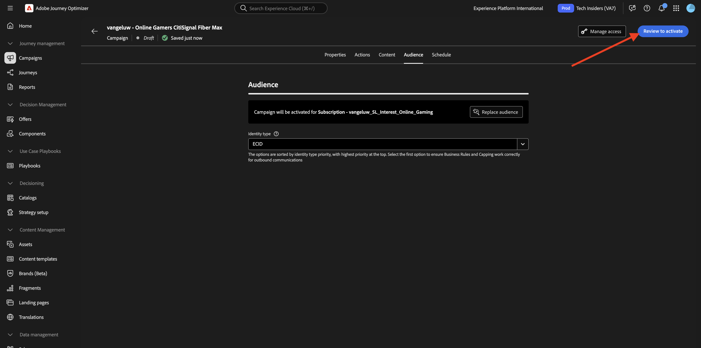
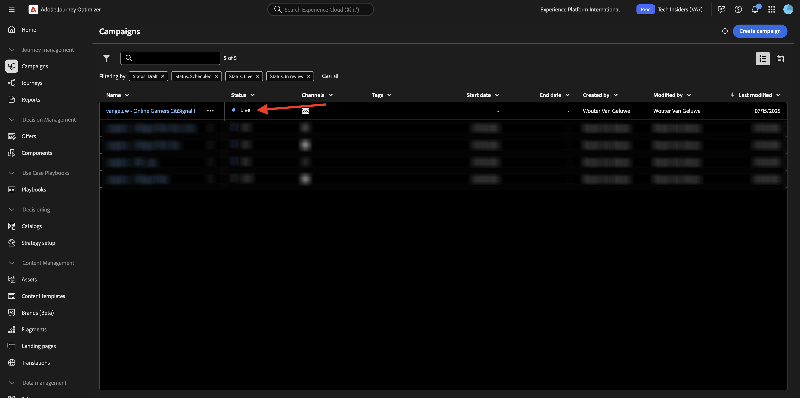

# 1.3.4 Creare esperienze e-mail per AJO

>[!IMPORTANT]
>
>Per completare questo esercizio, è necessario avere accesso a un ambiente Adobe Journey Optimizer fornito per l’integrazione con GenStudio for Performance Marketing, attualmente in versione beta.

>[!IMPORTANT]
>
>Per eseguire tutti i passaggi di questo esercizio, devi avere accesso a un ambiente Adobe Workfront esistente e in tale ambiente devi aver creato un progetto e un flusso di lavoro di approvazione. Se segui l&#39;esercizio [Gestione dei flussi di lavoro con Adobe Workfront](./../../../modules/asset-mgmt/module2.2/workfront.md){target="_blank"} avrai a disposizione la configurazione necessaria.

## 1.3.4.1 Crea e approva esperienza e-mail

Nel menu a sinistra, vai a **Crea**. Seleziona **E-mail**.


Seleziona il modello **E-mail** importato in precedenza, denominato `--aepUserLdap---citisignal-email-template`. Fai clic su **Usa**.


Dovresti vedere questo. Cambia il nome dell&#39;annuncio in `--aepUserLdap-- - Email Online Gamers Fiber Max`.


In **Parametri**, selezionare le opzioni seguenti:

- **Marchio**: `--aepUserLdap-- - CitiSignal`
- **Lingua**: `English (US)`
- **Persona**: `--aepUserLdap-- - Smart Home Families`
- **Prodotto**: `--aepUserLdap-- - CitiSignal Fiber Max`

Fare clic su **Seleziona dal contenuto**.


Selezionare la risorsa `--aepUserLdap-- - neon rabbit.png`. Fai clic su **Usa**.


Immettere il prompt `convince online gamers to start playing online multiplayer games using CitiSignal internet` e fare clic su **Genera**.


Dovresti quindi vedere qualcosa di simile, con 4 varianti di e-mail generate. La visualizzazione predefinita mostra la visualizzazione **mobile**. È possibile passare alla visualizzazione desktop facendo clic sull&#39;icona **computer**.


Per ogni e-mail, viene calcolato automaticamente un punteggio di conformità. Fai clic sul punteggio per visualizzare ulteriori dettagli.


Fai clic su **Visualizza e correggi i problemi**.


Puoi quindi visualizzare maggiori dettagli su cosa fare per ottimizzare il punteggio di complicanza.


Quindi, fai clic su **Richiedi approvazione**, che si connetterà ad Adobe Workfront.


Selezionare il progetto Adobe Workfront, che deve essere denominato `--aepUserLdap-- - CitiSignal Fiber Launch`. Immetti il tuo indirizzo e-mail in **Invita persone** e assicurati che il tuo ruolo sia impostato su **Approvatore**.


In alternativa, puoi anche utilizzare un flusso di lavoro di approvazione esistente in Adobe Workfront. A tale scopo, fare clic su **Usa modello** e selezionare il modello `--aepuserLdap-- - Approval Workflow`. Fai clic su **Invia**.


Fai clic su **Visualizza commenti in Workfront** per passare all&#39;interfaccia utente di Adobe Workfront Proof.


Nell&#39;interfaccia utente di Adobe Workfront Proof, fai clic su **Decidi**.


Seleziona **Approvato** e fai clic su **Decidi**.


Fai clic su **Pubblica**.


Seleziona la campagna `--aepUserLdap-- - CitiSignal Fiber Launch Campaign` e fai clic su **Pubblica**.


Fare clic su **Apri nel contenuto**.


Le 4 esperienze e-mail sono ora disponibili in **Contenuto** > **Esperienze**.


## 1.3.4.2 Creazione di una campagna in AJO

Accedi a Adobe Journey Optimizer da [Adobe Experience Cloud](https://experience.adobe.com). Fare clic su **Journey Optimizer**.


Verrai reindirizzato alla visualizzazione **Home** in Journey Optimizer. Innanzitutto, assicurati di utilizzare la sandbox corretta. La sandbox da utilizzare si chiama `--aepSandboxName--`. Ti troverai quindi nella **Home** della tua sandbox `--aepSandboxName--`.


Ora creerai una campagna. A differenza del percorso basato sugli eventi dell’esercizio precedente, che si basa su eventi di esperienza o entrate o uscite di pubblico in arrivo per attivare un percorso per 1 cliente specifico, le campagne sono indirizzate a un intero pubblico una volta con contenuti univoci come newsletter, promozioni una tantum o informazioni generiche, oppure periodicamente con contenuti simili inviati regolarmente, come ad esempio campagne e promemoria di compleanno.

Nel menu, vai a **Campagne** e fai clic su **Crea campagna**.


Seleziona **Pianificato - Marketing** e fai clic su **Crea**.


Nella schermata di creazione della campagna, configura quanto segue:

- **Nome**: `--aepUserLdap--  - Online Gamers CitiSignal Fiber Max`.
- **Descrizione**: campagna in fibra per i videogamer online

Fai clic su **Azioni**.


Fare clic su **+ Aggiungi azione** e quindi selezionare **E-mail**.


Quindi, selezionare una **configurazione e-mail** esistente e fare clic su **Modifica contenuto**.


Poi vedrai questo. Per la **riga oggetto**, utilizza:

```
{{profile.person.name.firstName}}, say goodbye to delays!
```

Fare clic su **Modifica contenuto**.


Fare clic su **Importa HTML**.


Fare clic sul pulsante per **Adobe GenStudio for Performance Marketing**.


Dovresti quindi visualizzare una finestra a comparsa che mostra tutte le esperienze e-mail pubblicate in GenStudio for Performance Marketing. Seleziona una delle esperienze e-mail disponibili e fai clic su **Usa**.


Seleziona il tuo archivio AEM Assets CS, che deve essere denominato `--aepUserLdap-- - CitiSignal dev`, e fai clic su **Importa**.


Dovresti vedere questo. Seleziona il pulsante immagine mancante e fai clic su **Seleziona una risorsa**.


Passa alla cartella con l&#39;aspetto di questa, a partire da **GenStudio.zip.....** e selezionare l&#39;immagine `--aepUserLdap-- - neon rabbit.png`. CLick **Seleziona**


Dovresti vedere questo.


Scorri verso il basso fino al piè di pagina, seleziona la parola **Annulla iscrizione** e fai clic sull&#39;icona **collegamento**.


Imposta **Type** su **External Opt-out/Unsubscription** e imposta l&#39;URL su `https://techinsiders.org/unsubscribe.html` (non è consentito avere un URL vuoto per il collegamento di annullamento dell&#39;abbonamento).

Fai clic su **Salva**, quindi fai clic sulla **freccia** nell&#39;angolo superiore sinistro dello schermo per tornare alla configurazione della campagna.


Vai a **Pubblico**.


Fai clic su **Seleziona pubblico**.


Selezionare il pubblico dell&#39;elenco di iscrizioni per i giocatori online, che deve essere denominato `--aepUserLdap--_SL_Interest_Online_Gaming`. Fai clic su **Salva**.


Fai clic su **Rivedi per attivare**.



Se la configurazione della campagna non presenta problemi, potrai fare clic su **Attiva**.


La campagna verrà quindi attivata e l’operazione richiederà un paio di minuti.


Dopo un paio di minuti, la campagna è attiva e l’e-mail verrà inviata all’elenco degli abbonamenti selezionato.



Hai completato l&#39;esercizio.

## Passaggi successivi

Vai a [Riepilogo e vantaggi](./summary.md){target="_blank"}

Torna a [GenStudio for Performance Marketing](./genstudio.md){target="_blank"}

Torna a [Tutti i moduli](./../../../overview.md){target="_blank"}
