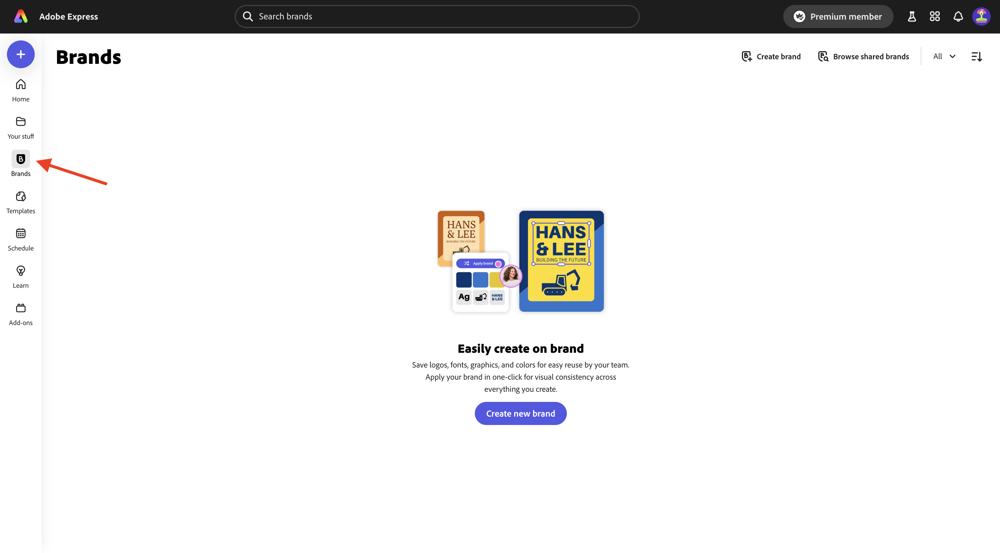
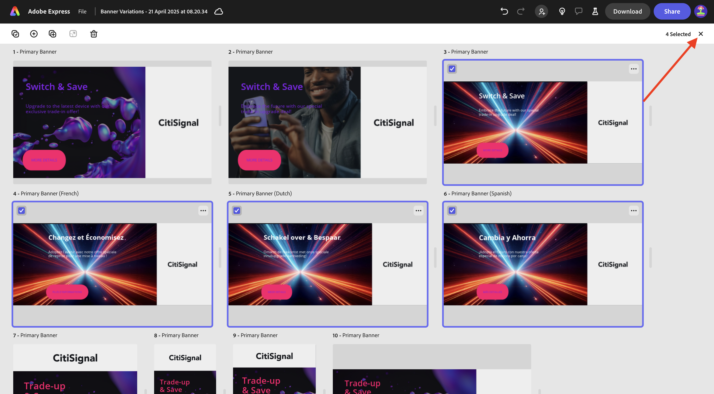

# 1.4.1 Guida introduttiva ad Adobe Express

## 1.4.1.1 Accesso ad Adobe Express

Apri una nuova finestra del browser in incognito e passa a [https://www.adobe.com/home](https://www.adobe.com/home){target="_blank"}. Accedi con il tuo account **aziendale o dell&#39;istituto di istruzione** e quindi seleziona l&#39;account **`--aepImsOrgName--`**.

Adobe Express è disponibile come parte delle licenze della tua organizzazione. Per assicurarti di avere accesso ad Adobe Express, devi verificare di aver effettuato l’accesso all’organizzazione giusta. A tale scopo, fare clic sull&#39;icona **profilo** e verificare quale account è attivo. L&#39;account da utilizzare è denominato `--aepImsOrgName--`.

Fare clic su **Cambia profilo** per cambiare account.

Scegli l&#39;account corretto dal menu, in questo caso **Experience Platform International** (ma questa potrebbe essere un&#39;organizzazione diversa per te).

Una volta attivato l&#39;account corretto, vai a **App** e fai clic su **Inizia** nella scheda **Adobe Express**.

Sei connesso a **Adobe Express**.

## 1.4.1.2 Introduzione a un modello marchio

In Adobe Express, vai a **Marchi**. Al momento, la libreria dei modelli del brand è probabilmente vuota. CitiSignal ha già definito un modello di marchio e ora devi riutilizzare quello esistente.

Per eseguire questa operazione, vai a [https://www.adobe.com/files/link/1c2f92cf-17bc-4d11-6031-dbd251e6cb57](https://www.adobe.com/files/link/1c2f92cf-17bc-4d11-6031-dbd251e6cb57).

Dovresti vedere questo. Fare clic sui tre punti **...**.

Seleziona **Crea una copia**.

Dopo circa un minuto, dovrebbe apparire un messaggio che conferma che hai creato una copia personale del modello del brand.

Torna ad Adobe Express, **Marchi** e aggiorna la pagina. Ora dovresti visualizzare il modello di brand **CitiSignal (Telco)**. Fare clic per aprire il modello di marchio **CitiSignal (Telco)**.

Dovresti quindi visualizzare una libreria di risorse come loghi, font, colori, modelli e così via.

Vai a **Modelli Express** e fai clic per aprire il modello **Varianti banner**.

Fare clic su **Avvia un nuovo file**.

Dovresti vedere questo.

Fai clic sulla casella di testo con la dicitura **Compensazione e salvataggio**. Quindi, selezionare **Riscrivi** e scegliere uno stile, quindi fare clic su **Genera**.

Scegli una variante e fai clic su **Sostituisci**.

Dovresti quindi visualizzare il testo aggiornato.

Fare clic sul testo **ULTERIORI DETTAGLI**.

Seleziona **Effetti**.

Vai a **Forma** e fai clic su **Visualizza tutto**.

Fai clic sul pulsante **finetune**. Modificare la **dimensione forma** e quindi fare clic sul pulsante del colore.

Modificare il colore scegliendo un altro colore dal tema **Colore CitiSignal**.

Dovresti quindi visualizzare il pulsante modificato.

Quindi, passa a **Marchi** e fai clic su **Applica marchio**. Dovresti quindi vedere l’aspetto della modifica dell’immagine.

Puoi anche specificare le impostazioni di **Applica marchio** facendo clic sull&#39;icona **ingranaggio**.

Fare clic sui tre punti **...** dell&#39;immagine su cui si sta lavorando, quindi fare clic su **Duplica**.

Dovresti quindi vedere una nuova immagine identica. Fare clic sul livello di sfondo sul lato destro dello schermo.

>[!IMPORTANT]
>
>Per completare questo esercizio, è necessario avere accesso a un ambiente AEM Assets CS Author funzionante. Se segui l&#39;esercizio [Adobe Experience Manager Cloud Service e Edge Delivery Services](./../../../modules/asset-mgmt/module2.1/aemcs.md){target="_blank"} potrai accedere a tale ambiente.

Vai a **Assets** nel menu a sinistra, seleziona il tuo archivio AEM Assets CS che deve essere denominato `--aepUserLdap-- - CitiSignal dev`. Passare alla cartella **citisignal**.

Seleziona l&#39;immagine **homepage-hero-1.png**. Dovresti quindi vedere il livello di sfondo cambiare.

Selezionare la casella di testo come indicato e fare clic su **Riscrivi**. Selezionare **Riformula**, quindi selezionare uno stile specifico. Fai clic su **Genera**.

Seleziona una variante e fai clic su **Sostituisci**.

Dovresti vedere questo. Fare clic sui tre punti **...** nella pagina nella parte inferiore della pagina e quindi su **Duplica**.

Nell&#39;immagine appena creata, passa a **media** e fai clic su **Genera immagine**.

Selezionare **Orizzontale (4:3)**.

Immettere il prompt `laser beams running through space` e fare clic su **Genera**.

Dovresti quindi visualizzare un’immagine generata da Adobe Firefly. Il livello in cui è stata generata l&#39;immagine si trova interamente nella parte superiore.

Spostarsi verso il basso nell&#39;immagine appena generata e posizionarla sopra il livello di sfondo precedente.

Rimuovere il livello di sfondo precedente facendo clic su di esso e selezionando **Elimina**.

Regola l’immagine in modo che copra l’intera area di lavoro.

Seleziona la casella di testo **Cambia e salva** per cambiare il colore del font in **bianco**.

Cambia il colore del font in **bianco**.

Selezionare l&#39;altra casella di testo per modificare anche il colore del carattere in **bianco**.

Cambia il colore del font in **bianco**.

Fare clic su **Ridimensiona** e immettere una risoluzione personalizzata di **2600** x **1080**. Verificare che la casella di controllo per **Espandi immagine** sia selezionata. Fare clic su **Ridimensiona**.

Dovresti vedere questo.

Dopo un paio di minuti, vedrai alcune nuove varianti dell’immagine. Sceglierne uno e fare clic su **Mantieni**.

Dovresti vedere questo.

Spostare e regolare l&#39;immagine in modo che occupi tutto lo spazio disponibile.

Fare clic su **Traduci**.

Scegli alcune lingue come **Francese**, **Olandese** e **Spagnolo**. Assicurarsi che sia selezionata solo la pagina specifica su cui si sta lavorando, che in questo caso è **Pagina 3**. Fai clic su **Traduci**.

Verranno quindi generate le traduzioni.

Dovresti quindi vedere un certo numero di nuove pagine che vengono create. Fai clic sull&#39;icona **chiudi**.

Verifica le traduzioni e modificale se necessario, ad esempio in questo esempio in cui la traduzione non è ottimale.

Aggiorna il testo in base alle esigenze.

Le risorse sono ora pronte.

## Passaggi successivi

Vai a [Animazione e video in Adobe Express](./ex2.md){target="_blank"}

Torna a [Adobe Express e Adobe Experience Cloud](./express.md){target="_blank"}

Torna a [Tutti i moduli](./../../../overview.md){target="_blank"}
