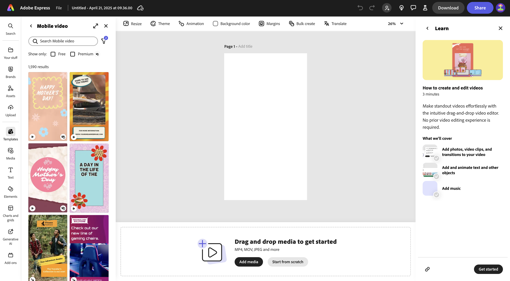
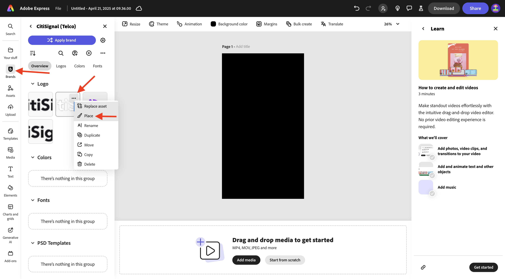
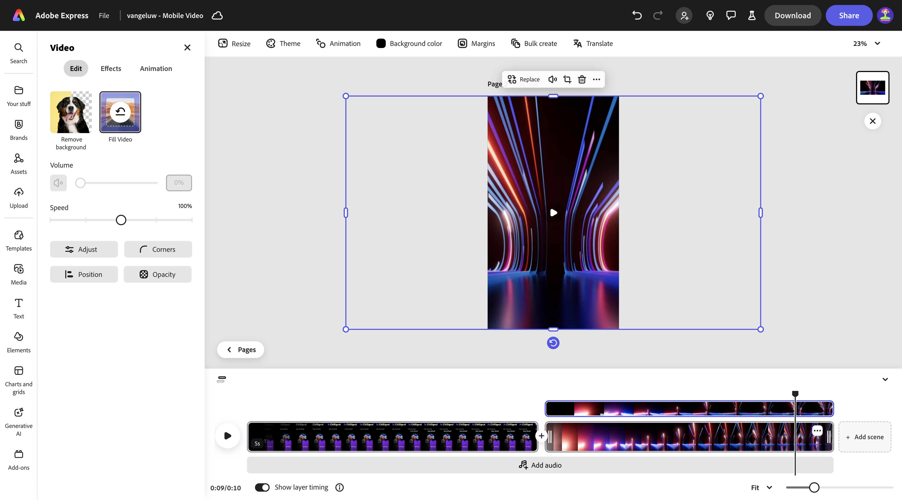
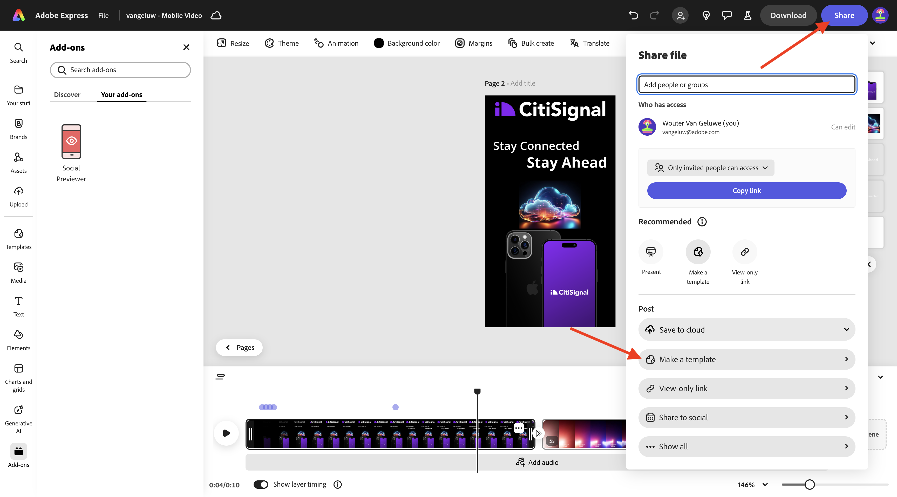
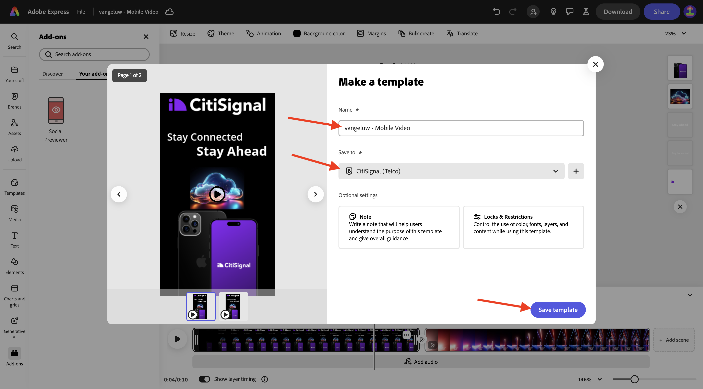

# 1.4.2 Animazione e video in Adobe Express

Prima di iniziare questo esercizio, scarica le risorse richieste da [https://tech-insiders.s3.us-west-2.amazonaws.com/one-adobe/Adobe_Express.zip](https://tech-insiders.s3.us-west-2.amazonaws.com/one-adobe/Adobe_Express.zip){target="_blank"} e decomprimi sul desktop.

## 1.4.2.1 Crea un video

Vai a [https://new.express.adobe.com/](https://new.express.adobe.com/){target="_blank"}. Fai clic sull&#39;icona **+** per creare una nuova **immagine**.

Vai a **Video** e seleziona **Video mobile**.

Dovresti vedere questo.

Selezionare **Colore di sfondo**, quindi scegliere **Nero**.

Aggiungere quindi il logo **CitiSignal**. Vai a **Marchi** e seleziona il logo CitiSignal bianco. Fai clic sui tre punti **...** e seleziona **Inserisci**.

Centrare il logo Citignal nella parte superiore dell&#39;immagine.

Vai a **Testo** e seleziona **Aggiungi il tuo testo**.

Immettere il testo `Stay Connected` e posizionare la casella di testo in una posizione simile a quella illustrata nell&#39;immagine seguente.

Vai a **Testo** e seleziona **Aggiungi il tuo testo**. Immettere il testo `Stay Ahead`.

Posizionate la casella di testo in una posizione simile a quella mostrata nell&#39;immagine seguente.

Selezionare la prima casella di testo con il testo **Resta connesso**. Vai a **Marchi**, a **Caratteri**. Fare clic sui tre punti **...** del primo carattere e fare clic su **Applica**.

Selezionare la seconda casella di testo con il testo **Avanti**. Vai a **Marchi**, a **Caratteri**. Fare clic sui tre punti **...** del terzo carattere e fare clic su **Applica**.

Dovresti vedere questo. Vai a **Media** e seleziona **Genera immagine**.

Immettere il prompt `futuristic looking transparent cloud on a black background` e fare clic su **Genera**.

Selezionare **Orizzontale (4:3)**.

Dovresti vedere questo. Scegli una delle varianti.

Centra l&#39;immagine generata. Vai a **Media** e fai clic su **Carica dal dispositivo**.

Passa al desktop, nella cartella **Adobe_Express** che contiene le risorse scaricate in precedenza. Seleziona il file **CitiSignalPhoneLogo.png** e fai clic su **Apri**.

Dovresti vedere questo.

Trascina l’immagine verso il basso in modo che appaia simile all’immagine seguente.

Cambia il nome del progetto in `--aepUserLdap-- - Mobile Video`.

Vai a **Animazione** e fai clic sull&#39;animazione **Glide**.

Fai clic sull&#39;icona **riproduci** per verificare l&#39;animazione.

Seleziona la casella di testo **Avanti**.

Regola il cursore della sequenza temporale per la casella di testo **Rimani in primo piano** in modo che inizi a metà.

Seleziona il logo **CitiSignal**.

Aprire le impostazioni di dettaglio nell&#39;azione **Diapositiva** e modificare la durata in 2,5 secondi.

Fare clic su **Scarica**. Seleziona il **formato file** **MP4** e imposta la **risoluzione video** su **1080p**. Fai clic su **Scarica**.

Il file video verrà quindi generato e scaricato sul computer. Il primo video è pronto.

## 1.4.2.2 Aggiungi al tuo video

Chiudi la visualizzazione **Timeline**.

Fai clic sui tre punti **...** e seleziona **Duplica**.

Viene quindi generata una nuova pagina. Fai clic su **Modifica sequenza temporale** per iniziare a lavorare con la nuova pagina.

Fare clic su **+ Aggiungi scena**.

Dovresti quindi vedere una nuova scena aggiunta.

Passa al desktop, nella cartella **Adobe_Express** che contiene le risorse scaricate in precedenza. Selezionare il file **`AdobeStock_648887461_trimmed.mp4`** e fare clic su **Apri**.

Il file video verrà quindi aggiunto alla nuova scena.

Fai clic al centro tra le due scene, quindi seleziona **Aggiungi transizione**.

Fai clic su **Dip to black**.

Modifica la **durata** in 2 secondi. Puoi fare clic sul pulsante **riproduci** per verificare la transizione.

Vai a **Testo** e fai clic su **Aggiungi il tuo testo**.

Immettere il testo `with lightning fast speed from CitiSignal`. Centra il testo facendo clic su **Allinea al centro**.

Modificare la dimensione del carattere in **60**.

## 1.4.2.3 Utilizzare i componenti aggiuntivi in Adobe Express

Vai a **Componenti aggiuntivi** e cerca il componente aggiuntivo **Visualizzatore anteprima social**.

Fare clic su **+ Add** per aggiungere il componente aggiuntivo.

Seleziona il componente aggiuntivo **Visualizzatore anteprima social** e fai clic sull&#39;opzione di anteprima **Instagram Post**. Ora puoi visualizzare facilmente in anteprima come si presenterà il tuo post sulle piattaforme di social media più comuni.

## 1.4.2.4 Crea un nuovo modello in Adobe Express

Fare clic sul pulsante **Condividi** e quindi selezionare **Crea modello**.

Utilizza il nome `--aepUserLdap-- - Mobile Video`, seleziona il brand **CitiSignal (Telco)**, quindi fai clic su **Salva modello**.

Il modello video è ora salvato nel modello marchio.

## 1.4.2.5 Salva il tuo video in AEM Assets CS

Fai di nuovo clic su **Condividi**, quindi seleziona **Salva nel cloud**. Seleziona **AEM Assets**.

Seleziona la **pagina corrente**. Utilizzare il nome `--aepUserLdap-- - Mobile Video` e quindi fare clic su **Seleziona cartella**.

Selezionare la cartella **`--aepUserLdap-- - Frame.io PNG`** e fare clic su **Seleziona**.

Fai clic su **Carica 1 risorsa**.

Vai a [https://experience.adobe.com/](https://experience.adobe.com/){target="_blank"} e fai clic su **Experience Manager Assets**.

Seleziona l&#39;ambiente AEM Assets CS, che deve essere denominato `--aepUserLdap-- - Citi Signal dev`.

In **Assets**, passa alla cartella **`--aepUserLdap-- - Frame.io PNG`**. Fare doppio clic sulla risorsa **`--aepUserLdap-- - Mobile Video`** per aprirla.

Il video creato in Adobe Express è ora disponibile in Adobe Experience Manager Assets.

## Passaggi successivi

Vai a [Creazione in blocco di Assets in Adobe Express](./ex3.md){target="_blank"}

Torna a [Adobe Express e Adobe Experience Cloud](./express.md){target="_blank"}

Torna a [Tutti i moduli](./../../../overview.md){target="_blank"}
