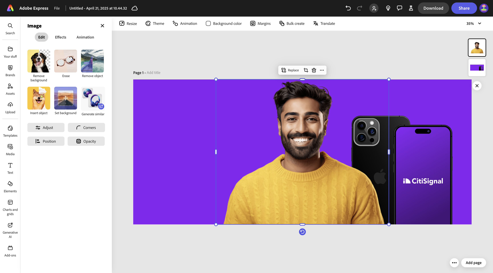
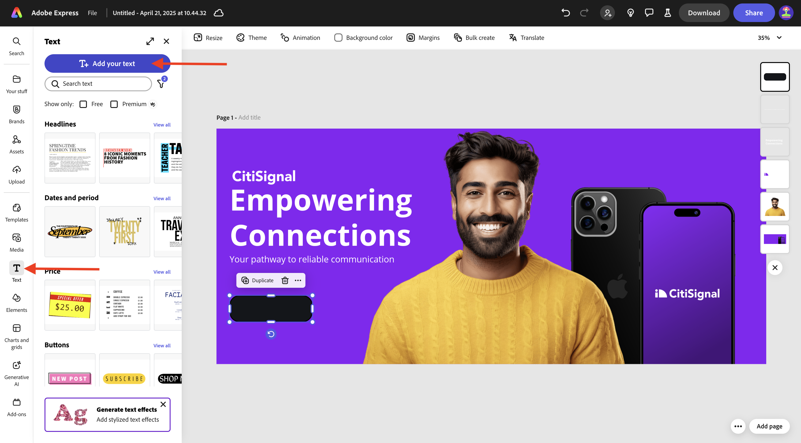
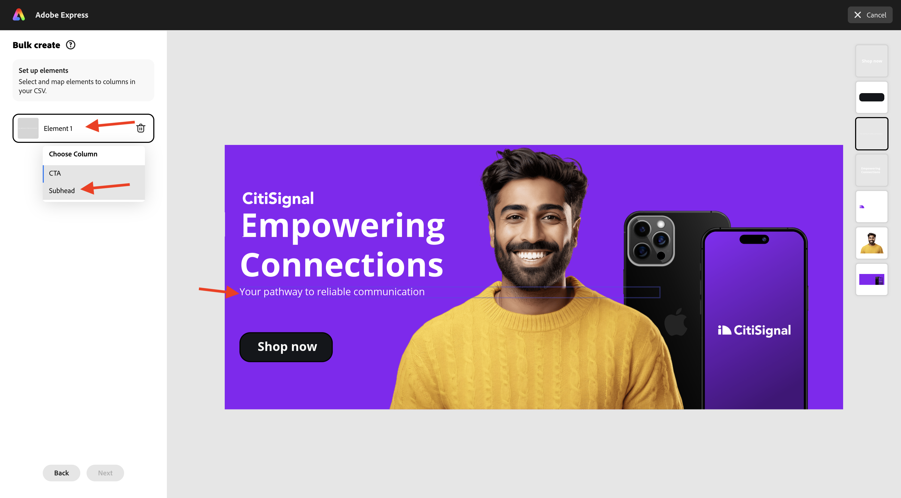
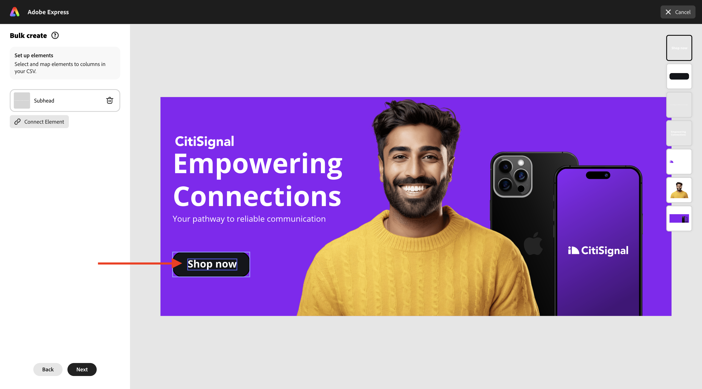
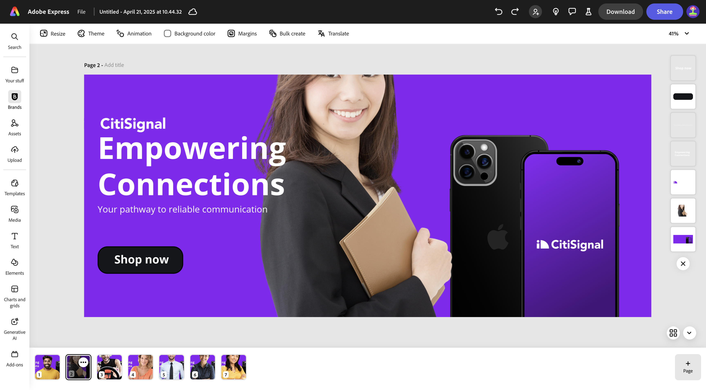

# 1.4.3 Creazione in blocco di Assets in Adobe Express

Prima di iniziare questo esercizio, scarica le risorse richieste da [https://tech-insiders.s3.us-west-2.amazonaws.com/one-adobe/Adobe_Express.zip](https://tech-insiders.s3.us-west-2.amazonaws.com/one-adobe/Adobe_Express.zip){target="_blank"} e decomprimi sul desktop.

## 1.4.3.1 Crea la risorsa di base

Vai a [https://new.express.adobe.com/](https://new.express.adobe.com/){target="_blank"}. Fai clic sull&#39;icona **+** per creare una nuova **immagine**.

Seleziona **Foto**, quindi scegli **Carica file multimediali**.

Passa al desktop, nella cartella **Adobe_Express** che contiene le risorse scaricate in precedenza. Seleziona il file **banner.png** e fai clic su **Apri**.

Dovresti vedere questo. Selezionare **Modifica immagine**.

Quindi, passa a **Media** e seleziona **Carica immagine**. Passa al desktop, nella cartella **Adobe_Express** che contiene le risorse scaricate in precedenza. Seleziona il file **man.png** e fai clic su **Apri**.

Dovresti vedere questo.

Aggiungere quindi il logo **CitiSignal**. Vai a **Marchi** e seleziona il logo CitiSignal bianco. Fai clic sui tre punti **...** e seleziona **Inserisci**.

Regolare la posizione dell&#39;immagine con il logo CitiSignal in modo che rifletta la stessa posizione nell&#39;immagine sottostante.

Vai a **Testo** e fai clic su **Aggiungi il tuo testo**.

Nella nuova casella di testo aggiungere il testo `Empowering Connections`. Trascinate la casella di testo in una posizione simile a quella mostrata nell&#39;immagine seguente. Quindi, vai a **Marchi**, a **Caratteri**. Fare clic sui tre punti **...** del terzo carattere e fare clic su **Applica**.

Cambiare il colore del carattere in **bianco**.

Vai di nuovo a **Testo** e fai clic su **Aggiungi il tuo testo**.

Nella nuova casella di testo immettere il testo `Your pathway to reliable communication`. Regolate la posizione della casella di testo da posizionare sotto la casella di testo precedente, in modo simile all&#39;immagine riportata di seguito.

Vai a **Marchi**, a **Caratteri** e fai clic sui 3 punti **...** del secondo carattere. Quindi fare clic su **Applica**.

Dovresti avere questo. Passare quindi a **Elementi**, a **Forme** e fare clic sulla forma rettangolo arrotondato.

Verrà quindi visualizzata una nuova forma rettangolo arrotondato. Regola le dimensioni e la posizione in modo che sembri un pulsante. Quindi, cambia il colore del rettangolo arrotondato in **nero**.

Vai di nuovo a **Testo** e fai clic su **Aggiungi il tuo testo**.

Immettere il testo `Shop now` nella nuova casella di testo e modificare la posizione della casella di testo da centrare sul pulsante. Vai a **Marchi**, a **Caratteri** e fai clic sui 3 punti **...** del terzo carattere. Quindi fare clic su **Applica**.

Dovresti vedere questo.

## Creazione in blocco di 1.4.3.2 in Adobe Express

Fare clic su **Creazione in blocco**.

Dovresti vedere questo. Fai clic su **sfoglia**.

Passa al desktop, alla cartella **Creazione in blocco rapida** nella cartella **Adobe_Express** che contiene le risorse scaricate in precedenza. Seleziona il file **CTA-options.csv** e fai clic su **Apri**.

Dovresti vedere questo. Fai clic su **Avanti**.

Fare clic su **Connetti elemento**.

Selezionare la casella di testo che contiene il testo **Percorso verso una comunicazione affidabile**. Quindi fai clic sul pulsante **Elemento 1** e collegalo a un campo del file CSV, in questo caso il campo **Intestazione**.

Selezionare quindi la casella di testo contenente il testo **Acquista ora**.

Fare quindi clic sul pulsante **Elemento 1** e collegarlo a un campo del file CSV, in questo caso il campo **CTA**.

Dovresti vedere questo. Quindi, fai clic sull’immagine della persona.

Fare clic sul pulsante **Elemento 1**.

Poi vedrai questo popup. Fai clic su **sfoglia**.

Passa al desktop, alla cartella **Creazione in blocco rapida** nella cartella **Adobe_Express** che contiene le risorse scaricate in precedenza. Selezionare 6-7 file di immagine e fare clic su **Apri**.

Poi vedrai questo. Trascina e rilascia un’immagine diversa per ogni variante della risorsa. Fai clic su **Fine**

Vedrai quindi le varianti dell’immagine che vengono generate. Fai clic su **Crea pagine**.

Le varianti sono ora pronte e puoi ispezionarle singolarmente per rivederle e convalidarle.

Hai completato l&#39;esercizio.

## Passaggi successivi

Vai a [Riepilogo e vantaggi](./summary.md){target="_blank"}

Torna a [Adobe Express e Adobe Experience Cloud](./express.md){target="_blank"}

Torna a [Tutti i moduli](./../../../overview.md){target="_blank"}