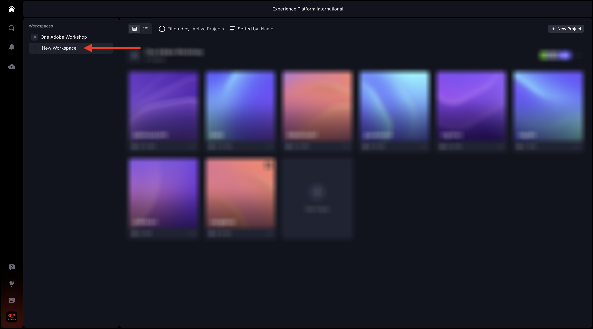
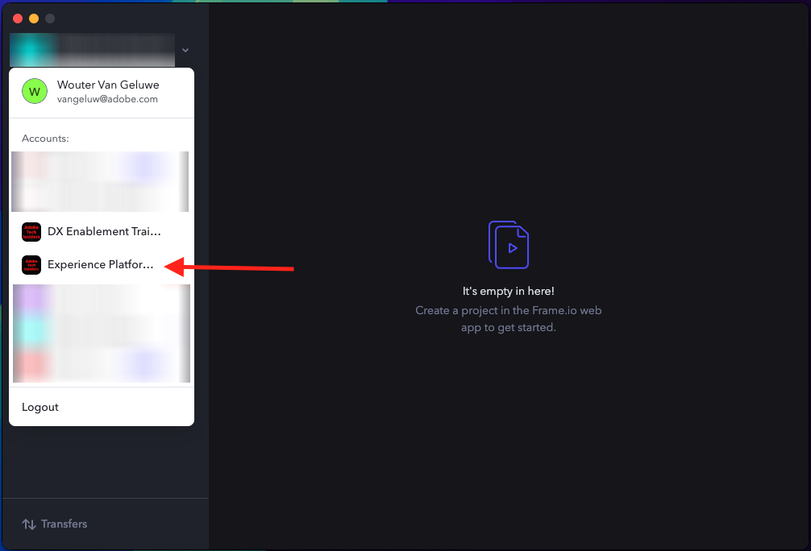

# 1.5.1 Guida introduttiva a Frame.io

>[!NOTE]
>
> La schermata seguente mostra un ambiente specifico in uso. Durante l’esercitazione, è molto probabile che il nome dell’ambiente sia diverso. Quando ti sei iscritto a questo tutorial, ti sono stati forniti i dettagli dell’ambiente da utilizzare, segui queste istruzioni.

Vai a [https://next.frame.io/](https://next.frame.io/). Assicurarsi di aver effettuato l&#39;accesso all&#39;ambiente `--aepImsOrgName--`.

Se non hai effettuato l’accesso all’ambiente di destra, fai clic sul logo nell’angolo in basso a sinistra e fai clic su per selezionare l’ambiente da utilizzare.

## 1.5.1.1 Crea l&#39;area di lavoro e il progetto

Fare clic su **+ Nuovo Workspace**.

Per il nome dell&#39;area di lavoro, utilizzare: `--aepUserLdap--`. Fai clic su **Salva**.

L’area di lavoro è stata creata. Successivamente, devi creare un nuovo progetto. Fare clic su **+ Nuovo progetto**.

Selezionare **Vuoto** e utilizzare il nome `CitiSignal`. Fare clic su **Crea nuovo progetto**.

Il progetto è stato creato. Ora devi caricare le risorse nel progetto. Fai clic su **Carica**.

Scarica questi file: [https://tech-insiders.s3.us-west-2.amazonaws.com/Frame.io_Assets.zip](https://tech-insiders.s3.us-west-2.amazonaws.com/Frame.io_Assets.zip) sul desktop e decomprimi sul desktop.

Seleziona tutti i file e fai clic su **Apri**.

>[!NOTE]
>
>Come puoi vedere nella schermata, la cartella **Effetti sonori** non è attualmente selezionata. Questo perché il caricamento manuale non supporta il caricamento di cartelle. Tra un paio di minuti installerai l’app Frame.io Transfer, che utilizzerai per caricare tale cartella e i relativi file.

Dopo alcuni minuti, i file saranno disponibili in Frame.io.

Ora hai caricato i file manualmente, ma esiste un modo migliore e più veloce per caricare e scaricare i file da e verso Frame.io. Il modo migliore per farlo è utilizzare l&#39;app Frame.io Transfer.

## 1.5.1.2 Scarica e configura l&#39;app di trasferimento Frame.io

Vai a [https://frame.io/transfer](https://frame.io/transfer) e scarica la versione per il tuo computer.

Installare l&#39;applicazione e aprirla.

Quando l’applicazione viene aperta, è necessario effettuare l’accesso. Fai clic su **accedi**.

Immetti l&#39;indirizzo e-mail del tuo account Adobe e fai clic su **Andiamo**.

Dopo l&#39;autenticazione, fare clic su **Apri app di trasferimento Frame.io**.

Dovresti vedere questo. Per selezionare l’ambiente corretto, fai clic su per aprire l’elenco a discesa.

Selezionare l&#39;ambiente da utilizzare per questa esercitazione, ovvero `--aepImsOrgName--`.

Dovresti quindi visualizzare l’area di lavoro e il progetto creati in precedenza, insieme ai file caricati manualmente.

Fai clic su **Carica**.

Vai alla cartella utilizzata in precedenza, che contiene i file decompressi scaricati in precedenza. Selezionare la cartella **Effetti sonori** e fare clic su **Carica**.

I file verranno quindi caricati.

Una volta caricata, la nuova cartella sarà disponibile in Frame.io.

## Passaggi successivi

Vai a [1.5.2 Approvazioni con Frame.io](./ex2.md){target="_blank"}

Torna a [Semplifica il flusso di lavoro con Frame.io](./frameio.md){target="_blank"}

Torna a [Tutti i moduli](./../../../overview.md){target="_blank"}
