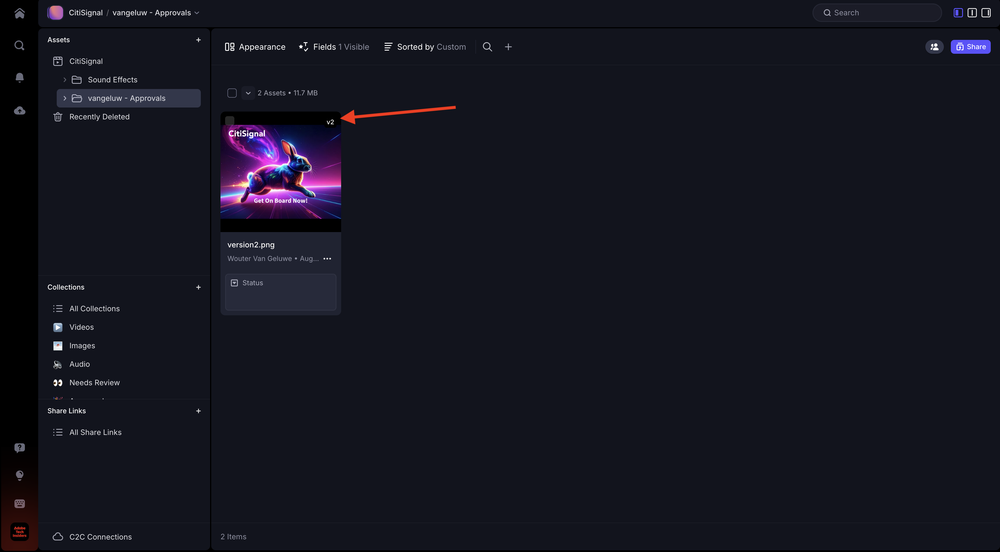
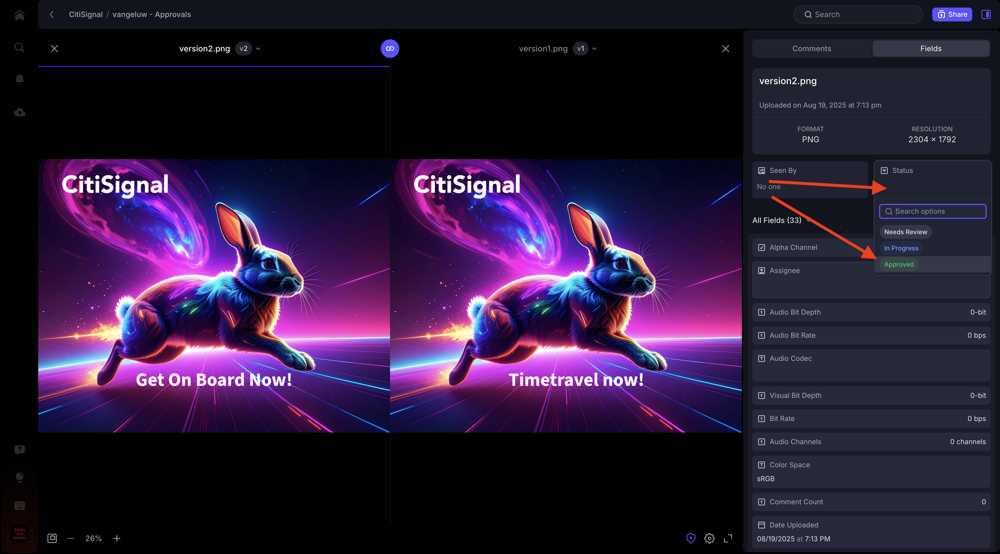
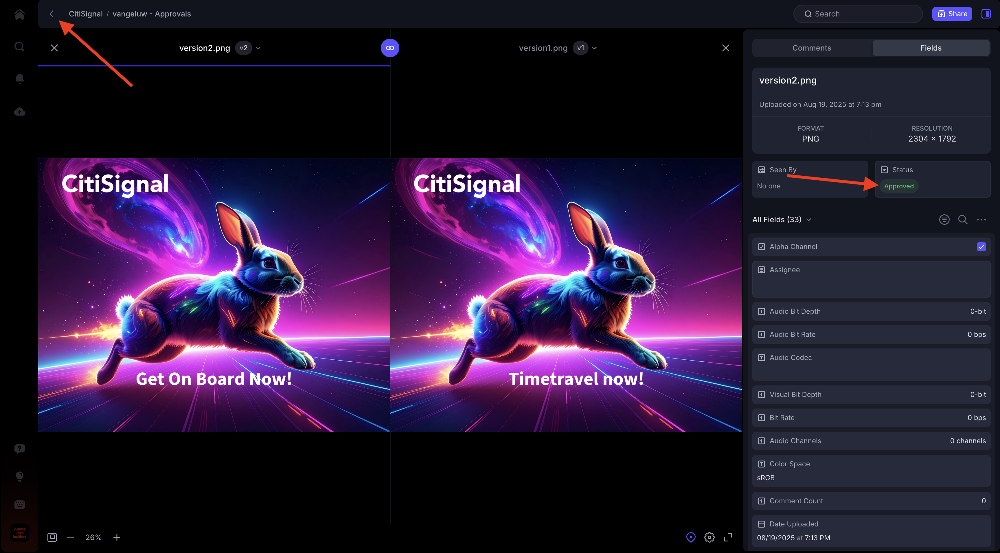

# 1.5.2 Approvazioni con Frame.io

>[!NOTE]
>
> La schermata seguente mostra un ambiente specifico in uso. Durante l’esercitazione, è molto probabile che il nome dell’ambiente sia diverso. Quando ti sei iscritto a questo tutorial, ti sono stati forniti i dettagli dell’ambiente da utilizzare, segui queste istruzioni.

Per esaminare il flusso di lavoro di approvazione in Frame.io, è necessario disporre di una risorsa. In questo esercizio, inizierai a creare autonomamente la risorsa utilizzando Adobe Firefly e Adobe Express. Una volta che hai la risorsa, la caricherai in Frame.io e quindi la approverai alla fine.

## 1.5.2.1 Crea risorsa con Adobe Firefly Services e Adobe Express

Vai a [https://firefly.adobe.com/](https://firefly.adobe.com/){target="_blank"}. Immettere il prompt `a neon rabbit running very fast through space` e fare clic su **Genera**.

Vedrai quindi diverse immagini generate. Scegli l&#39;immagine che preferisci, fai clic sull&#39;icona **Condividi** nell&#39;immagine, quindi seleziona **Apri in Adobe Express**.

L’immagine appena generata sarà quindi disponibile in Adobe Express per la modifica. È ora necessario aggiungere il logo CitiSignal all&#39;immagine. Per farlo, vai a **Marchi**.

Dovresti quindi visualizzare un modello di brand Citignal. create in GenStudio for Performance Marketing vengono visualizzate in Adobe Express. Fare clic per selezionare un modello di marchio il cui nome contiene `CitiSignal`.

Vai a **Logos** e fai clic sul logo **white** Citisignal per rilasciarlo sull&#39;immagine.

Posizionare il logo CitiSignal nella parte superiore dell&#39;immagine, non troppo lontano dal centro.

Vai a **Testo**.

Fai clic su **Aggiungi il testo**.

Immettere il testo `Timetravel now!`, modificare il colore e la dimensione del carattere, impostare il testo su **Grassetto** in modo da avere un&#39;immagine simile a quella corrente.

Fare clic su **Condividi**.

Fare clic su **... Mostra tutto**.

Scorri verso il basso e seleziona **Scarica**.

Fai clic su **Scarica**.

La risorsa verrà quindi inserita nel computer locale.

## 1.5.2.2 Approva la risorsa in Frame.io

Vai a [https://next.frame.io/](https://next.frame.io/). Assicurarsi di aver effettuato l&#39;accesso all&#39;ambiente `--aepImsOrgName--`.

Se non hai effettuato l’accesso all’ambiente di destra, fai clic sul logo nell’angolo in basso a sinistra e fai clic su per selezionare l’ambiente da utilizzare.

Vai all&#39;area di lavoro, che deve essere denominata `--aepUserLdap--`, quindi apri la cartella **CitiSignal**. Fai clic sull&#39;icona **+**, quindi seleziona **Nuova cartella**.

Denomina la cartella `--aepUserLdap-- - Approvals`. Fare doppio clic sulla cartella per aprirla.

Il file creato nell&#39;esercizio precedente verrà ora caricato in questa cartella. Fai clic su **Carica**.

Selezionare il file e fare clic su **Apri**.

Dovresti avere questo. Fare doppio clic sul file per aprirlo.

Abilita l’icona per lasciare un commento ancorato.

Immettere un commento, ad esempio `Change CTA to "Get on board now!"`. Fai clic sull&#39;icona **invia** per condividere il commento.

Dovresti avere questo. Vai a **Campi**.

Nel campo **Stato**, modifica lo stato in **Necessita revisione**.

Dovresti avere questo. Torna alla cartella facendo clic sulla freccia per tornare indietro.

Fai clic sui tre punti **...** e seleziona **Rinomina**.

Modificare il nome del file in `version1.png`.

## 1.5.2.3 Apporta modifiche alla progettazione in Adobe Express

Vai a [https://new.express.adobe.com/your-stuff/files](https://new.express.adobe.com/your-stuff/files) e apri di nuovo l&#39;immagine creata in precedenza.

Modificare il testo di CTA in `Get On Board Now!`.

Fai clic su **Condividi**, quindi seleziona **Scarica**.

Fai clic su **Scarica**.

Verrà quindi scaricata una nuova immagine nel computer locale. Rinominare il file in `version2.png`.

## 1.5.2.4 Approvare la versione 2 in Frame.io

Nella cartella in Frame.io, fai clic sull&#39;icona **+** e seleziona **Carica risorsa**.

Seleziona il file **version2.png** e fai clic su **Apri**.

Trascinare il file **version2.png** sul file **version1.png**. Questa azione abilita lo stacking delle versioni in Frame.io.

Dovresti vedere questo.

Fare clic sui tre punti **...** dell&#39;immagine, quindi selezionare **Confronta versioni**.

Dovresti quindi vedere questa vista di confronto che mostra entrambe le versioni del file. Vai a **Campi**.

Modificare il campo **Stato** in **Approvato**.

Dovresti avere questo. Fai clic sull’icona a forma di freccia per tornare alla vista cartelle.

Fai clic sui tre punti **...** e seleziona **Scarica** per utilizzare il file in un&#39;altra applicazione.

## Passaggi successivi

[1.5.3 Frame.io e Premiere Pro](./ex3.md){target="_blank"}

Torna a [Semplifica il flusso di lavoro con Frame.io](./frameio.md){target="_blank"}

Torna a [Tutti i moduli](./../../../overview.md){target="_blank"}
