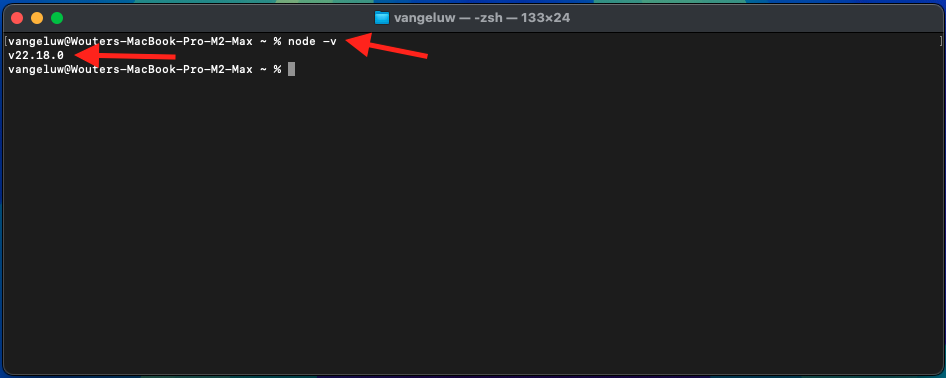

# 1.6.1 Adobe IO e App Builder

## 1.6.1.1 Crea il tuo progetto Adobe I/O

Vai a [https://developer.adobe.com/console/home](https://developer.adobe.com/console/projects){target="_blank"}.

Assicurati di selezionare l’istanza corretta nell’angolo in alto a destra dello schermo. L&#39;istanza è `--aepImsOrgName--`.

>[!NOTE]
>
> La schermata seguente mostra un’organizzazione specifica selezionata. Durante l’esercitazione, è molto probabile che il nome dell’organizzazione sia diverso. Quando ti sei iscritto a questo tutorial, ti sono stati forniti i dettagli dell’ambiente da utilizzare, segui queste istruzioni.

Quindi, seleziona **Crea progetto da modello**.

Seleziona **App Builder**.

Immettere il nome `--aepUserLdap-- GSPeM EXT`. Fai clic su **Salva**.

Dovresti vedere qualcosa del genere.

## 1.6.1.2 Configurare l&#39;ambiente di sviluppo

Per creare, inviare e distribuire l’app estensibile, nell’ambiente di sviluppo locale del computer devono essere installati le applicazioni e i pacchetti seguenti:

- Node.js (versione 20.x o successiva)
- npm (in pacchetto con Node.js)
- Interfaccia della riga di comando (CLI) di Adobe Developer

Se queste applicazioni o pacchetti non sono ancora installati nel computer, eseguire la procedura seguente.

### Node.js e npm

Vai a [https://nodejs.org/en/download](https://nodejs.org/en/download). Dovresti visualizzare questo messaggio, con una serie di comandi terminali che devono essere eseguiti per poter installare Node.js e npm. I comandi mostrati di seguito sono applicabili a MacBook.

Aprire innanzitutto una nuova finestra del terminale. Incolla ed esegui il comando indicato nella riga 2 della schermata:

`curl -o- https://raw.githubusercontent.com/nvm-sh/nvm/v0.40.3/install.sh | bash`

Quindi, esegui il comando sulla riga 5 nella schermata:

`\. "$HOME/.nvm/nvm.sh"`

Dopo aver eseguito entrambi i comandi correttamente, eseguire il comando seguente:

`node -v`

Dovresti trovare un numero di versione da restituire.

Eseguire quindi il comando seguente:

`npm -v`

Dovresti trovare un numero di versione da restituire.

Se gli ultimi 2 comandi hanno restituito un numero di versione, la configurazione di queste 2 funzionalità ha esito positivo.

### Interfaccia della riga di comando (CLI) di Adobe Developer

Per installare l’interfaccia della riga di comando (CLI) di Adobe Developer, esegui il seguente comando in una finestra del terminale:

`npm install -g @adobe/aio-cli`

L&#39;esecuzione di questo comando potrebbe richiedere alcuni minuti. Il risultato finale dovrebbe essere simile al seguente:

Anche l&#39;interfaccia della riga di comando (CLI) di Adobe Developer è stata installata correttamente.

Ora hai impostato gli elementi di base per poter eseguire un progetto App Builder.

## Passaggi successivi

Vai a [Creare il bucket AWS S3](./ex2.md){target="_blank"}

Torna a [GenStudio for Performance Marketing - Estensibilità](./genstudioext.md){target="_blank"}

Torna a [Tutti i moduli](./../../../overview.md){target="_blank"}
