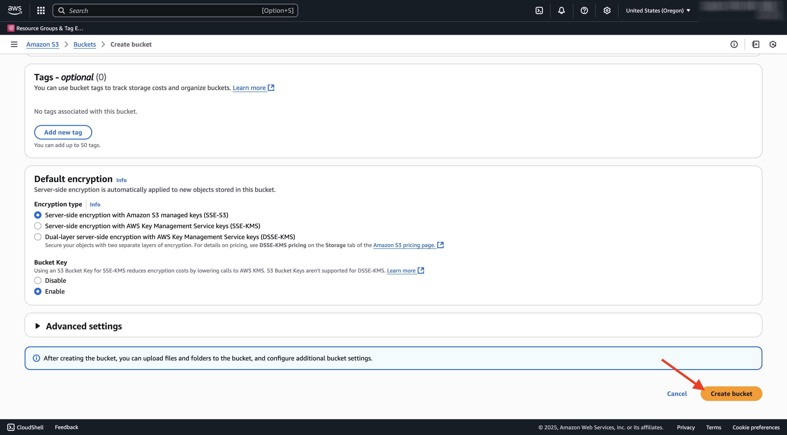
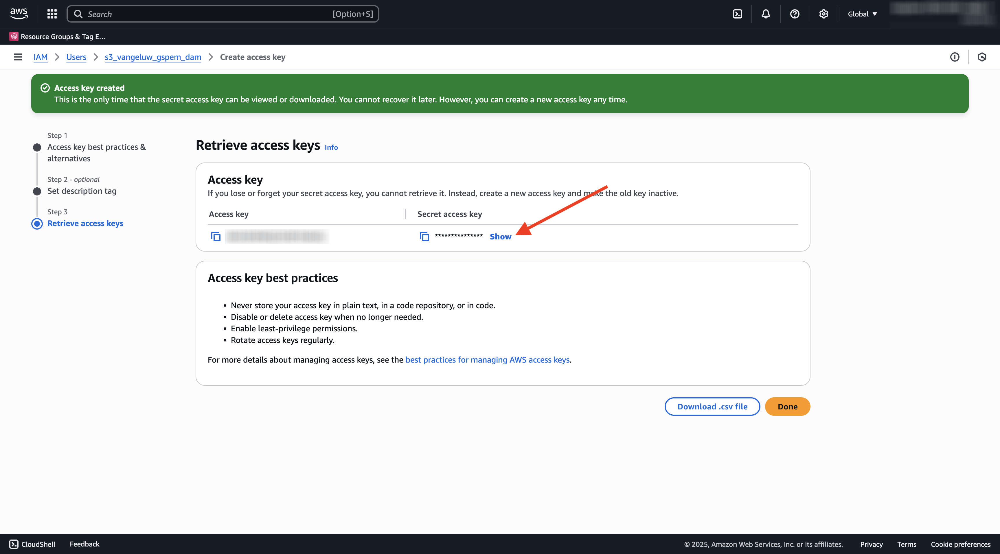

# 1.6.2 Creare il bucket AWS S3

## 1.6.2.1 Crea il bucket S3

Vai a [https://console.aws.amazon.com](https://console.aws.amazon.com) e accedi.

>[!NOTE]
>
>Se non disponi ancora di un account AWS, crea un nuovo account AWS utilizzando il tuo indirizzo e-mail personale.

Dopo l&#39;accesso, verrai reindirizzato a **AWS Management Console**.

Nella barra di ricerca, cerca **s3**. Fare clic sul primo risultato della ricerca: **S3 - Storage scalabile nel cloud**.

Verrà quindi visualizzata la home page di **Amazon S3**. Fai clic su **Crea bucket**.

Nella schermata **Crea bucket**, utilizza il nome `--aepUserLdap---gspem-dam`.

Lascia invariate tutte le altre impostazioni predefinite. Scorri verso il basso e fai clic su **Crea bucket**.

Vedrai quindi il tuo bucket in fase di creazione e verrà reindirizzato alla home page di Amazon S3.

## Impostare le autorizzazioni per accedere al bucket S3

Il passaggio successivo consiste nel configurare l’accesso al bucket S3.

Per eseguire questa operazione, vai a [https://console.aws.amazon.com/iam/home](https://console.aws.amazon.com/iam/home).

L’accesso alle risorse di AWS è controllato da Amazon Identity and Access Management (IAM).

Ora vedrai questa pagina.

Nel menu a sinistra, fai clic su **Utenti**. Viene visualizzata la schermata **Utenti**. Fare clic su **Crea utente**.

Quindi, configura l’utente:

- Nome utente: utilizzare `s3_--aepUserLdap--_gspem_dam`

Fai clic su **Avanti**.

Viene quindi visualizzata questa schermata delle autorizzazioni. Fai clic su **Allega criteri direttamente**.

Immettere il termine di ricerca **s3** per visualizzare tutti i criteri S3 correlati. Selezionare il criterio **AmazonS3FullAccess**. Scorri verso il basso e fai clic su **Avanti**.

Controlla la configurazione. Fare clic su **Crea utente**.

Poi vedrai questo. Fare clic su **Visualizza utente**.

Fare clic su **Credenziali di protezione** e quindi su **Crea chiave di accesso**.

Selezionare **l&#39;applicazione in esecuzione all&#39;esterno di AWS**. Scorri verso il basso e fai clic su **Avanti**.

Fai clic su **Crea chiave di accesso**

Poi vedrai questo. Fai clic su **Mostra** per visualizzare la chiave di accesso segreta:

È ora visualizzata la **chiave di accesso segreta**.

>[!IMPORTANT]
>
>Memorizzare le credenziali in un file di testo nel computer.
>
> - ID chiave di accesso: ...
> - Chiave di accesso segreta: ...
>
> Dopo aver fatto clic su **Fine** non verranno più visualizzate le credenziali.

Fai clic su **Fine**.

Ora hai creato correttamente un bucket AWS S3 e hai creato un utente con autorizzazioni di accesso a questo bucket.

## 1.6.2.2 Carica Assets nel bucket S3

Nella barra di ricerca, cerca **s3**. Fare clic sul primo risultato della ricerca: **S3 - Storage scalabile nel cloud**.

Fai clic su per aprire il nuovo bucket S3 creato, che deve essere denominato `--aepUserLdap---gspem-dam`.

Fai clic su **Carica**.

Dovresti vedere questo.

È possibile scaricare i file immagine CitiSignal [qui](./../../asset-mgmt/module2.2/images/CitiSignal_Neon_Rabbit.zip){target="_blank"}.

Esportare i file sul desktop.

Prendi i 2 file di immagini in quella cartella e rilasciali nella finestra di caricamento del bucket S3. Fai clic su **Carica**.

Dovresti vedere questo. Il bucket S3, i file immagine e l’utente IAM sono ora pronti per essere utilizzati dall’app DAM esterna.

## Passaggi successivi

Vai a [Crea la tua app DAM esterna](./ex3.md){target="_blank"}

Torna a [GenStudio for Performance Marketing - Estensibilità](./genstudioext.md){target="_blank"}

Torna a [Tutti i moduli](./../../../overview.md){target="_blank"}
