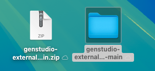
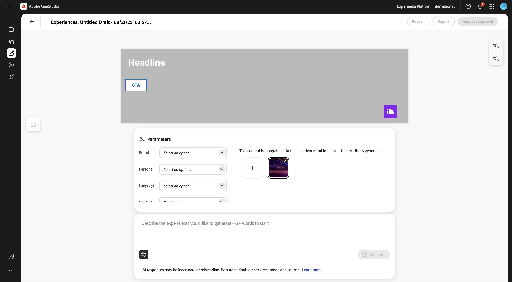

# 1.6.3 Creare e distribuire l’app DAM esterna

## 1.6.3.1 Scarica i file di app di esempio

Vai a [https://github.com/woutervangeluwe/genstudio-external-dam-app](https://github.com/woutervangeluwe/genstudio-external-dam-app). Fai clic su **Codice**, quindi seleziona **Scarica ZIP**.


Decomprimi il file zip sul desktop.



## 1.6.3.2 Configurare l&#39;interfaccia della riga di comando di Adobe Developer

Fare clic con il pulsante destro del mouse sulla cartella **genstudio-external-dam-app-main** e selezionare **New Terminal at Folder**.


Dovresti vedere questo. Immettere il comando `aio login`. Questo comando reindirizzerà al browser e prevede l’accesso.


Dopo aver effettuato correttamente l’accesso, dovresti visualizzarlo nel browser.


Il browser reindirizzerà alla finestra del terminale. Dovresti visualizzare un messaggio che indica che l&#39;accesso è stato eseguito correttamente **1&rbrace; e un token lungo restituito dal browser.**


Il passaggio successivo consiste nel configurare l’istanza e il progetto Adobe IO da utilizzare per l’app DAM esterna.

A questo scopo, è necessario scaricare un file dal progetto Adobe IO configurato in precedenza.

Vai a [https://developer.adobe.com/console/home](https://developer.adobe.com/console/projects){target="_blank"} e apri il progetto creato in precedenza, denominato `--aepUserLdap-- GSPeM EXT`. Apri l&#39;area di lavoro **Produzione**.


Fai clic su **Scarica tutto**. Verrà scaricato un file JSON.


Copia il file JSON dalla directory **Download** nella directory principale dell&#39;app DAM esterna.


Tornare alla finestra del terminale. Immettere il comando `aio app use XXX-YYY-Production.json`.

>[!NOTE]
>
>È necessario modificare il nome del file nel comando precedente in modo che corrisponda al nome del file.

Una volta eseguito il comando, l’app DAM esterna ora sarà connessa al progetto Adobe IO con App Builder creato in precedenza.


## 1.6.3.3 Installare GenStudio Extensibility SDK

È quindi necessario installare **GenStudio Extensibility SDK**. Ulteriori dettagli su SDK sono disponibili qui: [https://github.com/adobe/genstudio-extensibility-sdk](https://github.com/adobe/genstudio-extensibility-sdk).

Per installare SDK, esegui questo comando nella finestra del terminale:

`npm install @adobe/genstudio-extensibility-sdk`


Dopo alcuni minuti, il SDK verrà installato.


## 1.6.3.4 Esaminare l&#39;app DAM esterna in Visual Studio Code

Aprire Visual Studio Code. Fare clic su **Apri...** per aprire una cartella.


Seleziona la cartella **genstudio-external-dam-app-main** contenente l&#39;app scaricata in precedenza. Fai clic su **Apri**.


Fare clic per aprire il file **.env**.


Il file **.env** è stato creato dal comando `aio app use` eseguito nel passaggio precedente e contiene le informazioni necessarie per connettersi al progetto Adobe IO con App Builder.


È ora necessario aggiungere i dettagli seguenti al file **.env**, in modo che l&#39;app DAM esterna possa connettersi al bucket AWS S3 creato in precedenza.

```
AWS_ACCESS_KEY_ID=
AWS_SECRET_ACCESS_KEY=
AWS_REGION=
AWS_BUCKET_NAME=
```

I campi **`AWS_ACCESS_KEY_ID`** e **`AWS_SECRET_ACCESS_KEY`** erano disponibili dopo la creazione dell&#39;utente IAM nell&#39;esercizio precedente. Vi è stato chiesto di annotarli, ora potete copiare i valori.


Il campo **`AWS_REGION`** può essere preso dalla vista Home di AWS S3, accanto al nome del bucket. In questo esempio, la regione è **us-west-2**.


Il campo **`AWS_BUCKET_NAME`** deve essere `--aepUserLdap---gspem-dam`.

Queste informazioni ti consentono di aggiornare i valori di ciascuna di queste variabili.

```
AWS_ACCESS_KEY_ID=XXX
AWS_SECRET_ACCESS_KEY=YYY
AWS_REGION=us-west-2
AWS_BUCKET_NAME=--aepUserLdap---gspem-dam
```

Incollare il testo in entrambi i file, `.env.dev` e `.env.prod`. Non dimenticare di salvare le modifiche.


Quindi, tornare alla finestra del terminale. Esegui questo comando:

`export $(grep -v '^#' .env | xargs)`


Infine, devi modificare l’etichetta che verrà visualizzata all’interno di GenStudio for Performance Marketing, in modo da poter distinguere la tua app DAM esterna da altre integrazioni. Per eseguire questa operazione, aprire il file **Constants.ts** che è possibile trovare espandendo in Esplora risorse fino a **src/genstudiopem > web-src > src**.

La riga 14 deve essere modificata in

`export const extensionLabel: string = "--aepUserLdap-- - External S3 DAM";`

Non dimenticare di salvare le modifiche.


## 1.6.3.5 Esegui l&#39;app DAM esterna

Nella finestra del terminale, eseguire il comando `aio app run`. Dovrebbe vedere questo dopo 1-2 minuti.


Ora hai confermato che l’app è in esecuzione. Il passaggio successivo è quello di distribuirlo.

Innanzitutto, premi **CTRL+C** per interrompere l&#39;esecuzione dell&#39;app. Immettere quindi il comando `aio app deploy`. Questo comando distribuirà il codice in Adobe IO.

Di conseguenza, riceverai un URL simile per accedere all’applicazione distribuita:

`https://133309-201burgundyguan.adobeio-static.net/index.html`


A scopo di test, è ora possibile utilizzare tale URL come parametro della stringa di query aggiungendo `?ext=` come prefisso all&#39;URL precedente. Questo determina il parametro della stringa di query:

`?ext=https://133309-201burgundyguan.adobeio-static.net/index.html`

Vai a [https://experience.adobe.com/genstudio/create](https://experience.adobe.com/genstudio/create).


Quindi, aggiungi il parametro della stringa di query immediatamente prima del **#**. Il nuovo URL deve essere simile al seguente:

`https://experience.adobe.com/?ext=https://133309-201burgundyguan.adobeio-static.net/index.html#/@experienceplatform/genstudio/create`

La pagina verrà caricata come di consueto. Fai clic su **Banner** per iniziare a creare un nuovo banner.


Seleziona un modello e fai clic su **Usa**.


Fai clic su **Seleziona dal contenuto**.


Dovresti quindi essere in grado di selezionare il tuo DAM esterno, che dovrebbe essere denominato `--aepUserLdap-- - External S3 DAM`, dall&#39;elenco a discesa.


Dovresti vedere questo. Seleziona l&#39;immagine **neon_rabbit_banner.jpg** e fai clic su **Usa**.


Ora hai selezionato un’immagine da DAM esterno eseguita in un bucket S3. Con l&#39;immagine selezionata, ora puoi seguire il normale flusso di lavoro come documentato nell&#39;esercizio [1.3.3.4 Crea e approva annuncio metadati](./../module1.3/ex3.md#create--approve-meta-ad).



Quando apporti modifiche al codice nel computer locale, dovrai ridistribuire l’app. Quando ridistribuisci, utilizza questo comando del terminale:

`aio app deploy --force-build --force-deploy`


L&#39;app è ora pronta per essere pubblicata.

## Passaggi successivi

Vai a [Pubblica la tua app privatamente](./ex4.md){target="_blank"}

Torna a [GenStudio for Performance Marketing - Estensibilità](./genstudioext.md){target="_blank"}

Torna a [Tutti i moduli](./../../../overview.md){target="_blank"}
