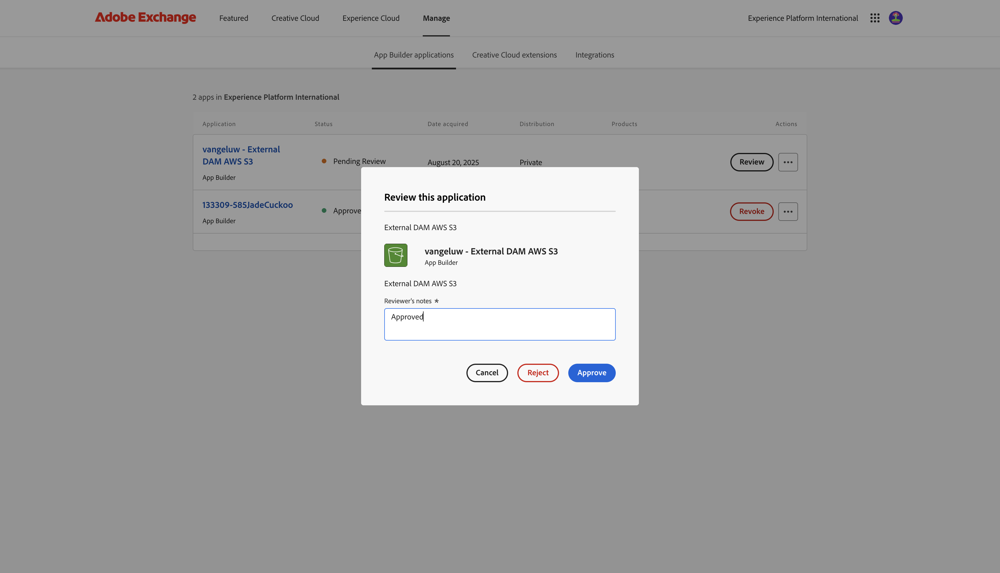

# 1.6.4 Distribuisci il codice e pubblica l&#39;app privatamente

Se pubblichi l’app privatamente, l’app sarà disponibile in GenStudio for Performance Marketing senza dover utilizzare il parametro della stringa di query.

## 1.6.4.1 Pubblica la tua app

Vai a [https://developer.adobe.com/console/projects](https://developer.adobe.com/console/projects){target="_blank"}.

>[!NOTE]
>
> La schermata seguente mostra un’organizzazione specifica selezionata. Durante l’esercitazione, è molto probabile che il nome dell’organizzazione sia diverso. Quando ti sei iscritto a questo tutorial, ti sono stati forniti i dettagli dell’ambiente da utilizzare, segui queste istruzioni.

Aprire il progetto Adobe IO con App Builder, che deve essere denominato `--aepUserLdap-- GSPeM EXT`.

Vai a **Produzione**.

Fai clic su **Pubblica privatamente**.

È quindi necessario compilare una serie di campi.

Compila i campi seguenti come questo:

- **Titolo app**: `--aepUserLdap-- - External DAM AWS S3`.
- **Descrizione app**: `External DAM AWS S3`
- **E-mail di contatto**: inserisci il tuo indirizzo e-mail
- **Icona app**: scarica e utilizza questa immagine: [immagine S3](./images/s3.jpeg)
- **Nota per il revisore**: DAM esterno AWS S3

Fai clic su **Invia**.

Fai clic su **Invia**.

## 1.6.4.2 Approva la tua app

>[!IMPORTANT]
>
>Questo passaggio può essere eseguito solo dagli amministratori di sistema in Adobe Admin Console. Se non sei un amministratore di sistema, non potrai eseguirlo. Contatta l&#39;amministratore di sistema per richiedere l&#39;approvazione dell&#39;app.

Quando uno sviluppatore invia una nuova app per la pubblicazione, gli amministratori di sistema dell’organizzazione ne vengono informati e viene richiesto di rivedere e approvare l’app.

Se sei un amministratore di sistema, riceverai questa e-mail e potrai fare clic su **Il mio Exchange** per avviare il processo.

In **Adobe Exchange**, le applicazioni App Builder vengono visualizzate e l&#39;app appena inviata è ora in attesa di revisione. Fare clic sul pulsante **Rivedi** per l&#39;app `--aepUserLdap-- - External DAM AWS S3`.

Aggiungi un commento e fai clic su **Approva**.

L’app ora è approvata e funzionerà automaticamente in GenStudio for Performance Marketing, senza dover specificare il parametro della stringa di query.

## Passaggi successivi

Vai a [Riepilogo e vantaggi](./summary.md){target="_blank"}

Torna a [GenStudio for Performance Marketing - Estensibilità](./genstudioext.md){target="_blank"}

Torna a [Tutti i moduli](./../../../overview.md){target="_blank"}
